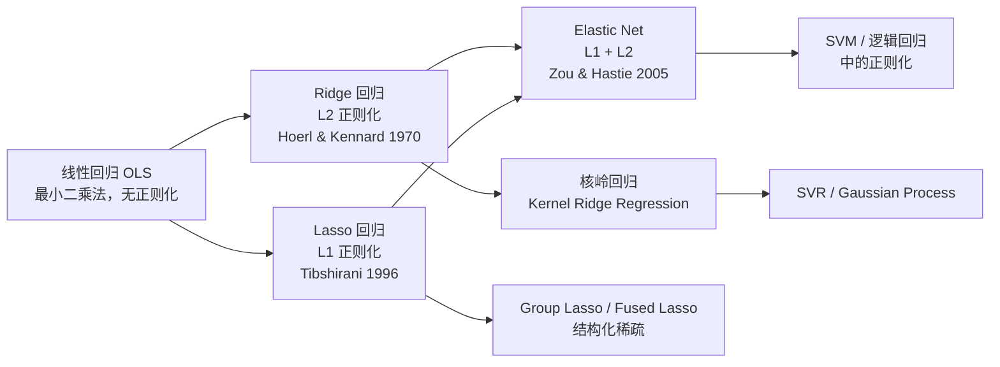
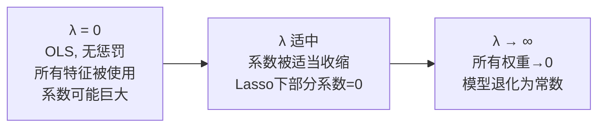

# Ridge / Lasso / Elastic Net

## 知识地图



## 前置知识

- [线性回归](linear-regression.md) —— 理解 MSE 损失函数和闭式解
- [梯度下降](sgd-momentum.md) —— 理解优化过程
- [L1/L2 正则化](l1-l2-regularization.md) —— 理解范数的几何含义
- [Sigmoid / Tanh](sigmoid-tanh.md) —— 基本数学基础
- 线性代数：矩阵求逆、特征值分解

## 为什么会出现 (Why)

经典线性回归（OLS，普通最小二乘）在工业界遇到两个致命问题：

1. **多重共线性 (Multicollinearity)**：特征之间高度相关时，$\mathbf{X}^T\mathbf{X}$ 接近奇异，闭式解 $\hat{\mathbf{w}} = (\mathbf{X}^T\mathbf{X})^{-1}\mathbf{X}^T\mathbf{y}$ 中的逆矩阵计算数值不稳定，导致系数的方差极大——小幅数据变动就会让系数符号翻转、数量级跳变。

2. **特征数量远超样本数 (n << d)**：基因表达数据、文本数据中特征数可达数万而样本仅几十，OLS 的解不唯一（无穷多解），且模型完全不可解释。

1970 年 Hoerl 和 Kennard 提出 Ridge 回归，在 $\mathbf{X}^T \mathbf{X}$ 对角线上加一个正数 $\lambda$ 保证矩阵可逆。1996 年 Tibshirani 提出 Lasso，利用 L1 范数的几何特性实现**自动特征选择**。2005 年 Zou 和 Hastie 提出 Elastic Net，结合两者优点，解决了 Lasso 在选择高度相关特征时的不稳定性。

## 解决什么问题 (Problem)

解决线性回归在**特征相关、高维稀疏、小样本**场景下的过拟合和不可解问题，同时 Lasso/Elastic Net 天然实现特征选择。

## 核心思想 (Core Idea)

给线性回归的损失函数加上一个"复杂度罚款"——Ridge 罚大权重（L2 平方），Lasso 罚非零权重（L1 绝对值），Elastic Net 两个都罚。这个简单的加法操作同时解决了共线性、过拟合和特征选择三个问题。

---

## 数学模型/公式

### 为什么需要正则化

线性回归的 MSE 损失函数对异常值和多重共线性很敏感。正则化通过给损失函数添加惩罚项来约束模型复杂度。

**通俗解释：** 没有正则化的线性回归像是一个"不管代价多大都要完美拟合"的完美主义者——即使某个特征的系数需要变成 1000 才能拟合一个离群点，它也会干。正则化加上一个"税务系统"：系数越大，缴的税越多。Ridge 按系数的平方收税（大系数被重罚），Lasso 按系数的绝对值收税（小系数直接归零），Elastic Net 是混合税制。

### 三种正则化对比

| 方法 | 惩罚项 | 效果 |
|------|--------|------|
| Ridge | $\lambda \sum w_j^2$ | 收缩系数但不稀疏 |
| Lasso | $\lambda \sum \|w_j\|$ | 产生稀疏解（特征选择） |
| Elastic Net | $\lambda(\alpha \sum \|w_j\| + (1-\alpha)\sum w_j^2)$ | 结合两者优点 |

### Ridge 回归

$$J(\mathbf{w}) = \frac{1}{2n} \|\mathbf{y} - \mathbf{X}\mathbf{w}\|^2 + \lambda \|\mathbf{w}\|_2^2$$

**通俗解释：** Ridge 的目标函数有两项：第一项是 MSE（预测误差，越小越好），第二项是系数向量的 L2 范数平方（系数的总能量，越小越好）。$\lambda$ 是两者之间的平衡旋钮。当 $\lambda = 0$ 时退化为普通线性回归；当 $\lambda \to \infty$ 时所有权重趋向于 0（模型变成只预测均值）。

闭式解：

$$\hat{\mathbf{w}} = (\mathbf{X}^T \mathbf{X} + n\lambda \mathbf{I})^{-1} \mathbf{X}^T \mathbf{y}$$

**通俗解释：** 这个闭式解和 OLS 的几乎一样，唯一的区别是在 $\mathbf{X}^T \mathbf{X}$ 的对角线上加了 $n\lambda$。这相当于往每个特征的方向上"注入"了一点噪声/正则化。从数值计算角度，这保证矩阵永远可逆——即使原始特征完全共线（$\mathbf{X}^T \mathbf{X}$ 奇异），加上 $\lambda \mathbf{I}$ 后一定满秩。就像给一个接近崩塌的桥梁加了几根支撑柱。

加入 $\lambda \mathbf{I}$ 保证了矩阵可逆，解决多重共线性问题。

### Lasso 回归

$$J(\mathbf{w}) = \frac{1}{2n} \|\mathbf{y} - \mathbf{X}\mathbf{w}\|^2 + \lambda \|\mathbf{w}\|_1$$

**通俗解释：** Lasso 的核心魔法在于 L1 惩罚。为什么 L1 能产生稀疏解而 L2 不能？关键在于它们在 0 点的导数行为：L2 的导数 $2w_j$ 在 $w_j \to 0$ 时趋于 0（惩罚逐渐消失，容忍小系数存活）；L1 的导数是 $\text{sign}(w_j)$（系数多小都按固定力度往 0 推）。就像削木头：Ridge 用砂纸（磨平但不会磨没），Lasso 用刀（一刀切下去可能直接切断）。

$L_1$ 惩罚的几何特性使得最优解落在坐标轴上，产生稀疏性。

#### 为什么 Lasso 产生稀疏解而 Ridge 不产生？

$L_1$ 球的尖角使得等高线更可能落在坐标轴上。

**通俗解释：** 从二维几何直观理解——L2 约束区域是圆（处处光滑），L1 约束区域是菱形（在坐标轴上有尖角）。损失函数的等高线是椭圆，最优解在等高线与约束区域相切处。圆和椭圆相切可以发生在圆周任意位置（通常是系数都不为 0 的点）；但菱形和椭圆相切极大概率发生在菱形的尖角处——而尖角正好在坐标轴上，意味着其中一个系数恰好为 0。这就是 Lasso 产生稀疏解的几何本质。

### Elastic Net

$$J(\mathbf{w}) = \frac{1}{2n} \|\mathbf{y} - \mathbf{X}\mathbf{w}\|^2 + \lambda \left( \alpha \|\mathbf{w}\|_1 + (1-\alpha) \|\mathbf{w}\|_2^2 \right)$$

**通俗解释：** Elastic Net 是 Lasso 和 Ridge 的"加权混合"。$\alpha$ 控制两者的混合比例：$\alpha=1$ 是纯 Lasso（全用刀削），$\alpha=0$ 是纯 Ridge（全用砂纸磨），$0 < \alpha < 1$ 是两者兼顾。为什么要混合？因为纯 Lasso 有个缺陷：当一组特征高度相关时（如基因通路中的多个基因），Lasso 会随机选其中一个而把其他的系数全置 0——这种"随机性"不好解释也不稳定。Elastic Net 的 L2 成分会"拉"一下相关特征的系数使它们接近，因此倾向于把相关特征作为一组同时选入或剔除——这就是著名的"分组效应 (Grouping Effect)"。

当 $\alpha=1$ 退化为 Lasso，$\alpha=0$ 退化为 Ridge。

---

## 可视化展示

### L1 vs L2 的几何直觉


### 正则化路径示意



---

## 最小可运行代码

### Scikit-learn

```python
from sklearn.linear_model import Ridge, Lasso, ElasticNet

# Ridge: L2 正则化
ridge = Ridge(alpha=1.0)
ridge.fit(X, y)

# Lasso: L1 正则化（自动特征选择）
lasso = Lasso(alpha=1.0)
lasso.fit(X, y)

# Elastic Net: L1 + L2
elastic = ElasticNet(alpha=1.0, l1_ratio=0.5)
elastic.fit(X, y)
```

### NumPy 手写

```python
import numpy as np

class RidgeRegression:
    def __init__(self, alpha=1.0, lr=0.01, epochs=1000):
        self.alpha = alpha
        self.lr = lr
        self.epochs = epochs

    def fit(self, X, y):
        n, d = X.shape
        self.w = np.zeros(d)
        self.b = 0
        for _ in range(self.epochs):
            y_pred = X @ self.w + self.b
            # L2 惩罚的梯度：添加 alpha * w
            dw = (1 / n) * X.T @ (y_pred - y) + self.alpha * self.w
            db = (1 / n) * np.sum(y_pred - y)
            self.w -= self.lr * dw
            self.b -= self.lr * db

class LassoRegression:
    def __init__(self, alpha=1.0, lr=0.01, epochs=1000):
        self.alpha = alpha
        self.lr = lr
        self.epochs = epochs

    def fit(self, X, y):
        n, d = X.shape
        self.w = np.zeros(d)
        self.b = 0
        for _ in range(self.epochs):
            y_pred = X @ self.w + self.b
            dw = (1 / n) * X.T @ (y_pred - y)
            # 次梯度方法处理 L1
            dw += self.alpha * np.sign(self.w)
            db = (1 / n) * np.sum(y_pred - y)
            self.w -= self.lr * dw
            self.b -= self.lr * db

class ElasticNetRegression:
    def __init__(self, alpha=1.0, l1_ratio=0.5, lr=0.01, epochs=1000):
        self.alpha = alpha
        self.l1_ratio = l1_ratio
        self.lr = lr
        self.epochs = epochs

    def fit(self, X, y):
        n, d = X.shape
        self.w = np.zeros(d)
        self.b = 0
        for _ in range(self.epochs):
            y_pred = X @ self.w + self.b
            dw = (1 / n) * X.T @ (y_pred - y)
            # L1 次梯度 + L2 梯度
            dw += self.alpha * self.l1_ratio * np.sign(self.w)
            dw += self.alpha * (1 - self.l1_ratio) * self.w
            db = (1 / n) * np.sum(y_pred - y)
            self.w -= self.lr * dw
            self.b -= self.lr * db
```

---

## 工业界应用

| 应用场景 | 推荐方法 | 为什么 | 优点 | 缺点 |
|----------|---------|--------|------|------|
| 信用评分卡 | Lasso | 金融监管要求模型变量少且可解释，Lasso 自动选特征 | 自动特征选择，系数含义清晰 | 高度相关特征随机选一个，不稳定 |
| 基因关联分析 (GWAS) | Elastic Net | 基因之间存在通路级别的强相关性 | 分组效应保证相关基因同进退 | 需调两个超参数（$\alpha$, $\lambda$） |
| CTR 预估（早期） | Ridge | 特征维度极高（数亿），Lasso 过于激进 | 数值稳定，训练快 | 不能特征选择，模型体积大 |
| 图像重建 / 压缩感知 | Lasso | 利用先验知识——自然图像在特定基下是稀疏的 | 理论上可精确恢复稀疏信号 | 求解器需针对特定结构优化 |
| 推荐系统矩阵分解 | Ridge | 用户/物品隐向量的 L2 约束防止过拟合 | 实现简单，效果稳定 | 不如 ALS + L2 直接 |

---

## 优缺点对比

### Ridge

| 优点 | 缺点 |
|------|------|
| 有闭式解，计算稳定 | 不能特征选择——所有特征都保留 |
| 解决多重共线性问题 | 系数不可解释（上万维时无法分析） |
| 对离群点比 OLS 鲁棒 | 相比 Lasso，在高维稀疏场景中不够简洁 |
| $\lambda$ 连续可调，可以逐步观察系数收缩 | 当真实模型是稀疏的时候，Ridge 必然包含噪声特征 |

### Lasso

| 优点 | 缺点 |
|------|------|
| 自动特征选择（稀疏解） | 无闭式解，需迭代优化（坐标下降/LARS） |
| 模型简洁，可解释性强 | 高度相关特征中随机选一个（不稳定） |
| 适合特征数远大于样本数 (n << d) | 当 n > d 且特征不太相关时，Ridge 可能效果更好 |
| 可直观展示"正则化路径"——系数如何随 $\lambda$ 归零 | 系数归零的 $\lambda$ 阈值需要 CV 确定 |

### Elastic Net

| 优点 | 缺点 |
|------|------|
| 兼具稀疏性和分组效应 | 需调两个超参数 |
| 处理特征相关组时比 Lasso 稳定 | 相比单一方法，计算成本更高 |
| 在特征数远大于样本数时稳定 | 分组效应的强度无法直接控制 |
| 是 Lasso 和 Ridge 的通用化——覆盖两个极端 | 有时两个参数都不如只调一个省事 |

---

## 对比表格

| 维度 | OLS (普通最小二乘) | Ridge (L2) | Lasso (L1) | Elastic Net (L1+L2) |
|------|-------------------|------------|------------|---------------------|
| 惩罚项 | 无 | $\lambda\|\mathbf{w}\|_2^2$ | $\lambda\|\mathbf{w}\|_1$ | $\lambda(\alpha\|\mathbf{w}\|_1 + (1-\alpha)\|\mathbf{w}\|_2^2)$ |
| 闭式解 | $\hat{\mathbf{w}}=(\mathbf{X}^T\mathbf{X})^{-1}\mathbf{X}^T\mathbf{y}$ | $\hat{\mathbf{w}}=(\mathbf{X}^T\mathbf{X}+\lambda\mathbf{I})^{-1}\mathbf{X}^T\mathbf{y}$ | 无（需迭代求解） | 无（需迭代求解） |
| 稀疏性 | 无 | 无 | **有（核心卖点）** | 有（但比 Lasso 弱） |
| 共线性处理 | 极差（矩阵奇异） | 优秀（保证可逆） | 一般（随机选一个） | **优秀（分组效应）** |
| 特征选择 | 无 | 无 | **自动选择** | 自动选择（但更保守） |
| n << d 时 | 不可解（无穷解） | 可解但不稀疏 | **可解且稀疏** | **可解且稳定** |
| 超参数数量 | 0 | 1 ($\lambda$) | 1 ($\lambda$) | 2 ($\lambda$, $\alpha$) |
| 求解方法 | 直接求逆 | 直接求逆 / GD | 坐标下降 / LARS | 坐标下降 |
| 提出年份 | ~1800 (Gauss) | 1970 (Hoerl & Kennard) | 1996 (Tibshirani) | 2005 (Zou & Hastie) |

---

## 选型建议

- **Ridge**：大多数特征都有用时——比如所有传感器数据都提供信息，但存在共线性
- **Lasso**：希望自动特征选择时——需要模型简洁可解释（信用评分、医疗诊断）
- **Elastic Net**：特征数 > 样本数，或特征高度相关时——基因数据、文本数据、图像像素

---

## 学完后建议继续学习

- [线性回归](linear-regression.md) —— 正则化解决的是线性回归的问题，理解源头很重要
- [L1/L2 正则化](l1-l2-regularization.md) —— 深入理解范数惩罚的数学原理
- [逻辑回归](logistic-regression.md) —— 分类任务中同样适用 L1/L2 正则化
- [SGD / Momentum](sgd-momentum.md) —— 理解梯度下降求解正则化模型的实践
- [PCA/SVD](pca-svd.md) —— 另一种处理共线性的方法（降维 vs 正则化）
- [MSE/MAE/Huber](mse-mae-huber.md) —— 损失函数的选择直接影响正则化的效果
- [线性 SVM](linear-svm.md) —— SVM 中的 C 参数本质上是 L2 正则化 + Hinge Loss

---

## 高频面试题

**Q1: 为什么 Lasso 产生稀疏解而 Ridge 不会？请从几何和梯度两个角度解释。**

标准答案：
- **梯度角度**：Ridge 的 L2 惩罚对 $w_j$ 的梯度是 $2\lambda w_j$，当 $w_j \to 0$ 时梯度也趋于 0，不会继续推向 0。Lasso 的 L1 惩罚梯度是 $\lambda \cdot \text{sign}(w_j)$，无论 $w_j$ 多小，都有一股恒定的力（$\lambda$）往 0 方向推。就像把球扔进坑里：Ridge 的坑底是平的（抛物线，梯度趋于 0），Lasso 的坑底是 V 形的（绝对值，梯度不衰减）。
- **几何角度**：约束区域在二维参数空间中，L2 是圆（处处光滑），L1 是菱形（在坐标轴上有四个尖角）。损失函数等高线是椭圆，最优解在等高线与约束区域首次接触处。与圆相切可发生在圆周任意位置；与菱形接触大概率在尖角（坐标轴上），意味着某个系数恰好为 0。

**Q2: 什么是多重共线性？为什么 Ridge 能解决而 OLS 不能？**

标准答案：多重共线性指特征之间存在高度线性相关性，导致 $\mathbf{X}^T\mathbf{X}$ 的特征值接近于 0，其逆矩阵的元素极大。后果是系数的方差 $\text{Var}(\hat{\mathbf{w}}) = \sigma^2(\mathbf{X}^T\mathbf{X})^{-1}$ 极大——训练数据微小变化就让系数符号翻转。Ridge 的解 $\hat{\mathbf{w}}_{ridge} = (\mathbf{X}^T\mathbf{X} + \lambda\mathbf{I})^{-1}\mathbf{X}^T\mathbf{y}$ 在对角线上加了 $\lambda\mathbf{I}$，等价于把每个特征值都抬高了 $\lambda$，最小特征值从接近 0 变成至少 $\lambda$——矩阵永远满秩，求逆数值稳定。

**Q3: Elastic Net 的"分组效应 (Grouping Effect)"是什么？**

标准答案：当一组特征高度相关时，Lasso 倾向于随机选择其中一个而把其余系数置 0——不同 fold 的 CV 中选到的特征可能不同，不可复现。Elastic Net 的 L2 成分会对相关特征的系数产生"拉力"使之接近：可以证明，如果两个特征相关系数 $\rho \to 1$，Elastic Net 估计的系数差 $\|\hat{w}_1 - \hat{w}_2\| \to 0$。这意味着相关特征要么被一同保留，要么被一同剔除——这就是"分组效应"。2005 年 Zou 和 Hastie 提出 Elastic Net 的主要动机就是解决 Lasso 在高相关特征场景的稳定性问题。

**Q4: 如何选择正则化系数 $\lambda$？**

标准答案：实践中通过交叉验证 (CV) 选择。对于 Ridge：`RidgeCV`（scikit-learn 内置高效 CV，利用广义交叉验证 GCV）。对于 Lasso/Elastic Net：`LassoCV` / `ElasticNetCV`（坐标下降 + K-fold CV）。具体步骤：(1) 在对数空间生成候选 $\lambda$ 序列（如 `np.logspace(-3, 3, 100)`）；(2) 对每个 $\lambda$ 做 K-fold CV，记录平均验证误差；(3) 通常采用"1-SE 规则"——不选验证误差绝对最小的 $\lambda$（可能过拟合），而选误差在最小值 1 个标准差以内的最简模型（最大的 $\lambda$）。这能让模型更稀疏且泛化能力不降。

**Q5: 什么时候用 Ridge，什么时候用 Lasso，什么时候用 Elastic Net？**

标准答案：(1) **Ridge**：大多数特征都可能有贡献时（传感器数据、图像像素、股价因子），且特征间存在较强共线性；你不需要稀疏解释，只追求预测精度。(2) **Lasso**：你需要模型可解释（金融风控、医疗指标——"只有这 5 个指标影响诊断"），且特征之间不高度相关；或特征数远大于样本数，Lasso 自动筛选出最多 n 个特征。(3) **Elastic Net**：特征数远大于样本数，且特征高度相关（基因表达、文本词频）；或者你做了 Lasso，发现不同 CV fold 选出的特征不一致（说明有共线性问题），此时升级到 Elastic Net。朴素经验法则：先尝试 Ridge（稳定基线），然后试 Lasso（看能稀疏到什么程度），如果 Lasso 不稳定就换 Elastic Net。
