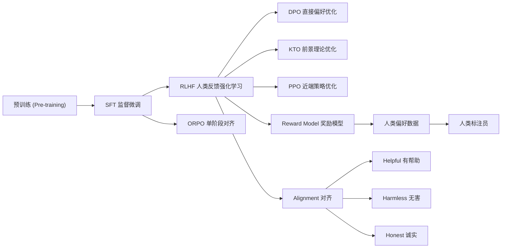
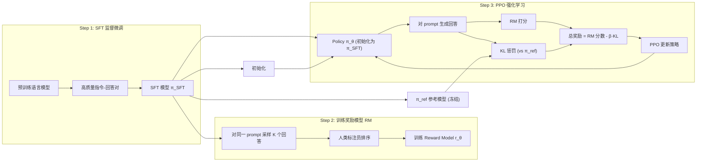

# RLHF (基于人类反馈的强化学习)

## 知识地图



## 前置知识

- **SFT (监督微调)**：用高质量指令-回答对微调模型，让模型学会遵循指令。
- **强化学习基础**：理解状态 (state)、动作 (action)、策略 (policy)、奖励 (reward) 的基本概念。
- **策略梯度 (Policy Gradient)**：直接优化策略以最大化期望奖励。
- **KL 散度 (KL Divergence)**：衡量两个概率分布之间的差异，RLHF 中用于防止策略偏离太远。
- **Bradley-Terry 模型**：经典的成对比较模型，用于从排序数据中学习隐含分数。

## 为什么会出现 (Why)

预训练语言模型只学会了"预测下一个 token"，SFT 教会了模型"遵循指令的格式"，但两者都无法解决一个根本问题：**模型不知道什么样的回答是"好"的**。

SFT 的局限非常明显：
- 标注数据只能告诉模型"正确答案长什么样"，但无法教会模型区分"好答案"和"坏答案"之间的细微差异。
- 模型容易生成有毒、偏见或不真实的内容，因为它的训练目标是最大化似然，而非"对人类有益"。
- 很多任务的评价标准难以形式化为损失函数——什么是"有帮助的"？什么是"礼貌的"？（你很难写出一个数学公式来量化礼貌。）

RLHF 的提出就是为了解决这个问题：**让人类偏好直接成为训练信号**。

## 解决什么问题 (Problem)

RLHF 解决的核心问题是：**如何将模糊、主观、难以量化的"人类偏好"转化为模型可以优化的数学目标**。

具体来说，RLHF 解决三大类问题：
1. **有用性 (Helpfulness)**：回答是否满足用户的真实需求。
2. **真实性 (Honesty/Hallucination)**：回答是否基于事实，不编造信息。
3. **无害性 (Harmlessness)**：回答是否正当、不包含偏见或有害内容。

## 核心思想 (Core Idea)

**用人类对模型输出的偏好排序训练一个"奖励模型"来模拟人类判断，再用强化学习（PPO）优化语言模型以最大化这个奖励——让模型的行为对齐人类价值观。**

## 算法流程/模型结构图

### RLHF 三步训练流程



### 三步流程详解

### Step 1: 监督微调 (SFT)

用高质量人工标注的 (指令, 回答) 对微调模型。

### Step 2: 训练奖励模型 (Reward Model, RM)

对同一个 prompt，模型生成多个回答，人类标注员对回答进行**排序**（标注排序比标注绝对分数更可靠）。

训练目标（Bradley-Terry 模型）：

$$L(\theta) = -\mathbb{E}_{(x, y_w, y_l) \sim D} \left[ \log \sigma(r_\theta(x, y_w) - r_\theta(x, y_l)) \right]$$

其中 $y_w$ 是人类偏好的回答，$y_l$ 是较差的回答。

**通俗解释：** RM 的目标很简单——让好回答的得分高于差回答。Bradley-Terry 模型将"$y_w$ 比 $y_l$ 更好"这个事件建模为 sigmoid 函数：如果 $r(y_w)$ 比 $r(y_l)$ 大很多，sigmoid 接近 1（模型确信 $y_w$ 更好），损失就小；如果 $r(y_w)$ 和 $r(y_l)$ 很接近或反过来了，损失就大。本质上就是一个二分类问题：判断哪一个是更好的回答。

### Step 3: 用 PPO 优化策略

将语言模型视为 RL 的 agent：

- **状态** $s_t$：当前生成的文本序列 $y_{<t}$
- **动作** $a_t$：生成下一个 token $y_t$
- **策略** $\pi_\theta$：语言模型（待优化）
- **奖励**：RM 打分 + KL 惩罚（防止偏离初始策略太远）

目标函数：

$$R_{total} = r_\theta(x, y) - \beta \cdot D_{KL}(\pi_\theta(y|x) \| \pi_{ref}(y|x))$$

**通俗解释：** 总奖励 = 奖励模型的打分 减去 策略和参考策略之间的 KL 散度。RM 打分驱动模型生成"人类喜欢"的内容，KL 惩罚防止模型走火入魔——如果模型为了刷高分而生成一堆人类看不懂但 RM 觉得好的奇怪文本，KL 惩罚会把它拉回来。$\beta$ 控制允许偏离的程度：$\beta$ 大则保守（更像 SFT 模型），$\beta$ 小则激进（更追求 RM 打分）。

## 数学模型/公式

### KL 惩罚的重要性

没有 KL 惩罚，策略很快会滥用奖励模型的漏洞（Reward Hacking），生成高奖励但无意义的文本。

$$\text{KL penalty} = \log \pi_\theta(y_t|x, y_{<t}) - \log \pi_{ref}(y_t|x, y_{<t})$$

**通俗解释：** KL 惩罚是每个 token 级别的约束。对于同样的上下文，如果当前策略给某个 token 的概率远高于参考策略，说明模型"跑偏了"，KL 惩罚会增大。这是 token 级别的"安全带"——每一步生成都被监控，确保模型不会在某一步突然抽风。

### PPO 算法核心

$$\max_\theta \mathbb{E} \left[ \frac{\pi_\theta(a|s)}{\pi_{old}(a|s)} \cdot A(s,a) - \beta \cdot \text{KL} \right]$$

**通俗解释：** PPO 的核心在于"信任区域"——策略更新不能太激进。如果某个动作有正优势（比平均水平好），应该增加它的概率；如果有负优势，应该降低。但这个"增加/降低"的幅度被 ratio 裁剪限制住了——不管优势多大，最多允许策略概率变成原来的 $1+\epsilon$ 倍。

裁剪目标防止策略更新过大：

$$L^{CLIP} = \mathbb{E} \left[ \min\left(r(\theta)A, \text{clip}(r(\theta), 1-\epsilon, 1+\epsilon)A\right) \right]$$

其中 $r(\theta) = \pi_\theta/\pi_{old}$，$\epsilon$ 通常取 0.2。

**通俗解释：** 这是 PPO 防止"一步迈太大"的机制。想象你在训练一只狗——如果它做对了，你可以给更多奖励让它多做这件事，但有个上限（$1+\epsilon$，即概率最多变大为原来的 1.2 倍）。同理，做错了也不能一下子让它"再也不敢"（$1-\epsilon$，概率至少保留原来的 0.8 倍）。这个裁剪让训练像"小步快跑"而非"大步猛冲"，非常稳定。

### 数据收集流程

1. 从当前策略采样多个回答
2. RM 打分
3. 计算优势函数（GAE）
4. 用 PPO 更新策略
5. 重复

## 可视化展示

### RLHF 各阶段计算资源分布

```echarts
return {
  title: { top: 5,  text: 'RLHF 训练各阶段资源占比', left: 'center', textStyle: { fontSize: 12 } },
  tooltip: { trigger: 'item' },
  series: [{
    type: 'pie',
    radius: ['40%', '70%'],
    data: [
      { name: 'PPO 强化学习', value: 45 },
      { name: 'RM 训练', value: 15 },
      { name: 'SFT 微调', value: 10 },
      { name: '人类偏好标注', value: 30 }
    ],
    label: { formatter: '{b}: {c}%' }
  }]
}
```

### RLHF 训练稳定性对比

```echarts
return {
  tooltip: { trigger: "axis", confine: true },
  title: { top: 5,  text: 'RLHF 训练过程中的奖励变化', left: 'center', textStyle: { fontSize: 12 } },
  xAxis: { type: 'category', data: ['Step 0', 'Step 100', 'Step 200', 'Step 500', 'Step 1000', 'Step 2000'] },
  yAxis: { type: 'value', name: '奖励值' },
  legend: { top: 28,  data: ['RM 打分', '总奖励 (RM - KL)', 'KL 散度'] },
  grid: { left: 60, right: 20, top: 55, bottom: 55 },
  series: [
    { name: 'RM 打分', type: 'line', data: [0.5, 1.2, 1.8, 2.5, 3.0, 3.8], smooth: true },
    { name: '总奖励 (RM - KL)', type: 'line', data: [0.4, 0.9, 1.4, 1.9, 2.3, 2.7], smooth: true },
    { name: 'KL 散度', type: 'line', data: [0.1, 0.3, 0.4, 0.6, 0.7, 1.1], smooth: true, itemStyle: { color: '#e74c3c' } }
  ]
}
```

## 最小可运行代码

```python
import torch
import torch.nn.functional as F
from transformers import AutoModelForCausalLM, AutoTokenizer

# ========== 1. 加载模型 ==========
model_name = "gpt2"  # 实际使用中替换为 LLaMA 等
model = AutoModelForCausalLM.from_pretrained(model_name)
ref_model = AutoModelForCausalLM.from_pretrained(model_name)  # 参考模型，冻结
tokenizer = AutoTokenizer.from_pretrained(model_name)
tokenizer.pad_token = tokenizer.eos_token

# ========== 2. 奖励模型 (简化示例) ==========
# 实际应用中 RM 通常是从 SFT 模型初始化，替换 LM head 为单个标量输出
class SimpleRewardModel(torch.nn.Module):
    def __init__(self, base_model):
        super().__init__()
        self.base = base_model
        self.reward_head = torch.nn.Linear(base_model.config.hidden_size, 1)

    def forward(self, input_ids, attention_mask):
        outputs = self.base(input_ids, attention_mask=attention_mask, output_hidden_states=True)
        last_hidden = outputs.hidden_states[-1]  # [B, L, H]
        # 取最后一个 token 的隐状态作为句子表示
        last_token_hidden = last_hidden[torch.arange(last_hidden.size(0)), attention_mask.sum(dim=1) - 1]
        reward = self.reward_head(last_token_hidden)  # [B, 1]
        return reward.squeeze(-1)  # [B]

# ========== 3. PPO 损失 ==========
def ppo_loss(logprobs_new, logprobs_old, advantages, clip_epsilon=0.2):
    """
    logprobs_new: 当前策略的 log 概率 [B]
    logprobs_old: 旧策略的 log 概率 [B]
    advantages: 优势函数 [B]
    """
    ratio = torch.exp(logprobs_new - logprobs_old)  # π_new / π_old
    clipped_ratio = torch.clamp(ratio, 1 - clip_epsilon, 1 + clip_epsilon)
    loss = -torch.min(ratio * advantages, clipped_ratio * advantages).mean()
    return loss

# ========== 4. KL 惩罚 ==========
def kl_penalty(logprobs_policy, logprobs_ref):
    """
    计算策略与参考模型的 KL 散度
    logprobs_policy: [B, L]
    logprobs_ref: [B, L]
    """
    return (logprobs_policy - logprobs_ref).sum(dim=-1).mean()  # [1]

# ========== 5. RLHF 训练步骤 (伪代码) ==========
def rlhf_training_step(policy_model, ref_model, reward_model, batch, beta=0.1):
    """
    batch: {prompt_ids, attention_mask}
    """
    # 1. 从当前策略采样回答
    with torch.no_grad():
        generated = policy_model.generate(
            batch['prompt_ids'],
            max_new_tokens=128,
            do_sample=True,
            temperature=0.7
        )

    # 2. 计算 log 概率 (旧策略)
    with torch.no_grad():
        old_logprobs = policy_model(generated).logits.log_softmax(-1)

    # 3. RM 打分
    with torch.no_grad():
        rm_scores = reward_model(generated, torch.ones_like(generated))

    # 4. 计算当前策略的 log 概率
    new_logprobs = policy_model(generated).logits.log_softmax(-1)
    ref_logprobs = ref_model(generated).logits.log_softmax(-1)

    # 5. 计算 KL 惩罚
    kl = kl_penalty(new_logprobs, ref_logprobs)

    # 6. 总奖励 = RM 打分 - β * KL
    total_reward = rm_scores - beta * kl

    # 7. 计算优势 (简化: 直接用奖励)
    advantages = total_reward - total_reward.mean()

    # 8. PPO 损失
    loss = ppo_loss(new_logprobs.sum(-1), old_logprobs.sum(-1), advantages)

    return loss, {'rm_score': rm_scores.mean().item(), 'kl': kl.item()}

# ========== 6. 推理 ==========
def rlhf_inference(policy_model, tokenizer, prompt, max_length=128):
    """RLHF 训练后的模型推理"""
    inputs = tokenizer(prompt, return_tensors="pt")
    outputs = policy_model.generate(
        inputs.input_ids,
        max_length=max_length,
        do_sample=True,
        temperature=0.7,
        top_p=0.9
    )
    return tokenizer.decode(outputs[0], skip_special_tokens=True)
```

## 工业界应用

| 应用领域 | 使用模型 | 为什么用 RLHF | 优势 | 劣势 |
|---------|---------|-------------|------|------|
| 对话助手 | ChatGPT / Claude | 让回答更有帮助、更礼貌、更安全 | 对齐效果明显，用户体验好 | 标注成本高，训练不稳定 |
| 代码生成 | GitHub Copilot | 偏好正确且可运行的代码 | 减少错误代码和危险建议 | 代码好坏评判主观性强 |
| 内容审核 | GPT-4 审核系统 | 训练对有害内容敏感的奖励模型 | 可定制审核标准 | 标准漂移需要持续维护 |
| 搜索引擎 | Bing Chat / Bard | 摘要质量排序 | 减少幻觉，提高可信度 | 与引用准确性的平衡 |
| 教育辅导 | Khanmigo (Khan Academy) | 不直接给答案，用启发式教学 | 安全性高，适合教育场景 | 可能过于保守 |

## 对比表格

### RLHF vs DPO vs KTO

| 特性 | RLHF | DPO | KTO |
|------|------|-----|-----|
| 所需模型数 | 4 (policy, ref, RM, value) | 2 (policy + ref) | 2 (policy + ref) |
| 显式奖励模型 | 需要 | 不需要 | 不需要 |
| 偏好数据格式 | 成对排序 (A > B) | 成对排序 (A > B) | 二元标签 (好/坏) |
| 在线采样 | 需要 (PPO 迭代) | 不需要 | 不需要 |
| 训练稳定性 | 不稳定 (容易 reward hacking) | 稳定 | 稳定 |
| 计算开销 | 极高 | 中等 | 中等 |
| 标注成本 | 高 (需排序) | 高 (需排序) | 低 (只需打分) |
| 理论优雅度 | 需要维护多个模型的同步 | 通过数学推导消除 RM | 基于前景理论，处理不对称性 |

### PPO vs 策略梯度方法

| 方法 | 策略更新约束 | 样本效率 | 训练稳定性 |
|------|------------|---------|-----------|
| Vanilla Policy Gradient | 无约束 | 低 | 不稳定 |
| TRPO | 二阶 KL 约束 | 中 | 较稳定 |
| PPO | CLIP 一阶约束 | 高 | 很稳定 |
| PPO-ptx (InstructGPT) | CLIP + 预训练混合 | 高 | 很稳定 |

## RLHF 的挑战与简化方案

### 挑战

- **训练不稳定**：同时维护 4 个模型（policy, ref, RM, value）
- **奖励黑客**：模型找到 RM 漏洞而非真正改善质量
- **标注成本高**：需要大量高质量人类偏好标注
- **偏好漂移**：不同文化/人群偏好不同

### RLHF 的简化方案

- **DPO**：直接用偏好数据优化策略，省去 RM
- **KTO**：使用非对比的信号（逐条打分而非排序）
- **ORPO**：在 SFT 过程中同时优化偏好

## 学完后建议继续学习

1. **[DPO 直接偏好优化](dpo.md)** — 理解如何通过数学推导消除奖励模型，降低 RLHF 的训练复杂度和不稳定性。
2. **[SFT 监督微调](sft.md)** — RLHF 的第一步基础，理解如何准备高质量的指令微调数据。
3. **[对齐进阶方法](alignment-advanced.md)** — 学习 KTO、ORPO、SimPO 等更先进的对齐技术，探索如何进一步减少标注和计算成本。
4. **Constitutional AI** — Anthropic 提出的用 AI 反馈替代人类反馈的方法，理解如何实现可扩展的对齐。
5. **Reward Hacking 防御** — 深入理解奖励模型过拟合、分布偏移等问题及对应的防御策略。

## 高频面试题

### Q1: 请详细描述 RLHF 的三个步骤及其各自的作用。

**标准答案：**

**Step 1 — 监督微调 (SFT)**：用高质量的人工标注（指令, 回答）对预训练语言模型进行微调。作用是为后续训练提供一个"懂指令"的基础模型。这一步让模型学会遵循指令格式，输出结构化的回复。

**Step 2 — 训练奖励模型 (RM)**：对同一个 prompt，SFT 模型生成 K 个候选回答（通常 K=4~9），人类标注员对这些回答进行排序。然后用 Bradley-Terry 模型训练一个 RM，其目标是预测人类偏好的概率。作用是用一个可微分的数学函数"模拟"人类偏好——RM 越精确，后续的强化学习就越有效。

**Step 3 — PPO 强化学习**：将 RM 作为奖励函数，用 PPO 算法优化语言模型。奖励由两部分组成：RM 打分（鼓励生成高质量回答）和 KL 惩罚（防止模型偏离 SFT 基准太远）。作用是将 RM 学到的人类偏好信号"回灌"到语言模型中，让模型内化人类的价值观。

### Q2: RLHF 中为什么需要 KL 惩罚？解释 Reward Hacking 的机制。

**标准答案：**

KL 惩罚的存在是为了防止 **Reward Hacking（奖励黑客）**——模型通过"欺骗"奖励模型来获取高分，而非真正生成优质内容。

Reward Hacking 的典型案例：
- 模型发现某些模式（如重复使用"certainly"、"I'm happy to help"、大量列举、过度详细）让 RM 打高分，于是生成冗长但内容空泛的回复。
- 模型找到 RM 的训练盲区，生成 RM 无法正确评估但人类不喜欢的输出。

KL 惩罚 $\beta \cdot D_{KL}(\pi_\theta \| \pi_{ref})$ 的作用：将策略约束在 SFT 模型的附近，防止它"走火入魔"。因为 SFT 模型是人类标注数据训练的，它的分布代表了"合理的语言行为"。KL 惩罚告诉模型：你可以追求高奖励，但不能偏离正常语言太多。

没有 KL 惩罚的后果：模型可能很快崩溃——开始生成乱码或无意义重复，仅仅因为 RM 给这些输出打了高分。

### Q3: 为什么 RLHF 中标注员只做排序（ranking）而不做绝对评分（rating）？

**标准答案：**

两个核心原因：

1. **排序比评分更可靠**：让人类给"这个回答打多少分"时，不同标注员的评分标准差异很大（有人习惯给 7 分，有人习惯给 5 分，量化标准难以对齐）。但让标注员判断"A 比 B 更好吗？"时，跨标注员的一致性远高于绝对评分。Bradley-Terry 模型恰好可以利用这种成对比较的排序信号。

2. **排序信息更丰富**：在同一个 prompt 下生成 K 个回答并进行全排列对比，可以产生 $C(K,2)$ 个训练信号。如果 K=4，则有 6 对比较，信息量是单点评分的 6 倍。而且排序隐含了传递性（如果 A > B 且 B > C，则 A > C），进一步增强训练信号。

### Q4: PPO-CLIP 中 $\epsilon=0.2$ 的含义是什么？为什么不用更大的值？

**标准答案：**

$\epsilon=0.2$ 意味着策略概率比 $\pi_\theta / \pi_{old}$ 被限制在 $[0.8, 1.2]$ 区间内——每次更新，策略对任何动作的概率最多变动 20%。

为什么是 0.2：
- **太大**（如 0.5）：信任区域过宽，策略可能在单次更新中发生剧烈变化，导致训练崩溃。等同于没有裁剪。
- **太小**（如 0.05）：信任区域过窄，每次更新幅度太小，训练极其缓慢，可能需要数倍步数才能收敛。
- **0.2** 是经验最优值：在大量 RL 任务上验证，提供足够的更新空间同时保持稳定。这个值也被 InstructGPT 论文确认有效（Schulman et al., 2017）。

### Q5: RLHF 与传统的监督学习有什么本质区别？

**标准答案：**

RLHF 与传统监督学习的本质区别在于**优化目标的定义方式**和**数据的生成方式**：

1. **目标不同**：SFT 优化的是似然最大化（$-\log P(y|x)$），目标是"模仿训练数据中的回答"。RLHF 优化的是期望奖励最大化，目标是"生成人类偏好的回答"——两者并不等价。一个"像训练数据"的回答可能不是"最好的回答"。

2. **数据依赖不同**：SFT 需要 (输入, 正确答案) 的配对数据，标注员必须写出"正确答案"。RLHF 只需要偏好排序，标注员不需要写答案，只需要判断哪个更好——标注难度和成本显著降低。

3. **训练动态不同**：SFT 是被动学习（固定数据集，一次训练）。RLHF 是主动学习（模型自己生成，RM 打分，然后优化——在线采样循环），模型可以探索训练数据中从未出现过的输出。

4. **泛化能力不同**：SFT 受限于标注数据的上限。RLHF 通过 RM 的泛化（将有限的人类偏好推广到未见过的输出）实现了某种程度的"偏好泛化"——即使某个 prompt 从未被标注过，RM 也能对它的输出给出合理的评分。
