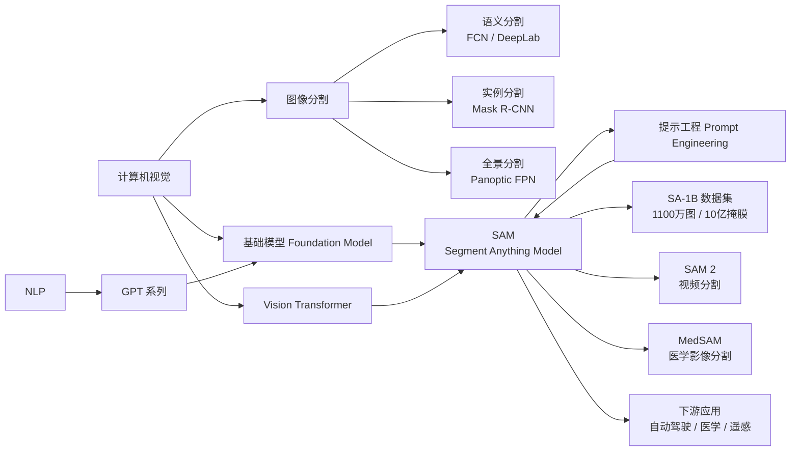
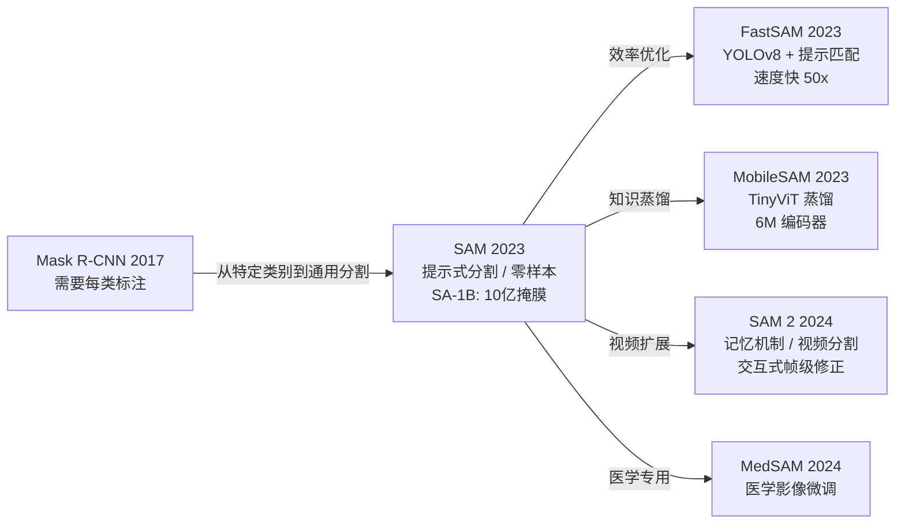
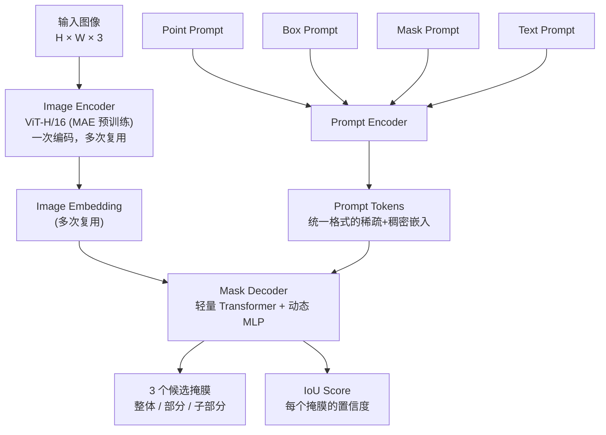
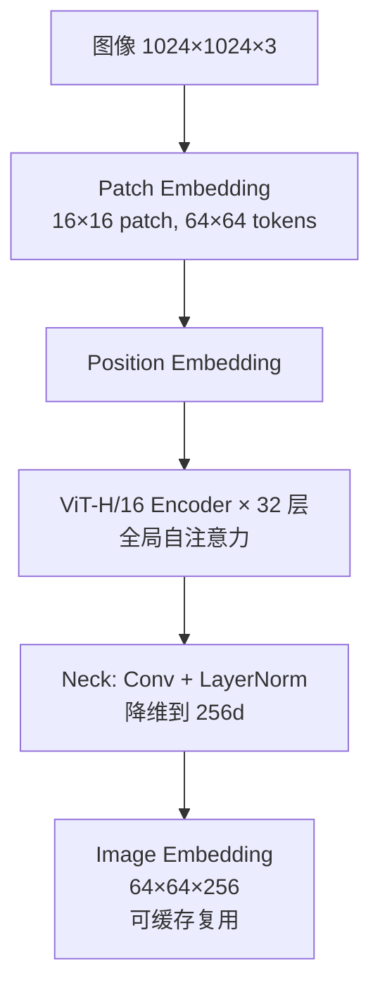
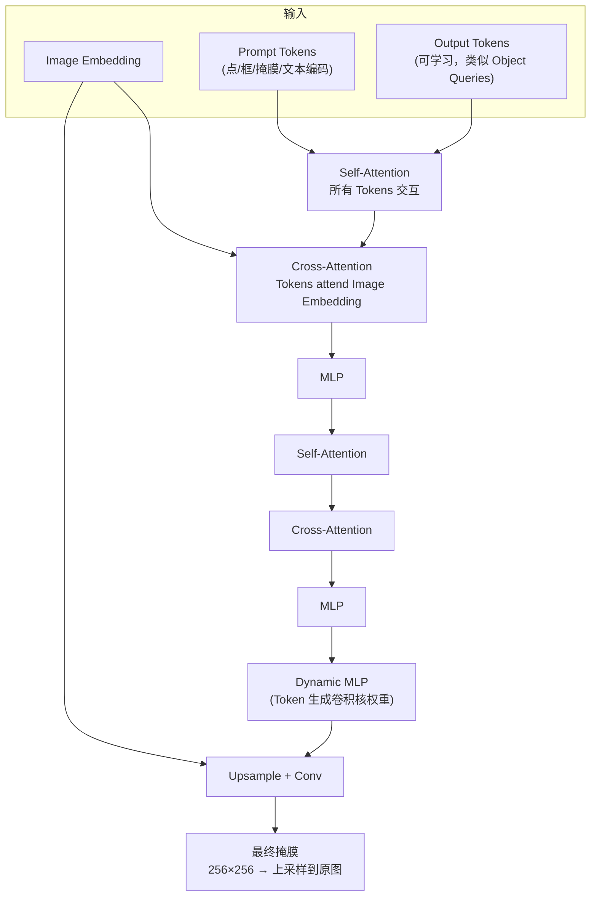
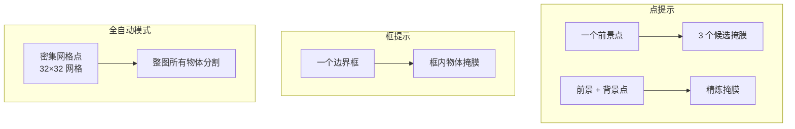
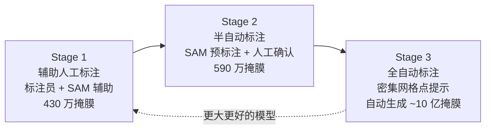

# Segment Anything Model (SAM)

## 知识地图



## 前置知识

- **图像分割基础**：语义分割 vs 实例分割 vs 全景分割，IoU/mIoU 评估
- **Vision Transformer (ViT)**：Patch Embedding、MAE 预训练、Encoder 架构
- **提示学习 (Prompt-based Learning)**：NLP 中 GPT 的 prompt 范式如何迁移到视觉
- **基础模型 (Foundation Model)**：大规模数据预训练 + 零样本泛化的概念

## 模型演化路线



| Model | Year | Key Innovation |
|-------|------|----------------|
| SAM | 2023 | 提示式分割基础模型，ViT-H 编码器 + 提示编码器 + 轻量 Decoder，SA-1B 数据集 |
| FastSAM | 2023 | 用 YOLOv8-seg 替代 ViT，将"提示→掩膜"转为"检测+分割→提示匹配" |
| MobileSAM | 2023 | 解耦蒸馏：先蒸馏编码器（TinyViT），再冻结编码器训练 Decoder，6M 参数 |
| SAM 2 | 2024 | 记忆机制扩展到视频，Memory Attention 访问历史帧，支持交互式修正 |
| MedSAM | 2024 | 在医学影像上微调 SAM，支持 CT/MRI/超声等多种模态 |

## 为什么会出现 (Why)

在 SAM 之前，图像分割面临两个核心问题：

1. **类别依赖**：分割模型（如 Mask R-CNN）需要针对特定类别训练。想分割"椅子"就得标注椅子数据，想分割"肿瘤"就得标注肿瘤数据。每增加一个新类别就是一次新的标注和训练。
2. **缺乏视觉基础模型**：NLP 有 GPT 这样的基础模型——一个模型解决多种任务。但视觉领域没有类似的东西。CLIP 解决的是分类问题，分割领域缺少一个"通用分割器"。

Meta 的 SAM 项目试图回答两个问题：
- 能不能训练一个模型，可以分割**任何图像中的任何物体**，而不针对特定类别？
- 能不能借鉴 NLP 的 prompt 范式，让用户通过简单的提示（点、框、文本）告诉模型"我想要分割什么"？

## 解决什么问题 (Problem)

构建一个零样本泛化的通用分割基础模型——给定任何图像和任何形式的提示（点/框/掩膜/文本），输出该提示指向的所有合理分割结果，无需针对特定类别或领域进行微调。

## 核心思想 (Core Idea)

SAM 是一个可提示的分割基础模型：通过大规模数据引擎（SA-1B，10 亿掩膜）训练，用 ViT 编码图像、Prompt Encoder 编码提示、轻量 Mask Decoder 融合二者输出分割掩膜，实现零样本泛化到任意分割任务。

## 模型结构图

### SAM 整体架构



### Image Encoder 详细



### Mask Decoder 详细



## 数学模型/公式

### Image Encoder 编码

$$\mathbf{z}_{image} = \text{ViT-H}(\mathbf{I}_{1024\times1024}) \in \mathbb{R}^{64 \times 64 \times 256}$$

**通俗解释：** 输入图像被缩放到 1024×1024，ViT-H/16 将其分成 64×64 个 Patch（每个 16×16），经过 32 层 Transformer 编码后通过一个轻量的卷积 Neck 降维到 256 通道。输出是一个 64×64×256 的特征图。这个编码只需要做一次，后续多次提示都可以复用。

### Prompt Encoder — 稀疏提示编码

$$\mathbf{z}_{sparse} = \text{PE}_{learned}(prompt\_type) + \text{PE}_{position}(prompt\_location)$$

**通俗解释：** 
- **点提示**：每个点有一个可学习的嵌入向量（表示"前景点"或"背景点"），加上该点的位置编码（正弦位置编码）。
- **框提示**：用两个点（左上角和右下角）编码，分别嵌入为"top-left corner"和"bottom-right corner"。
- **文本提示**：通过 CLIP 文本编码器嵌入。

### Prompt Encoder — 稠密提示编码（掩膜）

$$\mathbf{z}_{dense} = \text{Conv}(\mathbf{mask}) + \text{Conv}(\mathbf{mask\_no\_obj})$$

**通俗解释：** 掩膜提示是稠密的——输入掩膜（可以是低分辨率的粗糙掩膜）经过若干卷积层编码后，与 Image Embedding 逐元素加和。这比稀疏提示保留了更多的空间细节。

### Mask Decoder — 交叉注意力

$$\hat{\mathbf{y}} = \text{MaskDecoder}(\mathbf{z}_{image}, \mathbf{z}_{sparse}, \mathbf{z}_{dense}) = \text{MLP}_{dynamic}(\text{CrossAttn}(\text{OutputTokens}, \mathbf{z}_{image}))$$

**通俗解释：** Output Tokens（类似 DETR 的 Object Queries）和 Prompt Tokens 一起做 Self-Attention 交换信息，然后通过 Cross-Attention 从 Image Embedding 中提取分割信息。动态 MLP 根据 Token 输出生成卷积核权重，与 Image Embedding 做卷积得到最终掩膜。

### 歧义处理 — 多输出

$$\text{SAM}(I, P) \rightarrow \{(mask_1, iou_1), (mask_2, iou_2), (mask_3, iou_3)\}$$

**通俗解释：** 一个点提示可能有歧义——比如点在一件衣服上，可能是"这件上衣"（子部分）、"整件 T恤"（部分）、或"这身装扮"（整体）。SAM 输出 3 个不同粒度的候选掩膜，每个都带有 IoU 置信度分数，让下游任务自己选择最适合的。

### 数据引擎的放大效应

$$\text{SA-1B}: 11M \text{ images} \times \sim 100 \text{ masks/image} \approx 1B \text{ masks}$$

**通俗解释：** SAM 的数据引擎分三个阶段：第一阶段人工标注（430 万掩膜），第二阶段用 SAM 辅助半自动标注（590 万），第三阶段全自动的密集网格点提示生成掩膜（接近 10 亿）。关键在于"模型辅助标注"的飞轮效应——随着数据增多，模型越强，标注效率越高，产生更多数据。

## 可视化展示

### SAM 三种提示模式



### 数据引擎三步循环



## 最小可运行代码

### PyTorch — SAM 推理

```python
from segment_anything import sam_model_registry, SamPredictor
import torch

# 加载模型
sam = sam_model_registry["vit_h"](checkpoint="sam_vit_h_4b8939.pth")
sam = sam.to("cuda")

# 创建预测器
predictor = SamPredictor(sam)

# 编码图像（只需一次）
predictor.set_image(image)

# 方式1: 点提示
input_point = np.array([[500, 375]])
input_label = np.array([1])  # 1 = 前景, 0 = 背景
masks, scores, logits = predictor.predict(
    point_coords=input_point,
    point_labels=input_label,
    multimask_output=True,  # 输出3个候选
)

# 方式2: 框提示
input_box = np.array([100, 100, 400, 400])  # [x1, y1, x2, y2]
masks, scores, _ = predictor.predict(
    box=input_box,
    multimask_output=False,
)

# 方式3: 全自动分割
from segment_anything import SamAutomaticMaskGenerator

mask_generator = SamAutomaticMaskGenerator(sam)
masks = mask_generator.generate(image)  # 自动分割出所有物体
```

## 工业界应用

| 应用领域 | 说明 |
|----------|------|
| 自动驾驶 | 道路场景分割、车道线/行人/车辆分割，SAM 作为标注工具生成训练数据 |
| 医学影像 | MedSAM（SAM 微调版），CT/MRI/超声的器官和病灶分割 |
| 遥感卫星 | 建筑物、道路、农田的地图分割，零样本能力适用于多种地物类型 |
| 视频编辑 | SAM + 跟踪器实现视频中的物体分割和背景替换（SAM 2 的视频能力） |
| 工业缺陷检测 | 用 SAM 标注产品缺陷数据，降低标注成本 |
| AR/VR | 实时人像/物体分割，背景虚化，虚拟试穿 |
| 数据标注工具 | Meta 内部的标注工具，也是 Label Studio 等标注平台的内置引擎 |

## 对比表格

| | SAM | Mask R-CNN | SAM 2 |
|------|-----|-----------|-------|
| 任务范围 | 通用分割（零样本） | 特定类别实例分割 | 通用视频分割 |
| 提示方式 | 点/框/掩膜/文本 | 无（固定类别） | 点/框/掩膜 + 时序传播 |
| 数据规模 | SA-1B (10 亿掩膜) | COCO (20 万标注) | SAVA (35K 视频) |
| 编码器 | ViT-H (632M) | ResNet+FPN (~50M) | 记忆增强 ViT-H |
| 推理速度 | 较慢（ViT-H 数秒/图） | 较快 | 更慢（时序处理） |
| 泛化能力 | 极强（零样本） | 弱（需微调） | 极强（视频零样本） |
| 需要类别标注 | 不需要 | 需要 | 不需要 |

## 学完后建议继续学习

1. **FastSAM / MobileSAM** — SAM 的轻量化方案，了解分割基础模型的效率优化
2. **SAM 2** — SAM 从图像到视频的扩展，记忆机制和时序传播
3. **DETR / Mask DINO** — 端到端检测和分割的 Transformer 架构
4. **CLIP / SigLIP** — 图文对比学习，SAM 的文本提示能力来源
5. **MAE (Masked Autoencoder)** — SAM 编码器的预训练方法，掩膜图像建模
6. **MedSAM / SAM-Med2D** — SAM 在医学影像领域的微调策略

## 高频面试题

### Q1: SAM 的 Image Encoder 为什么一次编码可以复用多次？

**答案：** SAM 的 Image Encoder 将图像编码为一个稠密的特征图（Image Embedding），这个特征图与后续的提示无关。Image Encoder 的输入只有图像本身，不涉及任何 prompt 信息。Prompt 通过 Prompt Encoder 独立编码后，与 Image Embedding 一起送入 Mask Decoder。

这种设计的核心优势：
- **计算效率**：对于同一张图片，一次 ViT-H 编码（占 90%+ 的计算量）可以服务于无数次不同的提示
- **设计分离**：图像编码和提示编码完全解耦，Mask Decoder 是唯一将两者结合的地方

具体实现：`predictor.set_image(image)` 调用后 Image Embedding 被缓存；之后的每次 `predictor.predict(prompt)` 只需轻量的 Mask Decoder 推理。

### Q2: SAM 如何处理一个提示对应多个可能掩膜的歧义问题？

**答案：** SAM 的核心创新之一是**显式建模歧义**——不像传统模型那样"硬选"一个答案。具体机制：

1. **3 个 Output Tokens**：Mask Decoder 使用 3 个独立的可学习 Output Tokens（而非 DETR 的 100 个），每个 Token 负责输出一个不同粒度的掩膜。这三个 Token 在训练中被引导为分别输出"整体（whole）"、"部分（part）"、"子部分（subpart）"的分割。

2. **训练时的多粒度监督**：训练数据中一个点提示可能对应多级标注（如"人的身体"和"人的衣服"）。三个 Token 分别学习不同粒度的分割，IoU Score 指示模型对每个输出的质量置信度。

3. **下游选择**：实际使用中，下游任务可以按 IoU Score 选最高的、按面积选、或同时使用三个结果。

### Q3: SAM 的 SA-1B 数据集是怎么构建的？数据引擎的三阶段是什么？

**答案：** SAM 的数据引擎是其成功的关键——它不只是一个模型，更是一个"数据飞轮"。

- **Stage 1（辅助人工标注）**：标注员用浏览器内交互工具点击图像，SAM 实时反馈分割结果。标注员调整提示直到满意。本阶段产生 430 万高质量掩膜标注。
- **Stage 2（半自动标注）**：SAM 自动对图像做密集分割（32×32 网格点），生成大量候选掩膜。标注员只需要确认"哪些掩膜是正确的"，而非从头标注。效率提升数倍，产生 590 万掩膜。
- **Stage 3（全自动标注）**：SAM 此时已经足够强大。用密集网格点自动生成所有掩膜，后处理去重和过滤。接近 10 亿掩膜在这个阶段自动产生，无需人工干预。

飞轮效应：Stage 1 → 初始模型 → Stage 2 → 更强的模型 → Stage 3 → SA-1B 完整数据 → 最强的 SAM。

### Q4: SAM 为什么能零样本泛化？和之前的分割模型有什么本质区别？

**答案：** 三个层面的本质区别：

1. **任务定义不同**：传统分割模型回答"图中哪些像素属于类别 C？"（类别依赖）。SAM 回答"图中哪些像素和我给的提示有关？"（提示依赖）。后者是类别无关的（class-agnostic），因此不需要类别标注即可泛化。

2. **数据规模和多样性不同**：SA-1B 有 10 亿个掩膜来自 1100 万张不同领域的图像，覆盖了各种视觉概念。而 COCO 只有 80 个类别的 20 万张图。大规模数据让 SAM 学到了"什么是视觉物体"这个更本质的概念，而非"狗 vs 猫"这种具体类别。

3. **架构设计的泛化性**：SAM 的 Prompt Encoder + Mask Decoder 架构将分割任务转化为"条件生成"问题——根据提示条件生成掩膜。这种设计天然支持零样本泛化，因为模型学的是"提示→掩膜"的映射，不依赖类别标签。

### Q5: SAM 的局限性有哪些？

**答案：** 尽管 SAM 是很强大的基础模型，仍有明显的局限性：

1. **推理速度慢**：ViT-H 编码器有 632M 参数，单张图编码需要数秒（取决于硬件）。不适合实时应用。MobileSAM 等轻量化方案部分缓解了这个问题。

2. **细粒度边界不够精确**：输出掩膜分辨率为 256×256，上采样到原图后边界可能有锯齿。对于需要像素级精确分割的任务（如抠图），SAM 的粗糙输出需要后处理。

3. **复杂/高纹理物体的误分割**：SAM 的分割基于视觉一致性（颜色、纹理、边界），对于边界模糊的物体（如透明玻璃、阴影）或纹理极其复杂的物体，效果会下降。

4. **缺乏语义理解**：SAM 不知道分割出的是什么物体。它能告诉你"这里有三个物体"，但不能告诉你"这是猫、那是花盆"。需要结合 CLIP 等语义模型才能获得类别信息。

5. **文本提示能力弱**：虽然架构支持文本提示，但实际训练中文本数据远少于点/框数据，文本引导的分割效果不如点/框提示精确。
