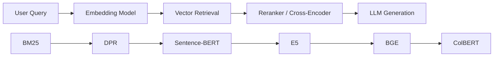
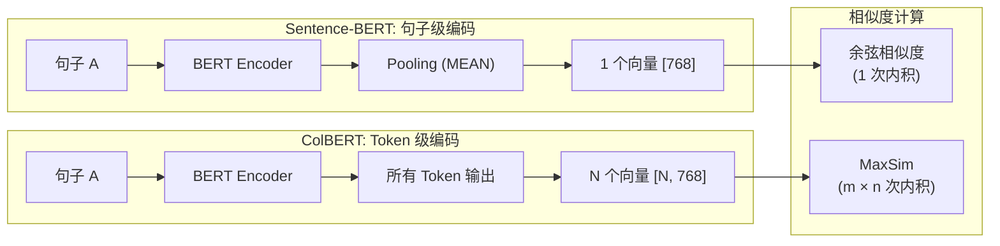

# Sentence-BERT / ColBERT

## 知识地图



## 前置知识

- **BERT 架构**：双向 Transformer 编码器、[CLS] token、Masked Language Modeling
- **孪生网络 (Siamese Network)**：两个共享权重的编码器处理不同输入
- **对比学习**：正样本对/负样本对、三元组损失
- **向量检索基础**：余弦相似度、内积搜索、FAISS 索引

## 为什么会出现 (Why)

### Sentence-BERT 的出现背景

BERT 在 2018 年彻底改变了 NLP，但它**不适合语义搜索**。原因很简单：BERT 需要将两个句子拼接（用 [SEP] 连接）后送入模型，才能判断它们的相似度。如果要从 10000 个句子中找到与 query 最相似的句子，需要做 $\binom{10000}{2}$ 次拼接推理——这是 $O(n^2)$ 级别的计算，在工程上完全不可行。

更直接说：BERT 产生的 token 级向量无法直接池化为好的句子级向量。用 [CLS] 输出或平均池化做余弦相似度的效果，甚至不如平均 GloVe 词向量。

### ColBERT 的出现背景

SBERT 解决了句子级检索的效率问题，但付出了代价：它将整个句子压缩为一个向量，丢失了 Token 级别的细粒度交互。对于需要精确匹配的场景（如"iPhone 15 Pro Max 256GB" vs "iPhone 15 Pro 128GB"），句子级向量很难区分。

ColBERT 提出了一个折中方案：保持独立编码的效率，但在计算相似度时做 Token 级别的交互。

## 解决什么问题 (Problem)

- **Sentence-BERT**：让 BERT 类模型能够**高效地**为句子生成可直接比较的固定大小向量，将语义相似度搜索从 $O(n^2)$ 降为 $O(n)$。
- **ColBERT**：在保持双塔效率的同时，恢复 Token 级别的细粒度交互，提供比句子级向量更高的检索精度。

## 核心思想 (Core Idea)

- **Sentence-BERT**：使用孪生网络架构独立编码每个句子，池化为固定向量，通过余弦相似度高效比较。
- **ColBERT**：在效率（双塔独立编码）和效果（交叉注意力交互）之间找一个中间点——独立编码，延迟交互 (Late Interaction)。

---

## Sentence-BERT (SBERT)

### 解决方案

SBERT 使用**孪生网络**架构，独立编码每个句子为固定大小的向量，然后用余弦相似度比较：

```python
# 两个句子独立编码
emb_A = pool(bert(A))  # [768]
emb_B = pool(bert(B))  # [768]
similarity = cosine(emb_A, emb_B)
```

### 数学模型/公式

#### 分类目标函数

$$o = \text{softmax}(W_t \cdot |u-v|; u*v)$$

将两个句子的向量之差和逐元素乘积拼接后分类。

**通俗解释：** 把两个句子向量 u 和 v 的"差异"(u-v 的绝对值) 和"交集"(逐元素乘积) 拼起来，通过一个全连接层判断它们的关系（如：蕴含、矛盾、中立）。|u-v| 捕捉了"这两个句子哪里不一样"，u*v 捕捉了"这两个句子哪里一样"。

#### 回归目标函数

$$\text{MSE}(\text{cosine}(u, v), \text{label})$$

**通俗解释：** 让模型预测的余弦相似度尽可能接近人类标注的真实相似度分数。例如人类标注 "句子 A 和句子 B 相似度 = 4.2/5.0"，模型就尽力让 cosine(u, v) 接近 4.2。

#### 三元组目标函数

$$L = \max(0, \|s_a - s_p\| - \|s_a - s_n\| + \epsilon)$$

**通俗解释：** 锚点 s_a（给定句子）离正样本 s_p（相关句子）的距离，必须比离负样本 s_n（不相关句子）的距离至少近 epsilon。如果已经满足了，损失为 0；如果不满足，就惩罚模型。这种损失让模型学习"谁跟谁更接近"的相对关系。

### 池化策略

| 策略 | 描述 |
|------|------|
| CLS | 使用 [CLS] token 的输出 |
| MEAN | 所有 token 输出的平均值（**推荐**） |
| MAX | 所有 token 输出的按维度最大值 |

---

## ColBERT (Contextualized Late Interaction)

### Late Interaction — 数学定义

**独立编码，延迟交互**：

- Query 编码：$Q = [q_1, q_2, \ldots, q_m]$（$m$ 个 token 向量）
- Doc 编码：$D = [d_1, d_2, \ldots, d_n]$（$n$ 个 token 向量）

相似度计算（MaxSim）：

$$S(q, d) = \sum_{i=1}^{m} \max_{j=1..n} q_i^T d_j$$

每个 query token 找到最相似的 doc token，求和。

**通俗解释：** 想象你查询"苹果手机价格"，ColBERT 会让"苹果"去找文档里最匹配的词（可能是"iPhone"），"手机"去找"smartphone"，"价格"去找"售价"或"$999"。每个查询词独立找到最相关的文档词，最后累加得分。这比 SBERT 更精细——SBERT 只看整体，ColBERT 能看到每个词和文档的对应关系。

### 索引

文档的所有 token 向量都存入向量索引（而非仅一个 [CLS] 向量）→ 索引更大但交互更精细。

---

## 可视化展示



## SBERT vs ColBERT

| | SBERT | ColBERT |
|------|-------|---------|
| 向量数/文档 | 1 | N (每个 token) |
| 索引大小 | 小 | 大（数十倍） |
| 交互粒度 | 粗（句子级） | 细（token 级） |
| 速度 | 快 | 较快 |
| 效果 | 好 | 更好 |

---

## 最小可运行代码

### Sentence-BERT 使用

```python
from sentence_transformers import SentenceTransformer

model = SentenceTransformer('all-MiniLM-L6-v2')
embeddings = model.encode(sentences)
similarities = model.similarity(emb_A, emb_B)
```

### ColBERT 检索示例

```python
from colbert import Indexer, Searcher
from colbert.infra import Run, RunConfig, ColBERTConfig

# 索引文档
with Run().context(RunConfig(nranks=1, experiment="my_index")):
    config = ColBERTConfig(doc_maxlen=300, nbits=2)
    indexer = Indexer(checkpoint="colbert-ir/colbertv2.0", config=config)
    indexer.index(name="my_index", collection=["文档1", "文档2", ...])

# 检索
with Run().context(RunConfig(nranks=1, experiment="my_index")):
    searcher = Searcher(index="my_index", checkpoint="colbert-ir/colbertv2.0")
    results = searcher.search("什么是机器学习?", k=10)
```

### LangChain + SBERT

```python
from langchain.embeddings import HuggingFaceEmbeddings

embeddings = HuggingFaceEmbeddings(
    model_name="sentence-transformers/all-MiniLM-L6-v2"
)
vec = embeddings.embed_query("什么是机器学习?")
```

---

## 工业界应用

| 应用场景 | 推荐方案 | 原因 |
|----------|---------|------|
| 通用语义搜索 | SBERT | 快速、索引小、效果足够好 |
| 精确关键词匹配 | ColBERT | Token 级交互，专有名词不遗漏 |
| 大规模文档检索 (>1M) | SBERT + FAISS | 索引小，检索快 |
| 小规模高精度检索 (<100K) | ColBERT | 精度高，可接受索引开销 |
| 多语言检索 | SBERT (多语言模型) | 社区多语言模型丰富 |
| RAG 粗召回 | SBERT | 速度快，满足 Top-K 粗筛需求 |

---

## 对比表格

| 维度 | BERT (Cross-Encoder) | Sentence-BERT (Bi-Encoder) | ColBERT (Late Interaction) |
|------|----------------------|----------------------------|-----------------------------|
| 编码方式 | 拼接两个句子一起编码 | 独立编码，各自向量化 | 独立编码，保留所有 Token 向量 |
| 检索复杂度 | O(n^2) — 不可行 | O(n) — 可行 | O(n) — 可行 |
| 交互粒度 | 最深（逐 Token 交叉注意力） | 最粗（句子级向量余弦） | 中等（Token 级 MaxSim） |
| 索引大小 | 无索引 | 小（每文档 1 个向量） | 大（每文档 N 个向量） |
| 检索精度 | 最高 | 较高 | 很高（接近 Cross-Encoder） |
| 典型用途 | 精排 (Rerank) | 粗召回 (Retrieval) | 粗召回 + 精排合一 |

---

## 学完后建议继续学习

1. **BM25 与 DPR** — 理解稀疏检索和稠密检索的对比
2. **BGE / E5 模型** — 了解基于 SBERT/ColBERT 架构优化的最新模型
3. **FAISS 向量索引** — 学习如何高效存储 SBERT/ColBERT 向量
4. **RAG 基础** — 将检索模型集成到 RAG 系统中
5. **Dense Retrieval Advanced** — PLAID 等 ColBERT 加速方案

---

## 高频面试题

**Q1: 为什么 BERT 不能直接用于语义搜索？SBERT 是如何解决的？**

A: BERT 需要拼接两个句子后通过交叉注意力层计算相似度——每次判断一对句子都需要一次完整的前向推理。对 N 个候选文档做排序需要 O(N^2) 次推理，在 10000 个文档的集合中，这是 5000 万次推理，完全不可行。SBERT 的解决方案是孪生网络架构：每个句子独立编码为固定向量，查询时只需编码 query 一次（O(1)），与预计算好的文档向量做余弦相似度，复杂度降为 O(N)。

**Q2: SBERT 的三种池化策略 (CLS / MEAN / MAX) 哪种最好？为什么？**

A: MEAN（平均池化）通常是推荐策略。原因：CLS token 是 BERT 预训练时为 NSP 任务设计的，不代表最优的句子级语义表示；MAX 池化对异常值敏感，且丢失了 token 的集体信息；MEAN 平等考虑所有 token 的贡献，在实践中效果最稳定。但也有例外：有些模型专门为 CLS 池化优化过（如 BGE 系列），这时 CLS 可能更好。

**Q3: ColBERT 的 "Late Interaction" 是什么意思？和 Cross-Encoder 有什么区别？**

A: "Late Interaction" 指交互发生在编码之后。Cross-Encoder 在编码阶段就让两个句子的 token 通过注意力层交互——精度最高但无法预计算。ColBERT 的编码是独立的（像双塔），但在计算相似度时做 Token 级 MaxSim 交互——既保留了独立编码的效率，又有 Token 级精度。Late 的意思是交互被"延迟"到了相似度计算阶段，而不是编码阶段。

**Q4: SBERT 和 ColBERT 各适合什么场景？**

A: SBERT 适合：大规模文档检索（索引大小是 ColBERT 的 1/N）、对检索速度要求极高的场景、通用语义匹配。ColBERT 适合：小到中等规模文档集（可承受更大索引）、需要精确 Token 级匹配的业务（如产品型号搜索）、希望用单一模型同时做粗召回和精排的场景。

**Q5: 如何训练一个 SBERT 模型？有哪些训练数据要求？**

A: SBERT 训练通常分两步：1) 收集或构造句子对数据，每对标注相似度分数（如 STS 数据集）或关系标签（蕴含/矛盾/中立，如 NLI 数据集）；2) 在预训练 BERT 基础上，根据数据形式选择分类/回归/三元组目标函数进行微调。数据要求：至少几千对标注数据，正负样本比例均衡（约 1:1）。对于没有标注数据的场景，可以用数据增强（回译、同义词替换）构造正样本对，用随机采样构造负样本对。
