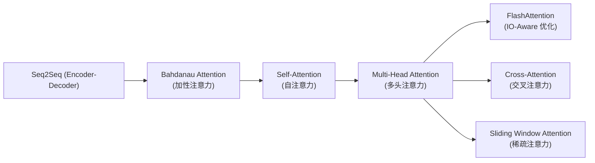
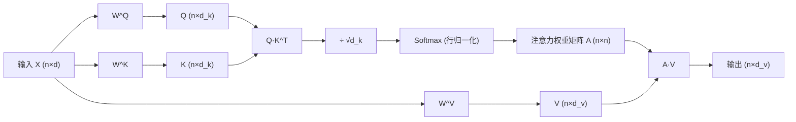

# Self-Attention (自注意力)

## 知识地图



## 前置知识

- **矩阵乘法与 Softmax**：理解 $QK^T$ 的维度变换和行归一化
- **词向量 (Word Embedding)**：输入序列已转化为稠密向量表示
- **RNN / LSTM 的基本概念**：理解序列建模中"全局信息交互"需求从何而来
- **概率分布**：注意力权重本质上是一个概率分布（和为 1，每个值非负）

## 为什么会出现 (Why)

在 Self-Attention 出现之前，序列建模主要依赖 RNN/LSTM 或 CNN：

- **RNN/LSTM**：串行计算，第 t 步依赖第 t-1 步的隐状态，无法并行训练。长距离依赖信息需要经过 $O(n)$ 步传递，容易被遗忘门稀释。
- **CNN**：虽然可以并行，但感受野受卷积核大小限制，需要堆叠多层才能覆盖长距离依赖。
- **Bahdanau Attention**：虽然引入了"注意力"概念，但只是在 Encoder-Decoder 之间做对齐，序列内部仍然是 RNN。

**Self-Attention 的驱动力**：能否让序列中每个位置一步直达所有其他位置，同时完全并行计算？Transformer (2017) 用 Self-Attention 回答了这个问题。

## 解决什么问题 (Problem)

Self-Attention 解决的核心问题：**如何在 $O(1)$ 步内让序列中任意两个位置直接交互，并让模型自主学习"谁更重要"。**

具体来说：
1. **全局依赖**：任何两个 token 之间的信息传递路径长度为 $O(1)$，而非 RNN 的 $O(n)$
2. **并行计算**：所有位置的注意力可以同时计算，不依赖时序递推
3. **动态权重**：注意力权重由输入内容动态决定，而非固定的卷积核或距离衰减

## 核心思想 (Core Idea)

**让序列中每个位置"看到"所有其他位置，并自主决定重点关注哪些位置——通过"查询-键-值"(Q-K-V)的相似度匹配实现全局信息交互。**

---

## 数学公式

### 从输入到 Q, K, V

给定输入序列 $\mathbf{X} \in \mathbb{R}^{n \times d}$，通过三个独立的线性投影得到 Query、Key、Value：

$$
\mathbf{Q} = \mathbf{X} \mathbf{W}^Q, \quad \mathbf{K} = \mathbf{X} \mathbf{W}^K, \quad \mathbf{V} = \mathbf{X} \mathbf{W}^V
$$

其中 $\mathbf{W}^Q, \mathbf{W}^K \in \mathbb{R}^{d \times d_k}$，$\mathbf{W}^V \in \mathbb{R}^{d \times d_v}$。

**通俗解释：** 把输入序列复制三份，分别经过三个不同的"透镜"(线性变换)去看它——一份用来"提问"(Query)，一份用来"被匹配"(Key)，一份用来"提供内容"(Value)。这就像图书馆检索：你心里有一个问题(Query)，书架上每本书有索引卡(Key)，匹配到合适的书后，你取走的是书的内容(Value)。

**直觉**：
- **Query**："我（当前位置）在寻找什么样的信息？"
- **Key**："我（每个位置）包含什么样的信息？"
- **Value**："我（每个位置）的实际内容是什么？"

### Scaled Dot-Product Attention

$$
\text{Attention}(\mathbf{Q}, \mathbf{K}, \mathbf{V}) = \text{softmax}\left(\frac{\mathbf{Q} \mathbf{K}^T}{\sqrt{d_k}}\right) \mathbf{V}
$$

计算流程：
1. $\mathbf{Q}\mathbf{K}^T$：计算所有位置对的**相似度得分**（$n \times n$ 矩阵）
2. $/\sqrt{d_k}$：缩放，防止点积过大导致 Softmax 梯度消失
3. $\text{softmax}$：将得分归一化为**注意力权重**（每行和为 1）
4. $\times \mathbf{V}$：按权重加权求和——输出是 Value 的加权平均

**通俗解释：** 这四步可以用"图书馆找书"来理解：
1. **Q 与所有 K 做点积** — 把你脑海里的问题跟书架上每本书的索引卡比对，得到一个"相关度分数"。
2. **除以 $\sqrt{d_k}$** — 如果索引卡很长（维度大），分数会虚高。除以 $\sqrt{d_k}$ 相当于"校准"，把分数拉回合理范围。
3. **Softmax** — 把相关度分数变成百分比权重（所有书的相关度加起来 = 100%）。
4. **加权求和 V** — 你不是挑一本书带走，而是按相关度比例从所有书里各抄一点内容，拼成最终答案。

### 为什么除以 $\sqrt{d_k}$？

假设 $\mathbf{q}, \mathbf{k}$ 的每个分量独立，均值为 0，方差为 1：

$$
\text{Var}(q \cdot k) = \sum_{i=1}^{d_k} \text{Var}(q_i k_i) = d_k \cdot 1 \cdot 1 = d_k
$$

当 $d_k$ 很大时（如 64 或 128），点积方差也很大 → Softmax 输入分布极端 → 梯度趋近于 0。除以 $\sqrt{d_k}$ 将方差压回 1：

$$
\text{Var}\left(\frac{q \cdot k}{\sqrt{d_k}}\right) = 1
$$

**通俗解释：** 两个随机向量的点积，维度越高结果越大。如果把一个方差巨大的分数送进 Softmax，Softmax 会极端化——某个位置的权重接近 1，其他接近 0，梯度几乎消失。除以 $\sqrt{d_k}$ 就像调低音量，让 Softmax 的输出分布更平滑，梯度能正常回传。

---

## 可视化展示

### Self-Attention 计算流程



### 注意力矩阵 (Attention Matrix) 概念

注意力矩阵 $A \in \mathbb{R}^{n \times n}$ 是 Self-Attention 的核心数据结构：

- **行**：当前 token（Query）
- **列**：被关注的 token（Key）
- **值 $A_{ij}$**：token $i$ 对 token $j$ 的关注程度

对于 Self-Attention，这是一个**非对称方阵**（$A_{ij} \neq A_{ji}$ 通常），因为"我关注你"不等于"你关注我"。在自回归模型中，通过 **causal mask** 将矩阵变为上三角（位置 $i$ 只能看到 $\leq i$ 的位置）。

### Softmax 温度效应：不同 $d_k$ 下的注意力分布

```echarts
return {
  xAxis: { type: 'category', data: ['词1', '词2', '词3', '词4', '词5'] },
  yAxis: { type: 'value', min: 0, max: 1, name: '注意力权重' },
  legend: { top: 28,  data: ['d_k=4 (未缩放)', 'd_k=64 (缩放后)'] },
  series: [
    {
      name: 'd_k=4 (未缩放)', type: 'bar',
      data: [0.02, 0.03, 0.88, 0.04, 0.03],
      itemStyle: { color: '#c0392b' }
    },
    {
      name: 'd_k=64 (缩放后)', type: 'bar',
      data: [0.12, 0.18, 0.40, 0.17, 0.13],
      itemStyle: { color: '#2980b9' }
    }
  ],
  tooltip: { trigger: 'axis' },
  grid: { left: 60, right: 20, top: 40, bottom: 60 }
}
```

不缩放时注意力过于集中（Softmax 饱和）；缩放后分布更平滑，梯度流动更健康。

---

## 最小可运行代码

### PyTorch 完整实现

```python
import torch
import torch.nn as nn
import math

class SelfAttention(nn.Module):
    def __init__(self, d_model, d_k=None):
        super().__init__()
        d_k = d_k or d_model
        self.W_q = nn.Linear(d_model, d_k, bias=False)
        self.W_k = nn.Linear(d_model, d_k, bias=False)
        self.W_v = nn.Linear(d_model, d_k, bias=False)
        self.scale = math.sqrt(d_k)

    def forward(self, x):
        # x: [batch, seq_len, d_model]
        Q = self.W_q(x)
        K = self.W_k(x)
        V = self.W_v(x)
        scores = Q @ K.transpose(-2, -1) / self.scale
        attn = torch.softmax(scores, dim=-1)
        return attn @ V
```

### NumPy 手写

```python
import numpy as np

def self_attention(X, W_q, W_k, W_v):
    Q = X @ W_q
    K = X @ W_k
    V = X @ W_v
    d_k = K.shape[-1]
    scores = Q @ K.T / np.sqrt(d_k)
    attn_weights = np.exp(scores - scores.max(axis=-1, keepdims=True))  # 数值稳定 softmax
    attn_weights /= attn_weights.sum(axis=-1, keepdims=True)
    return attn_weights @ V
```

---

## 复杂度分析

| 指标 | 复杂度 | 瓶颈 |
|------|--------|------|
| 时间 | $O(n^2 d)$ | $n$ 为序列长度 |
| 空间 | $O(n^2)$ | 注意力矩阵 $n \times n$ |
| 参数量 | $3 \cdot d \cdot d_k$ | 不含序列长度 |

**长序列的根本瓶颈**：$n^2$ 的注意力矩阵。当 $n=4096$ 时，单个注意力矩阵占用 $4096^2 \times 4\text{bytes} \approx 67\text{MB}$。这催生了 FlashAttention、Sparse Attention、Linformer 等优化。

## 工业界应用

| 应用场景 | 模型/系统 | 说明 |
|----------|----------|------|
| 机器翻译 | Transformer, MarianMT | 最早使用 Self-Attention 替代 RNN |
| 大规模语言模型 | GPT 系列, LLaMA 系列 | 自回归 Self-Attention (causal) |
| 文本理解 | BERT, RoBERTa | 双向 Self-Attention (无 causal mask) |
| 代码生成 | Codex, CodeLLaMA | Causal Self-Attention + 长上下文 |
| 蛋白质结构预测 | AlphaFold | 使用 Self-Attention 建模氨基酸间关系 |
| 语音识别 | Whisper, Conformer | 结合 Self-Attention 和卷积 |

## 对比表格：Self-Attention vs RNN vs CNN

| 特性 | Self-Attention | RNN | CNN |
|------|---------------|-----|-----|
| 全局感受野 | ✅ $O(1)$ 步 | ❌ $O(n)$ 步 | 受限（kernel 大小） |
| 并行计算 | ✅ 完全并行 | ❌ 串行 | ✅ 并行 |
| 序列长度敏感 | $O(n^2)$ | $O(n)$ | $O(n)$ |
| 位置信息 | 需显式编码 | 隐式 | 隐式 |
| 动态权重 | ✅ 由内容决定 | 固定参数 | 固定参数 |

## 学完后建议继续学习

1. **Multi-Head Attention** — 将单头扩展为多视角并行，理解 Transformer 的完整注意力层
2. **Cross-Attention** — 学习两个序列之间如何交互（Encoder-Decoder 桥梁）
3. **Positional Encoding** — 理解 Self-Attention 如何感知位置信息
4. **FlashAttention** — 理解工业界如何解决 $O(n^2)$ 内存瓶颈
5. **Transformer 完整架构** — 将 Self-Attention 嵌入完整的 Encoder-Decoder 结构

## 高频面试题

### Q1: Self-Attention 的计算流程是什么？每一步的作用是什么？

**标准答案：**
Self-Attention 的计算分为四步：
1. **线性投影**：将输入 $X$ 通过 $W^Q, W^K, W^V$ 三个矩阵分别投影为 Query、Key、Value。Query 负责"提问"，Key 负责"被匹配"，Value 提供实际内容。
2. **计算相似度**：$QK^T$ 得到 $n \times n$ 的注意力分数矩阵，衡量每对 token 的相关性。
3. **缩放 + Softmax**：除以 $\sqrt{d_k}$ 防止梯度消失，Softmax 将分数归一化为概率分布（每行和为 1）。
4. **加权求和**：用注意力权重对 Value 加权求和，得到每个位置的输出——它是所有 Value 的加权平均，权重由 Query-Key 相似度决定。

### Q2: 为什么要除以 $\sqrt{d_k}$？不除会怎样？

**标准答案：**
假设 Q 和 K 的每个分量独立同分布，均值为 0，方差为 1，则点积 $q \cdot k$ 的方差为 $d_k$。当 $d_k$ 很大时（如 64、128），点积的绝对值会很大，导致 Softmax 的输入分布极端——最大值趋近于 1，其余趋近于 0，梯度几乎消失。除以 $\sqrt{d_k}$ 将方差压回 1，使 Softmax 输出分布更平滑，保证梯度正常流动。

### Q3: Self-Attention 的时间复杂度和空间复杂度是多少？长序列的瓶颈在哪里？

**标准答案：**
- 时间复杂度：$O(n^2 d)$，其中 $n$ 为序列长度，$d$ 为维度
- 空间复杂度：$O(n^2)$，来自 $n \times n$ 的注意力矩阵

长序列的根本瓶颈是 $O(n^2)$ 的注意力矩阵。当 $n=4096$ 时，单个注意力矩阵约 67MB（FP32）；当 $n=32K$ 时，约 4GB。常见的解决方案包括：FlashAttention（IO 优化）、Sparse Attention（滑动窗口/空洞注意力）、Linformer（低秩近似）、MQA/GQA（减少 KV 头数）。

### Q4: 为什么 Self-Attention 比 RNN 更适合处理长距离依赖？

**标准答案：**
- **信息传递路径**：Self-Attention 中任意两个位置的信息交互是 $O(1)$ 步（直接通过注意力矩阵），而 RNN 需要 $O(n)$ 步（逐时间步传递），信息在长距离传递中会被遗忘门稀释。
- **并行计算**：Self-Attention 所有位置可同时计算，而 RNN 必须串行，第 $t$ 步依赖第 $t-1$ 步。
- **动态权重**：Self-Attention 的注意力权重由内容动态决定，能灵活适应不同上下文；RNN 的权重是固定的。
- **代价**：Self-Attention 的 $O(n^2)$ 复杂度在长序列时成为瓶颈。

### Q5: Self-Attention 为什么还需要位置编码？它本身不能感知位置吗？

**标准答案：**
Self-Attention 的核心操作是 $QK^T$（点积），这个操作是**置换等变**的（permutation equivariant）——如果打乱输入序列的顺序，输出也会被打乱但值不变。这是因为点积只关心两个向量的"内容相似度"，不关心它们在第几个位置。因此，Self-Attention 本身**不具备位置感知能力**。需要额外加入位置编码（正弦位置编码、可学习位置编码、RoPE 等）来让模型知道每个 token 在序列中的位置。
