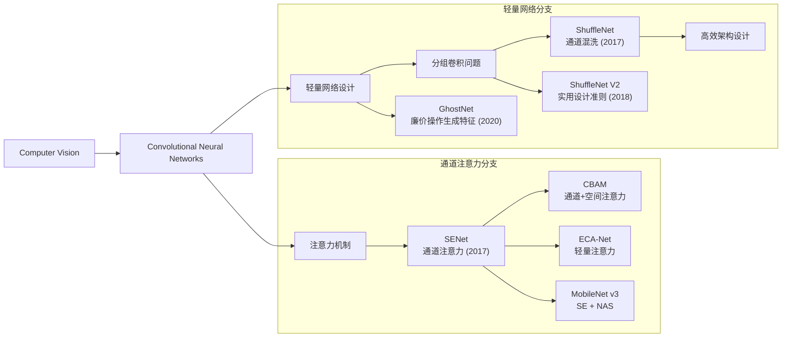
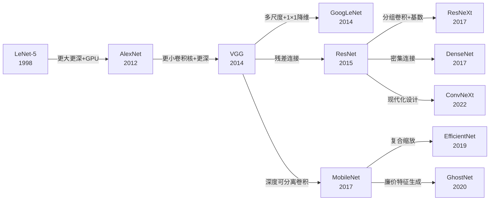
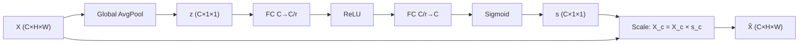
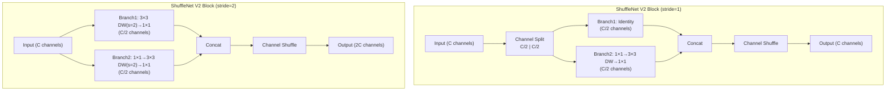

# SENet / ShuffleNet / GhostNet

## 知识地图



## 前置知识

- 标准卷积和分组卷积（Grouped Convolution）的区别
- ResNet 残差连接的基本概念
- MobileNet 深度可分离卷积的原理
- 全局平均池化（Global Average Pooling, GAP）的作用
- FLOPs 和 MAC（Memory Access Cost）的计算
- ImageNet 图像分类基准

## 模型演化路线



| 模型 | 年份 | 关键创新 | 解决的问题 |
|------|------|---------|-----------|
| SENet | 2017 | Squeeze-and-Excitation（通道注意力） | 不同通道的重要性不同，网络不应平等对待所有通道 |
| ShuffleNet v1 | 2017 | Channel Shuffle（通道混洗） | 分组卷积导致组间信息不流通 |
| ShuffleNet v2 | 2018 | 实用设计准则（MAC/并行度/element-wise） | FLOPs 不等于实际推理速度 |
| GhostNet | 2020 | Ghost Module（廉价线性变换） | CNN 中间特征图存在大量相似对，浪费计算 |

---

## 核心思想

SENet (Squeeze-and-Excitation) 提出**通道注意力**——不是所有通道都一样重要，让网络自己学"哪个通道该被强调"。ShuffleNet 解决的是 $1 \times 1$ 卷积在轻量模型中的瓶颈——通过通道混洗让分组卷积间信息流通。GhostNet 观测到 CNN 中间特征图存在大量"相似对"——廉价地用线性变换生成冗余特征，只为"必要特征"做真正的卷积。

三种设计的共同目标：**在极低 FLOPs 下保持精度**，用于移动端和嵌入式部署。

---

## SENet — Squeeze-and-Excitation

### 为什么会出现

传统 CNN 中，每个卷积层对所有输入通道一视同仁地把它们"混合"成输出通道。但实际上，不同通道携带的信息对不同任务的重要性是不同的。例如：
- 在检测猫的图片时，"猫耳朵"特征的通道应该比"背景纹理"的通道更重要。
- 这种"哪个通道重要"的信息其实可以从**全局上下文**中推断出来——但如果只看局部感受野（3×3 卷积），是得不到这个全局信息的。

自动驾驶公司 Momenta 的 Jie Hu 等人提出 SE block：在卷积层之后加一个极轻量的模块（仅增加约 2% 参数），让网络学会为每个通道分配一个 0-1 之间的权重——"这个通道对当前任务有多重要？"

### 解决什么问题

解决 CNN 中**通道间信息不平等**的问题——让网络自动学会对不同通道的特征"加权"，强调有用的通道、抑制无用的通道。

### 核心思想

**对每个通道做一次"投票"：先用全局平均池化收集每个通道的整体表现（Squeeze），再用两层全连接网络对这些表现打分（Excitation），最后用分数去乘原来的特征图——重要的通道放大，不重要的通道缩小。**

### 数学定义

对特征图 $\mathbf{X} \in \mathbb{R}^{C \times H \times W}$：

1. **Squeeze**：全局平均池化 → $\mathbf{z} \in \mathbb{R}^C$，$z_c = \frac{1}{HW}\sum_{i,j} x_{c,i,j}$

**通俗解释：** 对每个通道的所有空间位置求平均值——相当于问："这个通道整体表现如何？有多活跃？"

2. **Excitation**：两层 MLP + Sigmoid → $\mathbf{s} = \sigma(\mathbf{W}_2 \cdot \delta(\mathbf{W}_1 \cdot \mathbf{z}))$

**通俗解释：** 用一个小型神经网络分析"每个通道的活跃度"，输出一个 0-1 之间的分数——这个神经网络会学到"哪些通道的组合模式预示着这个通道有用"。

3. **Scale**：$\tilde{\mathbf{X}}_c = s_c \cdot \mathbf{X}_c$

**通俗解释：** 用分数逐通道缩放特征图——得分高的通道被放大（重要特征被强调），得分低的被抑制（噪声被压低）。

中间降维比 $r=16$（如 $C=256$，中间 $16$ 维），参数量仅 $2C^2/r$。

**通俗解释（r=16 的作用）：** 如果不降维，参数量是 $C^2$（256×256=65536）。引入 r=16 后变成 $2 \times 256 \times 16 = 8192$——减少了 87.5% 的参数，但 SE 模块仍然有效，因为通道间的重要性关系可以用低维的"瓶颈编码"来捕捉。

### SE Block 可视化



---

## ShuffleNet

### ShuffleNet v1 — 通道混洗

#### 为什么会出现

MobileNet v1 提出了深度可分离卷积来降低计算量。但深度可分离卷积之后的 Pointwise (1×1) 卷积仍然占据绝大部分计算量（约 94%）。ShuffleNet 的团队（旷视科技）提出：对 Pointwise 卷积也做分组——但这会导致新的问题：**分组卷积让信息只在组内流通，组间完全隔离。** 就像把班级分成几个小组讨论，但组之间不交流——信息会闭塞。

解决方案：**Channel Shuffle**——在做完分组 Pointwise 卷积后，把通道"洗牌"一下，让下一层的分组能混入其他组的信息。

#### 解决什么问题

解决分组卷积导致的**信息隔离**问题——通过在组间"洗牌"通道顺序，让下一层的分组卷积能接触到来自所有组的特征。

#### 核心思想

**分组卷积很便宜，但组间没有信息交流。在每个分组卷积之后，把通道顺序打乱（像洗牌一样），让下一层的每个组都能看到来自上一层不同组的通道——用几乎零开销解决了分组的信息瓶颈。**

#### Channel Shuffle 操作

将 $C$ 个通道 reshape 为 $(g, C/g)$ → transpose → flatten，等价于"分组间洗牌"。

### ShuffleNet V2 — 实用设计准则

#### 为什么会出现

ShuffleNet v1 的设计目标是降低 FLOPs（理论计算量）。但实际上，FLOPs 只是影响推理速度的因素之一。在真实硬件上，具有相同 FLOPs 的两个模型，推理速度可能差很多。ShuffleNet V2 团队通过大量实验总结了四条影响实际速度的关键设计准则。

#### 四条实用设计准则

1. **输入输出通道数相同时 MAC（Memory Access Cost）最小**
   - **通俗解释：** 如果一个操作的输入和输出张量大小相同，GPU/CPU 可以更高效地复用内存。如果输入小输出大，需要额外分配内存。

2. **过多分组卷积增加 MAC**
   - **通俗解释：** 分组数越多，每个组的通道数越少——GPU 在小矩阵上的并行效率差。

3. **网络碎片化（多分支）降低并行度**
   - **通俗解释：** 多个小操作比一个大操作更难并行。GPU 喜欢"一个大的矩阵乘法"胜过"10 个小的矩阵乘法"。

4. **Element-wise 操作（ReLU/Add）不可忽略**
   - **通俗解释：** 虽然 element-wise 操作的理论 FLOPs 很小，但内存读写开销大。加太多会减慢实际速度。

---

## GhostNet (2020)

### 为什么会出现

在 ShuffleNet v2 和 MobileNet v3 之后，轻量网络的设计空间似乎已被穷尽。但华为诺亚实验室的研究人员观察到一个被忽视的现象：**CNN 的中间层特征图中，很多通道两两之间只差一个简单的线性变换（如明暗不同、轻微的几何变换）。**

如果这些"相似"特征可以用廉价变换生成，为什么还要浪费昂贵的卷积运算来计算它们？GhostNet 的核心思想是：只对一半的特征图做真正的卷积（"内在特征"），另一半通过对内在特征做廉价的 3×3 深度卷积来"模仿"（"幽灵特征"）。

### 解决什么问题

在极低 FLOPs（<150M）下进一步提升精度——通过利用 CNN 中间特征的冗余性，用廉价操作替代 50% 的卷积计算。

### 核心思想

**一半的特征图通过真正的卷积获得"原片"，另一半通过对"原片"做廉价的线性变换（3×3 深度卷积）获得"复印本"——拼在一起近似全卷积效果，但计算量减半。**

### Ghost Module 数学定义

普通卷积输出中，很多特征图两两之间存在简单的线性关系（"幽灵对"）。Ghost 模块：

1. 正常卷积产生 $\frac{C_{out}}{2}$ 个"内在"特征图
2. 对每个内在特征图施加廉价操作 $\Phi_i$（如 $3 \times 3$ 深度卷积），各生成一个"幽灵"特征
3. 拼接 → $C_{out}$ 个特征图

**通俗解释：** 想象你有一个 50 人的合唱团。传统方法：为每个歌手单独录制（50 次录制）。Ghost 方法：选 25 个主唱歌手（内在特征）认真录制，剩下 25 个伴唱通过对主唱录音加一点点混响/变调（廉价线性变换）生成。最终听起来效果差不多，但录制工作量减半。

计算量减少约 50%，因为一半的特征图由廉价操作生成。

---

## 可视化展示

### SE Block


### ShuffleNet V2 Block



### 轻量模型对比

```echarts
return {
  tooltip: { trigger: "axis", confine: true },
  title: { top: 5,  text: '轻量模型 ImageNet Top-1 vs FLOPs', left: 'center', textStyle: { fontSize: 12 } },
  xAxis: { type: 'value', name: 'FLOPs (M)', min: 0, max: 600 },
  yAxis: { type: 'value', name: 'Top-1 Accuracy (%)', min: 68, max: 78 },
  series: [
    { name: 'MobileNetV3', type: 'scatter', symbolSize: 14,
      data: [[219, 75.2]], itemStyle: { color: '#2980b9' } },
    { name: 'ShuffleNetV2', type: 'scatter', symbolSize: 14,
      data: [[299, 74.9], [149, 72.6]], itemStyle: { color: '#16a085' } },
    { name: 'GhostNet', type: 'scatter', symbolSize: 14,
      data: [[141, 73.9], [226, 75.0]], itemStyle: { color: '#d35400' } },
    { name: 'SENet', type: 'scatter', symbolSize: 14,
      data: [[390, 77.6]], itemStyle: { color: '#2c3e50' } }
  ],
  grid: { left: 60, right: 20, top: 55, bottom: 60 }
}
```

---

## 最小可运行代码

### SE Block

```python
import torch
import torch.nn as nn

class SEBlock(nn.Module):
    """Squeeze-and-Excitation 通道注意力模块"""
    def __init__(self, channels, reduction=16):
        super().__init__()
        self.squeeze = nn.AdaptiveAvgPool2d(1)
        self.excitation = nn.Sequential(
            nn.Linear(channels, channels // reduction, bias=False),
            nn.ReLU(inplace=True),
            nn.Linear(channels // reduction, channels, bias=False),
            nn.Sigmoid())

    def forward(self, x):
        B, C, _, _ = x.shape
        s = self.squeeze(x).view(B, C)
        s = self.excitation(s).view(B, C, 1, 1)
        return x * s


# 将 SE 插入 ResNet Bottleneck
class SEBottleneck(nn.Module):
    expansion = 4

    def __init__(self, in_ch, mid_ch, out_ch, stride=1, reduction=16):
        super().__init__()
        self.conv1 = nn.Conv2d(in_ch, mid_ch, 1, bias=False)
        self.bn1 = nn.BatchNorm2d(mid_ch)
        self.conv2 = nn.Conv2d(mid_ch, mid_ch, 3, stride, 1, bias=False)
        self.bn2 = nn.BatchNorm2d(mid_ch)
        self.conv3 = nn.Conv2d(mid_ch, out_ch, 1, bias=False)
        self.bn3 = nn.BatchNorm2d(out_ch)
        self.se = SEBlock(out_ch, reduction)  # SE 插入在最后一个 1×1 之后

        self.shortcut = nn.Sequential()
        if stride != 1 or in_ch != out_ch:
            self.shortcut = nn.Sequential(
                nn.Conv2d(in_ch, out_ch, 1, stride, bias=False),
                nn.BatchNorm2d(out_ch))

    def forward(self, x):
        out = nn.functional.relu(self.bn1(self.conv1(x)))
        out = nn.functional.relu(self.bn2(self.conv2(out)))
        out = self.bn3(self.conv3(out))
        out = self.se(out)  # 通道重新加权
        out += self.shortcut(x)
        return nn.functional.relu(out)
```

### Channel Shuffle

```python
def channel_shuffle(x, groups):
    """通道混洗：reshape → transpose → flatten"""
    B, C, H, W = x.shape
    return x.view(B, groups, C // groups, H, W) \
            .transpose(1, 2) \
            .contiguous() \
            .view(B, C, H, W)
```

### ShuffleNetV2 Block

```python
class ShuffleNetV2Block(nn.Module):
    def __init__(self, in_c, out_c, stride=1):
        super().__init__()
        mid = out_c // 2
        self.stride = stride
        # 分支1: 恒等映射 (或 depthwise conv if stride=2)
        if stride > 1:
            self.branch1 = nn.Sequential(
                nn.Conv2d(in_c, in_c, 3, stride, 1, groups=in_c, bias=False),
                nn.BatchNorm2d(in_c),
                nn.Conv2d(in_c, mid, 1, bias=False),
                nn.BatchNorm2d(mid), nn.ReLU(inplace=True))
        # 分支2
        self.branch2 = nn.Sequential(
            nn.Conv2d(in_c if stride > 1 else mid, mid, 1, bias=False),
            nn.BatchNorm2d(mid), nn.ReLU(inplace=True),
            nn.Conv2d(mid, mid, 3, stride, 1, groups=mid, bias=False),
            nn.BatchNorm2d(mid),
            nn.Conv2d(mid, mid, 1, bias=False),
            nn.BatchNorm2d(mid), nn.ReLU(inplace=True))

    def forward(self, x):
        if self.stride > 1:
            out = torch.cat([self.branch1(x), self.branch2(x)], dim=1)
        else:
            x1, x2 = x.chunk(2, dim=1)
            out = torch.cat([x1, self.branch2(x2)], dim=1)
        return channel_shuffle(out, 2)


# torchvision 内置
import torchvision.models as models

# SENet (通过 ResNet 加 SE 实现)
senet50 = models.resnet50(weights=None)  # SE 版本需要自行替换 bottleneck

shufflenet_v2_x1_0 = models.shufflenet_v2_x1_0(weights=None)

# MobileNet v3 (内置 SE 模块)
mobilenet_v3_large = models.mobilenet_v3_large(weights=None)

print(f"ShuffleNetV2 1.0× params: {sum(p.numel() for p in shufflenet_v2_x1_0.parameters()) / 1e6:.2f}M")
```

### Ghost Module

```python
class GhostModule(nn.Module):
    """Ghost 模块：一半正常卷积 + 一半廉价操作"""
    def __init__(self, in_ch, out_ch, kernel_size=1, ratio=2, dw_size=3, stride=1):
        super().__init__()
        self.out_ch = out_ch
        init_channels = out_ch // ratio
        cheap_channels = init_channels * (ratio - 1)

        self.primary_conv = nn.Sequential(
            nn.Conv2d(in_ch, init_channels, kernel_size, stride,
                      padding=kernel_size//2, bias=False),
            nn.BatchNorm2d(init_channels),
            nn.ReLU(inplace=True),
        )
        self.cheap_operation = nn.Sequential(
            nn.Conv2d(init_channels, cheap_channels, dw_size, 1,
                      padding=dw_size//2, groups=init_channels, bias=False),
            nn.BatchNorm2d(cheap_channels),
            nn.ReLU(inplace=True),
        )

    def forward(self, x):
        y_primary = self.primary_conv(x)
        y_cheap = self.cheap_operation(y_primary)
        return torch.cat([y_primary, y_cheap], dim=1)
```

---

## 工业界应用

| 模型 | 应用场景 | 原因 |
|------|---------|------|
| SE-ResNet-50 | 大规模图像分类基准 | SE 模块即插即用，仅增 2% 参数，提点 1%+ |
| SE-ResNet | 目标检测 backbone | 通道注意力帮助模型关注目标相关通道 |
| SE-MobileNet v3 | 移动端分类 | NAS 自动将 SE 安排在最优位置 |
| ShuffleNet v2 | ARM 芯片实时推理 | FLOPs + MAC 双低，实际延迟比 MobileNet v2 更低 |
| ShuffleNet v2 0.5× | 超低功耗 IoT 设备 | < 10M FLOPs，可在 MCU 级芯片运行 |
| GhostNet | 手机 NPU 推理 | 廉价操作用分组卷积实现，NPU 友好 |

---

## 对比表格

| 维度 | SENet (SE-ResNet-50) | ShuffleNet V2 | GhostNet 1.0× |
|------|---------------------|---------------|---------------|
| 年份 | 2017 | 2018 | 2020 |
| 参数量 | 28.1M | 2.3M (1.0×) | 5.2M |
| FLOPs | 4.1G | 146M | 141M |
| ImageNet Top-1 | 77.2% | 69.4% (1.0×) | 73.9% |
| 核心创新 | 通道注意力 | 通道混洗 + 实用设计准则 | Ghost Module 廉价特征 |
| 设计方法 | 即插即用模块 | 手工设计 + 准则指导 | 手工设计（观察驱动） |
| 部署目标 | 云端 + 边缘 | 移动端极低延迟 | 极低 FLOPs 场景 |

---

## 学完后建议继续学习

- [MobileNet / EfficientNet / ConvNeXt](/learn/mobilenet-efficientnet) — 了解 SE 模块在 MobileNet v3 和 EfficientNet 中的应用
- [ConvNeXt / GhostNet](/learn/convnext-ghostnet) — 深入了解 GhostNet 的完整架构设计和 ConvNeXt 的现代化理念
- [GoogLeNet / ResNet / DenseNet](/learn/googlenet-resnet) — 回顾 ResNet 残差连接和 Batch Normalization 基础

---

## 高频面试题

### Q1: SENet 的 Squeeze-and-Excitation 具体是怎么做的？为什么有效？

**答案：** SE 模块三步：
1. **Squeeze（压缩）**：对每个通道做全局平均池化，把 $H \times W$ 的空间信息压缩成 1 个数字——这个数字代表该通道的"全局活跃度"。
2. **Excitation（激励）**：用一个两层的 MLP（全连接 → ReLU → 全连接 → Sigmoid）为每个通道输出一个 0-1 的权重。中间层降维 r=16 以控制参数量。
3. **Scale（加权）**：用权重逐通道乘回原始特征图。

有效的原因：
- **全局感受野**：GAP 让每个通道的权重基于整张图片的全局信息，而不是局部的 3×3 感受野。
- **通道间依赖**：MLP 学习通道间的非线性关系（如"通道 3 激活 + 通道 17 激活 → 这是一张猫的图片 → 应该强调猫相关的通道"）。
- **极低成本**：仅增加约 2% 的参数（$\frac{2C^2}{r}$），是可忽略的额外开销。

### Q2: Channel Shuffle 是怎么实现的？为什么需要它？

**答案：** Channel Shuffle 的实现非常巧妙且完全可导：

```python
# 输入: (B, C, H, W), 分成 g 组
x = x.view(B, g, C//g, H, W)    # reshape 成 (B, g, C/g, H, W)
x = x.transpose(1, 2)            # 交换 g 和 C/g 维度
x = x.contiguous().view(B, C, H, W)  # 展开回 (B, C, H, W)
```

效果：原来相邻的通道被打散，均匀分布到 g 个组中。下一层的分组卷积每个组都会收到来自上一层所有组的通道。

需要它的原因：分组卷积让计算量降到 1/g，但信息流通被阻断在组内。如果不 shuffle，网络相当于 g 个独立的子网络并行——浪费了跨组信息。Channel Shuffle 用 zero-parameter 的操作（只是张量的 view+transpose）打破了这个隔离。

### Q3: ShuffleNet V2 的四条设计准则是什么？为什么 FLOPs 不能代表实际速度？

**答案：** 四条准则：

1. **输入输出通道数相同**：减少内存分配和复制的开销（MAC 最小）。
2. **控制分组数**：分组过多→每组通道少→GPU 在小矩阵上并行效率差→MAC 增加。
3. **减少碎片化**：多个小操作（如 Inception 的多分支）比一个大操作（如单路径 ResNet）并行度低。
4. **减少 element-wise 操作**：ReLU、Add、Concat 等虽然 FLOPs 极小，但内存读写开销大。

FLOPs 只是计算量的理论值，不代表实际速度，因为：
- 内存访问开销（MAC）可能比计算本身更耗时。
- GPU/CPU 的并行度取决于操作类型（如大矩阵乘法的 GPU 利用率远高于逐元素操作）。
- 不同操作的硬件实现效率不同（如 Depthwise Conv 的 FLOPs 利用率只有标准 Conv 的约 30%）。

### Q4: SE 模块中 reduction ratio r 的作用是什么？如何选择 r 的值？

**答案：** r 控制 Excitation 阶段 MLP 中间层的压缩程度：
- r=16 时，中间层通道数是 $C/16$（如 256→16→256），参数量为 $2C^2/r$。
- r 越大→参数越少→模块越轻但表达能力越弱。
- r 越小→参数越多→模块越强但额外开销越大。

原始论文通过实验确定 r=16 是一个好的平衡点（在精度和参数开销之间）。不同任务可以调整：
- 分类任务：r=16 或 r=8（标准选择）。
- 检测/分割任务：有时用 r=4 或 r=8，因为需要更精细的通道注意力。
- 极轻量模型（MobileNet v3）：用 r=4，因为本身通道数少（如 C=40），r=16 会让中间层只剩 2 维，信息损失太大。

### Q5: SENet、CBAM、ECA-Net 三种注意力机制有什么区别？

**答案：**

| 特性 | SENet (2017) | CBAM (2018) | ECA-Net (2020) |
|------|-------------|-------------|----------------|
| 注意力类型 | 仅通道 | 通道 + 空间 | 仅通道 |
| 通道注意力实现 | GAP → MLP(C→C/r→C) + Sigmoid | GAP + GMP → MLP + Sigmoid | GAP → 1D Conv(k) → Sigmoid |
| 空间注意力 | 无 | 通道维度上的 Pool → 7×7 Conv → Sigmoid | 无 |
| 参数量 | $\frac{2C^2}{r}$ | 略高于 SE | 极低（仅 k 个参数） |
| FLOPs 开销 | 低 | 中等 | 极低 |

关键区别：
- **CBAM**：同时用通道注意力和空间注意力（"哪个通道重要" + "哪个位置重要"），效果更好但开销更大。
- **ECA-Net**：用 1D 卷积替代 MLP，参数从 $2C^2/r$ 降到 k（3 或 5 个参数），证明了通道注意力不需要全连接——通道间的局部交互（相邻通道共享信息）就足够了。
