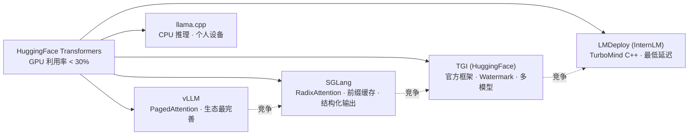
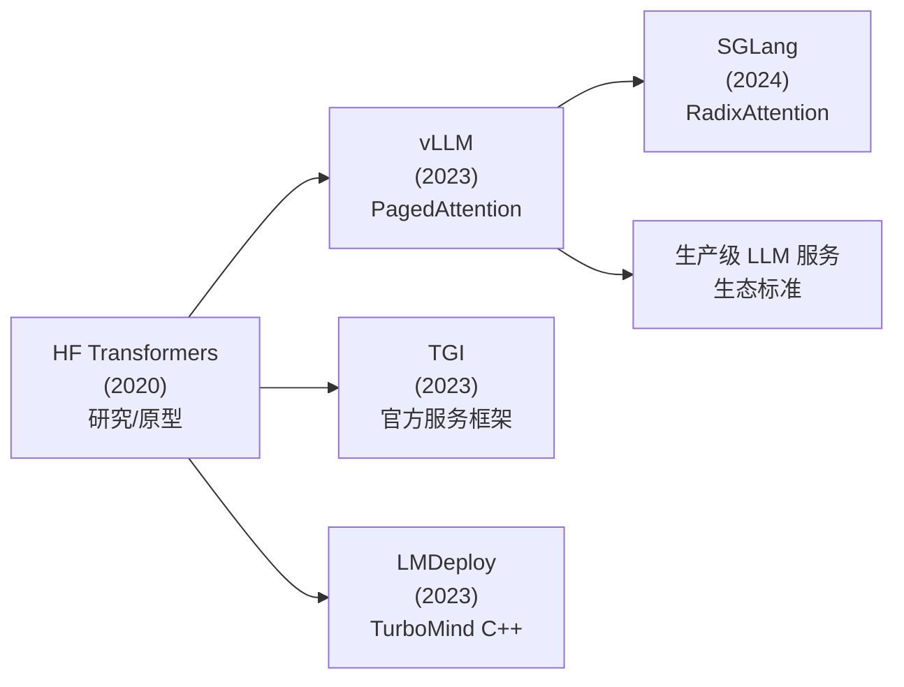
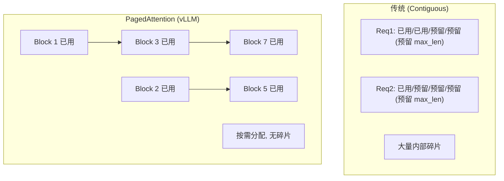

# LLM Serving Frameworks (vLLM / SGLang / TGI / LMDeploy)

## 知识地图



## 前置知识

- **LLM 推理基础**：自回归生成、KV Cache、Attention 计算
- **Continuous Batching**：迭代级请求调度的原理
- **PagedAttention**：基于分页的 KV Cache 内存管理
- **GPU 显存管理**：显存分配、碎片化、内存复用
- **分布式推理**：Tensor Parallelism、Pipeline Parallelism
- **HTTP 服务架构**：RESTful API、流式输出 (SSE)

## 框架演化路线



| Framework | Year | Developer | Core Innovation | Language |
|-----------|------|-----------|----------------|----------|
| vLLM | 2023 | UC Berkeley | PagedAttention 消除 KV Cache 碎片 | Python/C++ |
| TGI | 2023 | HuggingFace | 官方框架, Watermark, 多模型支持 | Rust/Python |
| SGLang | 2024 | Stanford/UCB | RadixAttention 前缀缓存, 结构化输出 | Python |
| LMDeploy | 2023 | Shanghai AI Lab (InternLM) | TurboMind C++ 推理后端, 最低延迟 | C++/Python |

## 为什么会出现 (Why)

裸跑 HuggingFace Transformers 做 LLM 推理，GPU 利用率通常不到 30%。专业推理框架解决三大痛点：

1. **KV Cache 内存管理**：传统方式为每个请求预留最大长度的连续显存，造成严重浪费。vLLM 将 OS 的虚拟内存/分页思想引入 KV Cache。
2. **请求调度效率**：多个用户同时请求时，传统的 static batching 等所有人完成才换下一批，GPU 利用率极低。
3. **前缀缓存和结构化输出**：很多场景中多个请求共享相同前缀（如 system prompt），重复计算浪费算力。SGLang 的 RadixAttention 只存一次。

四个框架走了不同的路径——vLLM 做生态（最广泛的模型和功能支持），SGLang 做极致优化（前缀缓存+结构化输出），TGI 做官方支持（HuggingFace 生态无缝集成），LMDeploy 做最低延迟（C++ 重写关键路径）。

## 解决什么问题 (Problem)

- **内存碎片**：传统 KV Cache 连续分配产生大量内部碎片，vLLM PagedAttention 按 block 非连续分配消除碎片
- **前缀重复计算**：多条请求共享相同 system prompt 时，传统方式每条都要重新计算相同的前缀
- **推理延迟**：Python 推理循环开销大，LMDeploy 用 C++ 重写关键路径
- **结构化输出约束**：需要模型输出 JSON、Regex 等格式时，传统方式靠 prompt 引导不够可靠
- **生态碎片化**：每个推理框架有各自的 API，TGI 希望成为 HuggingFace 的统一标准

## 核心思想 (Core Idea)

将操作系统的虚拟内存/分页机制引入 KV Cache 管理（vLLM），将 Trie 树引入前缀缓存（SGLang），将 C++ 级优化引入推理循环（LMDeploy），在 GPU 利用率 30% 提升到 80%+ 的基础上进一步优化多请求共享和结构化生成。

---

## 数学模型/公式

### PagedAttention 分块注意力 (vLLM)

KV Cache 按 Block 组织，注意力计算时拼接：

$$\text{Attn}(Q_i, \{B_1, ..., B_k\}) = \frac{\sum_{j=1}^{k} \sum_{t \in B_j} \exp(Q_i \cdot K_t / \sqrt{d}) \cdot V_t}{\sum_{j=1}^{k} \sum_{t \in B_j} \exp(Q_i \cdot K_t / \sqrt{d})}$$

每个 block 存 $B$ 个 token 的 K 和 V。

**通俗解释：** 虽然 Block 在物理显存上不连续，在数学上它们仍然代表连续的逻辑序列。注意力计算时，把需要的 Block 的 K、V 拼起来（逻辑上拼接，不需要物理拷贝），一次性计算完整的注意力。每个 Block 内部可以和 FlashAttention 的 tile 计算完美配合。类比操作系统内存管理：传统方式像 C 语言的 `malloc(MAX_LEN)`——赌你的请求不会超过 4096 个 token，即使只用了 500 个，那 3596 个位置也浪费了。PagedAttention 像虚拟内存——按 page（Block）分配，需要几页就分配几页，这些 page 在物理显存上不需要连续。请求结束后释放 page，其他请求可以立即使用——没有碎片。

**核心优势**：
- 按需分配（不像 contiguous allocation 必须预留最大长度）
- 零碎片化（blocks 可以来自不同物理位置）
- 内存共享（beam search 或 parallel sampling 时共享 prompt 的 KV Cache blocks）

### RadixAttention 前缀命中 (SGLang)

对新请求 $x$ 找最长匹配前缀 $P$：

$$P^* = \arg\max_{P \in \mathcal{T}} |P| \quad \text{s.t.} \quad P = x[:|P|]$$

复用 $P$ 的 KV Cache：$\text{Cache}(P)$，只计算剩余部分 $x[|P|:]$。

**通俗解释：** $\mathcal{T}$ 是已经缓存的 Trie 树（前缀树）。对于新请求 "Translate to French: The cat sits"，在 Trie 中查找——找到了 "Translate to French: " 这个前缀（假设已有缓存）。那这个前缀的 KV Cache 直接复用，只需要计算 "The cat sits" 部分的 KV Cache。前缀越长，节省的计算越多。在多轮对话中，整个历史对话都可以复用。如果 1000 个用户都用同样的 system prompt（"你是一个有帮助的助手"），传统方式会计算 1000 次完全相同的 attention。RadixAttention 建立一个前缀 Trie 树——第一个用户计算完 system prompt 的 KV Cache 后存入根节点，后面 999 个用户直接从树的根节点取用已经算好的 KV Cache。多轮对话场景命中率可达 80%+。

### 负载感知调度 (vLLM)

$$P_{admit} = \min\left(1, \frac{\text{available\_blocks}}{\text{required\_blocks}}\right)$$

**通俗解释：** vLLM 的调度器在决定是否接受一个新请求时，会估算它需要的 Block 数量。如果可用 Block 充足，直接接受；如果紧张，排队等待。这防止了类似 OS 的内存过载（OOM）——通过提前计算而非事后崩溃来管理系统资源。

---

## 可视化展示

### PagedAttention 内存管理



### Prefix Tree Cache (SGLang RadixAttention)

```
Prefix Tree Cache:
"Translate to French: "  ← 根节点 (prompt 前缀)
├── "The cat sits"        ← 子节点 (用户 query1)
│   └── generated tokens...
└── "A dog runs"          ← 子节点 (用户 query2)
    └── generated tokens...
```

**通俗解释：** 新请求到达时，在 Trie 中查找最长匹配前缀 → 直接复用其 KV Cache → 只计算新 token。LRU 缓存自动管理淘汰——Trie 的叶节点如果没有新命中会被自动淘汰。

### 推理框架架构对比

```mermaid
graph TD
    subgraph vLLMArch["vLLM 架构"]
        V1["HTTP Server<br/>(FastAPI)"] --> V2["Scheduler<br/>(Continuous Batching)"]
        V2 --> V3["Worker<br/>(PagedAttention + FlashAttn)"]
        V3 --> V4["GPU Memory<br/>(Paged KV Cache)"]
    end
    subgraph SGLangArch["SGLang 架构"]
        S1["HTTP Server<br/>(FastAPI)"] --> S2["Scheduler<br/>(RadixAttention)"]
        S2 --> S3["Worker<br/>(FlashAttn + Prefix Cache)"]
        S3 --> S4["GPU Memory<br/>(Radix Tree KV Cache)"]
    end
    subgraph LMDeployArch["LMDeploy 架构"]
        L1["HTTP/gRPC Server"] --> L2["TurboMind Engine<br/>(C++)"]
        L2 --> L3["Persistent Batching"]
        L3 --> L4["GPU Memory<br/>(Fine-grained)"]
    end
```



### 推理框架性能

```echarts
return {
  tooltip: { trigger: "axis", confine: true },
  title: { top: 5,  text: '推理框架吞吐量对比 (LLaMA2-7B, A100)', left: 'center', textStyle: { fontSize: 12 } },
  xAxis: { type: 'category', data: ['HF Transformers', 'TGI', 'vLLM', 'SGLang', 'LMDeploy'] },
  yAxis: { type: 'value', min: 0, max: 5000, name: 'Throughput (tokens/s)' },
  series: [{
    type: 'bar',
    data: [250, 1800, 3200, 3800, 4200],
    itemStyle: { color: '#2c3e50' },
    label: { show: true, position: 'top' }
  }],
  grid: { left: 60, right: 20, top: 55, bottom: 55 }
}
```

---

## 最小可运行代码

### vLLM 异步推理

```python
from vllm import LLM, SamplingParams
from vllm.engine.arg_utils import AsyncEngineArgs
from vllm.engine.async_llm_engine import AsyncLLMEngine

# 1. 离线批处理
llm = LLM(model="meta-llama/Llama-2-7b-hf",
          max_model_len=4096,
          gpu_memory_utilization=0.9)
sampling_params = SamplingParams(temperature=0.8, top_p=0.95, max_tokens=256)

prompts = ["Explain quantum computing:", "Write a Python function to:"]
outputs = llm.generate(prompts, sampling_params)
for o in outputs:
    print(o.outputs[0].text)

# 2. 在线异步服务
async def serve():
    engine_args = AsyncEngineArgs(model="meta-llama/Llama-2-7b-hf")
    engine = AsyncLLMEngine.from_engine_args(engine_args)

    results_generator = engine.generate("What is AI?", sampling_params, request_id="req-1")
    async for request_output in results_generator:
        if request_output.finished:
            print(request_output.outputs[0].text)
```

### vLLM OpenAI-compatible API 服务启动

```bash
# 启动兼容 OpenAI API 的服务
python -m vllm.entrypoints.openai.api_server \
    --model meta-llama/Llama-2-7b-hf \
    --max-model-len 4096 \
    --gpu-memory-utilization 0.9 \
    --port 8000
```

```python
# 客户端调用 (与 OpenAI SDK 完全兼容)
from openai import OpenAI

client = OpenAI(base_url="http://localhost:8000/v1", api_key="not-needed")
response = client.chat.completions.create(
    model="meta-llama/Llama-2-7b-hf",
    messages=[{"role": "user", "content": "Hello!"}],
    temperature=0.7,
)
print(response.choices[0].message.content)
```

### SGLang 前缀缓存

```python
import sglang as sgl

@sgl.function
def translate(s, text, target_lang):
    s += "You are a translator. Translate to " + target_lang + ":\n\n"
    s += text + "\n\nTranslation:"
    s += sgl.gen("translation", max_tokens=256)

# 多个请求共享 "You are a translator..." 前缀 → 自动缓存 KV
# SGLang 的 RadixAttention 自动管理前缀缓存, 无需手动操作
```

### SGLang 结构化输出

```python
import sglang as sgl
from sglang import Regex

@sgl.function
def extract_json(s, text):
    s += "Extract name and age from this text as JSON:\n"
    s += text + "\n\n"
    s += sgl.gen("output", max_tokens=128,
                 regex=r'\{"name": ".+", "age": \d+\}')

# 强制模型输出符合正则表达式格式的 JSON
# RadixAttention 前缀缓存自动处理
```

### LMDeploy TurboMind Python API

```python
from lmdeploy import pipeline, TurbomindEngineConfig

# C++ 后端的低延迟推理
backend_config = TurbomindEngineConfig(
    model_name="internlm2",
    tp=1,                     # tensor parallel (单卡)
    session_len=4096,
    max_batch_size=64)
pipe = pipeline("internlm/internlm2-chat-7b", backend_config=backend_config)

response = pipe(["你好, 请介绍一下深度学习"],
                gen_config=dict(top_p=0.8, temperature=0.7, max_new_tokens=512))
print(response[0].text)
```

### TGI (Text Generation Inference) 使用

```bash
# Docker 启动 TGI 服务
docker run --gpus all -p 8080:80 \
    -e HF_TOKEN=$HF_TOKEN \
    ghcr.io/huggingface/text-generation-inference:latest \
    --model-id meta-llama/Llama-2-7b-hf \
    --max-total-tokens 4096
```

```python
# 客户端调用
from huggingface_hub import InferenceClient

client = InferenceClient(model="http://localhost:8080")
response = client.text_generation(
    "Explain machine learning in simple terms.",
    max_new_tokens=256,
    temperature=0.7,
)
print(response)
```

---

## 工业界应用

| 产品/服务 | 使用框架 | 场景 |
|-----------|---------|------|
| LMSys Chatbot Arena | vLLM | 大规模模型评测服务 |
| HuggingFace Inference Endpoints | TGI | 托管模型推理 API |
| Anyscale Endpoints | vLLM | 云端 LLM 推理服务 |
| Together AI | vLLM (定制版) | 高性能推理 API |
| InternLM 官方服务 | LMDeploy | 书生系列模型推理 |
| Databricks MosaicML | vLLM | 企业级 AI 平台 |
| 快手/字节跳动内部 | LMDeploy + vLLM | 推荐系统 + 内容理解 |

---

## 对比表格

### 四大框架选型

| 维度 | vLLM | SGLang | TGI | LMDeploy |
|------|------|--------|-----|----------|
| 吞吐 | 高 | 极高 | 中高 | 极高 |
| 延迟 | 低 | 低 | 中 | 极低 (C++) |
| 模型支持 | 最广 (500+) | 广 (主要架构) | 广 (HF 原生) | InternLM/LLaMA/Qwen |
| 易用性 | 高 (pip install) | 中 (DSL) | 极高 (HF 生态) | 中 |
| 前缀缓存 | APC | RadixAttention (Trie) | 无 | 无 |
| 结构化输出 | 基础 | 强 (Regex/JSON) | 基础 (grammar) | 无 |
| 量化 | AWQ/GPTQ/FP8 | AWQ/GPTQ/FP8 | GPTQ/bitsandbytes | W4A16/TurboMind INT4 |
| 分布式 | TP/PP | TP | TP | TP |
| OpenAI API | 原生兼容 | 原生兼容 | 兼容 | 兼容 |
| 适合场景 | 通用首选 | 多轮对话 + Agent | HF 生态用户 | 延迟敏感 + InternLM |

---

## 学完后建议继续学习

1. **Advanced Inference** — FlashDecoding、Continuous Batching、Speculative Decoding 三项核心技术
2. **模型量化深入** — AWQ vs GPTQ vs GGUF 算法原理和实现对比
3. **分布式推理** — Tensor Parallelism、Pipeline Parallelism、Expert Parallelism
4. **RAG 框架** — LangChain、LlamaIndex 与推理框架的集成
5. **监控与运维** — Prometheus 指标、GPU 利用率监控、Auto-scaling 策略

---

## 高频面试题

### Q1: vLLM 的 PagedAttention 解决了什么问题？和操作系统虚拟内存的相似之处是什么？

**标准答案：** PagedAttention 解决 KV Cache 的三个核心问题：（1）**内存碎片**——传统 contiguous allocation 为每个请求预留 max_len 空间，不同长度的请求释放后产生外部碎片。PagedAttention 使用固定大小的 Block（2KB-8KB），任何请求释放的 Block 可以立即分配给其他请求；（2）**显存浪费**——预留 max_len 但实际使用远少于此，内部碎片严重。Block 按需分配，用多少占多少；（3）**无法共享**——beam search 或 parallel sampling 时多个序列共享同一个 prompt 的 KV Cache，传统方式需要各自存一份。PagedAttention 通过 Block Table 让多个序列指向同一组物理 Block（copy-on-write）。与 OS 虚拟内存的相似性：Block 对应 Page、Block Table 对应 Page Table、逻辑连续对应物理不连续、内存共享。

### Q2: SGLang 的 RadixAttention 和传统前缀缓存有什么区别？为什么 Trie 树结构更优？

**标准答案：** 传统前缀缓存通常缓存完整的 prompt 字符串（exact match）——只有完全相同的 prompt 才能命中。RadixAttention 使用 **Trie（前缀树）** 结构缓存所有已经计算过的 prefix 的 KV Cache：（1）支持最长前缀匹配——新请求 "Translate to French: The cat sits" 可以复用 "Translate to French: " 的缓存，即使之前没见过完整的 "The cat sits"；（2）自动管理 LRU 淘汰——Trie 的叶节点如果没有新命中会被自动淘汰；（3）天然支持多轮对话——每一轮对话的前面部分和上一轮共享。在多轮对话（system prompt + 历史 + 新 query）场景，前缀命中率可达 80%+，对应节省 80% 的注意力计算。

### Q3: LMDeploy TurboMind 为什么能达到最低推理延迟？C++ 后端比 Python 强在哪？

**标准答案：** TurboMind 的 C++ 实现在三个层次上优化了延迟：（1）**消除 Python 开销**——Python 的 GIL（Global Interpreter Lock）、动态类型检查、对象装箱/拆箱在每个迭代中累积，C++ 零这些开销。对于 7B 模型单个 token 的生成来说，Python 的调度延迟可能比 CUDA kernel 执行时间还长；（2）**Persistent Batching**——TurboMind 维护一个持久的 batch，在 GPU 上保持模型权重和计算图常驻，避免每次迭代的模型加载和释放；（3）**精细的显存管理**——手动控制 CUDA memory allocation/deallocation，减少 cudaFree/cudaMalloc 的调用次数。综合效果：在低 QPS（单个 token 的延迟）场景下，TurboMind 可比 vLLM 快 30-50%。

### Q4: 如何为不同的业务场景选择推理框架？

**标准答案：** 选型矩阵如下：
- **通用 LLM API 服务** → vLLM。生态最完善，支持的模型最多（500+），OpenAI API 兼容，社区活跃，出问题最容易找到解决方案。
- **多轮对话 + Agent 系统** → SGLang。RadixAttention 在多轮对话中前缀命中率 80%+，结构化输出（Regex/JSON/Function Call）比 vLLM 更原生、更可靠。
- **HuggingFace 生态深度用户** → TGI。无缝集成 HF Hub，不需要额外适配层，官方支持最及时。
- **延迟敏感（实时互动/电话客服）** → LMDeploy。C++ TurboMind 后端的单 token 延迟最低，Persistent Batching 减少调度抖动。
- **成本优先 + 长尾场景** → vLLM + AWQ 量化。vLLM 的 PagedAttention 最大化显存利用率，AWQ 进一步压缩模型大小，性价比最高。

### Q5: 推理框架如何处理"生成失控"（模型无限生成、输出过长）的问题？

**标准答案：** 多层防御策略：（1）**max_tokens 硬限制**——最基础的防御，设定单次生成的最大 token 数；（2）**EOS token 检测**——模型应学会在合适位置输出 EOS，框架检测到后立即停止；（3）**TGI 的 Watermark（水印）**——在生成的 token 中嵌入不可见的水印，用于事后追踪滥用；（4）**请求级别超时控制**——每个请求设定最大处理时间，超时强制终止并释放资源；（5）**Token 速率限制**——通过 rate limiter 限制每个用户/IP 的 token 消费速率；（6）**调度器的输入/输出长度检查**——vLLM 的 scheduler 在 admit 请求前会估算所需 Block 数，预估过长的请求被拒绝或排队。
