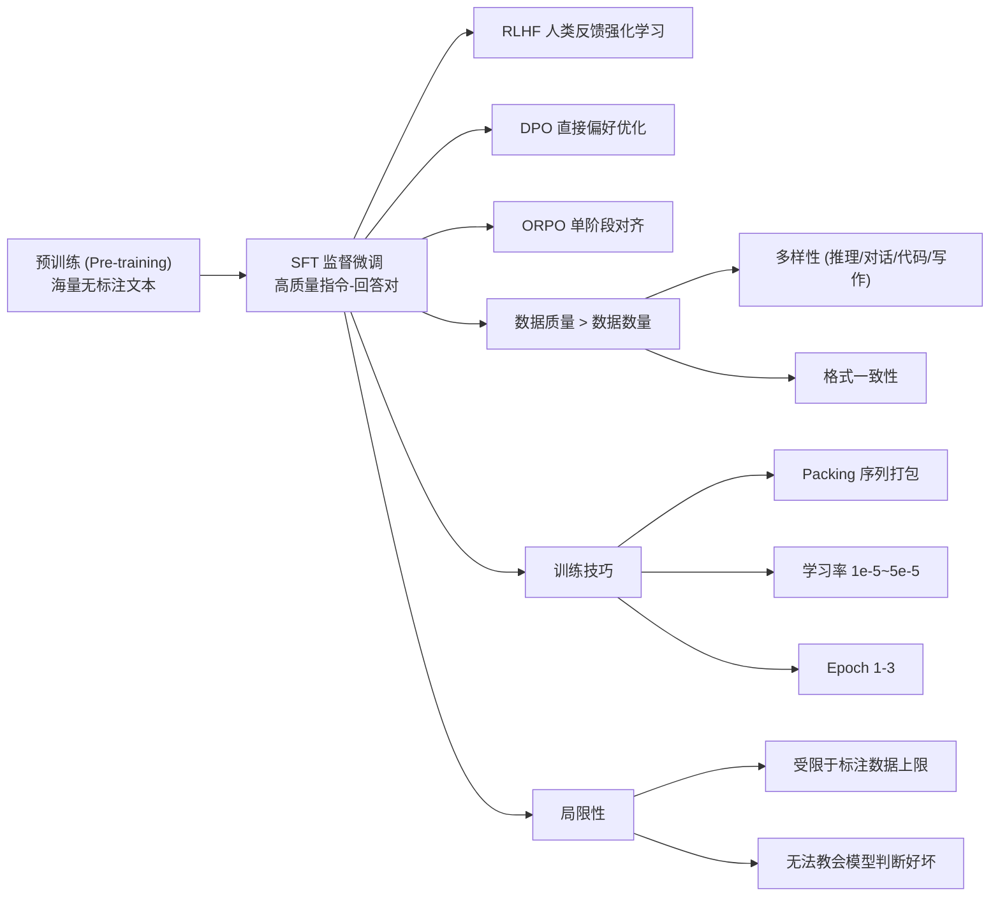
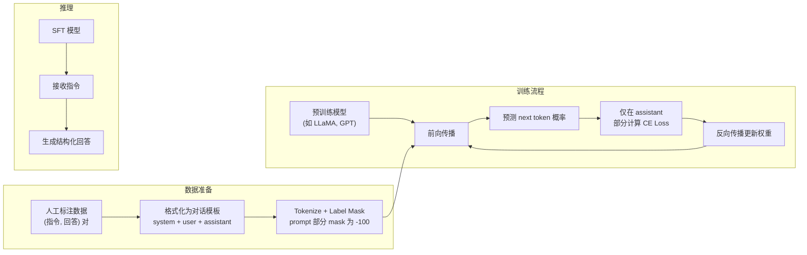

# SFT (监督微调 / Supervised Fine-Tuning)

## 知识地图



## 前置知识

- **语言模型预训练**：理解自回归语言模型（GPT 系列）通过下一个 token 预测在大规模无标注文本上训练的过程。
- **指令微调 (Instruction Tuning)**：SFT 的具体形式——用 (指令, 回答) 对微调，而非原始文本续写。
- **Cross-Entropy Loss**：分类任务的标准损失函数，SFT 的数学基础。
- **Tokenization**：文本如何被分割为 token，理解 tokenizer 和 padding 的作用。
- **迁移学习**：在预训练权重基础上微调到特定任务。

## 为什么会出现 (Why)

预训练语言模型（如 GPT-3）虽然在海量文本上训练成了强大的"文本续写器"，但它们有根本性的行为问题：**模型只会续写，不懂遵循指令**。

举例说明：
- 用户："解释什么是机器学习"。
- 预训练模型的输出（续写模式）："解释什么是机器学习？这是一个常见的问题。在本文中，我们将深入探讨..." —— 它把用户的提问当成了文章标题，开始写一篇博客。
- 用户期望的 SFT 模型输出："机器学习是人工智能的一个分支，它使计算机系统能够从数据中学习并改进..." —— 直接回答问题。

预训练模型之所以这样，是因为它的训练数据是网页、书籍、代码——它只见过"续写下一个 token"的模式，从未被明确教过"问答"的模式。SFT 的作用就是：**用指令-回答格式的数据，教会模型用户和助手之间的交互范式**。

## 解决什么问题 (Problem)

SFT 解决的核心问题：**让预训练语言模型从"文本续写器"转变为"指令跟随助手"**。

具体包含：
1. **格式对齐**：教会模型理解 system/user/assistant 的角色定义和对话格式。
2. **意图理解**：让模型理解用户的真实意图（而非把指令当作文本续写的起点）。
3. **输出风格控制**：让模型输出结构化、有帮助、符合人类期望的内容格式。
4. **任务泛化**：通过多样化的指令数据，让模型学会遵循未见过的指令类型。

## 核心思想 (Core Idea)

**用高质量的人工标注指令-回答对微调预训练模型，仅对回答部分计算损失，教会模型"看到指令时应该怎么回答"而非"看到指令时应该续写什么"。**

## 算法流程/模型结构图

### SFT 训练流程



## 数学模型/公式

### 训练目标

标准的下一个 token 预测损失，但**仅在 assistant 回复部分计算损失**：

$$L = -\sum_{t \in \text{assistant}} \log P(y_t \mid y_{<t}, \text{context})$$

对 system/user prompt 部分使用 label mask（设为 -100），不参与损失计算。

**通俗解释：** SFT 的训练和预训练用的是同一个数学公式——预测下一个 token 的交叉熵损失。区别只有一个：**在哪里算损失**。预训练在整个序列上算（每个 token 都是目标），SFT 只在 assistant 回答部分算。这意味着模型不需要"背下用户的 prompt"，只需要学会"给定 prompt 时，好的回答是什么"。label mask 是一个筛选器——PyTorch 的 CrossEntropyLoss 在遇到 label=-100 时会自动忽略该位置的贡献。

### 数据格式

典型的指令微调数据：

```json
{
  "instruction": "将以下句子翻译为英文",
  "input": "今天天气很好",
  "output": "The weather is nice today."
}
```

或对话格式：

```json
{
  "messages": [
    {"role": "system", "content": "你是一个有帮助的助手"},
    {"role": "user", "content": "什么是机器学习？"},
    {"role": "assistant", "content": "机器学习是..."}
  ]
}
```

**通俗解释：** 选择哪种格式取决于目标场景。单轮 QA 用 instruction/input/output 格式够了。多轮对话场景（如 ChatGPT）用 messages 格式——模型学到的不只是一问一答，还有上下文的连贯性、system prompt 的行为约束等。

## 可视化展示

### SFT 数据分布对效果的影响

```echarts
return {
  tooltip: { trigger: "axis", confine: true },
  title: { top: 5,  text: 'SFT 数据多样性与通用能力的关系', left: 'center', textStyle: { fontSize: 12 } },
  xAxis: { type: 'category', data: ['纯代码 (10K)', '纯对话 (10K)', '纯写作 (10K)', '混合 (10K)', '混合 (50K)'] },
  yAxis: { type: 'value', name: '通用能力得分', max: 100 },
  series: [{
    type: 'bar',
    data: [25, 30, 20, 72, 85],
    itemStyle: { color: '#2980b9' },
    label: { show: true, position: 'top', formatter: '{c}' }
  }],
  grid: { left: 60, right: 20, top: 55, bottom: 60 }
}
```

### 数据质量与数量的关系

```echarts
return {
  tooltip: { trigger: "axis", confine: true },
  title: { top: 5,  text: '数据质量 vs 数据数量对 SFT 效果的影响', left: 'center', textStyle: { fontSize: 12 } },
  xAxis: { type: 'category', data: ['1K 高质量', '10K 高质量', '100K 中质量', '1M 低质量', '10M 噪声'] },
  yAxis: { type: 'value', name: '模型评分', max: 100 },
  series: [{
    type: 'line',
    data: [55, 85, 72, 48, 30],
    smooth: true,
    label: { show: true, formatter: '{c}' },
    itemStyle: { color: '#2980b9' }
  }],
  grid: { left: 60, right: 20, top: 55, bottom: 55 }
}
```

## 数据质量 > 数据数量

LLaMA 论文的关键发现：

- 少量高质量数据（~10K 条）的 SFT 效果远超大量低质量数据
- 数据多样性很重要（涵盖推理、对话、写作、代码等）
- 格式一致性对模型输出风格影响大

## 训练技巧

### Packing

将多个短对话打包到一个序列中，提高 GPU 利用率：

```
[对话1] [EOS] [对话2] [EOS] [对话3] [EOS]
```

注意在序列边界位置正确处理 attention mask（每个对话独立）。

**通俗解释：** 实际训练中，很多对话只有几百个 token，但 GPU 的序列长度是 2048 或 4096。如果不打包，大量 GPU 算力在 pad token 上浪费。Packing 把多个短对话拼成一长条，让 GPU 每次前向计算都在处理"真数据"而非 padding。唯一要注意的是 attention mask——对话 A 的 token 不能看到对话 B 的 token（它们语义上无关）。

### 学习率与 Epoch

- 学习率：1e-5 ~ 5e-5（比预训练小一个数量级）
- Epoch：1-3（SFT 容易过拟合，通常 1-2 个 epoch 足够）
- Batch size：128 左右

**通俗解释：** 学习率比预训练小一个数量级，因为预训练权重已经"懂了语言"——我们只希望微调模型的行为模式，不希望大幅改动它的知识。epoch 少是因为 SFT 数据量远小于预训练数据，多跑几个 epoch 模型可能把训练数据"背下来"（过拟合），失去泛化能力。

## 最小可运行代码

```python
from transformers import AutoTokenizer, AutoModelForCausalLM, Trainer
from datasets import Dataset
import torch

# ========== 1. 加载预训练模型 ==========
model = AutoModelForCausalLM.from_pretrained("meta-llama/Llama-2-7b")
tokenizer = AutoTokenizer.from_pretrained("meta-llama/Llama-2-7b")
tokenizer.pad_token = tokenizer.eos_token

# ========== 2. 构建 SFT 数据集 ==========
def format_sft_example(instruction, input_text, output_text):
    """构建 SFT 训练样本"""
    prompt = f"### Instruction:\n{instruction}\n\n### Input:\n{input_text}\n\n### Response:\n"
    full_text = prompt + output_text
    return {"text": full_text}

# 示例数据
sft_data = [
    {"instruction": "将以下句子翻译为英文", "input": "今天天气很好", "output": "The weather is nice today."},
    {"instruction": "什么是机器学习？", "input": "", "output": "机器学习是人工智能的一个分支..."},
]

formatted_data = [format_sft_example(**item) for item in sft_data]
dataset = Dataset.from_list(formatted_data)

def tokenize_function(examples):
    """Tokenize 并创建 label mask"""
    tokenized = tokenizer(
        examples["text"],
        truncation=True,
        max_length=2048,
        padding=False
    )
    # 对 prompt 部分做 mask (简化处理——实际应用中需要更精确的定位)
    # TRL 的 SFTTrainer 会自动处理
    tokenized["labels"] = tokenized["input_ids"].copy()
    return tokenized

tokenized_dataset = dataset.map(tokenize_function, batched=True)

# ========== 3. 使用 HuggingFace TRL 库训练 ==========
from trl import SFTTrainer

trainer = SFTTrainer(
    model=model,
    train_dataset=tokenized_dataset,
    max_seq_length=2048,
    packing=True,
    args={
        "learning_rate": 2e-5,
        "num_train_epochs": 2,
        "per_device_train_batch_size": 4,
        "gradient_accumulation_steps": 8,
        "warmup_ratio": 0.03,
        "logging_steps": 10,
        "save_steps": 500,
        "bf16": True,
    }
)
trainer.train()

# ========== 4. 推理 ==========
def generate_response(model, tokenizer, instruction, input_text="", max_new_tokens=256):
    prompt = f"### Instruction:\n{instruction}\n\n### Input:\n{input_text}\n\n### Response:\n"
    inputs = tokenizer(prompt, return_tensors="pt").to(model.device)
    outputs = model.generate(
        inputs.input_ids,
        max_new_tokens=max_new_tokens,
        temperature=0.7,
        top_p=0.9,
        do_sample=True,
        pad_token_id=tokenizer.eos_token_id
    )
    response = tokenizer.decode(outputs[0][inputs.input_ids.shape[1]:], skip_special_tokens=True)
    return response

print(generate_response(model, tokenizer, "解释什么是机器学习"))
```

## 工业界应用

| 应用领域 | 使用方式 | 为什么用 SFT | 优势 | 劣势 |
|---------|---------|-------------|------|------|
| 对话助手 | ChatGPT、Claude 的基础阶段 | 让模型掌握对话格式和行为规范 | 稳定可控，训练快速 | 只学"格式"不学"判断" |
| 代码助手 | GitHub Copilot 使用 SFT 在代码指令上 | 代码补全需要精确遵循指令 | 代码输出格式规范 | 无法区分好代码和坏代码 |
| 客服系统 | 企业用历史对话记录做 SFT | 让模型学习特定产品知识 | 领域适配成本低 | 需要大量标注数据 |
| 翻译系统 | 中英翻译指令微调 | 统一翻译风格和格式 | 翻译质量稳定 | 不如专用翻译模型 |
| 教育内容 | 知识问答的 SFT 微调 | 让模型学会"教学式"回答风格 | 输出风格统一 | 可能生成过时信息 |
| 企业内部问答 | 在内部文档上做 SFT | 让模型掌握公司特定知识 | 数据安全可控 | 知识无法实时更新 |

## 对比表格

### SFT vs 预训练 vs RLHF/DPO

| 特性 | 预训练 | SFT | RLHF/DPO |
|------|--------|-----|----------|
| 数据格式 | 无标注原始文本 | 指令-回答对 | 偏好排序/比较 |
| 数据量 | 数万亿 token | 1万~10万条 | 数千~数万对 |
| 训练目标 | 最大化所有 token 的概率 | 仅最大化回答部分概率 | 最大化人类偏好 |
| 学习内容 | 语言知识和推理 | 指令遵循格式 | 价值观和行为偏好 |
| 训练成本 | 极高 (数百万美元) | 低 (数百美元) | 中-高 (取决于方法) |
| 所能教会模型 | 语言能力 | 行为格式 | 什么是"好" |
| 标注难度 | 无需标注 | 需写出正确答案 | RLHF: 排序, DPO: 排序, KTO: 二分 |

### 不同 SFT 数据规模的效果

| 数据规模 | 任务遵循度 | 过拟合风险 | 适用场景 |
|---------|-----------|-----------|---------|
| 1K-5K | 基本遵循 | 低 | 原型验证 |
| 10K-50K | 良好遵循 | 低-中 | 大多数应用 (推荐) |
| 100K-500K | 优秀遵循 | 中 | 追求广泛覆盖 |
| 1M+ | 极好遵循 | 高 | 大规模商业部署 |

## SFT 的局限性

- 无法让模型产生超出训练数据的上限
- 依赖标注质量（错误标注会植入不良行为）
- 不能教会模型"判断什么是好回答"（→ 需要 RLHF）

## 学完后建议继续学习

1. **[RLHF 基于人类反馈的强化学习](rlhf.md)** — SFT 的下一步，理解如何用偏好数据让模型学会判断"什么是好回答"。
2. **[DPO 直接偏好优化](dpo.md)** — 了解 RLHF 的简化方案，直接用偏好数据优化策略而无需奖励模型。
3. **[对齐进阶方法](alignment-advanced.md)** — 学习 KTO、ORPO、SimPO 等更前沿的对齐技术。
4. **数据构建最佳实践** — 深入理解如何构建高质量 SFT 数据集：数据多样性、难度筛选、格式工程。
5. **多轮对话 SFT** — 学习多轮对话数据的构建和训练技巧，处理上下文窗口内的对话历史。

## 高频面试题

### Q1: SFT 中为什么只在 assistant 回答部分计算损失，不计算 prompt 部分的损失？

**标准答案：**

核心原因是**训练目标和推理行为的一致性**。

在推理时，用户给出 prompt，模型基于 prompt 生成回答。如果训练时连 prompt 部分也算入损失，模型会在 prompt 上学到"复述用户的指令"，这是错误的行为信号——我们不希望模型学会"看到指令时先背一遍指令再回答"。

更技术性的原因：
- prompt 中的 token 是用户提供的条件，模型不需要预测它们——它们已经被给定了。损失只应该惩罚在正确答案（assistant 回答）上的预测错误。
- 如果 prompt 部分也算损失，模型会在 prompt 上分配优化资源，而这些 token 在推理时本来就是用户提供的、不需要模型生成。

实现方式也很简单——将 prompt 的 label 设为 -100（PyTorch 的 `CrossEntropyLoss` 默认忽略 `ignore_index=-100` 的位置）。

### Q2: 为什么 SFT 只要 1-2 个 epoch 就够了？

**标准答案：**

两个层面：

1. **数据量 vs 模型容量**：SFT 数据通常只有 1 万-10 万条，而模型有数十亿参数。如果在这么小的数据集上训练太多 epoch，模型会"背诵"训练数据而非学到泛化能力——过拟合表现为输出变冗长、重复、或只能回答训练数据中的特定问题。

2. **预训练基础**：预训练模型已经具备了强大的语言和知识能力。SFT 本质上是在修改模型的"行为模式"（生成风格和格式），而非从零学习语言能力。这种"微调"通常很快收敛——格式和风格的调整不需要大量的 epoch。

实践中，1-2 个 epoch 足以让模型掌握指令遵循的行为模式；3 个 epoch 以上往往出现明显的过拟合（如输出质量下降、多样性降低）。

### Q3: 请解释 SFT 中 Packing 技术的原理和注意事项。

**标准答案：**

Packing 是将多个短序列拼接成一个长序列的技术，目的是提高 GPU 利用率。

原理：GPU 的矩阵乘法在处理 2048 或 4096 长度的序列时，计算量类似，但很多 SFT 对话只有 300-500 个 token。如果不打包，大量位置是 padding token，GPU 在做无效计算。Packing 把多个对话用 EOS token 分隔拼接在一起，让 GPU 每个前向都在处理有效数据。

注意事项：
1. **Attention Mask**：不同对话之间不能互相 attend。需要设置 block-diagonal attention mask，让每个对话只看自己的 token。
2. **Position Encoding**：如果用的是 RoPE 等相对位置编码，需要处理跨对话的位置偏移。同一个对话内的 token 相对位置保持不变。
3. **Loss Mask**：同样只在每个对话的 assistant 部分计算损失，EOS 和拼接边界处正确切断。

实际框架（如 TRL 的 SFTTrainer）会在内部处理这些细节。

### Q4: SFT 之后模型就能完美遵循指令了吗？为什么还需要 RLHF/DPO？

**标准答案：**

不能。SFT 有三个根本性的局限：

1. **只学会了"模仿"，没学会"判断"**：SFT 让模型知道"面对这个问题，数据集的标注员是怎么回答的"。但如果同一个问题有多个可能的回答（一个更好，一个一般，一个不好），SFT 无法区分——它只会向"平均回答"靠拢。

2. **标注数据的上限效应**：SFT 模型的效果受限于标注数据的质量上限。如果标注员写的回答是 70 分水平，SFT 模型最多学成 70 分，不可能超过。

3. **没有安全对齐**：SFT 只是教模型"格式"和"内容"，无法教会模型"不要回答有害问题"、"不要说谎"、"避免偏见"——因为这些行为需要偏好信号（"这样回答比那样回答更好"），而非单一的正确答案。

RLHF/DPO 解决的就是这些问题：通过偏好信号教会模型区分好坏，以及注入安全等行为约束。

### Q5: SFT 和预训练的关键区别是什么？

**标准答案：**

| 维度 | 预训练 | SFT |
|------|--------|-----|
| 数据 | 海量无标注文本（万亿 token） | 少量标注指令对（万-10 万条） |
| 数据格式 | 原始文本序列 | 指令-回答结构化格式 |
| 训练目标 | 预测所有 token | 仅预测回答部分 token |
| 学到什么 | 语言知识、世界知识、推理能力 | 指令遵循行为、对话格式 |
| 训练成本 | 极高（数百万美元） | 低（数百美元） |
| 模型行为 | 文本续写 | 指令回答 |
| 是否可以跳过 | 否 | 是（可以用预训练模型直接做 RLHF/DPO） |
