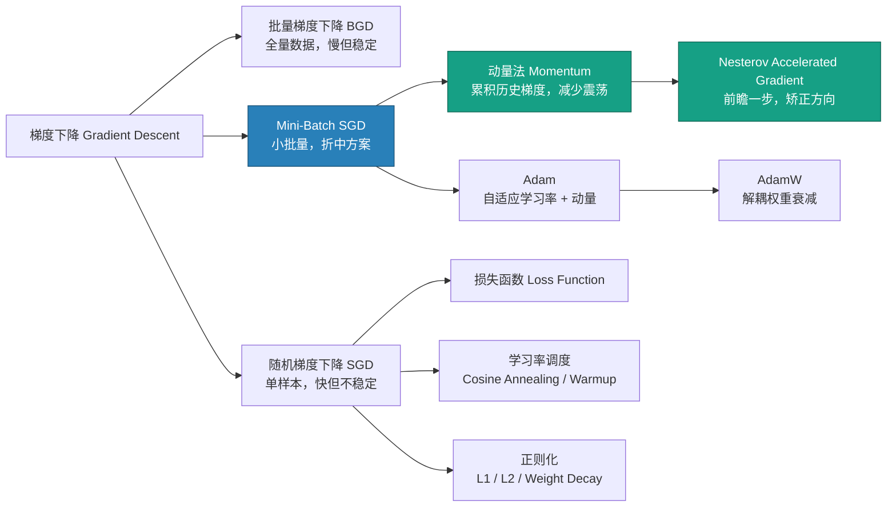
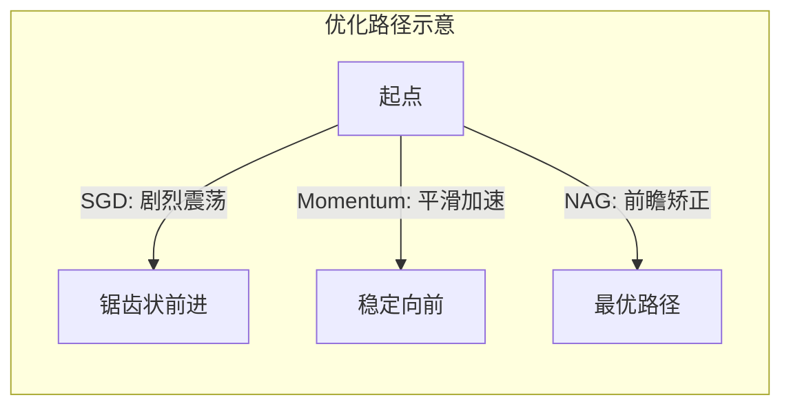

# SGD / Momentum / Nesterov

## 知识地图



## 前置知识

- **梯度下降基础**：理解损失函数对参数求导、沿负梯度方向更新参数的基本原理
- **反向传播 (Backpropagation)**：知道如何通过链式法则计算每层参数的梯度
- **损失函数**：了解常见的损失函数（MSE、交叉熵等）及其梯度形式
- **学习率 (Learning Rate)**：理解学习率控制参数更新步长的概念

## 为什么会出现 (Why)

**批量梯度下降 (BGD)** 每次迭代需要在全量数据上计算梯度，当数据集很大时（如 ImageNet 百万级图片），一次参数更新耗时过长，训练不切实际。

**普通 SGD** 每次随机抽一个样本计算梯度更新参数，虽然快，但梯度方向方差极大——参数更新路径剧烈震荡，收敛缓慢。

**Momentum** 的提出是为了解决 SGD 的震荡问题：通过在参数更新中引入"惯性"，让优化过程保留之前的方向信息，在方向一致的维度上加速，在反复震荡的维度上减速。物理直觉来自一个小球在损失曲面上滚动，而不是离散地跳跃。

**Nesterov Accelerated Gradient (NAG)** 进一步改进 Momentum：标准动量法是"先累积动量再在当前位置算梯度"，而 Nesterov 说"先按动量走一步，提前看一眼未来的梯度"，类似于"前瞻矫正"。这使得 NAG 在凸优化中有更快的理论收敛率。

## 解决什么问题 (Problem)

| 方法 | 解决的问题 |
|------|-----------|
| **SGD** | 海量数据下无法承受全量梯度计算 → 用小批量估计梯度 |
| **Momentum** | SGD 在沟壑形损失面上震荡严重 → 用指数滑动平均平滑更新方向 |
| **Nesterov** | 动量法"冲过头"的问题 → 前瞻一步提前矫正 |
| **学习率调度** | 固定学习率难以兼顾前期快速收敛与后期精细调优 |

## 核心思想 (Core Idea)

**用历史梯度的指数滑动平均作为"惯性"，让优化器在一致的方向上加速、在震荡的方向上减速，就像推着滚石下山——越滚越快但不乱拐弯。**

---

## 数学模型/公式

### SGD (随机梯度下降)

$$\mathbf{w}_{t+1} = \mathbf{w}_t - \eta \cdot \nabla L(\mathbf{w}_t)$$

> **通俗解释：** 就像蒙着眼下山，每走一步就感受一下脚下的坡度，朝最陡的方向迈一步。因为只看脚下（一个 mini-batch），所以走得歪歪扭扭，但大致方向是对的。

- 每次迭代只用一个 mini-batch 估计梯度（而非全量数据）
- 梯度噪声有助于逃离局部最优（鞍点）
- 收敛速度受学习率 $\eta$ 限制

### Momentum (动量)

物理直觉：将优化过程看作小球在损失面上滚动，动量积累之前梯度方向的速度，减少震荡：

$$\mathbf{v}_{t+1} = \beta \mathbf{v}_t + \nabla L(\mathbf{w}_t)$$

> **通俗解释：** $v_t$ 像一个"速度记录器"，$\beta$（通常 0.9）决定保留多少之前的速度。可以把 $\beta$ 理解为"惯性系数"——$\beta$ 越大惯性越大，越不愿意改变方向。

$$\mathbf{w}_{t+1} = \mathbf{w}_t - \eta \cdot \mathbf{v}_{t+1}$$

> **通俗解释：** 参数更新不再只看当前梯度，而是按累积的速度 $v$ 往前走。如果最近几步方向一致，$v$ 很大，就走得快；如果左右横跳，正负抵消，$v$ 很小，就走得稳。

- $\beta$ 通常取 0.9
- $\mathbf{v}$ 是历史梯度的指数移动平均
- 加速在一致梯度方向上的移动，抑制震荡

### Nesterov Accelerated Gradient (NAG)

"前瞻"一步：先按累积动量走一步，再在那一点计算梯度：

$$\mathbf{v}_{t+1} = \beta \mathbf{v}_t + \nabla L(\mathbf{w}_t - \eta \beta \mathbf{v}_t)$$

> **通俗解释：** 不满足于在当前位置测坡度，而是"我打算以当前速度往前冲一步，先去那里看看坡度如何"。公式中的 $\mathbf{w}_t - \eta \beta \mathbf{v}_t$ 就是那个"前瞻位置"。相当于闭眼走路时，先伸脚探一下前面的地面。

$$\mathbf{w}_{t+1} = \mathbf{w}_t - \eta \cdot \mathbf{v}_{t+1}$$

> **通俗解释：** 用前瞻位置的梯度来校正最终方向。好比开车时不仅看眼前的路，还提前看弯道后的路况来调整方向盘。

相比标准 Momentum，Nesterov 有"前瞻矫正"能力，在凸优化中有更快的理论收敛率 $O(1/t^2)$（vs 标准动量 $O(1/t)$）。

### 学习率调度公式

**阶梯衰减 (Step Decay)**：每 $k$ 个 epoch 将学习率乘以 $\gamma$（如每 30 epoch × 0.1）。

**余弦退火 (Cosine Annealing)**：

$$\eta_t = \eta_{min} + \frac{1}{2}(\eta_{max} - \eta_{min}) \left(1 + \cos\left(\frac{t}{T_{max}} \pi\right)\right)$$

> **通俗解释：** 学习率像余弦波一样平滑地从高点滑到低点。相比于阶梯衰减的"断崖式"下降，余弦退火让模型在每一个学习率阶段都有充分的时间探索。

平滑地将学习率从最大值衰减到最小值，现代训练（ViT, GPT 等）的标配。

**预热 (Warmup)**：训练开始时线性增加学习率，避免初期不稳定：

$$\eta_t = \eta_{max} \cdot \min\left(1, \frac{t}{T_{warmup}}\right)$$

> **通俗解释：** 训练刚开始时，模型参数是随机的，梯度方向混乱且数值可能很大。如果一上来就用大学习率，模型容易"崩掉"。预热就是先让小步慢走，等方向稳定了再加速。

**周期重启 (Cosine Annealing with Warm Restarts)**：训练过程中周期性将学习率重置为最高值，帮助跳出局部最优。

---

## 可视化展示

### 不同优化器在损失曲面上的路径对比



### SGD vs Momentum 收敛行为示意

```echarts
return {
  title: { top: 5,  text: 'SGD vs Momentum 损失下降曲线 (示意)' },
  xAxis: { type: 'value', name: '迭代步数' },
  yAxis: { type: 'value', name: 'Loss', min: 0 },
  legend: { top: 28,  data: ['SGD', 'SGD + Momentum (β=0.9)', 'SGD + NAG'] },
  series: [
    {
      name: 'SGD', type: 'line', smooth: true,
      lineStyle: { color: '#e74c3c', width: 2 },
      data: (function() {
        const d = [];
        for (let i = 0; i <= 100; i++) {
          d.push([i, 2.0 * Math.exp(-i * 0.03) + 0.3 * Math.sin(i * 0.5) * Math.exp(-i * 0.02)]);
        }
        return d;
      })()
    },
    {
      name: 'SGD + Momentum (β=0.9)', type: 'line', smooth: true,
      lineStyle: { color: '#2980b9', width: 2 },
      data: (function() {
        const d = [];
        for (let i = 0; i <= 100; i++) {
          d.push([i, 2.0 * Math.exp(-i * 0.05) + 0.1 * Math.sin(i * 0.3) * Math.exp(-i * 0.04)]);
        }
        return d;
      })()
    },
    {
      name: 'SGD + NAG', type: 'line', smooth: true,
      lineStyle: { color: '#16a085', width: 2.5 },
      data: (function() {
        const d = [];
        for (let i = 0; i <= 100; i++) {
          d.push([i, 2.0 * Math.exp(-i * 0.055) + 0.05 * Math.sin(i * 0.25) * Math.exp(-i * 0.045)]);
        }
        return d;
      })()
    }
  ],
  tooltip: { trigger: 'axis' },
  grid: { left: 60, right: 20, top: 55, bottom: 60 }
}
```

---

## 最小可运行代码

### PyTorch 实现

```python
import torch
import torch.optim as optim
import torch.nn as nn

# 构建一个简单模型
model = nn.Sequential(
    nn.Linear(784, 256),
    nn.ReLU(),
    nn.Linear(256, 10)
)

# SGD + Momentum + Nesterov
optimizer = optim.SGD(
    model.parameters(),
    lr=0.1,
    momentum=0.9,
    weight_decay=5e-4,
    nesterov=True
)

# 余弦退火调度
scheduler = optim.lr_scheduler.CosineAnnealingLR(optimizer, T_max=100)

# 或使用 Warm Restarts
# scheduler = optim.lr_scheduler.CosineAnnealingWarmRestarts(optimizer, T_0=10)

# 训练循环
for epoch in range(100):
    for batch_idx, (data, target) in enumerate(train_loader):
        optimizer.zero_grad()
        output = model(data)
        loss = nn.CrossEntropyLoss()(output, target)
        loss.backward()
        optimizer.step()
    scheduler.step()
```

### 手动实现 Momentum (NumPy)

```python
import numpy as np

def sgd_momentum_update(w, dw, v, lr=0.01, beta=0.9):
    """
    w: 当前参数
    dw: 当前梯度
    v: 速度缓存
    lr: 学习率
    beta: 动量系数
    """
    v = beta * v + dw
    w = w - lr * v
    return w, v

def sgd_nesterov_update(w, dw, v, lr=0.01, beta=0.9):
    """
    Nesterov: 先前瞻再校正
    """
    v_prev = v
    v = beta * v + dw
    # Nesterov 更新: 用前瞻后的位置
    w = w - lr * (dw + beta * (v - v_prev))
    # 等价于标准 Nesterov 公式
    return w, v
```

---

## 工业界应用

| 应用场景 | 使用的方法 | 为什么 | 优点 | 缺点 |
|----------|-----------|--------|------|------|
| **ResNet 图像分类** | SGD + Momentum (β=0.9) | 精心调参后泛化能力最好 | 测试集准确率高，收敛稳定 | 需要对学习率调度有经验 |
| **目标检测 (Faster R-CNN)** | SGD + Momentum | 成熟稳定，社区调参经验丰富 | 复现性好 | 训练周期长 |
| **ViT / Transformer 预训练** | AdamW | 自适应学习率适合注意力机制的多尺度梯度 | 收敛快，调参少 | 偶尔泛化不如精心调参的 SGD |
| **GPT / LLM 预训练** | AdamW | 大模型训练必须稳定，不能崩 | 训练稳定，收敛可靠 | 内存占用比 SGD 大（需要存 m 和 v） |
| **GAN 训练** | Adam (β1=0.5) | 生成器和判别器博弈需要快速适应 | 动态平衡比 SGD 好 | 需要调低 β1 |
| **强化学习 (PPO)** | Adam | 非平稳数据分布需要自适应学习率 | 对超参数不敏感 | 理论收敛保证弱于 SGD |

---

## 优缺点对比

| 方法 | 优点 | 缺点 | 适用场景 |
|------|------|------|----------|
| **SGD** | 实现简单，理论分析成熟，梯度噪声有助于泛化 | 震荡严重，对学习率极其敏感，收敛慢 | 小数据集、对学习率有经验的场景 |
| **SGD + Momentum** | 加速收敛，抑制震荡，几乎无额外计算开销 | 可能冲过最优解，需要调节 β | CV 任务的标配 baseline |
| **SGD + Nesterov** | 比标准动量收敛更快，理论保证更好 | 比动量法稍复杂，RNN 场景收益不如自适应方法 | 凸优化场景、需要快速收敛时 |
| **学习率预热 (Warmup)** | 避免训练初期崩溃 | 增加超参数（预热步数） | Transformer 训练必备 |
| **余弦退火** | 平滑衰减，最终阶段能精细收敛 | 需要预先知道总训练步数 | 现代 CV/NLP 训练标配 |

---

## 对比表格

### SGD vs Adam 对比

| 维度 | SGD (含 Momentum) | Adam / AdamW |
|------|-------------------|--------------|
| **收敛速度** | 慢，需要精心调学习率 | 快，默认参数就能工作 |
| **最终泛化能力** | 通常更好（找到更平坦的极小值） | 可能略差（倾向于尖锐极小值） |
| **内存占用** | 低（只需存梯度 + 速度） | 高（需存 m, v 两个缓存） |
| **超参数敏感度** | 极高（lr, momentum, schedule...） | 低（默认 β1=0.9, β2=0.999 一般够用） |
| **稀疏梯度场景** | 吃力 | 自适应学习率天然适合 |
| **Transformer 训练** | 基本不工作，需要精细调参 | AdamW 是标配 |
| **CV 任务 (ResNet)** | 优选 | 可用但泛化可能略差 |

### 学习率调度策略对比

| 调度策略 | 形状 | 优点 | 缺点 | 典型用途 |
|----------|------|------|------|----------|
| **Step Decay** | 阶梯式下降 | 简单直观 | 下降点需手动指定 | 早期深度学习 |
| **Cosine Annealing** | 余弦曲线平滑下降 | 无需设置下降点，平滑 | 需预知总步数 | ViT, GPT, 现代标配 |
| **Warm Restarts** | 周期性锯齿 | 多次跳出局部最优 | 训练曲线波动大 | 需要 ensemble 效果时 |
| **Linear Warmup** | 先线性上升 | 防止训练初期崩溃 | 额外超参数 | Transformer 训练必备 |

---

## 学完后建议继续学习

- [Adam 与 AdamW 优化器详解](adam-adamw.md) — 理解自适应学习率优化器的原理和 AdamW 的解耦设计
- [L1 / L2 正则化](l1-l2-regularization.md) — 理解 Weight Decay 的数学本质及其与优化器的交互
- [MSE / MAE / Huber Loss](mse-mae-huber.md) — 不同损失函数的梯度行为直接决定 SGD 的优化路径
- [Cross-Entropy Loss](cross-entropy.md) — 分类任务中交叉熵 + Softmax 的优雅梯度是 SGD 高效工作的关键

---

## 高频面试题

### Q1: SGD 中 Momentum 的作用是什么？为什么 β 通常设为 0.9？

**标准回答：** Momentum 通过指数滑动平均累积历史梯度，起到两个作用：(1) 在方向一致的维度上，历史梯度同号累加，加速前进；(2) 在反复震荡的维度上，历史梯度正负抵消，抑制震荡。β=0.9 意味着当前速度的 90% 来自历史动量、10% 来自新梯度。这等价于大约 1/(1-0.9) = 10 步历史梯度的有效窗口，在 CV 任务中是一个经验上很好的平衡——既不过于保守（β 太大，惯性太强），也不过于敏感（β 太小，退化为普通 SGD）。

### Q2: Nesterov 动量与标准动量的本质区别是什么？

**标准回答：** 标准动量先在当前位置计算梯度，再与历史速度叠加进行更新。Nesterov 动量则"先按当前速度走一步到达前瞻位置，在前瞻位置计算梯度，再用这个梯度进行最终更新"。数学差异体现在梯度项：标准动量用 $\nabla L(\mathbf{w}_t)$，Nesterov 用 $\nabla L(\mathbf{w}_t - \eta\beta\mathbf{v}_t)$。这相当于"先探路再迈步"，使 NAG 在凸优化中有更快的理论收敛率 $O(1/t^2)$，而标准动量只有 $O(1/t)$。

### Q3: 为什么 Transformer 训练需要 Warmup，而 ResNet 通常不需要？

**标准回答：** Transformer 使用 Adam 优化器且包含 LayerNorm 和残差连接。训练初期，注意力矩阵接近均匀分布，梯度的尺度极不均匀——某些参数梯度过大、某些过小。Adam 会记住这些初始极端梯度（通过二阶矩 $v_t$ 的指数滑动平均，默认 β2=0.999 意味着长期记忆），导致学习率被错误地缩放，训练不稳定甚至发散。Warmup 用小学习率度过这个混乱初期，让 Adam 的二阶矩估计稳定后再加速收敛。ResNet 的 BatchNorm 天然提供了一定的梯度稳定效果，配合 SGD（无自适应学习率），初始梯度不会产生持久影响，因此通常不需要 warmup。

### Q4: SGD 的梯度噪声为什么有助于泛化？

**标准回答：** SGD 每次只用一个 mini-batch 估计梯度，引入了随机噪声。这种噪声在训练时有两个好处：(1) 帮助逃离鞍点和尖锐的局部极小值；(2) 更容易收敛到**平坦的极小值 (flat minima)**——平坦极小值的损失曲面对参数扰动不敏感，因此泛化能力更强。相比之下，全量梯度下降（BGD）或噪声较小的优化器倾向于收敛到尖锐极小值，泛化较差。这解释了为什么有时 SGD 的最终测试精度反而高于 Adam（尽管 Adam 训练 loss 更低）。

### Q5: 余弦退火相比阶梯衰减有什么优势？

**标准回答：** (1) 阶梯衰减在指定时刻断崖式下降学习率，模型需要突然适应新的学习率尺度，可能导致 loss 短暂反弹；余弦退火是平滑过渡的。(2) 阶梯衰减需要手动指定衰减点和衰减比例，而余弦退火只需指定初始和最终学习率以及总步数。(3) 余弦退火在末尾阶段学习率极低且变化缓慢，给模型充分的时间在最优解附近精细收敛。研究表明，在训练末期使用极低学习率（如 1e-6）对最终精度有显著影响，余弦退火的设计天然支持这一点。
