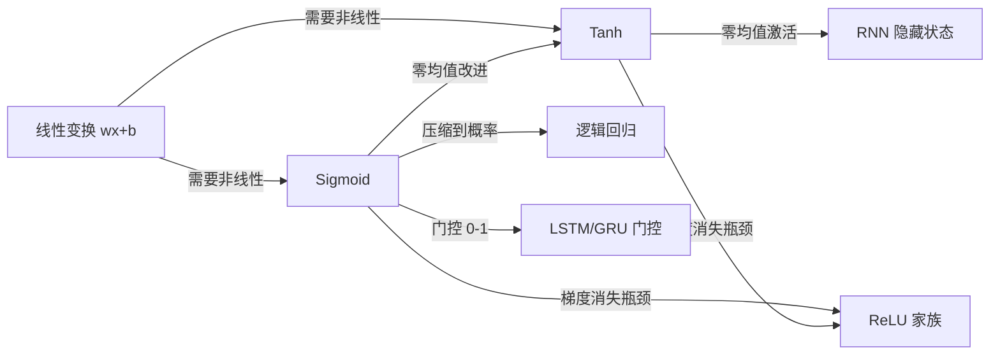

# Sigmoid / Tanh

## 知识地图



## 前置知识

- [线性回归](linear-regression.md)：理解线性变换 $\mathbf{w}^T\mathbf{x} + b$ 是激活函数的输入
- 链式法则与反向传播：理解梯度在深层网络中的回传机制
- [梯度下降](sgd-momentum.md)：理解参数更新对梯度的依赖
- [Dense Layer / 全连接层](dense-layer.md)：激活函数在线性层之后的位置

## 为什么会出现 (Why)

早期的神经网络（感知机时代）使用阶跃函数（Step Function）作为激活：输出要么是 0，要么是 1。但阶跃函数处处梯度为 0（除了不连续点），无法使用梯度下降训练。研究者需要一个**平滑、可微、输出有界**的函数来替代阶跃函数——于是 Sigmoid 函数（源于生物学中的神经元 S 型放电曲线）被引入神经网络。Tanh 是对 Sigmoid 的改进：将输出范围从 $(0, 1)$ 改为 $(-1, 1)$，使输出均值为零，缓解了 Sigmoid 的"非零均值"导致的 zig-zag 更新问题。

## 解决什么问题 (Problem)

**为神经网络引入平滑的非线性**：将线性层的无界实数输出压缩到有界区间，同时保持处处可微以便反向传播。Sigmoid 提供 $(0, 1)$ 的概率化输出，Tanh 提供 $(-1, 1)$ 的零均值输出。两者是神经网络从"感知机时代"走向"反向传播时代"的桥梁激活函数。

## 核心思想 (Core Idea)

**Sigmoid 把实数"挤"到 (0,1) 变成概率，Tanh 把 Sigmoid 拉回零中心——两个最经典的 S 型激活函数，统一致命弱点是远离零点时梯度消失。**

---

## 数学模型/公式

### Sigmoid

$$
\sigma(x) = \frac{1}{1 + e^{-x}}
$$

**通俗解释：** 输入 $x$ 是一个任意实数。如果 $x$ 是很大的正数，$e^{-x} \to 0$，输出 $\to 1$；如果 $x$ 是很小的负数（如 -100），$e^{-x}$ 巨大，输出 $\to 0$。在 $x=0$ 附近，曲线平滑地从 0 过渡到 1——像一个"软开关"。

**导数**（具备自引用特性，计算高效）：

$$
\sigma'(x) = \sigma(x)(1 - \sigma(x))
$$

**通俗解释：** 导数的最大值出现在 $\sigma(0)=0.5$ 处，为 $0.5 \times 0.5 = 0.25$。当 $\sigma(x)$ 接近 0 或 1 时，导数趋近于 0——这就是梯度消失的根源。好消息是：计算导数时只需要函数值本身，不需要重新计算指数，非常高效。

- 输出范围：$(0, 1)$
- 适合二分类输出层（配合 BCE Loss）
- **梯度消失**：当 $|x| > 5$ 时，梯度 $< 0.007$
- **非零均值**：输出恒为正，导致反向传播时梯度全部同号（参数更新呈 zig-zag 路径）

### Tanh

$$
\tanh(x) = \frac{e^x - e^{-x}}{e^x + e^{-x}} = 2\sigma(2x) - 1
$$

**通俗解释：** Tanh 和 Sigmoid 本质上是一个家族——$\tanh(x) = 2\sigma(2x) - 1$。你可以把 Tanh 理解为"先对输入乘以 2 再做 Sigmoid，然后拉伸和向下平移"：把 $(0, 1)$ 的输出范围拉伸到 $(-1, 1)$ 并中心化。$2\sigma(2x)$ 把值映射到 $(0, 2)$，减去 1 后变为 $(-1, 1)$。

**导数**：

$$
\tanh'(x) = 1 - \tanh^2(x)
$$

**通俗解释：** 和 Sigmoid 类似，导数可以用函数值本身表示（$1 - t^2$），计算高效。最大导数在 $x=0$ 处为 1，是 Sigmoid 最大导数的 4 倍——Tanh 在原点附近的梯度流动更顺畅。但在 $|x| > 5$ 时，梯度仍然 $< 0.0009$，梯度消失问题只是延后了，并未解决。

- 输出范围：$(-1, 1)$，**零均值**——这是相比 Sigmoid 的关键优势
- 当 $|x| > 5$ 时，梯度仍 $< 0.0009$，梯度消失问题依旧存在

### 梯度消失的链式效应

深层网络中，梯度通过链式法则逐层回传：

$$
\frac{\partial L}{\partial w^{(1)}} = \prod_{l=2}^{L} \sigma'(z^{(l)}) \cdot \cdots
$$

**通俗解释：** 想象一个有 $L$ 层的网络。反向传播时，第一层的梯度需要乘以第 2 到第 $L$ 层每一层的导数。由于 Sigmoid 的导数 $\le 0.25$，$L$ 个 $\le 0.25$ 的数连乘得到 $0.25^L$——10 层网络后这个因子是 $0.25^{10} \approx 10^{-6}$，梯度几乎是零。这就是为什么深层网络使用 Sigmoid 时，前面的层几乎不更新。

$L$ 层中每层的梯度因子 $\sigma'(z) \leq 0.25$（Sigmoid 的最大导数值），连乘后呈指数衰减 → 浅层权重几乎停止更新。

---

## 可视化展示

### Sigmoid 与 Tanh 函数曲线

```echarts
return {
  xAxis: { type: 'value', min: -8, max: 8, name: 'x' },
  yAxis: { type: 'value', min: -1.2, max: 1.2, name: 'σ(x) / tanh(x)' },
  legend: { top: 28,  data: ['Sigmoid', 'Tanh', 'Sigmoid 导数', 'Tanh 导数'] },
  series: [
    {
      name: 'Sigmoid',
      type: 'line',
      smooth: true,
      lineStyle: { color: '#2980b9', width: 2 },
      data: (function() {
        const data = [];
        for (let i = -8; i <= 8; i += 0.05) data.push([i, 1 / (1 + Math.exp(-i))]);
        return data;
      })()
    },
    {
      name: 'Tanh',
      type: 'line',
      smooth: true,
      lineStyle: { color: '#c0392b', width: 2 },
      data: (function() {
        const data = [];
        for (let i = -8; i <= 8; i += 0.05) data.push([i, Math.tanh(i)]);
        return data;
      })()
    },
    {
      name: 'Sigmoid 导数',
      type: 'line',
      smooth: true,
      lineStyle: { color: '#2980b9', width: 1.5, type: 'dashed' },
      data: (function() {
        const data = [];
        for (let i = -8; i <= 8; i += 0.05) {
          const s = 1 / (1 + Math.exp(-i));
          data.push([i, s * (1 - s)]);
        }
        return data;
      })()
    },
    {
      name: 'Tanh 导数',
      type: 'line',
      smooth: true,
      lineStyle: { color: '#c0392b', width: 1.5, type: 'dashed' },
      data: (function() {
        const data = [];
        for (let i = -8; i <= 8; i += 0.05) {
          const t = Math.tanh(i);
          data.push([i, 1 - t * t]);
        }
        return data;
      })()
    }
  ],
  tooltip: { trigger: 'axis' },
  grid: { left: 60, right: 20, top: 40, bottom: 60 }
}
```

### 梯度消失示意：$L$ 层网络中的梯度衰减

```echarts
return {
  xAxis: { type: 'value', name: '网络层数 L', min: 0, max: 20 },
  yAxis: { type: 'value', name: '梯度缩放因子', min: 0, max: 1 },
  series: [{
    type: 'line',
    smooth: false,
    data: (function() {
      const data = [];
      for (let L = 0; L <= 20; L++) {
        data.push([L, Math.pow(0.25, L)]);
      }
      return data;
    })(),
    areaStyle: { color: 'rgba(192, 57, 43, 0.15)' },
    lineStyle: { color: '#c0392b', width: 2 }
  }],
  tooltip: { trigger: 'axis', formatter: '层数 {b}<br/>梯度因子: {c}' },
  grid: { left: 60, right: 20, top: 20, bottom: 60 }
}
```

---

## 最小可运行代码

### NumPy 手写实现

```python
import numpy as np

def sigmoid(x):
    """数值稳定的 Sigmoid"""
    x = np.clip(x, -500, 500)
    return 1 / (1 + np.exp(-x))

def sigmoid_derivative(x):
    s = sigmoid(x)
    return s * (1 - s)

def tanh(x):
    pos = np.exp(x)
    neg = np.exp(-x)
    return (pos - neg) / (pos + neg)

def tanh_derivative(x):
    t = tanh(x)
    return 1 - t * t
```

### PyTorch 调用

```python
import torch
import torch.nn as nn

# 内置激活
sigmoid = torch.sigmoid          # 函数式
tanh = torch.tanh

# 或作为层使用
nn.Sigmoid()
nn.Tanh()
```

---

## 工业界应用

| 函数 | 使用场景 | 为什么用它 | 优点 | 缺点 |
|------|----------|-----------|------|------|
| Sigmoid | 二分类输出层 | 输出天然是概率 $(0,1)$ | 与 BCE Loss 配合梯度简洁，输出有概率意义 | 非零均值导致收敛慢 |
| Sigmoid | LSTM/GRU 的遗忘门、输入门、输出门 | 门控需要 $(0,1)$ 范围控制信息流通量 | 0=完全遗忘，1=完全保留，语义清晰 | 门控值可能饱和导致梯度消失 |
| Tanh | LSTM/GRU 的候选记忆 $\tilde{C}_t$ | 零均值有利于记忆单元的稳定更新 | $(-1,1)$ 范围允许正负信息累积 | 仍存在一定梯度的饱和区 |
| Tanh | RNN 隐藏状态激活 | 零均值防止状态偏移累积 | 长期堆叠时比 Sigmoid 更稳定 | 已被 GRU/LSTM 中的 Tanh 所取代 |
| Sigmoid | 注意力门控 / 特征重要性加权 | 将重要性权重压缩到 $(0,1)$ | 平滑可微，适合端到端学习 | 现代常用 Softmax 替代以引入归一化 |

**隐藏层几乎不再使用它们**——ReLU 家族已全面替代。

---

## 优缺点对比

| | Sigmoid | Tanh |
|------|---------|------|
| 输出范围 | $(0, 1)$ | $(-1, 1)$ |
| 均值中心 | 非零（恒正输出） | 零中心 |
| 最大导数 | 0.25（$x=0$ 处） | 1.0（$x=0$ 处） |
| 梯度消失阈值 | $\|x\| > 5$ 时梯度 $< 0.007$ | $\|x\| > 5$ 时梯度 $< 0.0009$ |
| 计算复杂度 | $e^{-x}$ 一次 | $e^x + e^{-x}$ 两次 |
| 主要用途 | 二分类输出层、门控 | RNN 隐藏状态、记忆单元 |
| 梯度消失 | 严重 | 严重（比 Sigmoid 稍好但本质相同） |

---

## 对比表格

| | Sigmoid | Tanh | ReLU | GELU |
|------|---------|------|------|------|
| 公式 | $\frac{1}{1+e^{-x}}$ | $\frac{e^x-e^{-x}}{e^x+e^{-x}}$ | $\max(0, x)$ | $x \cdot \Phi(x)$ |
| 输出范围 | $(0, 1)$ | $(-1, 1)$ | $[0, +\infty)$ | $(-\epsilon, +\infty)$ |
| 零均值 | 否 | 是 | 否 | 近似 |
| 梯度消失 | 严重 | 严重 | 仅 $x<0$ 时消失 | 轻微（平滑过渡） |
| Dead Neuron | 无 | 无 | 有（负半轴永为 0） | 极少 |
| 主要时代 | 1980s-2000s | 1990s-2000s | 2012-至今 | 2018-至今 (Transformer) |

---

## 学完后建议继续学习

- [ReLU 家族](relu-variants.md)：理解 ReLU 如何解决梯度消失问题，以及 LeakyReLU、PReLU 等变体
- [GELU / Swish](gelu-swish.md)：Transformer 中使用的现代激活函数
- [逻辑回归](logistic-regression.md)：Sigmoid 在分类中的核心应用
- [RNN / LSTM / GRU](recurrent-layer.md)：Sigmoid 和 Tanh 在门控循环单元中的具体角色
- [Batch Normalization](normalization.md)：BN 如何通过强制零均值/单位方差来弥补 Sigmoid/Tanh 的非零均值问题
- [Softmax](softmax.md)：多分类场景下的归一化激活

---

## 高频面试题

**Q1: Sigmoid 和 Tanh 的关系是什么？为什么 Tanh 通常比 Sigmoid 表现好？**

答：数学上 $\tanh(x) = 2\sigma(2x) - 1$，两者是同族函数。Tanh 比 Sigmoid 好的核心原因是**零均值**：Tanh 的输出平均值为 0（正负各半），而 Sigmoid 输出恒为正（均值约 0.5）。非零均值导致反向传播时，同一层所有参数的梯度符号相同（全正或全负），参数更新只能 zig-zag 前进（像走楼梯一样），不能直线逼近最优点。零均值则允许梯度的正负分量抵消，更新路径更直接。

**Q2: 为什么隐藏层不再使用 Sigmoid/Tanh，而输出层和门控仍然使用？**

答：隐藏层需要信息自由流动，Sigmoid/Tanh 的饱和区会截断梯度——多层堆叠后梯度指数衰减到零，网络无法训练（这就是 ReLU 崛起的根本原因）。而输出层只在网络末端使用一次 Sigmoid/Tanh，没有多层堆叠导致的梯度衰减问题；门控（如 LSTM 的遗忘门）本身需要 $(0, 1)$ 的输出范围来表达"信息保留比例"——这是 ReLU 做不到的。

**Q3: 什么是"梯度消失"？为什么 S 型激活函数会导致它？**

答：梯度消失是指深层网络中靠近输入层的梯度接近于零，导致这些层的参数几乎不更新。S 型函数导致梯度消失的原因：(1) Sigmoid 的最大导数仅 0.25，Tanh 最大为 1.0；(2) 导数在输入绝对值稍大时迅速趋向 0；(3) 深层网络中，$L$ 层导数连乘，每一层都是 $\le 1$（甚至远小于 1）的数，$L$ 次连乘后呈指数衰减。例如 10 层 Sigmoid 网络，梯度因子 $\le 0.25^{10} \approx 10^{-6}$——基本为零。

**Q4: Sigmoid 输出层的损失函数应该选 MSE 还是 BCE？为什么？**

答：应该选 BCE（Binary Cross Entropy）。原因与逻辑回归一致：Sigmoid + MSE 的梯度中包含 $\sigma'(x)$ 因子，当预测值饱和（接近 0 或 1）时梯度消失——即使预测完全错误也无法从错误中学习。Sigmoid + BCE 的梯度化简后为 $\hat{y} - y$，消除了导数的饱和项，梯度直接与误差成正比，收敛更快。

**Q5: 为什么 LSTM 可以缓解梯度消失问题，用的不也是 Sigmoid 和 Tanh 吗？**

答：LSTM 不是靠激活函数来缓解梯度消失的——它靠的是**门控机制和细胞状态的加法更新**。细胞状态 $C_t$ 的更新是 $C_t = f_t \odot C_{t-1} + i_t \odot \tilde{C}_t$，这条路径上没有非线性激活函数的导数（只有逐元素乘法），梯度可以"无障碍"地沿时间步传播。Sigmoid 和 Tanh 只参与门控值的计算和候选状态的生成，不在梯度传播的主路径上。因此 LSTM 的梯度消失问题比普通 RNN 轻得多，但并非完全消除。
