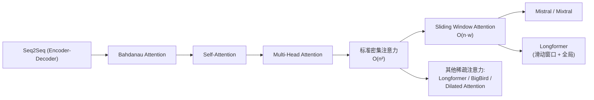
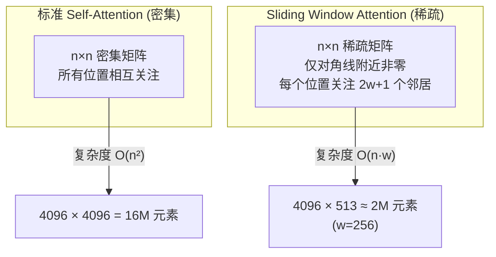

# 滑动窗口注意力 (Sliding Window Attention)

## 知识地图



## 前置知识

- **Self-Attention 的 $O(n^2)$ 瓶颈**：理解标准注意力的计算和内存复杂度
- **注意力 Mask 机制**：理解如何在注意力分数中通过 mask 屏蔽某些位置
- **CNN 感受野概念**：理解逐层扩大感受野的直觉（类比 CNN 的卷积核）
- **稀疏矩阵概念**：理解稀疏注意力矩阵比密集矩阵更高效

## 为什么会出现 (Why)

标准 Self-Attention 要求每个 token 关注所有其他 token，产生 $O(n^2)$ 的注意力矩阵。当序列长度 $n$ 很大时（如长文档、DNA 序列、长对话），这变得不切实际——$n=32K$ 时单个注意力矩阵占用约 4GB 显存。

更关键的是：**大多数语言任务中，token 之间的依赖是局部稀疏的**。一个词和它相邻的几个词关系最密切，和 1000 个位置外的词直接关联的概率极低。为了处理那些极低概率的长距离依赖而付出 $O(n^2)$ 的代价，是巨大的浪费。

Sliding Window Attention 由 Longformer (2020) 提出并推广，Mistral (2023) 将其作为默认注意力机制，证明了稀疏注意力在实际使用中是可行的。

## 解决什么问题 (Problem)

Sliding Window Attention 解决的核心问题：**如何在保持线性或近线性复杂度的同时，利用多层堆叠自然形成全局感受野，使模型能够处理长序列。**

## 核心思想 (Core Idea)

**限制每个 token 只关注其周围固定大小的窗口，把复杂度从 $O(n^2)$ 降到 $O(n \cdot w)$，并通过多层堆叠逐层扩大感受野，最终覆盖整个序列。**

---

## 数学公式

### 注意力范围定义

对位置 $i$，其注意力范围：

$$
\text{Attention}(i) = \{j: \max(0, i-w) \leq j \leq \min(n-1, i+w)\}
$$

其中 $w$ 是窗口大小（单侧）。

**通俗解释：** 位置 $i$ 只能"看到"左边 $w$ 个词和右边 $w$ 个词——总共 $2w+1$ 个邻居。就像你在一个长队伍里，只能和你前后各几个人聊天，而不是和队伍里所有人都聊一遍。

### 复杂度分析

标准注意力的每个位置的复杂度为 $O(n)$，总复杂度 $O(n^2)$。滑动窗口将每个位置限制为 $O(w)$，总复杂度为 $O(n \cdot w)$。当 $w \ll n$ 时，近乎线性。

$$
\begin{aligned}
\text{标准 Attention: } & O(n^2 d) \\
\text{Sliding Window: } & O(n w d) \quad (w \ll n)
\end{aligned}
$$

**通俗解释：** 假设你读一篇 10,000 字的文章。标准注意力相当于每个字都跟其他 9,999 个字做比较——约 1 亿次比较。滑动窗口相当于每个字只跟前后 256 个字做比较——约 512 万次，计算量减少了约 20 倍。

### 金字塔形的感受野

堆叠多层滑动窗口注意力后，顶层 token 的感受野可以覆盖整条序列（类似于 CNN 的逐层扩大感受野）。

第 $l$ 层的感受野：

$$
RF_l = 2lw
$$

例如 $w=512, L=24$ 层，顶层感受野 $= 24 \times 2 \times 512 = 24576$。

**通俗解释：** 每经过一层，每个 token 能接触到更远的 token——因为上一层已经聚合了窗口内的信息，当前层再聚合一次，窗口相当于"膨胀"了。就像传话游戏：第 1 层你跟前后各 2 个人聊天；第 2 层时，你前后那 2 个人已经把更远的信息带给你了，于是你实际"间接"接触了前后各 4 个人的信息；层层叠加后，最顶层就能覆盖整个序列。

---

## 可视化展示

### 滑动窗口注意力矩阵



### 三层堆叠感受野扩张示意

```echarts
return {
  tooltip: { trigger: "axis", confine: true },
  title: { top: 5,  text: '逐层感受野扩张 (w=2)', left: 'center' },
  xAxis: { type: 'category', data: ['第1层', '第2层', '第3层'] },
  yAxis: { type: 'value', min: 0, max: 15, name: '感受野范围 (单侧)' },
  series: [{
    type: 'bar',
    data: [2, 4, 6],
    itemStyle: { color: '#2980b9' },
    label: { show: true, position: 'top', formatter: '{c} 个位置' }
  }],
  grid: { left: 60, right: 20, top: 55, bottom: 55 }
}
```

每一层将上一层的窗口信息再次聚合，感受野线性扩张：$RF_l = 2lw$。

---

## 模型使用

### Mistral / Mixtral

使用 $w = 4096$ 的滑动窗口注意力，使得可以在长序列上高效推理。配合 KV Cache，内存使用显著降低。

### Longformer

结合三种注意力模式：
1. **滑动窗口**：局部上下文
2. **全局注意力**：特定位置（如 [CLS]）关注全序列
3. **扩张滑动窗口**：空洞式的稀疏窗口，扩大感受野

---

## 最小可运行代码

### PyTorch 实现

```python
import torch

def sliding_window_attention(Q, K, V, window_size):
    """
    Q, K, V: [batch, heads, seq_len, d_k]
    """
    B, H, N, D = Q.shape
    scores = Q @ K.transpose(-2, -1)  # [B, H, N, N]

    # 构建滑动窗口 mask
    mask = torch.ones(N, N, device=Q.device)
    for i in range(N):
        left = max(0, i - window_size)
        right = min(N, i + window_size + 1)
        mask[i, left:right] = 0
    mask = mask.bool()

    scores = scores.masked_fill(mask, float('-inf'))
    attn = torch.softmax(scores / (D ** 0.5), dim=-1)
    return attn @ V
```

---

## 工业界应用

| 应用场景 | 模型 | 窗口配置 | 说明 |
|----------|------|----------|------|
| 开源 LLM | Mistral-7B | w=4096 | 默认使用滑动窗口 |
| MoE 模型 | Mixtral 8×7B | w=4096 | 窗口 + MoE 路由 |
| 长文档理解 | Longformer | w=512 + 全局 | 滑动窗口 + [CLS] 全局注意力 |
| DNA 序列建模 | DNABert-S | w=512 | 长达 1M bp 的 DNA 序列 |
| 代码生成 | CodeGemma | w=8192 | 长代码文件处理 |

---

## 对比表格

### 标准 Attention vs Sliding Window vs Dilated Sliding Window

| 方法 | 复杂度 | 单层感受野 | 长距离依赖 | 特点 |
|------|--------|-----------|-----------|------|
| 标准 Attention | $O(n^2)$ | 全局 | 直接 | 全局感受野，内存瓶颈 |
| 滑动窗口 | $O(nw)$ | $2w+1$ | 需层叠 | 局部 + 层层叠加覆盖全局 |
| 空洞滑动窗口 | $O(nw)$ | $2w \cdot \text{gap}$ | 更快覆盖 | 跳跃式窗口，感受野扩张更快 |
| 全局+局部 (Longformer) | $O(n(g+w))$ | $g$ 全局 + $w$ 局部 | 指定位置直接 | 指定位置全局，其他局部 |

### 稀疏注意力方法横向对比

| 方法 | 提出者 | 复杂度 | 核心思路 |
|------|--------|--------|---------|
| Sliding Window | Longformer (2020) | $O(nw)$ | 固定窗口 + 全局 token |
| BigBird | Google (2020) | $O(n)$ | 窗口 + 全局 + 随机 |
| Sparse Transformer | OpenAI (2019) | $O(n\sqrt{n})$ | 跨步 + 固定模式 |
| Reformer | Google (2020) | $O(n \log n)$ | LSH 哈希 |
| Linear Transformer | (2020) | $O(n)$ | 核函数线性化 |

---

## 优缺点

- **优点**：线性复杂度，易于实现，适合流式处理（无限长序列），与 KV Cache 天然匹配
- **缺点**：需要多层堆叠才能获得全局感受野，某些极端长距离依赖可能丢失

---

## 学完后建议继续学习

1. **Longformer / BigBird** — 了解其他稀疏注意力变体（全局注意力 + 随机注意力）
2. **FlashAttention** — IO-Aware 优化，从硬件层面加速注意力计算，与稀疏注意力正交
3. **Mistral 架构** — 深入理解滑动窗口注意力在工业级 LLM 中的实际应用
4. **Dilated Attention (LongNet)** — 理解空洞/扩张注意力如何更高效地扩大感受野
5. **Mamba / SSM** — 了解状态空间模型如何作为 Attention 的替代方案处理长序列

## 高频面试题

### Q1: Sliding Window Attention 的核心思想是什么？复杂度为什么能降到 $O(nw)$？

**标准答案：**
核心思想是限制每个 token 只关注其周围固定大小的窗口（左右各 $w$ 个邻居），而非所有 $n$ 个 token。通过构建窗口 mask 屏蔽窗口外的位置（将其注意力分数设为 $-\infty$），将每个位置的注意力计算量从 $O(n)$ 降到 $O(w)$，总复杂度从 $O(n^2)$ 降到 $O(nw)$。当 $w \ll n$ 时，近乎线性。

### Q2: 滑动窗口注意力如何覆盖长距离依赖？单层窗口有限怎么办？

**标准答案：**
通过**多层堆叠**实现。每经过一层 Transformer，每个 token 的输出包含了窗口内所有 token 的信息。下一层再以窗口聚合时，窗口内的每个 token 已经包含了来自更远位置的信息。感受野随层数线性增长：$RF_l = 2lw$。例如 $w=512, L=24$ 层，顶层感受野可达 24,576 个 token，足以覆盖大多数长文档。这类似于 CNN 中通过多层卷积逐步扩大感受野的原理。

### Q3: Mistral 为什么选择 Sliding Window Attention？和 FlashAttention 冲突吗？

**标准答案：**
Mistral 选择滑动窗口的核心理由：
1. **线性复杂度**：$w=4096$ 固定，推理成本随序列长度线性增长
2. **流式处理**：滑动窗口天然适合处理无限长流式输入，不需要重新计算整个序列
3. **KV Cache 友好**：每步生成时只缓存窗口内的 K, V，内存使用固定

与 FlashAttention **不冲突**——FlashAttention 是 IO 优化（如何高效计算注意力），Sliding Window 是模式设计（计算哪些注意力）。两者可以结合：FlashAttention 的 tiling 技术可以加速滑动窗口的计算。Mistral 就同时使用了滑动窗口和 FlashAttention。

### Q4: Sliding Window 和 Dilated Sliding Window 有什么区别？

**标准答案：**
- **Sliding Window**：窗口内的位置是**连续的**（位置 $i$ 关注 $i-w$ 到 $i+w$）。
- **Dilated Sliding Window**：窗口内的位置是**跳跃的**（每隔 $d$ 个取一个，$d$ 为 dilation rate）。例如 $w=3, d=2$，位置 $i$ 关注 $\{i-4, i-2, i, i+2, i+4\}$。

Dilated 的优势在于：在相同窗口大小下，感受野扩大了 $d$ 倍（$RF_l = 2lwd$），能更快覆盖长距离依赖，代价是丢失了窗口内的"细粒度"局部信息。Longformer 中两种模式交替使用，类似 CNN 中空洞卷积的作用。
