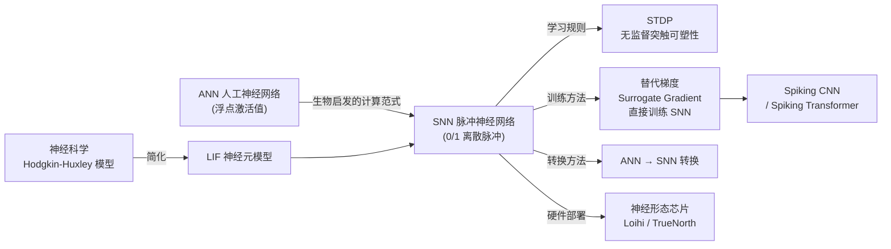
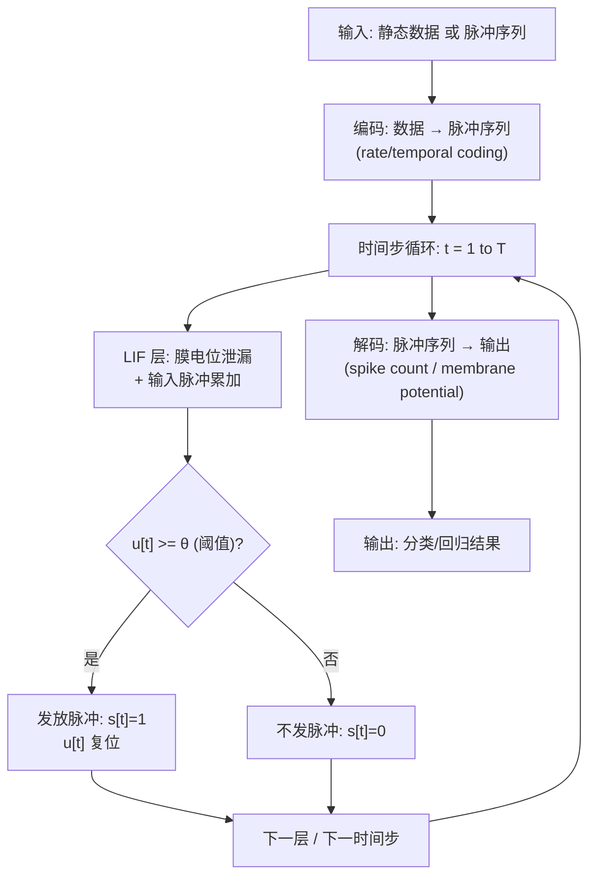
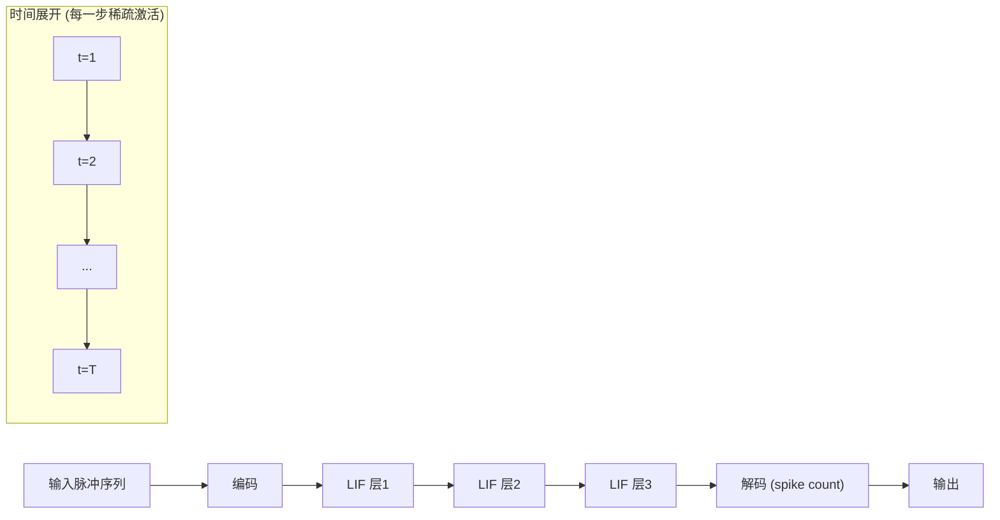
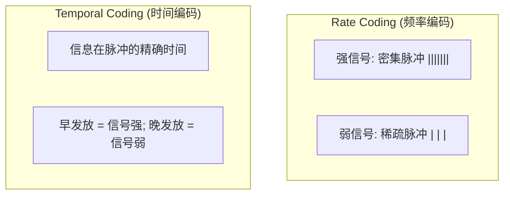

# SNN (脉冲神经网络)

## 知识地图



## 前置知识

- ANN 的神经元模型（加权求和 + 激活函数）
- 微分方程基础（LIF 模型的 ODE 形式）
- 反向传播与自动求导
- 神经科学基础概念：膜电位、阈值、动作电位

## 为什么会出现 (Why)

传统 ANN 用浮点数的矩阵乘法在 GPU 上疯狂运转，功耗极高（训练一个 GPT 级别模型消耗数万度电）。而人脑有 860 亿个神经元，日常功耗仅约 20 瓦——核心秘密在于神经元通过**稀疏脉冲（spike）**进行通信，绝大多数时间处于静默状态，只有接收到足够刺激时才发放一次脉冲。SNN 试图复现这种"事件驱动"的计算范式，以实现极低功耗的运算——被称为第三代神经网络。

## 解决什么问题 (Problem)

在保持一定推理能力的前提下，大幅降低神经网络的计算功耗，适配神经形态硬件（如 Intel Loihi、IBM TrueNorth）。SNN 信息编码在脉冲的**频率**（Rate Coding：脉冲发放频率代表信号强度）或**精确时间**（Temporal Coding：脉冲的精确发放时间携带信息）中。

## 核心思想 (Core Idea)

**SNN 用 0/1 离散脉冲在时间维度上传递信息——神经元膜电位积累到阈值时发放脉冲并复位，这种事件驱动的稀疏计算方式使其在神经形态芯片上可实现极低功耗运行。**

---

## 数学定义与原理解析

### LIF 神经元模型（最常用）

膜电位 $u(t)$ 的动态方程：

$$
\tau_m \frac{du}{dt} = -(u(t) - u_{rest}) + R \cdot I(t)
$$

**通俗解释：** 这是一个"漏水的桶"模型。$\tau_m$ 是膜时间常数（漏水速度），$u(t) - u_{rest}$ 表示膜电位与静息电位的偏差（水桶里的水量），$R \cdot I(t)$ 是输入电流（往桶里加水）。如果没有输入，膜电位会以指数速度泄漏回静息电位（漏水）。输入越强，电位积累越快。

离散化形式（Euler 方法）：

$$
u[t] = \underbrace{\beta \cdot u[t-1]}_{\text{泄漏}} + \underbrace{w \cdot s_{in}[t]}_{\text{输入脉冲}} - \underbrace{\theta \cdot s_{out}[t-1]}_{\text{复位}}
$$

其中 $\beta = e^{-1/\tau_m} < 1$ 是泄漏因子，$\theta$ 是阈值。

**通俗解释：** 在每个时间步：(1) 旧电位乘以 $\beta$（漏掉一部分，$\beta=0.9$ 意味着每步漏 10%）；(2) 加上输入脉冲的加权贡献（$w$ 是突触权重）；(3) 如果上一步发放了脉冲（$s_{out}[t-1]=1$），则减去阈值复位。

**脉冲发放规则**：

$$
s_{out}[t] = \begin{cases} 1 & \text{if } u[t] \geq \theta \\ 0 & \text{otherwise} \end{cases}
$$

**通俗解释：** 水位超过警戒线就"喷发"一次（发放脉冲 $s_{out}=1$），然后水位下降（复位）。喷发的过程是全部或全无的（0 或 1），没有中间值。

发放后：$u[t] \leftarrow u[t] - \theta$（硬复位）或 $u[t] \leftarrow u[t] \cdot (1 - s_{out}[t])$（软复位）。

### STDP (Spike-Timing-Dependent Plasticity)

无监督学习规则——突触权重变化取决于前后脉冲的时间差：

$$
\Delta w = \begin{cases}
A_+ \cdot e^{-\Delta t / \tau_+} & \text{if } \Delta t > 0 \text{ (前->后)} \\
-A_- \cdot e^{\Delta t / \tau_-} & \text{if } \Delta t < 0 \text{ (后->前)}
\end{cases}
$$

$\Delta t = t_{post} - t_{pre}$。

**通俗解释：** 这是 SNN 的无监督学习规则，灵感直接来自生物学。"先因后果"（前神经元先发放，后神经元后发放 → 因果关系）增强突触连接（长时程增强 LTP）；"先果后因"（后神经元先发放 → 前后颠倒）削弱突触连接（长时程抑制 LTD）。$\Delta t$ 越小（脉冲发放时间越接近），变化越大——越精确的时间关联越被强化。

### 替代梯度 (Surrogate Gradient) 训练

SNN 直接训练的核心技巧——前向用硬阈值（阶梯函数），反向用平滑近似：

$$
\frac{\partial s}{\partial u} \approx \frac{1}{1 + \alpha|u - \theta|^2} \quad \text{或} \quad \max(0, 1 - |u - \theta|)
$$

**通俗解释：** 脉冲发放函数是阶跃函数——在阈值处从 0 跳到 1，理论上梯度在此处要么为零要么无穷大，无法做反向传播。替代梯度的核心技巧是"偷梁换柱"：前向传播时严格按硬阈值发放（生成真实的 0/1 脉冲），但反向传播计算梯度时假装发放函数是平滑的（用上面的近似公式），从而"骗"过反向传播获得有意义的梯度信号。这就像用一个平滑的 S 曲线来近似台阶——S 曲线在台阶附近有非零梯度，可以用来指导参数更新。

---

## 算法流程图



---

## 可视化展示

### LIF 神经元膜电位动态

```echarts
return {
  tooltip: { trigger: "axis", confine: true },
  title: { top: 5,  text: 'LIF 神经元膜电位变化', left: 'center', textStyle: { fontSize: 12 } },
  xAxis: { type: 'value', name: '时间步', min: 0, max: 50 },
  yAxis: { type: 'value', name: '膜电位 u(t)', min: -0.2, max: 1.2 },
  series: [{
    type: 'line', step: 'end',
    data: (function() {
      const d = [], theta = 1.0, beta = 0.9;
      let u = 0, input_spikes = [5,6,7, 20,21,22,23, 38,39,40,41,42];
      for (let t = 0; t <= 50; t++) {
        let I = input_spikes.includes(t) ? 0.3 : 0;
        u = beta * u + I;
        if (u >= theta) { u = 0; d.push([t, theta]); d.push([t, 0]); }
        else d.push([t, u]);
      }
      return d;
    })(),
    lineStyle: { color: '#2c3e50', width: 1.5 },
    markLine: { silent: true, data: [{ yAxis: 1.0, label: { formatter: '阈值 theta' }, lineStyle: { type: 'dashed', color: '#c0392b' } }] }
  }],
  grid: { left: 60, right: 20, top: 55, bottom: 60 }
}
```

### SNN 信息处理流程



### Rate Coding vs Temporal Coding



---

## 最小可运行代码

### PyTorch -- LIF 神经元

```python
import torch
import torch.nn as nn

# 替代梯度：反正切型
class SurrogateArctan(torch.autograd.Function):
    @staticmethod
    def forward(ctx, x, alpha=2.0):
        ctx.save_for_backward(x)
        ctx.alpha = alpha
        return (x > 0).float()

    @staticmethod
    def backward(ctx, grad_out):
        x, = ctx.saved_tensors
        alpha = ctx.alpha
        grad_in = grad_out / (1 + alpha * x * x)  # arctan 导数近似
        return grad_in, None

class LIFNeuron(nn.Module):
    def __init__(self, threshold=1.0, beta=0.9):
        super().__init__()
        self.threshold = threshold
        self.beta = beta

    def forward(self, x):
        # x: [B, T, N]
        B, T, N = x.shape
        u = torch.zeros(B, N, device=x.device)
        spikes = []
        for t in range(T):
            u = self.beta * u + x[:, t, :]
            s = SurrogateArctan.apply(u - self.threshold)
            u = u * (1 - s)  # 软复位
            spikes.append(s)
        return torch.stack(spikes, dim=1)  # [B, T, N]

# SNN 模型
class SimpleSNN(nn.Module):
    def __init__(self, in_dim, hidden_dim, out_dim, T=16):
        super().__init__()
        self.T = T
        self.fc1 = nn.Linear(in_dim, hidden_dim)
        self.lif1 = LIFNeuron(threshold=1.0, beta=0.85)
        self.fc2 = nn.Linear(hidden_dim, out_dim)
        self.lif2 = LIFNeuron(threshold=1.0, beta=0.85)

    def forward(self, x):
        # x: [B, in_dim] -> 展开为时间序列
        x = x.unsqueeze(1).repeat(1, self.T, 1)  # [B, T, in_dim]
        h = self.lif1(self.fc1(x))
        out = self.lif2(self.fc2(h))
        return out.sum(dim=1)  # rate coding: 总脉冲数作为输出
```

---

## 工业界应用

| 应用场景 | 说明 | 代表系统 |
|----------|------|----------|
| 神经形态芯片 | 超低功耗边缘 AI | Intel Loihi 2, IBM TrueNorth, SynSense |
| 语音识别 | 事件驱动音频处理 | SynSense 低功耗关键词检测 |
| 手势识别 | 配合事件相机 (DVS) 实时识别 | Prophesee + SNN |
| 机器人控制 | 低延迟传感器-运动回路 | 神经形态机器人控制 |
| 脑机接口 | SNN + 神经信号的生物兼容性 | Neuralink / BrainGate 相关研究 |

---

## 对比表格

| | ANN (传统神经网络) | SNN (脉冲神经网络) |
|------|-------------------|-------------------|
| 信息表示 | 浮点激活值 (连续) | 0/1 脉冲 (离散) |
| 时间维度 | 无 (单次前向) | 有 (时间步展开) |
| 计算方式 | 密集矩阵乘法 | 稀疏脉冲累加 (事件驱动) |
| 训练方法 | 反向传播 (梯度下降) | 替代梯度 / STDP / ANN→SNN 转换 |
| 功耗 | 高 (所有神经元每步都算) | 极低 (只在发放脉冲时计算) |
| 精度 | 高 | 目前低于同规模 ANN (~1-5% 差距) |
| 硬件适配 | GPU / TPU | 神经形态芯片 (Loihi, TrueNorth) |
| 发展成熟度 | 极其成熟 | 学术/早期工业阶段 |

---

## 学完后建议继续学习

1. **SNN 训练框架 (snnTorch / SpikingJelly)** -- 用 PyTorch 风格代码训练 SNN 的成熟框架
2. **ANN-to-SNN 转换** -- 训练好 ANN 再转换为 SNN（精度保留较好，但需更多时间步）
3. **事件相机 (Event Camera / DVS)** -- SNN 的天然搭档，异步输出亮度变化事件
4. **神经形态计算硬件** -- Loihi 2 和 TrueNorth 的编程模型与 SNN 部署

---

## 高频面试题

### Q1: LIF 神经元的工作原理是什么？为什么要"漏电"？

**答：** LIF (Leaky Integrate-and-Fire) 由三个核心机制构成：(1) **Integrate（积分）**：输入脉冲带来的电流持续积累在膜电位上；(2) **Leaky（泄漏）**：膜电位以 $\beta$ 的速率指数衰减——没有新的输入时电位会逐渐回到静息状态；(3) **Fire（发放）**：膜电位超过阈值 $\theta$ 时发放脉冲并复位。

"漏电"是必不可少的生物学和功能特征：(1) 漏电确保神经元对最近的信息更敏感（历史电位自动衰减，实现"短期记忆"）；(2) 漏电防止膜电位无限积累——否则任何微弱但持续的输入最终都会触发发放，失去信号的区分力；(3) 漏电赋予了时间常数 $\tau_m$，控制神经元对输入变化的时间响应特性。

### Q2: 替代梯度 (Surrogate Gradient) 是什么？为什么 SNN 需要它？

**答：** SNN 的脉冲发放函数是阶跃函数（Heaviside step），其导数在阈值处为无穷大（Dirac delta），其他地方为 0——这使得标准反向传播无法为 SNN 计算有意义的梯度。替代梯度的做法是"前向严格、反向放松"：前向传播时用真实的硬阈值函数生成脉冲；反向传播时把阶跃函数的导数替换为一个平滑的近似函数（如反正切导数 $\frac{1}{1+\alpha|u-\theta|^2}$ 或三角窗 $\max(0, 1-|u-\theta|)$）。这相当于用一个平滑的代理函数来"骗过"自动求导系统，让它以为脉冲发放是可微的。

实践中替代梯度训练 SNN 效果很好，虽然在数学上不严格（不是真实梯度的无偏估计），但经验上收敛到好的解——类似于训练二值化神经网络 (BNN) 时的 Straight-Through Estimator。

### Q3: SNN 相比 ANN 的优势和劣势是什么？

**答：** 优势：(1) **极低功耗**——事件驱动计算，只在脉冲发放时消耗能量（安静神经元不产生任何计算）；(2) 天然适配神经形态芯片（如 Loihi），能效比可达到 GPU 的 100-1000 倍；(3) 时间信息处理能力强——天然的时间维度使其适合处理连续时间信号；(4) 与生物学的相似性使其在脑科学研究和脑机接口中有独特价值。

劣势：(1) 精度不如同规模 ANN（在 ImageNet 上的 Top-1 大约低 1-5%）；(2) 训练困难——替代梯度是近似方法，ANN→SNN 转换需要大量时间步；(3) 主流深度学习框架支持弱；(4) GPU 上运行没有速度优势（SNN 的时间展开在 GPU 上反而更慢），需要专用硬件才能发挥功耗优势。

### Q4: Rate Coding 和 Temporal Coding 的区别是什么？

**答：** Rate Coding（频率编码）用脉冲发放的平均频率来表示信息——强信号对应高频率脉冲，弱信号对应低频率。这是目前最常用的编码方式，稳健但需要较多时间步才能估计出准确频率（延迟高）。

Temporal Coding（时间编码）用脉冲的精确发放时间来表示信息——例如越早发放表示信号越强。理论上信息密度远高于 Rate Coding（单次脉冲就能传递信息），延迟极低，但对噪声更敏感，训练的难度也更大。目前大多数 SNN 实际应用仍以 Rate Coding 为主。

### Q5: ANN-to-SNN 转换的基本思路是什么？有什么优缺点？

**答：** 基本思路：(1) 先用常规方法训练一个 ReLU 激活的 ANN；(2) 将 ReLU 神经元的输出值映射为 SNN 中 LIF 神经元的脉冲发放频率（利用 ReLU 的非负输出和 LIF 的"输入→频率"近似线性关系）；(3) 用阈值缩放进行权重归一化，确保 SNN 在有限时间步内能逼近 ANN 的输出。

优点：精度损失小（可以接近 ANN 的原始精度），训练过程完全在 ANN 中完成（避免 SNN 训练的梯度问题）。

缺点：需要大量时间步（通常 100-1000 步）才能达到高精度，推理延迟高（不符合 SNN 低延迟的初衷）；CNN 转换效果较好，但 Transformer 和复杂结构难以直接转换；对 ANN 的激活函数有限制（通常只能用 ReLU，不能有负值输出）。
