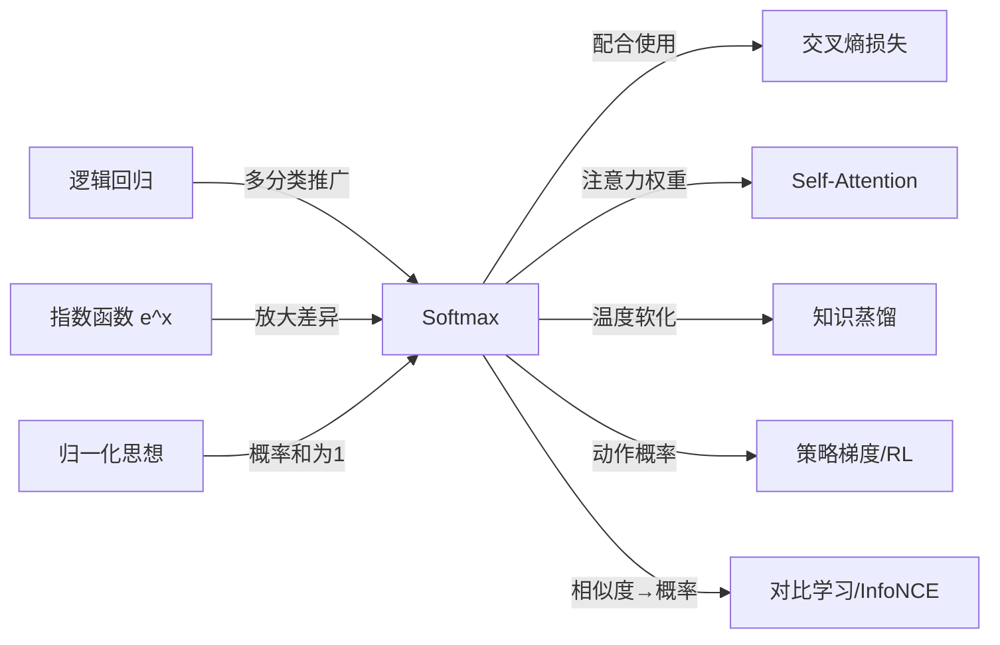

# Softmax

## 知识地图



## 前置知识

- [逻辑回归](logistic-regression.md)：理解二分类的概率输出和交叉熵损失
- [交叉熵](cross-entropy.md)：理解为什么 Softmax + 交叉熵的梯度如此简洁
- 指数函数 $e^x$ 的性质：单调递增、恒为正、增长速度极快
- 概率论基础：概率分布的定义（非负 + 和为 1）
- [Self-Attention](self-attention.md)：理解 Softmax 在注意力机制中的核心角色

## 为什么会出现 (Why)

在 Softmax 出现之前，多分类问题有几个不够优雅的方案：
- One-vs-Rest：为 $K$ 个类别训练 $K$ 个独立二分类器，输出不构成概率分布（各类概率之和不一定为 1）
- 直接使用 Sigmoid 对每个类别独立输出概率——各类之间没有"竞争"关系，无法体现互斥性
- argmax 简单但不可微，无法用于梯度优化

需要一个函数，能将 $K$ 个任意实数（logits）映射为 $K$ 个正数、且和为 1 的概率分布——同时保持可微性以便梯度优化。Softmax 正是为此而生。

## 解决什么问题 (Problem)

**将任意实数向量转换为概率分布**：给定 $K$ 个类别各自的"分数"（logits），Softmax 通过指数放大 + 归一化，输出每个类别的概率，且保证 $\sum_{k=1}^K \hat{y}_k = 1$。这使得多分类模型可以端到端地用梯度下降训练。

## 核心思想 (Core Idea)

**Softmax 是 argmax 的可微近似——用指数函数放大类别间的差距，再归一化为概率分布，温度参数可以控制这个"近似"的软硬程度。**

---

## 数学模型/公式

### 标准 Softmax

$$
\text{softmax}(\mathbf{z})_i = \frac{e^{z_i}}{\sum_{j=1}^{K} e^{z_j}}
$$

**通俗解释：** 每个 logit 先经过 $e^{z_i}$ 变成正数（指数函数保证恒 > 0），然后除以所有指数之和——就像 $K$ 个人分蛋糕，每个人分到的比例取决于他的"指数分数"占总分的比例。指数函数的好处是：分数大的人会被指数放大得更多，获得远超正比的份额。

**关键性质**：

- **平移不变性**：$\text{softmax}(\mathbf{z} + c) = \text{softmax}(\mathbf{z})$，推导中分子分母的 $e^c$ 相消
- **输出和为 1**：天然构成合法概率分布
- **非饱和性**：不同于 Sigmoid，Softmax 始终有梯度流动（至少有一个维度的梯度不为零）

### 带温度的 Softmax

$$
\text{softmax}(\mathbf{z}/\tau)_i = \frac{e^{z_i/\tau}}{\sum_{j=1}^{K} e^{z_j/\tau}}
$$

**通俗解释：** 温度 $\tau$ 控制分布的"软硬"。$\tau$ 越小，分布越尖锐（接近 one-hot，像 argmax）；$\tau$ 越大，分布越平滑（接近均匀分布）。就像烧开水——温度低时水分子静止（分布尖锐），温度高时水分子沸腾乱窜（分布均匀）。

| $\tau$ 值 | 分布形态 | 用途 |
|-----------|----------|------|
| $\tau \to 0$ | 趋近 one-hot（argmax） | 确定性推理 |
| $\tau = 1$ | 标准 Softmax | 常规训练 |
| $\tau > 1$ | 平滑、均匀 | 知识蒸馏（捕获"暗知识"） |

### 数值稳定性

直接计算 $e^{z_i}$ 当 $z_i$ 很大时会导致上溢。标准做法是减去最大值：

$$
\text{softmax}(\mathbf{z})_i = \frac{e^{z_i - \max(\mathbf{z})}}{\sum_j e^{z_j - \max(\mathbf{z})}}
$$

**通俗解释：** 在所有 logits 中减去最大值，不影响结果（因为有平移不变性）但能防止指数爆炸——最大的 exponent 被限制为 $e^0 = 1$，其余都小于等于 1。

这等价于令 $c = -\max(\mathbf{z})$，不改变结果但保证指数最大为 $e^0 = 1$。

### Softmax + 交叉熵的优雅梯度

这是 Softmax 如此流行的深层原因——与交叉熵结合后，梯度形式极其简洁：

$$
\frac{\partial L}{\partial z_i} = \hat{y}_i - y_i
$$

**通俗解释：** 梯度 = 预测概率 - 真实标签（one-hot）。形式与逻辑回归的 $\hat{y} - y$ 完全一致！这意味着：如果某类预测概率偏高，梯度为正，参数向降低该类的方向更新；反之亦然。这个简洁形式使得 Softmax + Cross Entropy 成为所有深度学习框架的多分类默认组合。

其中 $\hat{y}_i$ 是 Softmax 输出，$y_i$ 是 one-hot 标签。"预测值 - 真实值"——形式与线性回归的 MSE 梯度一致。

---

## 可视化展示

### 温度参数对 Softmax 分布的影响

对一个三维 logits $(3, 1, 0)$ 应用不同温度的 Softmax：

```echarts
return {
  xAxis: { type: 'category', data: ['类别 A (logit=3)', '类别 B (logit=1)', '类别 C (logit=0)'] },
  yAxis: { type: 'value', min: 0, max: 1, name: '概率' },
  legend: { top: 28,  data: ['τ=0.2', 'τ=0.5', 'τ=1.0', 'τ=2.0', 'τ=5.0'] },
  series: (function() {
    const logits = [3, 1, 0];
    const taus = [0.2, 0.5, 1.0, 2.0, 5.0];
    const colors = ['#c0392b', '#d35400', '#2c3e50', '#16a085', '#2980b9'];
    return taus.map(function(tau, idx) {
      const scaled = logits.map(function(z) { return Math.exp(z / tau); });
      const sum = scaled.reduce(function(a, b) { return a + b; }, 0);
      const probs = scaled.map(function(s) { return +(s / sum).toFixed(4); });
      return {
        name: 'τ=' + tau, type: 'bar',
        data: probs,
        itemStyle: { color: colors[idx] }
      };
    });
  })(),
  tooltip: { trigger: 'axis' },
  grid: { left: 60, right: 20, top: 40, bottom: 60 }
}
```

### Softmax 函数曲面（二维输入 → 二维概率）

```echarts
return {
  xAxis: { type: 'value', min: -5, max: 5, name: 'z₁ - z₂' },
  yAxis: { type: 'value', min: 0, max: 1, name: 'P(类别1)' },
  legend: { top: 28,  data: ['τ=0.5', 'τ=1.0', 'τ=2.0'] },
  series: [
    {
      name: 'τ=0.5', type: 'line', smooth: true,
      lineStyle: { color: '#d35400', width: 2 },
      data: (function() {
        const d = [];
        for (let i = -5; i <= 5; i += 0.05) {
          const s1 = Math.exp(i / 0.5), s2 = Math.exp(0);
          d.push([i, s1 / (s1 + s2)]);
        }
        return d;
      })()
    },
    {
      name: 'τ=1.0', type: 'line', smooth: true,
      lineStyle: { color: '#2c3e50', width: 2.5 },
      data: (function() {
        const d = [];
        for (let i = -5; i <= 5; i += 0.05) {
          const s1 = Math.exp(i), s2 = Math.exp(0);
          d.push([i, s1 / (s1 + s2)]);
        }
        return d;
      })()
    },
    {
      name: 'τ=2.0', type: 'line', smooth: true,
      lineStyle: { color: '#2980b9', width: 2 },
      data: (function() {
        const d = [];
        for (let i = -5; i <= 5; i += 0.05) {
          const s1 = Math.exp(i / 2), s2 = Math.exp(0);
          d.push([i, s1 / (s1 + s2)]);
        }
        return d;
      })()
    }
  ],
  tooltip: { trigger: 'axis' },
  grid: { left: 60, right: 20, top: 40, bottom: 60 }
}
```

---

## 最小可运行代码

### PyTorch 实现

```python
import torch
import torch.nn as nn
import torch.nn.functional as F

# Softmax 层
softmax = nn.Softmax(dim=-1)

# 数值稳定版本：直接使用 CrossEntropyLoss（内置 log_softmax + NLL）
loss_fn = nn.CrossEntropyLoss()

# 带温度的 Softmax
def temperature_softmax(logits, T=1.0):
    return F.softmax(logits / T, dim=-1)
```

### NumPy 手写

```python
import numpy as np

def softmax(z, axis=-1):
    z_max = np.max(z, axis=axis, keepdims=True)
    exp_z = np.exp(z - z_max)
    return exp_z / np.sum(exp_z, axis=axis, keepdims=True)

def temperature_softmax(z, T=1.0):
    z_max = np.max(z / T, axis=-1, keepdims=True)
    exp_z = np.exp(z / T - z_max)
    return exp_z / np.sum(exp_z, axis=-1, keepdims=True)
```

---

## 工业界应用

| 应用场景 | 为什么用它 | 优点 | 缺点 |
|----------|-----------|------|------|
| 多分类模型输出层 | 将 logits 转为 $K$ 类概率分布 | 可微、可端到端训练、输出有明确概率意义 | 当类别数 $K$ 极大时计算开销线性增长 |
| Self-Attention 权重归一化 | $\text{softmax}(QK^T/\sqrt{d_k})$ 归一化注意力权重 | 保证所有 token 的注意力权重和为 1 | 对长序列产生稀疏问题（被 softmax 强制分配注意力） |
| 知识蒸馏 | 高温度 $\tau$ 软化教师输出，暴露类间相似度 | 学生能从教师的"暗知识"中学习 | 温度选择需要实验调参 |
| 强化学习策略网络 | 动作选择的概率分布 | 平滑探索，避免确定性的 argmax 策略 | 在连续动作空间需要其他参数化方式 |
| 对比学习 (InfoNCE) | 正样本对的相似度通过 Softmax 与负样本竞争 | 天然适合"拉近正样本、推远负样本"的对比任务 | 对 batch size 敏感（需要足够负样本） |

---

## 优缺点对比

| 优点 | 缺点 |
|------|------|
| 输出严格构成概率分布（和为 1，每项 > 0） | 对输入的绝对大小敏感（无界输入 → 概率极端化） |
| 处处可微，适合梯度优化 | 类别数量极大时（如语言模型中的词汇表 Softmax）计算开销大 |
| 配合交叉熵得到极简梯度 ($\hat{y}-y$) | 输出永远 > 0（无稀疏性），不像 sparsemax 可以输出零概率 |
| 温度参数灵活控制分布软硬 | 对极大/极小 logits 需要数值稳定技巧（减去最大值） |

---

## 对比表格

| | Softmax | Sigmoid | Sparsemax |
|------|---------|---------|-----------|
| 输出范围 | $K$ 维概率向量，和为 1 | 标量概率 $(0, 1)$ | $K$ 维稀疏概率向量 |
| 适用任务 | 多分类（互斥类） | 二分类 / 多标签分类 | 需要稀疏概率的场景 |
| 梯度形式 | $\hat{y}_i - y_i$（与 CE 配合） | $\hat{y} - y$（与 BCE 配合） | 分段线性梯度 |
| 输出稀疏性 | 无（所有 $K$ 类都有非零概率） | N/A | 有（部分类别概率为 0） |
| 计算复杂度 | $O(K)$ | $O(1)$ | $O(K \log K)$（需排序） |

---

## 学完后建议继续学习

- [交叉熵](cross-entropy.md)：深入理解 Softmax + 交叉熵的黄金组合
- [逻辑回归](logistic-regression.md)：二分类特例，Sigmoid 可以看作 $K=2$ 的 Softmax
- [Self-Attention](self-attention.md)：Softmax 在注意力机制中的核心应用
- [知识蒸馏](knowledge-distillation.md)：利用带温度的 Softmax 传递教师模型的"暗知识"
- [对比学习 / InfoNCE](clip-align.md)：Softmax 在对比损失中的角色
- [Sigmoid / Tanh](sigmoid-tanh.md)：与 Sigmoid 的对比，理解何时用哪个

---

## 高频面试题

**Q1: Softmax 为什么要用指数函数 $e^x$，换成别的函数可以吗？**

答：指数函数有三个不可替代的特性：(1) 恒为正，保证输出概率 > 0；(2) 单调递增，保证更大的 logit 获得更大的概率，排序一致性不被破坏；(3) 最关键的是——指数函数与对数函数互逆，与交叉熵 $\log(\text{softmax}(z))$ 联用时产生极简梯度 $\hat{y} - y$。如果换成平方函数 $z^2$ 或绝对值 $|z|$，这个梯度简化就不会发生，优化将变得复杂。

**Q2: Softmax 的数值稳定性问题是怎么产生的？如何解决？**

答：当 $\mathbf{z}$ 中有很大的分量（如 1000）时，$e^{1000}$ 会导致浮点数上溢变成 inf。解决方案是利用 Softmax 的平移不变性：在计算前对所有分量减去最大值，即 $\text{softmax}(\mathbf{z}) = \text{softmax}(\mathbf{z} - \max(\mathbf{z}))$。减完后最大指数为 $e^0 = 1$，其他 $\le 1$，完全避免上溢。PyTorch 的 `nn.CrossEntropyLoss()` 内置了这一技巧。

**Q3: 温度参数 $\tau$ 的直观理解？在知识蒸馏中如何选择？**

答：$\tau$ 缩放 logits 后再做 Softmax。$\tau \to 0$ 时分布趋近 one-hot（硬标签，只有最大 logit 对应的类有概率），$\tau \to \infty$ 时分布趋近均匀。在知识蒸馏中，教师模型使用较大的 $\tau$（如 2~20）来软化输出——暴露类别间的相对相似度（例如猫和老虎的图像虽然标签不同，但特征相似），学生用同样的 $\tau$ 学习这种"暗知识"，推理时 $\tau = 1$。

**Q4: 为什么 PyTorch 的 `CrossEntropyLoss` 输入需要是 logits 而不是概率？**

答：因为 `CrossEntropyLoss` 内部先做 `log_softmax`（即先减去最大值再做 Softmax + log），这样可以保证数值稳定。如果用户先手动做 Softmax 再取 log 传入，会引入两次数值误差。框架设计的哲学是：把数值稳定性的责任交给框架内部，用户只需传入最原始的 logits。

**Q5: Softmax 和 Sigmoid 是什么关系？多分类时为什么不用 Sigmoid？**

答：当 $K=2$ 时，Softmax 等价于 Sigmoid：$\text{softmax}([z_1, z_2])_1 = \frac{e^{z_1}}{e^{z_1}+e^{z_2}} = \frac{1}{1+e^{-(z_1-z_2)}} = \sigma(z_1-z_2)$。多分类时不能用多个独立 Sigmoid，因为 Sigmoid 输出各类独立，不能保证概率和为 1——对于互斥的多分类任务，各类之间需要有"竞争归一化"，这正是 Softmax 的归一化分母所保证的。
