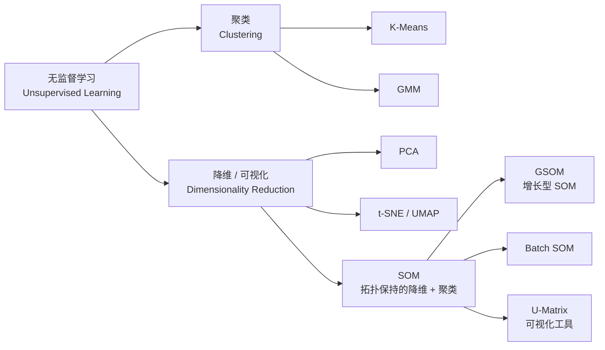
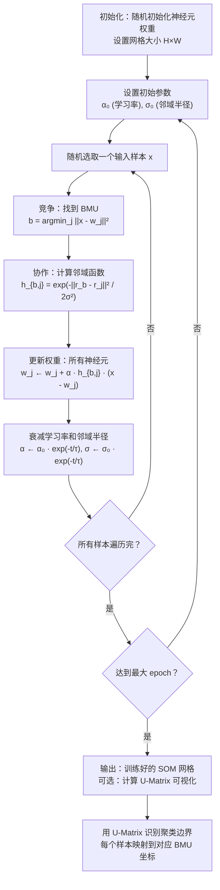
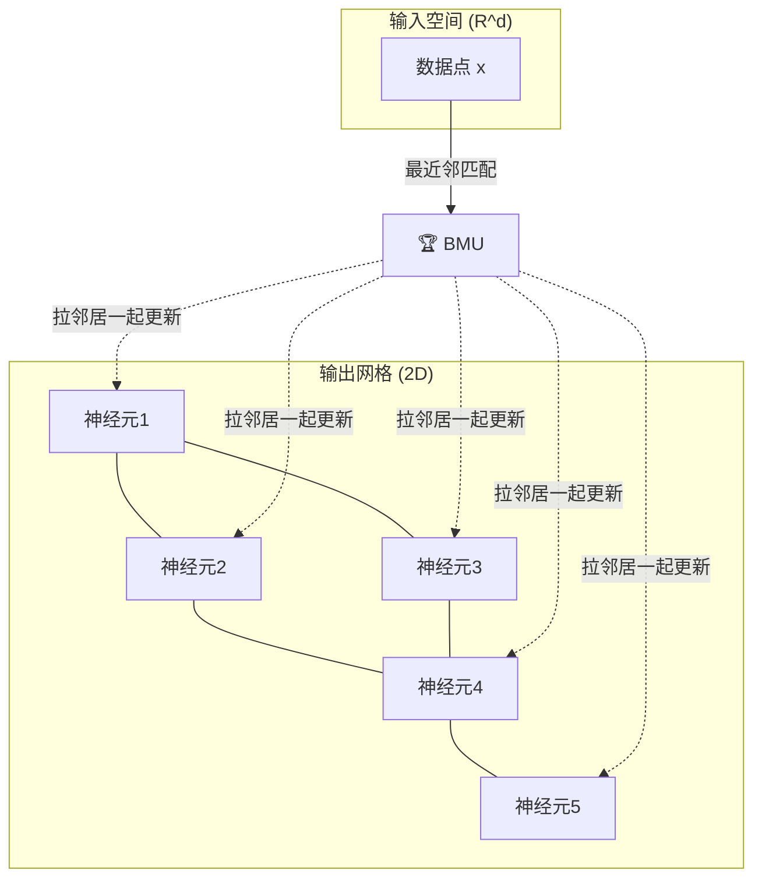

# SOM (自组织映射 / Kohonen 网络)

## 知识地图



## 前置知识

- **K-Means 聚类**：理解竞争学习——每个输入找到最近的聚类中心
- **神经网络基础**：权重更新的概念（SOM 不使用反向传播，但权重更新机制类似）
- **梯度下降**：理解迭代优化和参数更新
- **高斯函数**：理解 $\exp(-\frac{\|x\|^2}{2\sigma^2})$ 的形状和衰减特性
- **拓扑学概念**：理解"保持拓扑结构"的含义——相邻输入映射到相邻输出

## 为什么会出现 (Why)

在 t-SNE 和 UMAP 出现之前，数据科学家面临一个问题：如何将高维数据可视化在 2D 平面上，同时保持数据的原始结构？PCA 能降维但不能保持非线性拓扑结构。K-Means 能聚类但输出只是一堆标签，不知道簇与簇之间的关系。SOM (Kohonen, 1982) 用一个巧妙的思路同时解决了这两个问题：在 2D 网格上排布神经元，训练时不仅更新获胜神经元，还"拉着邻居一起靠近输入"。最终，相似的输入数据会映射到网格上相邻的位置，高维数据的拓扑结构被忠实地"打印"在 2D 地图上。

## 解决什么问题 (Problem)

将高维数据映射到低维（通常 2D）网格上，同时保持数据的拓扑结构——即在高维空间中相似的数据点，在低维网格上对应的神经元也相邻。这使得 SOM 既是降维和可视化工具，又是聚类工具。

## 核心思想 (Core Idea)

**竞争学习 + 邻域协作：获胜神经元（BMU）不仅更新自己的权重向量以靠近输入，还以递减的强度拉着网格上邻近的神经元一起更新，最终形成保持拓扑结构的低维映射。**

---

## 数学模型/公式

### 竞争阶段：找胜者 (BMU, Best Matching Unit)

给定输入 $\mathbf{x} \in \mathbb{R}^d$，网格上每个神经元 $j$ 有权重向量 $\mathbf{w}_j \in \mathbb{R}^d$：

$$
b = \arg\min_j \| \mathbf{x} - \mathbf{w}_j \|^2
$$

**通俗解释：** BMU 就是权重向量与输入向量最接近的那个神经元——它"赢了"这场比赛，有资格代表当前输入。

### 协作阶段：邻域更新

$$
\mathbf{w}_j(t+1) = \mathbf{w}_j(t) + \alpha(t) \cdot h_{b,j}(t) \cdot (\mathbf{x} - \mathbf{w}_j(t))
$$

其中：
- $\alpha(t)$ **学习率**，随时间衰减
- $h_{b,j}(t)$ **邻域函数**（Gaussian）：

$$
h_{b,j}(t) = \exp\left(-\frac{\| \mathbf{r}_b - \mathbf{r}_j \|^2}{2\sigma^2(t)}\right)
$$

- $\mathbf{r}_b, \mathbf{r}_j$ 是网格上的 2D 坐标
- $\sigma(t)$ 是邻域半径，同样随时间衰减

**通俗解释：** 更新规则分三步理解：(1) $(\mathbf{x} - \mathbf{w}_j)$ 是"把神经元拉向输入的方向"；(2) $h_{b,j}$ 是"拉力有多大"——BMU 本身拉力最大（$h_{b,b}=1$），远离 BMU 的神经元几乎不动（$h \approx 0$）；(3) $\alpha$ 控制全局学习速度。整个过程就像在一块橡皮布上按一个图钉——图钉位置的神经元被直接拉过去，周围的区域也跟着变形。

### 衰减策略

$$
\alpha(t) = \alpha_0 \cdot \exp(-t / \tau_\alpha)
$$

$$
\sigma(t) = \sigma_0 \cdot \exp(-t / \tau_\sigma)
$$

典型参数：$\alpha_0 = 0.1$，$\sigma_0 = \text{grid\_size}/2$，$\tau = \text{epochs}$。

**通俗解释：** 训练分两阶段：(1) 早期——学习率大、邻域半径大，网格进行全局拓扑重排，形成大致的"地图"；(2) 晚期——学习率小、邻域半径小，仅局部微调，细化簇边界。

### U-Matrix（统一距离矩阵）

SOM 训练后的可视化工具——每个神经元与其邻居的权重距离由颜色编码，距离大的地方形成"山脊"（聚类边界）。

**通俗解释：** U-Matrix 是 SOM 的"等高线图"。如果两个相邻神经元的权重向量差异很大（在数据空间中很远），说明这里有一条"分界线"——两边的数据属于不同簇。在 U-Matrix 中，这些分界线会以深色"山脊"的形式呈现。

---

## 算法流程图



---

## 可视化展示

### SOM 拓扑映射



### 邻域半径衰减

```echarts
return {
  tooltip: { trigger: "axis", confine: true },
  title: { top: 5,  text: 'SOM 训练过程中邻域半径的收缩', left: 'center', textStyle: { fontSize: 12 } },
  xAxis: { type: 'value', name: '迭代次数' },
  yAxis: { type: 'value', name: '邻域半径 σ(t)', min: 0, max: 5 },
  series: [{
    type: 'line', smooth: true,
    data: (function() {
      const d = [];
      for (let t = 0; t <= 100; t++) d.push([t, 5 * Math.exp(-t/30)]);
      return d;
    })(),
    lineStyle: { color: '#2c3e50', width: 2.5 }
  }],
  grid: { left: 60, right: 20, top: 55, bottom: 60 }
}
```

初期邻域大，全局拓扑成形；后期邻域小，局部细节收敛。

---

## 最小可运行代码

```python
import numpy as np


class SOM:
    def __init__(self, grid_h, grid_w, input_dim, lr=0.1, sigma=None):
        self.grid_h, self.grid_w = grid_h, grid_w
        self.n_neurons = grid_h * grid_w
        self.lr0 = lr
        self.sigma0 = sigma or max(grid_h, grid_w) / 2

        # 权重初始化 + 2D 网格坐标
        self.W = np.random.randn(grid_h, grid_w, input_dim) * 0.1
        y, x = np.meshgrid(np.arange(grid_h), np.arange(grid_w), indexing='ij')
        self.coords = np.stack([y, x], axis=-1)  # [H, W, 2]

    def _decay(self, t, max_t):
        return self.lr0 * np.exp(-t / max_t), \
               self.sigma0 * np.exp(-t / max_t)

    def train(self, X, epochs=100):
        n = X.shape[0]
        for epoch in range(epochs):
            lr, sigma = self._decay(epoch, epochs)
            for i in np.random.permutation(n):
                # 找 BMU
                diff = self.W - X[i]  # [H, W, d]
                dist = np.sum(diff ** 2, axis=-1)  # [H, W]
                by, bx = np.unravel_index(np.argmin(dist), (self.grid_h, self.grid_w))

                # 邻域函数
                coord_diff = self.coords - np.array([by, bx])
                d2 = np.sum(coord_diff ** 2, axis=-1)  # [H, W]
                h = np.exp(-d2 / (2 * sigma ** 2))

                # 批量更新所有权重
                self.W += lr * h[..., np.newaxis] * (X[i] - self.W)

    def map(self, X):
        """返回每个输入的 BMU 坐标"""
        result = []
        for x in X:
            dist = np.sum((self.W - x) ** 2, axis=-1)
            result.append(np.unravel_index(np.argmin(dist), (self.grid_h, self.grid_w)))
        return np.array(result)

    def umatrix(self):
        """
        计算 U-Matrix: 每个神经元与其邻居的权重距离。
        返回值大小: [2*H-1, 2*W-1]
        用于可视化聚类边界。
        """
        H, W = self.grid_h, self.grid_w
        u = np.zeros((2 * H - 1, 2 * W - 1))

        for i in range(H):
            for j in range(W):
                # 右侧邻居的距离
                if j < W - 1:
                    d = np.linalg.norm(self.W[i, j] - self.W[i, j + 1])
                    u[2 * i, 2 * j + 1] = d
                # 下侧邻居的距离
                if i < H - 1:
                    d = np.linalg.norm(self.W[i, j] - self.W[i + 1, j])
                    u[2 * i + 1, 2 * j] = d
                # 右下邻居的距离（对角）
                if i < H - 1 and j < W - 1:
                    d1 = np.linalg.norm(self.W[i, j] - self.W[i + 1, j + 1])
                    d2 = np.linalg.norm(self.W[i, j + 1] - self.W[i + 1, j])
                    u[2 * i + 1, 2 * j + 1] = (d1 + d2) / 2

        return u


# ===== 使用示例 =====
if __name__ == '__main__':
    np.random.seed(42)

    # 生成颜色数据（3D -> 2D）
    colors = np.array([
        [255, 0, 0], [0, 255, 0], [0, 0, 255],
        [255, 255, 0], [255, 0, 255], [0, 255, 255],
        [128, 0, 0], [0, 128, 0], [0, 0, 128],
    ], dtype=float) / 255.0

    # 扩充数据
    X = np.tile(colors, (20, 1)) + np.random.randn(180, 3) * 0.05

    som = SOM(grid_h=8, grid_w=8, input_dim=3, lr=0.1)
    som.train(X, epochs=200)

    # 映射
    positions = som.map(X[:9])  # 映射前 9 个"纯色"样本
    print("BMU positions of color samples (H, W):")
    for i, pos in enumerate(positions):
        print(f"  Color {i}: grid position ({pos[0]}, {pos[1]})")

    # U-Matrix
    u = som.umatrix()
    print(f"\nU-Matrix shape: {u.shape}  (ready for visualization)")
    print(f"U-Matrix max distance (ridge): {u.max():.4f}")
```

---

## 工业界应用

| 领域 | 应用场景 | 典型用法 |
| --- | --- | --- |
| **客户细分** | 市场营销 | 将高维客户特征（消费金额、频率、品类偏好等）映射到 2D SOM 地图，识别不同的客户群体及其关系 |
| **故障诊断** | 工业设备监控 | 将设备的多维传感器读数映射到 SOM，正常状态和异常状态在地图上形成不同的"区域" |
| **金融风控** | 信贷评估 | 将贷款申请人的多维特征映射到 SOM，可视化识别高风险和低风险人群的分布 |
| **文本分析** | 文档聚类 | WEBSOM——将大规模文档集映射到 SOM 地图，相似主题的文档聚集在一起 |
| **生物信息学** | 基因表达分析 | 将基因表达谱映射到 SOM，发现功能相似的基因组 |
| **图像处理** | 图像分割/压缩 | 用 SOM 学习图像的调色板，实现颜色量化和压缩 |

---

## 对比表格

| 维度 | SOM | K-Means | t-SNE | PCA |
| --- | --- | --- | --- | --- |
| **输出形式** | 2D 网格上的神经元（拓扑地图） | K 个聚类中心 + 标签 | 2D/3D 散点图 | 低维投影 |
| **拓扑保持** | 是（相邻输入映射到相邻网格位置） | 否 | 是（局部结构保持好） | 仅保持线性结构 |
| **聚类能力** | 有（U-Matrix 识别边界） | 有（硬分配） | 无（仅可视化） | 无 |
| **可解释性** | 强（每个神经元是"原型"，网格直观） | 中（聚类中心可解释） | 弱（坐标无物理意义） | 中（主成分有方向含义） |
| **对新样本的扩展** | 可直接映射新数据 | 可直接分配最近中心 | 需重新运行 | 可直接投影 |
| **计算复杂度** | $O(n \cdot H \cdot W \cdot d \cdot epochs)$ | $O(n \cdot K \cdot d \cdot iter)$ | $O(n^2)$ | $O(n \cdot d^2 + d^3)$ |
| **参数敏感性** | 中（学习率、邻域半径衰减） | 低（仅 K） | 中（perplexity） | 低 |

---

## 学完后建议继续学习

1. **GSOM (Growing SOM)**：动态增长网格大小，无需预设网格尺寸
2. **Batch SOM**：批量更新版本的 SOM，收敛更快且对样本顺序不敏感
3. **t-SNE / UMAP**：当前主流的非线性降维可视化方法，通常比 SOM 呈现更清晰的局部结构
4. **Vector Quantization (VQ) / LVQ**：与 SOM 共享竞争学习思想但面向监督学习的变种
5. **Neural Gas**：不使用固定网格拓扑，通过数据驱动的邻域关系替代物理网格，灵活性更高

---

## 高频面试题

### Q1: SOM 和 K-Means 的本质区别是什么？

**标准答案：** (1) SOM 的神经元排列在 2D 网格上，具有拓扑结构——相邻神经元在权重空间中也是相似的。K-Means 的聚类中心之间没有拓扑关系。(2) SOM 更新时不仅更新获胜神经元，还更新其邻居（邻域协作），这迫使 SOM 形成有序的拓扑映射。K-Means 只更新获胜的中心。(3) SOM 输出是一个完整的 2D 地图，可直接用于可视化；K-Means 只输出离散的聚类标签。(4) SOM 的学习率随时间衰减，邻域半径也衰减，从全局粗调到局部细调。K-Means 每次迭代的学习步长不变。简单说：K-Means 是"分堆"，SOM 是"画地图"。

### Q2: SOM 的邻域函数为什么选择高斯函数？可以用其他函数吗？

**标准答案：** 高斯函数是 SOM 最常用的邻域函数，原因是：(1) 平滑递减——离 BMU 越远，更新的影响力平滑地减小，避免了硬边界带来的不连续；(2) 参数可调——通过 $\sigma(t)$ 控制邻域大小，方便实现从全局到局部的退火策略。也可以使用其他函数，如墨西哥帽函数（Mexican Hat，中心兴奋、近邻抑制、远端弱兴奋）可形成更尖锐的边界；气泡函数（bubble，半径内等权、半径外为零）计算简单但边界不光滑。实践中高斯函数效果最稳定，是默认选择。

### Q3: SOM 为什么要衰减学习率和邻域半径？

**标准答案：** 这是 SOM 的核心机制——"退火"训练策略。训练分两个阶段：(1) 排序阶段（早期）——大学习率和大邻域半径，BMU 带着大片邻居一起移动，快速建立全局拓扑顺序，网格在此阶段完成大致的"自我组织"；(2) 收敛阶段（晚期）——小学习率和小邻域半径，只做局部微调，细化每个神经元对少量输入样本的精确表示。如果不衰减，网格会持续震荡，永远不能收敛到稳定的映射。这模仿了模拟退火的思想——从粗粒度的全局搜索过渡到细粒度的局部优化。

### Q4: 如何评估 SOM 的训练质量？

**标准答案：** 常用指标包括：(1) 量化误差 (Quantization Error)——每个输入与其 BMU 之间距离的平均值，越小越好；(2) 拓扑误差 (Topographic Error)——相邻 BMU 在网格上不相邻的输入对比例，衡量拓扑保持程度，越小越好；(3) U-Matrix 目视检查——看 U-Matrix 上是否形成清晰的山脊（聚类边界）；(4) 命中图 (Hit Map)——统计每个神经元作为 BMU 的次数，健康的 SOM 应该各区域都有响应而非死神经元聚集。在实际应用中，通常结合量化误差和拓扑误差，并辅以 U-Matrix 可视化综合评估。

### Q5: SOM 如何处理缺失数据或类别特征？

**标准答案：** 对于缺失数据：(1) 在计算 BMU 和更新权重时，只考虑非缺失维度，用欧氏距离除以有效维度数做归一化；(2) 先用均值/中位数填充缺失值，再进行标准 SOM 训练。对于类别特征：(1) One-hot 编码后当作连续值处理（简单但可能失真）；(2) 使用适合混合数据的距离度量，如 Gower 距离——对连续特征用归一化曼哈顿距离，对类别特征用 Dice 系数，加权组合。对于有序类别特征（如"低/中/高"），可先映射为数值（1/2/3）再标准化。SOM 本身只接受连续向量输入，所有非数值特征需预处理。
