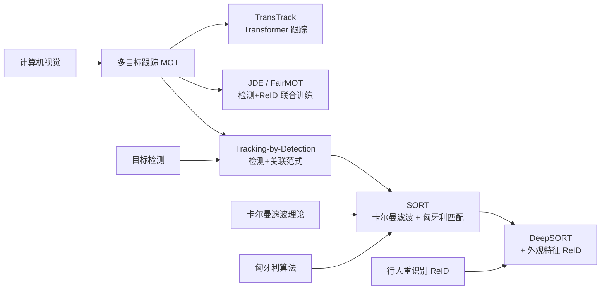
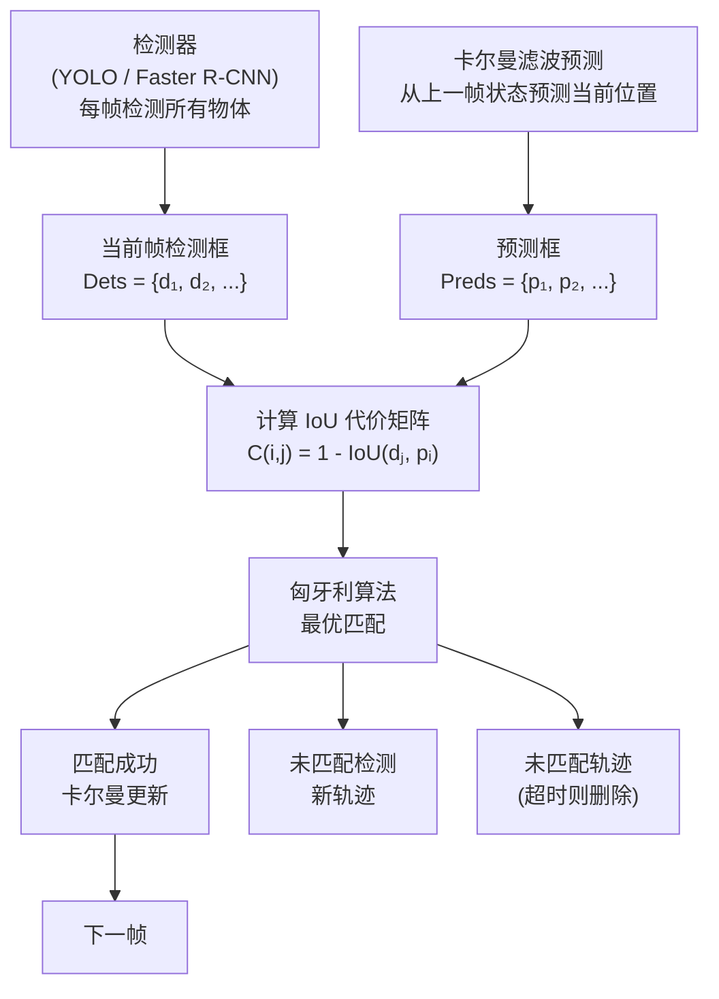
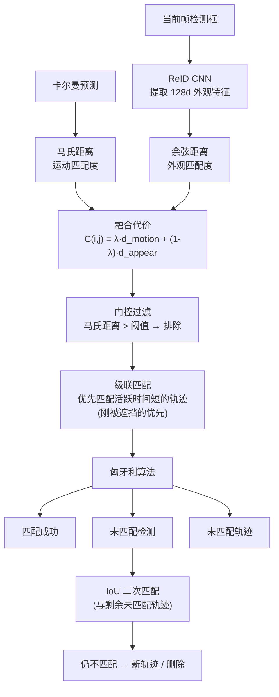
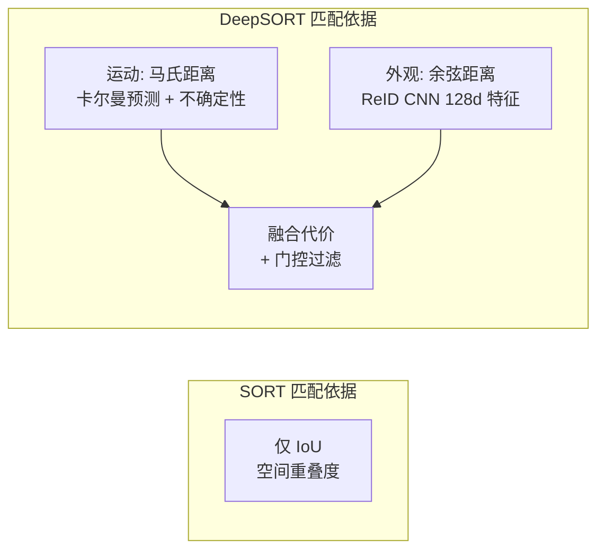
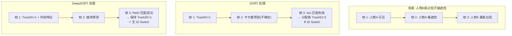

# SORT / DeepSORT

## 知识地图



## 前置知识

- **目标检测**：YOLO / Faster R-CNN，边界框输出 (x, y, w, h)
- **卡尔曼滤波**：状态预测、观测更新、协方差矩阵、匀速模型
- **匈牙利算法**：二分图匹配、代价矩阵、最优分配
- **IoU**：交并比，两个框之间的面积重叠度
- **ReID (行人重识别)**：提取人的外观特征，跨相机/跨帧识别同一人

## 模型演化路线


| Model | Year | Key Innovation |
|-------|------|----------------|
| SORT | 2016 | 卡尔曼滤波预测 + IoU 匈牙利匹配，极简但高效，纯跟踪 260Hz |
| DeepSORT | 2017 | 引入外观特征（ReID CNN）和级联匹配，大幅减少 ID Switch |
| JDE | 2019 | 检测和 ReID 特征共享 CNN Backbone 联合训练，速度提升 |
| FairMOT | 2020 | 解决检测和 ReID 的不公平竞争，用 DLA 骨干实现精度/速度平衡 |
| ByteTrack | 2021 | 利用低分检测框做二次匹配，充分利用检测结果，COCO SOTA |

## 为什么会出现 (Why)

在 SORT 之前，多目标跟踪的主要方法依赖于光流（Optical Flow）或均值漂移（Mean Shift）等低层视觉信号。这些方法存在两个核心问题：

1. **对遮挡和光照极其敏感**：光流假设像素亮度恒定，均值漂移基于颜色直方图。两者在遮挡、光照变化、相机抖动时极易失败。
2. **缺乏语义理解**：无法利用目标检测领域的最新进展。2015-2016 年目标检测（尤其是 Faster R-CNN）已经非常成熟，但跟踪领域没有有效地利用这些检测器。

SORT 的核心洞察：既然检测器已经很强了，跟踪可以简化为"在连续的检测结果之间做数据关联"——把跟踪变成检测后的问题。

DeepSORT 进一步发现 SORT 只用 IoU 做关联在面对遮挡时 ID Switch 严重——同一人物被遮挡后重新出现，IoU 匹配会将其视为新 ID。加入外观特征（ReID）可以解决这个问题。

## 解决什么问题 (Problem)

- **SORT**：将多目标跟踪简化为检测+关联，用卡尔曼滤波做运动预测，用匈牙利算法做检测-轨迹匹配
- **DeepSORT**：在 SORT 基础上加入外观特征（ReID），减少遮挡后的 ID Switch

## 核心思想 (Core Idea)

**SORT**：将多目标跟踪解耦为检测和关联——检测器在每帧找到物体，卡尔曼滤波预测已有轨迹的运动状态，匈牙利算法以 IoU 为代价做最优匹配。  
**DeepSORT**：在 SORT 基础上加入外观匹配（ReID 特征 + 余弦距离）和级联匹配策略，将运动和外观信息融合为统一的代价函数。

## 模型结构图

### SORT 完整流程



### DeepSORT 级联匹配流程



## 数学模型/公式

### SORT — 卡尔曼滤波状态向量

$$\mathbf{x} = [u, v, s, r, \dot{u}, \dot{v}, \dot{s}]^T$$

**通俗解释：** 状态向量包含 7 个变量：
- $(u, v)$：边界框中心的像素坐标
- $s$：边界框的面积（尺度）
- $r$：边界框的长宽比
- $(\dot{u}, \dot{v}, \dot{s})$：对应变量的变化速率（速度）

注意：长宽比 $r$ 被假设为常数（$\dot{r} = 0$），因为在跟踪中物体不会剧烈改变形状。

### SORT — 匀速运动模型

$$\hat{\mathbf{x}}_{t|t-1} = \mathbf{F} \hat{\mathbf{x}}_{t-1|t-1}$$

$$\mathbf{P}_{t|t-1} = \mathbf{F} \mathbf{P}_{t-1|t-1} \mathbf{F}^T + \mathbf{Q}$$

**通俗解释：** 
- 第一个公式：用上一帧的状态预测当前帧的状态。$\mathbf{F}$ 是状态转移矩阵，假设匀速运动——新位置 = 旧位置 + 速度 × Δt。
- 第二个公式：预测状态的不确定性（协方差矩阵 $\mathbf{P}$）。$\mathbf{Q}$ 是过程噪声，表示模型本身的不完美（如物体会加速减速）。

### SORT — 卡尔曼更新

$$\mathbf{K}_t = \mathbf{P}_{t|t-1} \mathbf{H}^T (\mathbf{H} \mathbf{P}_{t|t-1} \mathbf{H}^T + \mathbf{R})^{-1}$$

$$\hat{\mathbf{x}}_{t|t} = \hat{\mathbf{x}}_{t|t-1} + \mathbf{K}_t (\mathbf{z}_t - \mathbf{H} \hat{\mathbf{x}}_{t|t-1})$$

**通俗解释：** 
- 卡尔曼增益 $\mathbf{K}_t$：决定"更相信预测还是更相信观测"。预测不确定性大 + 观测准确性高 → 更相信观测。
- 状态更新：最优估计 = 预测值 + 加权(观测值 - 预测值)。加权系数就是卡尔曼增益。
- $\mathbf{z}_t$ 是检测器检测到的框（观测），$\mathbf{H}$ 将状态映射到观测空间。

### DeepSORT — 融合代价函数

$$c_{i,j} = \lambda \cdot d_{motion}(i, j) + (1 - \lambda) \cdot d_{appearance}(i, j)$$

**通俗解释：** 每个检测框 j 和每个轨迹 i 之间计算一个综合匹配代价：
- $d_{motion}$：运动匹配度（马氏距离），越小越好
- $d_{appearance}$：外观匹配度（余弦距离），越小越好
- $\lambda$：平衡两者的权重（通常 0.5~0.7）

### DeepSORT — 马氏距离 (运动)

$$d_{motion}(i, j) = (\mathbf{d}_j - \mathbf{y}_i)^T \mathbf{S}_i^{-1} (\mathbf{d}_j - \mathbf{y}_i)$$

**通俗解释：** 检测框 $\mathbf{d}_j$ 与轨迹预测框 $\mathbf{y}_i$ 之间的"统计距离"。与普通欧式距离不同，马氏距离考虑了预测的不确定性（$\mathbf{S}_i$ 是预测状态的协方差矩阵）——如果预测很确定，即使两个点欧式距离很近但不一样，马氏距离也很大；如果预测很模糊，即使差得远也不会惩罚太重。

### DeepSORT — 余弦距离 (外观)

$$d_{appearance}(i, j) = \min \{ 1 - \mathbf{r}_j^T \mathbf{r}_k^{(i)} \mid \mathbf{r}_k^{(i)} \in \mathcal{R}_i \}$$

**通俗解释：** 
- $\mathbf{r}_j$：当前检测框的外貌特征向量（128 维，L2 归一化）
- $\mathcal{R}_i$：轨迹 i 最近保存的 $L$ 个外观特征（通常 $L=100$）
- 与轨迹最近的所有外观特征逐个计算余弦相似度，取最小值（最相似的那个）的补数作为距离
- $1 - \cos\_sim$ 范围在 [0, 2]，越小表示越像同一个人

### DeepSORT — 级联匹配

$$\text{Track}_i \in \text{Active} \implies \text{TimeSinceUpdate}_i = \text{age} - \text{last\_update\_frame}$$

**通俗解释：** 级联匹配的精髓：轨迹按"距离上次成功匹配过去了多久"从小到大排序，优先匹配刚更新过的轨迹。原因：刚被遮挡又重新出现的物体，卡尔曼预测的不确定性已经很大（预测协方差膨胀），此时如果与"活跃已久的轨迹"一起竞争，会因为预测不准而排到后面。级联匹配让这些"刚断联"的轨迹优先和检测框匹配。

## 可视化展示

### SORT vs DeepSORT 关联维度对比



### 遮挡场景对比



## 最小可运行代码

### PyTorch — 卡尔曼滤波核心

```python
import numpy as np

class KalmanBoxTracker:
    count = 0

    def __init__(self, bbox):
        """初始化跟踪器
        bbox: [x1, y1, x2, y2] 边界框
        """
        self.kf = KalmanFilter()
        self.kf.F = np.eye(7, 7)
        # 状态转移: 匀速模型
        for i in range(4):
            self.kf.F[i, i+4] = 1.0

        self.kf.H = np.eye(4, 7)  # 观测矩阵: 只观测位置
        self.kf.R[2:, 2:] *= 10.0  # 观测噪声
        self.kf.P[4:, 4:] *= 1000.0  # 初始速度不确定性
        self.kf.P *= 10.0
        self.kf.Q[-1, -1] *= 0.01  # 过程噪声
        self.kf.Q[4:, 4:] *= 0.01

        # 初始化状态: [cx, cy, area, ratio, vx, vy, varea]
        x1, y1, x2, y2 = bbox
        w, h = x2 - x1, y2 - y1
        cx, cy = (x1 + x2) / 2, (y1 + y2) / 2
        self.kf.x[:4] = [cx, cy, w * h, w / h]

        self.id = KalmanBoxTracker.count
        KalmanBoxTracker.count += 1
        self.time_since_update = 0
        self.history = []

    def predict(self):
        """卡尔曼预测下一帧位置"""
        self.kf.predict()
        self.time_since_update += 1
        return self.get_state()

    def update(self, bbox):
        """用检测框更新卡尔曼状态"""
        x1, y1, x2, y2 = bbox
        w, h = x2 - x1, y2 - y1
        cx, cy = (x1 + x2) / 2, (y1 + y2) / 2
        self.kf.update([cx, cy, w * h, w / h])
        self.time_since_update = 0
        self.history.append([x1, y1, x2, y2])

    def get_state(self):
        """返回当前估计的边界框"""
        cx, cy, area, ratio = self.kf.x[:4].flatten()
        w = np.sqrt(area * ratio)
        h = area / w
        return [cx - w/2, cy - h/2, cx + w/2, cy + h/2]
```

### PyTorch — 匈牙利关联 + 级联匹配

```python
from scipy.optimize import linear_sum_assignment

def associate_detections_to_trackers(detections, trackers, iou_threshold=0.3):
    """
    用匈牙利算法匹配检测框和追踪框
    detections: [[x1,y1,x2,y2], ...]
    trackers: [[x1,y1,x2,y2], ...]
    """
    if len(trackers) == 0:
        return np.empty((0, 2), dtype=int), np.arange(len(detections)), np.empty((0, 5))

    # 计算 IoU 代价矩阵
    iou_matrix = np.zeros((len(detections), len(trackers)))
    for d, det in enumerate(detections):
        for t, trk in enumerate(trackers):
            iou_matrix[d, t] = compute_iou(det, trk)

    # 代价 = 1 - IoU (最小化)
    cost_matrix = 1 - iou_matrix

    # 匈牙利算法求解最优匹配
    row_ind, col_ind = linear_sum_assignment(cost_matrix)

    matched = []
    unmatched_detections = []
    unmatched_trackers = []

    for t in range(len(trackers)):
        if t not in col_ind:
            unmatched_trackers.append(t)

    for d in range(len(detections)):
        if d not in row_ind:
            unmatched_detections.append(d)

    for d, t in zip(row_ind, col_ind):
        if iou_matrix[d, t] < iou_threshold:
            unmatched_detections.append(d)
            unmatched_trackers.append(t)
        else:
            matched.append([d, t])

    return matched, unmatched_detections, unmatched_trackers
```

## 工业界应用

| 应用领域 | 使用模型 | 说明 |
|----------|---------|------|
| 自动驾驶 | DeepSORT / ByteTrack | 车辆、行人、骑行者跟踪，多传感器后融合前的时序关联 |
| 视频监控 | DeepSORT | 商场/交通枢纽的人流统计、异常行为检测 |
| 体育分析 | DeepSORT (微调) | 篮球/足球运动员跟踪，配合 Pose 提取运动分析 |
| 无人机跟踪 | SORT | 轻量级跟踪（无人机计算资源有限），目标跟随 |
| 零售客流分析 | DeepSORT | 门店顾客进店/路径/停留时间分析 |
| 细胞跟踪 | SORT (医学) | 显微镜视频中的细胞分裂/迁移跟踪 |

## 对比表格

| | SORT | DeepSORT | ByteTrack |
|------|------|----------|-----------|
| 关联依据 | IoU（仅空间） | IoU + 外观特征（ReID） | IoU（充分利用低分框） |
| ID Switch | 较多 | 少（减少 ~45%） | 少 |
| 遮挡处理 | 差（被遮挡后 ID 易丢失） | 较好（外观辅助） | 好（低分框补偿） |
| 速度 | 极快（260Hz 纯跟踪） | 较快（包含 ReID 推理） | 快（无 ReID 网络） |
| 外观模型 | 无 | 独立 ReID CNN (128d) | 无 |
| 匹配策略 | 单次匈牙利 | 级联匹配 + 门控 | 低分高分两阶段匹配 |
| 适用场景 | 简单场景，物体外观相似 | 行人跟踪（遮挡频繁） | 通用检测跟踪 |

## 学完后建议继续学习

1. **DeepSORT 级联匹配深入** — 理解级联匹配的数学原理和工程实现
2. **JDE / FairMOT** — 检测和 ReID 联合训练的单阶段跟踪方法
3. **ByteTrack** — 利用低分检测框实现高精度跟踪
4. **TrackFormer / TransTrack** — Transformer 应用于多目标跟踪的端到端方法
5. **卡尔曼滤波深入** — 扩展卡尔曼滤波 (EKF)、无迹卡尔曼滤波 (UKF)

## 高频面试题

### Q1: SORT 中的卡尔曼滤波具体做了什么？状态向量为什么选 7 维？

**答案：** 卡尔曼滤波在整个流程中承担"运动预测"和"状态平滑"两个角色：

**预测阶段**：当检测器没有在当前帧匹配到某个轨迹时，卡尔曼滤波用上一帧的最优估计来预测当前帧的位置。这保证了即使检测器漏掉一帧（如短暂遮挡），轨迹也不会立即中断。

**更新阶段**：当检测框匹配到轨迹时，卡尔曼滤波融合"模型预测"和"检测观测"得到最优估计，起到平滑噪声的作用（检测器输出本身有抖动）。

**7 维状态向量的选择**：$\mathbf{x} = [u, v, s, r, \dot{u}, \dot{v}, \dot{s}]$。选择这些维度是因为：
- $(u, v)$ 表示中心位置，这是跟踪最基本的目标
- $s$（面积）和 $r$（长宽比）表示框的大小和形状。$s$ 可以变化（物体靠近/远离相机），$r$ 假设不变（物体不会扭曲形变）
- $(\dot{u}, \dot{v}, \dot{s})$ 是上述变量的变化速率，用于匀速运动模型的预测
- 长宽比 $r$ 没有速度分量，因为假设物体在跟踪过程中不会剧烈改变形状

这个状态向量的设计源于"在图像平面上做近似匀速运动"的假设。

### Q2: 为什么 DeepSORT 使用级联匹配（Cascade Matching）而不是一次性匈牙利匹配？

**答案：** 级联匹配解决的核心问题是**长期未更新轨迹的卡尔曼预测不可靠**。

当一个轨迹被遮挡了很多帧，卡尔曼滤波一直在做纯预测（没有观测更新）。预测协方差矩阵 $\mathbf{P}$ 会不断膨胀——不确定性越来越大。到遮挡结束时，预测的位置可能与真实位置偏差很大。

如果此时把所有轨迹（刚更新的 vs 长期未更新的）放在一起做匈牙利匹配：
- 长期未更新的轨迹由于其预测不准确，它的预测框可能与真实物体检测框相差很远，导致 IoU 很小
- 匈牙利算法会优先匹配 IoU 大的对，导致这些"刚被遮挡又重新出现"的轨迹被错误匹配或被永久丢失

级联匹配的解决方案：
1. 按 `time_since_update`（距离上次成功匹配的帧数）从小到大排序轨迹
2. 优先让"刚刚失联"的轨迹与检测框匹配
3. 匹配成功的轨迹被移除，剩余轨迹和检测框进入下一轮
4. 最后仍未匹配的检测框通过 IoU 与剩余轨迹做二次匹配

这种逐级处理的策略让"短暂丢失"的轨迹优先获得重新匹配的机会，有效减少了 ID Switch。

### Q3: DeepSORT 的外观特征是怎么提取的？ReID 模型和检测器是什么关系？

**答案：** DeepSORT 使用一个独立的轻量 CNN 提取外观特征：

**ReID 网络结构**：一个小型 ResNet（或类似 CNN），在行人重识别数据集上训练（如 Market-1501、MARS）。输入是检测框裁剪出的行人图像，输出是一个 128 维的 L2 归一化特征向量。

**与检测器的关系**：DeepSORT 中检测器和 ReID 是**完全独立的两个模型**——检测器（如 YOLO）负责输出检测框，然后每个检测框被裁切下来喂给 ReID 网络提取外观特征。两者在推理时串行执行。

**这对速度和部署的影响**：
- 优点：灵活——检测器和 ReID 网络可以独立优化和替换
- 缺点：需要两个模型的推理时间，速度较慢；图像裁切 → 送入 ReID 网络也有额外的预处理开销

后续工作（JDE、FairMOT）将检测和 ReID 合并到一个共享 Backbone 中联合训练，消除了"两个独立模型"的冗余，但增加了训练复杂度。

### Q4: SORT 的速度能达到 260Hz，这个数字具体是怎么计算的？瓶颈在哪里？

**答案：** 260 Hz = 每秒处理 260 帧的跟踪部分（不含检测器时间）。SORT 原论文报告的是跟踪本身的延迟：0.0038 秒/帧 ≈ 260 Hz。

计算分解：
- 卡尔曼滤波预测：每个轨迹做一次矩阵乘法（7×7 和 7×4 的矩阵运算），轨迹数通常 10~50，总耗时微秒级
- IoU 代价矩阵计算：$N_{det} \times N_{track}$ 次框重叠计算，几十到几百次简单算术运算
- 匈牙利算法：$O(\min(N_{det}, N_{track})^3)$ 在小型矩阵上极快

**真正的瓶颈是检测器**：YOLO/Faster R-CNN 等检测器的推理时间是 10~50ms（20~100 Hz），远大于跟踪部分的 3.8ms。所以实际系统的帧率取决于检测器速度。

DeepSORT 比 SORT 慢多少？主要增加在 ReID 特征提取——每个检测框需要前向传播一次 CNN（1~5ms × $N_{det}$），在行人数较多时会成为瓶颈。后续的 JDE/FairMOT 用共享骨干网络解决这个问题。

### Q5: DeepSORT 的 λ 参数（融合运动和外貌的权重）如何影响跟踪效果？实际项目中如何选择？

**答案：** $\lambda$ 控制代价函数中运动和外观的平衡：

$$c_{i,j} = \lambda \cdot d_{motion}(i, j) + (1 - \lambda) \cdot d_{appearance}(i, j)$$

- $\lambda \to 1$（偏向运动）：等同于 SORT，依赖卡尔曼预测。在物体运动平滑、遮挡少时效果好。但外观相似的不同物体容易被混淆。
- $\lambda \to 0$（偏向外貌）：依赖 ReID 特征。在频繁遮挡时能保持 ID，但外观相似的物体（如穿同样制服的人）容易被混淆。
- $\lambda = 0.5 \sim 0.7$（平衡）：最常用的选择，两种信息互补。

实际项目中 $\lambda$ 的选择：
1. **行人跟踪**（MOT 基准）：$\lambda \approx 0.5$，遮挡频繁，外观信息很重要
2. **车辆跟踪**（自动驾驶）：$\lambda \approx 0.7 \sim 0.8$，车辆运动规律（公路上大都是匀速/匀加速），且外观相似度高（同款车很多）
3. **通用物体跟踪**：$\lambda \approx 0.6$，折中选择
4. **视频帧率很低**（如 5fps）：$\lambda$ 应减小，因为运动模型在低帧率下预测间隔大、不确定性高，外观信息更可靠

实践中 $\lambda$ 是超参数，通过目标数据集的 ID Switch 和 MOTA 指标网格搜索确定。
