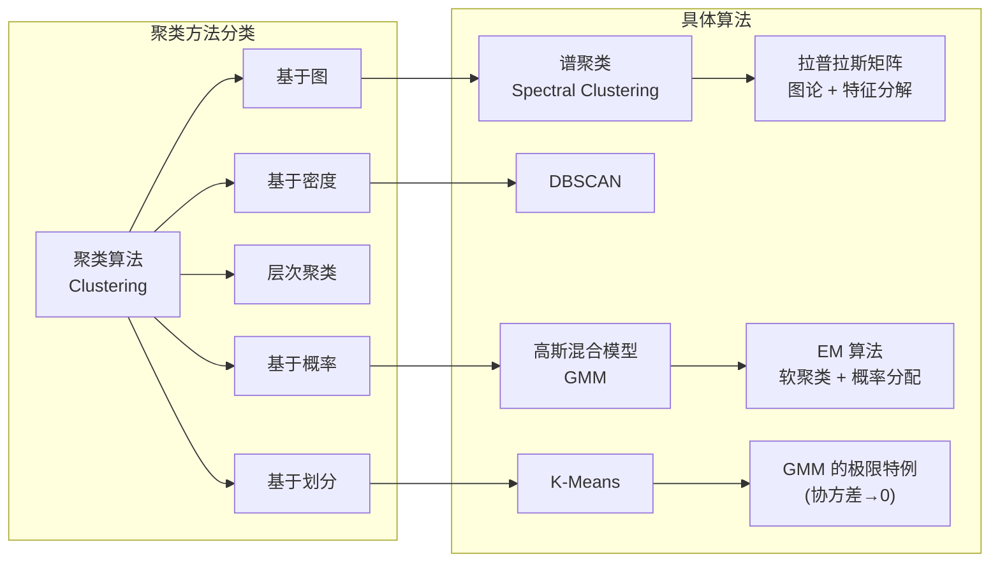
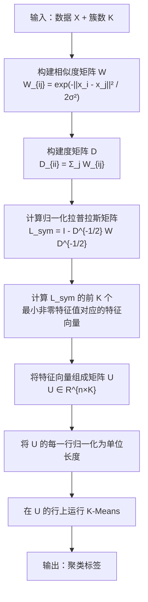
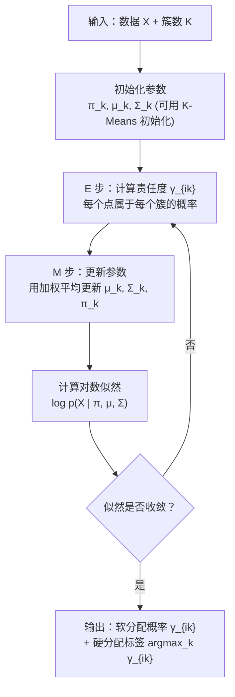
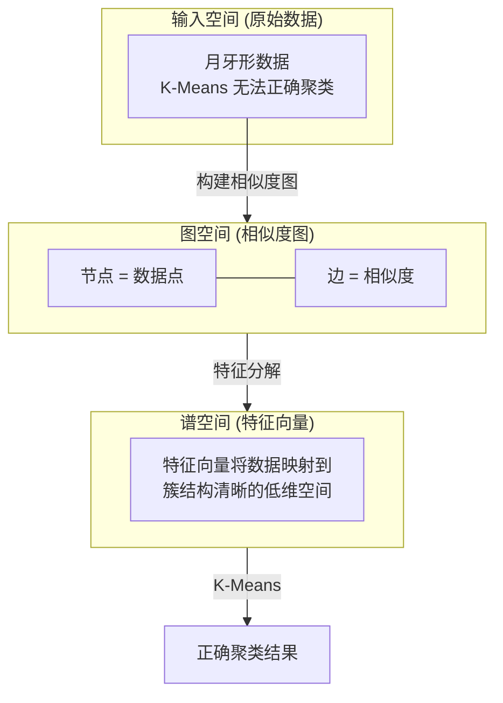
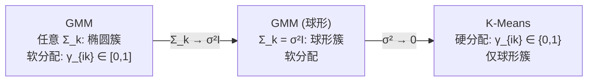

# Spectral Clustering (谱聚类) / GMM (高斯混合模型)

## 知识地图



## 前置知识

- **K-Means 聚类**：理解硬分配、Lloyd 算法、K-Means 的局限性（只能发现球形簇）
- **图论基础**：图的邻接矩阵、度矩阵、拉普拉斯矩阵的基本概念
- **线性代数**：特征值分解、特征向量的含义、相似度矩阵的构建
- **概率论**：高斯分布 (Gaussian Distribution)、贝叶斯定理、最大似然估计
- **EM 算法**：期望最大化算法的基本框架 (E 步 + M 步)

## 为什么会出现 (Why)

**谱聚类的动机**：K-Means 和 DBSCAN 各有局限——K-Means 只能发现凸的球形簇，DBSCAN 对密度参数极其敏感。当数据分布在一个非线性的流形上时（如两个缠绕的月牙形、同心圆），传统方法全部失效。谱聚类通过将数据点看作图的节点、相似度看作边的权重，利用图的拉普拉斯矩阵的特征向量将数据投影到"图谱空间"，在此空间中原本缠绕的簇变得线性可分。

**GMM 的动机**：K-Means 做"硬分配"——每个点硬性属于某一个簇。但现实数据中的簇往往是重叠的，边界上的点"既像 A 又像 B"。GMM 用概率分布建模每个簇，做"软分配"——告诉你这个点有 70% 概率属于簇 A、30% 属于簇 B，保留了不确定性信息。

## 解决什么问题 (Problem)

- **谱聚类**：发现任意形状的簇（非凸、嵌套、缠绕），基于图的全局连通性而非局部距离做聚类
- **GMM**：提供软聚类（概率分配），可拟合椭圆形的簇，并通过概率框架提供聚类结果的不确定性度量

## 核心思想 (Core Idea)

**谱聚类将聚类转化为图划分问题，利用拉普拉斯矩阵的特征向量将数据映射到低维流形空间再进行聚类；GMM 假设数据由多个高斯分布混合生成，通过 EM 算法迭代优化每个点的软分配概率。**

---

## 数学模型/公式

## 谱聚类 (Spectral Clustering)

### 算法步骤

1. **构建相似度矩阵** $\mathbf{W}$（常用 RBF 核）：

$$W_{ij} = \exp\left(-\frac{\|x_i - x_j\|^2}{2\sigma^2}\right)$$

**通俗解释：** 计算每对数据点之间的"亲密度"。距离越近，亲密度越高（接近 1）；距离越远，亲密度越低（接近 0）。$\sigma$ 控制"多近算近"——太大则认为所有点都很近，太小则只有几乎重合的点才近。

2. **构建度矩阵** $\mathbf{D}$（对角矩阵，$D_{ii} = \sum_j W_{ij}$）：

**通俗解释：** 每个节点的"度"是与它相连的所有边的权重之和。如果某个点通过高权重边连接了很多点，它的度就大。

3. **计算拉普拉斯矩阵**：

非归一化拉普拉斯矩阵：
$$\mathbf{L} = \mathbf{D} - \mathbf{W}$$

归一化拉普拉斯矩阵：
$$\mathbf{L}_{sym} = \mathbf{D}^{-1/2} \mathbf{L} \mathbf{D}^{-1/2} = \mathbf{I} - \mathbf{D}^{-1/2} \mathbf{W} \mathbf{D}^{-1/2}$$

**通俗解释：** 拉普拉斯矩阵是图的"差分算子"。它的特征向量中，最小非零特征值对应的向量（Fiedler 向量）天然地指示了图的最优二分——正值一侧是一类，负值一侧是另一类。这来源于图割理论：最小化 RatioCut 等价于寻找拉普拉斯矩阵的 Fiedler 向量。

4. 计算 $\mathbf{L}_{sym}$ 的前 $K$ 个最小非零特征值对应的特征向量，构成矩阵 $\mathbf{U} \in \mathbb{R}^{n \times K}$
5. 将 $\mathbf{U}$ 的行归一化后使用 K-Means

**通俗解释：** 第 4-5 步是将每个数据点从原始特征空间映射到"谱空间"（由拉普拉斯矩阵的特征向量张成），在这个新空间中，原本缠绕在一起的簇会神奇地分离开。然后只需在谱空间跑 K-Means 即可。

---

## 高斯混合模型 (GMM)

### 核心公式

假设数据由 $K$ 个高斯分布混合生成：

$$p(x) = \sum_{k=1}^{K} \pi_k \cdot \mathcal{N}(x \mid \mu_k, \Sigma_k)$$

其中 $\sum_k \pi_k = 1$，$\pi_k$ 是第 $k$ 个成分的权重。

**通俗解释：** 数据生成过程可以想象为：先以概率 $\pi_k$ 选择一个高斯分布（如掷一个 K 面的骰子），然后从这个选定的高斯分布中采样一个数据点。$\pi_k$ 表示第 k 个簇的"大小"或"重要程度"。

### EM 算法求解

GMM 使用 **EM 算法**（而非 K-Means 的硬分配）做**软聚类**：

**E 步**（计算责任度——每个点属于各簇的概率）：

$$\gamma_{ik} = \frac{\pi_k \cdot \mathcal{N}(x_i \mid \mu_k, \Sigma_k)}{\sum_{j=1}^{K} \pi_j \cdot \mathcal{N}(x_i \mid \mu_j, \Sigma_j)}$$

**通俗解释：** 对每个数据点，看看它在每个高斯分布下的"可能性"（概率密度）有多大，然后归一化为概率。如果点 $x_i$ 离簇 k 的中心很近，$\gamma_{ik}$ 就接近 1。

**M 步**（更新参数——用加权平均重新估计分布参数）：

$$\mu_k = \frac{\sum_i \gamma_{ik} x_i}{\sum_i \gamma_{ik}}$$

$$\Sigma_k = \frac{\sum_i \gamma_{ik} (x_i - \mu_k)(x_i - \mu_k)^T}{\sum_i \gamma_{ik}}$$

$$\pi_k = \frac{\sum_i \gamma_{ik}}{n}$$

**通俗解释：** M 步就是用 E 步算出的"软标签"$\gamma_{ik}$ 做加权平均来更新每个簇的中心、形状和权重。如果一个点有 70% 概率属于簇 A，那它对簇 A 的均值估计贡献 0.7 个"票数"，而不是完整的 1 票。

---

## 算法流程图

### 谱聚类流程



### GMM (EM 算法) 流程



---

## 可视化展示

### 谱聚类 vs 传统聚类

谱聚类可以发现**任意形状的簇**，因为它基于图连通性而非距离度量。关键是在正确的**流形**上进行聚类。



### K-Means 是 GMM 的特例

K-Means 是 GMM 当所有协方差矩阵为 $\epsilon\mathbf{I}$ 且 $\epsilon \to 0$ 时的极限情况。



---

## 最小可运行代码

### 谱聚类实现

```python
import numpy as np
from sklearn.cluster import KMeans


def spectral_clustering(X, n_clusters, sigma=1.0):
    """
    谱聚类实现（使用归一化拉普拉斯矩阵）。
    X: [n_samples, n_features]
    n_clusters: 簇数
    sigma: RBF 核的带宽参数
    """
    n = X.shape[0]

    # 1. 构建相似度矩阵 (RBF 核)
    sq_dists = np.sum(X ** 2, axis=1).reshape(-1, 1) + \
               np.sum(X ** 2, axis=1) - \
               2 * X @ X.T
    W = np.exp(-sq_dists / (2 * sigma ** 2))
    np.fill_diagonal(W, 0)  # 自己到自己的相似度设为 0

    # 2. 度矩阵
    D_diag = W.sum(axis=1)
    D_inv_sqrt = np.diag(1.0 / np.sqrt(D_diag + 1e-10))

    # 3. 归一化拉普拉斯矩阵 L_sym = I - D^{-1/2} W D^{-1/2}
    L_sym = np.eye(n) - D_inv_sqrt @ W @ D_inv_sqrt

    # 4. 特征分解: 取最小的 n_clusters 个特征值对应的特征向量
    eigvals, eigvecs = np.linalg.eigh(L_sym)
    U = eigvecs[:, :n_clusters]  # eigh 默认从小到大排列

    # 5. 行归一化
    U_norm = U / (np.linalg.norm(U, axis=1, keepdims=True) + 1e-10)

    # 6. K-Means 在谱空间聚类
    labels = KMeans(n_clusters=n_clusters, n_init=10).fit_predict(U_norm)
    return labels
```

### GMM 实现

```python
import numpy as np
from scipy.stats import multivariate_normal


class GMM:
    def __init__(self, n_components, max_iter=100, tol=1e-4):
        self.K = n_components
        self.max_iter = max_iter
        self.tol = tol

    def fit(self, X):
        n, d = X.shape

        # 用 K-Means 初始化
        from sklearn.cluster import KMeans
        km = KMeans(n_clusters=self.K, n_init=10).fit(X)
        self.pi = np.ones(self.K) / self.K
        self.mu = km.cluster_centers_
        self.sigma = np.array([np.cov(X[km.labels_ == k].T) + 1e-6 * np.eye(d)
                               for k in range(self.K)])

        log_likelihood_old = -np.inf
        self.gamma = np.zeros((n, self.K))

        for iteration in range(self.max_iter):
            # E 步: 计算责任度
            for k in range(self.K):
                self.gamma[:, k] = self.pi[k] * multivariate_normal.pdf(
                    X, mean=self.mu[k], cov=self.sigma[k]
                )
            self.gamma /= self.gamma.sum(axis=1, keepdims=True) + 1e-10

            # M 步: 更新参数
            N_k = self.gamma.sum(axis=0)
            self.pi = N_k / n
            self.mu = (self.gamma.T @ X) / N_k[:, np.newaxis]
            for k in range(self.K):
                diff = X - self.mu[k]
                self.sigma[k] = (self.gamma[:, k][:, np.newaxis] * diff).T @ diff / N_k[k]
                self.sigma[k] += 1e-6 * np.eye(d)  # 正则化保证可逆

            # 检查收敛
            log_likelihood = np.sum(np.log(
                np.sum([self.pi[k] * multivariate_normal.pdf(X, self.mu[k], self.sigma[k])
                        for k in range(self.K)], axis=0)
            ))
            if np.abs(log_likelihood - log_likelihood_old) < self.tol:
                break
            log_likelihood_old = log_likelihood

        return self

    def predict_proba(self, X):
        """返回软分配概率"""
        n = X.shape[0]
        gamma = np.zeros((n, self.K))
        for k in range(self.K):
            gamma[:, k] = self.pi[k] * multivariate_normal.pdf(
                X, mean=self.mu[k], cov=self.sigma[k]
            )
        gamma /= gamma.sum(axis=1, keepdims=True) + 1e-10
        return gamma

    def predict(self, X):
        """返回硬分配标签"""
        return np.argmax(self.predict_proba(X), axis=1)


# ===== 使用示例 =====
if __name__ == '__main__':
    from sklearn.datasets import make_moons, make_blobs

    # 谱聚类示例: 月牙形数据
    X_moons, _ = make_moons(n_samples=200, noise=0.08, random_state=42)
    labels_sc = spectral_clustering(X_moons, n_clusters=2, sigma=0.15)
    print(f'Spectral Clustering on moons: unique labels = {np.unique(labels_sc)}')

    # GMM 示例: 椭圆形簇
    X_blobs, _ = make_blobs(n_samples=300, centers=3, random_state=42)
    gmm = GMM(n_components=3)
    gmm.fit(X_blobs)
    labels_gmm = gmm.predict(X_blobs)
    print(f'GMM on blobs: unique labels = {np.unique(labels_gmm)}')
    proba = gmm.predict_proba(X_blobs)
    print(f'Soft assignment shape: {proba.shape}  (each row sums to 1)')
```

---

## 工业界应用

| 领域 | 谱聚类应用 | GMM 应用 |
| --- | --- | --- |
| **图像分割** | 基于像素相似度图将图像分割为语义区域 | 基于颜色的前景/背景分离 |
| **社交网络分析** | 社区发现——基于用户关系图发现社群 | 用户群体细分（软归属） |
| **语音/音频** | 说话人分割——将会议录音按说话人切分 | 说话人识别——GMM-UBM 是经典方法 |
| **生物信息学** | 基因表达数据的聚类（非球形簇） | 基因表达的软聚类（基因可能参与多个通路） |
| **异常检测** | 发现图结构中的异常节点 | 基于 GMM 的对数似然阈值检测异常点 |
| **推荐系统** | 基于用户-物品交互图的协同聚类 | 用户兴趣分布的建模 |

---

## 对比表格

### 谱聚类 vs GMM vs K-Means vs DBSCAN

| 维度 | 谱聚类 | GMM | K-Means | DBSCAN |
| --- | --- | --- | --- | --- |
| **簇形状** | 任意形状 | 椭圆形 | 球形 | 任意形状 |
| **分配方式** | 硬（但基于谱空间的全局信息） | 软（概率分配） | 硬（0/1 分配） | 硬（核心/边界/噪声） |
| **参数** | K（簇数）+ σ（带宽） | K + 协方差类型 | K | eps + min_samples |
| **计算复杂度** | $O(n^3)$（特征分解） | $O(n \cdot K \cdot d^2 \cdot iter)$ | $O(n \cdot K \cdot d \cdot iter)$ | $O(n \log n)$（有索引时） |
| **大规模适用性** | 差（需完整相似度矩阵） | 中（可用 Mini-Batch EM） | 好 | 好 |
| **局外点/噪声处理** | 较敏感 | 敏感（会影响协方差估计） | 敏感 | 天然有噪声类别 |
| **理论基础** | 图割理论 + 谱图理论 | 概率模型 + EM 算法 | 距离最小化 | 密度连通性 |
| **不确定性量化** | 无 | 有（后验概率） | 无 | 无 |

---

## 学完后建议继续学习

1. **GMM 的变种**：贝叶斯高斯混合模型 (Bayesian GMM)——使用 Dirichlet 过程自动确定簇数 K
2. **大规模谱聚类**：Nystrom 近似、Landmark-based Spectral Clustering——避免 $O(n^3)$ 的计算瓶颈
3. **图神经网络 (GNN)**：将谱图理论推广到深度学习，适用于图结构数据的表示学习
4. **变分推断**：GMM 的贝叶斯处理方法，用变分推断替代 EM 算法
5. **流形学习**：ISOMAP、LLE、Laplacian Eigenmaps——与谱聚类共享相似的数学基础

---

## 高频面试题

### Q1: 谱聚类为什么能发现任意形状的簇，而 K-Means 不能？

**标准答案：** K-Means 在原始特征空间直接计算欧氏距离并最小化簇内平方和，这隐含假设簇是凸的（更确切地说是 Voronoi 划分，簇边界为线性超平面）。谱聚类不直接在原始空间聚类，而是通过相似度图将数据映射到图谱空间。在这个谱空间中，数据点的坐标由拉普拉斯矩阵的特征向量决定，这些特征向量编码了图的全局连接结构——无论原始空间中簇是什么形状，只要簇内连接紧密、簇间连接稀疏，谱嵌入就能将它们分开。本质上，谱聚类是对数据所在的流形进行聚类，而非对数据在欧氏空间中的坐标进行聚类。

### Q2: GMM 的 EM 算法和 K-Means 的 Lloyd 算法有什么联系？

**标准答案：** K-Means 可以看作 GMM 的 EM 算法在特定条件下的极限情形。具体来说，当 GMM 中所有成分的协方差矩阵设为 $\epsilon \mathbf{I}$（各向同性的球形高斯），且 $\epsilon \to 0$ 时：(1) E 步中 $\gamma_{ik}$ 会退化为独热编码（最靠近中心的簇得到概率 1，其余为 0）；(2) M 步中均值的更新退化为对硬分配点的简单平均。这就变成了 K-Means 的迭代步骤。此外，两者都保证目标函数单调下降（K-Means: SSE，GMM: 对数似然），且都对初始化敏感。

### Q3: 谱聚类中 $\sigma$（RBF 核带宽）如何选择？选得不好会有什么后果？

**标准答案：** $\sigma$ 控制相似度矩阵的局部范围。选择方法：(1) 经验法则——设为数据点间距离的中位数或平均值；(2) 局部缩放 (Self-tuning)——每个点有自适应的 $\sigma_i = \text{distance to k-th nearest neighbor}$，然后 $W_{ij} = \exp(-\|x_i-x_j\|^2 / (2\sigma_i \sigma_j))$；(3) 网格搜索——在多个 $\sigma$ 上聚类，选使簇内紧密度最好的。$\sigma$ 太小：相似度矩阵几乎是对角矩阵，图变成孤立的散点，无法形成有意义的簇。$\sigma$ 太大：相似度矩阵接近全 1 矩阵，图退化为全连接图，所有点在一个簇里。

### Q4: GMM 如何选择最优的 K（成分数）？

**标准答案：** 常用方法：(1) BIC (Bayesian Information Criterion) = $-2\log L + K_{params}\log n$——既考虑拟合度又惩罚参数数，BIC 最小者为优；(2) AIC (Akaike Information Criterion) = $-2\log L + 2K_{params}$——与 BIC 类似但惩罚更轻；(3) 交叉验证——在留出数据上评估对数似然；(4) Elbow Method——画出 K 与对数似然的关系图，找"肘部"拐点；(5) 业务先验知识——如果数据来自已知的类别数。实践中 BIC 最为常用，因为它有理论上的模型选择一致性。

### Q5: 谱聚类的时间复杂度是 $O(n^3)$，如何在大规模数据上使用？

**标准答案：** 瓶颈在于计算完整 $n \times n$ 相似度矩阵的特征分解。加速方法：(1) Nystrom 近似——随机采样 $m \ll n$ 个地标点，只计算 $n \times m$ 的相似度子矩阵，将特征分解缩小到 $m \times m$；(2) 稀疏化相似度矩阵——只保留每个点的 k 近邻，使用稀疏矩阵的特征求解器（如 ARPACK），复杂度可降至 $O(n \cdot k^2)$ 量级；(3) Landmark-based Spectral Clustering (LSC)——选 p 个代表性点作为地标，复杂度 $O(np^2 + p^3)$。当 n 极大（百万级）时，可考虑使用基于深度学习的方法（如谱网络）来近似谱聚类。
