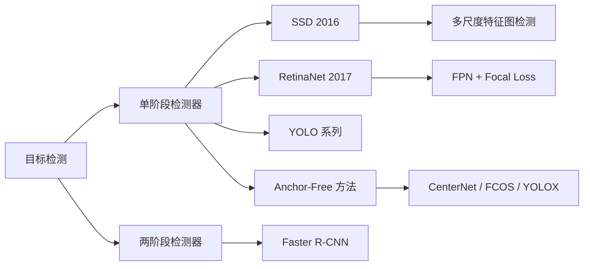
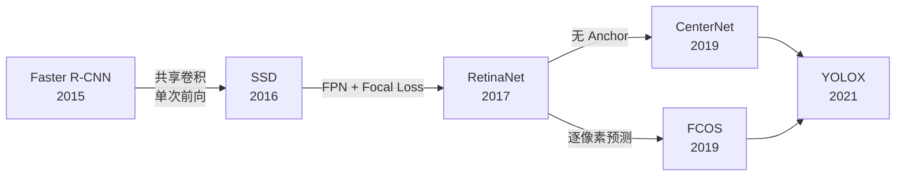
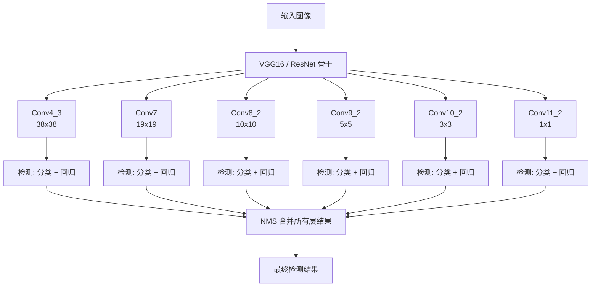
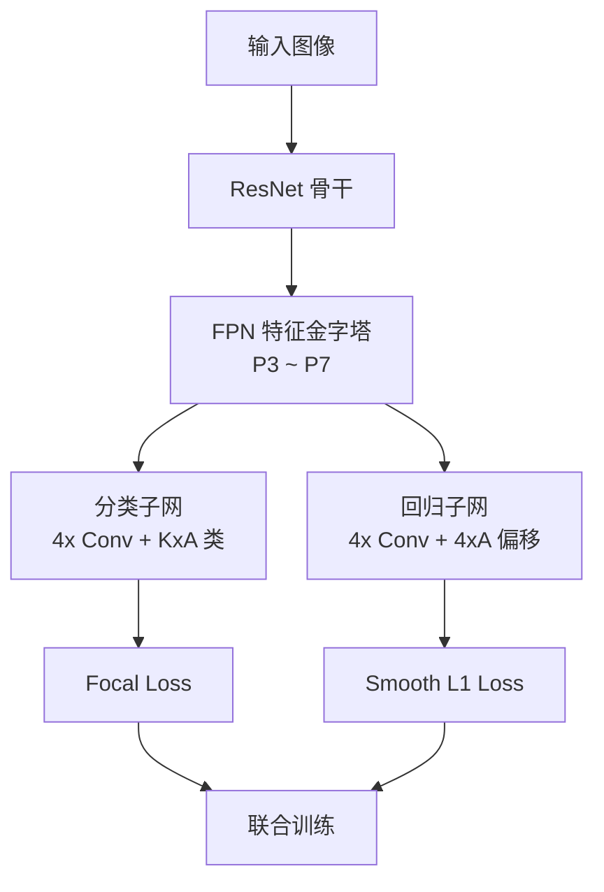
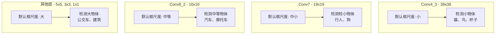

# SSD / RetinaNet

## 知识地图



## 前置知识

- 目标检测基础：边界框、IoU、NMS、mAP
- Faster R-CNN 的 Anchor 机制和 RPN
- 交叉熵损失和类别不平衡问题
- 特征金字塔 FPN 的基本概念
- 单阶段 vs 两阶段检测器的区别

## 模型演化路线



| 模型 | 年份 | 关键创新 |
|------|------|----------|
| SSD | 2016 | 多尺度特征图检测，默认框机制，单阶段高效 |
| RetinaNet | 2017 | Focal Loss 解决类别不平衡，FPN 多尺度特征 |
| CenterNet | 2019 | Anchor-Free，将检测转化为关键点估计 |
| FCOS | 2019 | Anchor-Free，逐像素预测，引入 Centerness |

## 为什么会出现 (Why)

在 Faster R-CNN 取得成功后，目标检测面临一个核心矛盾：**精度 vs 速度**。

- **Faster R-CNN** 精度高但速度不够快（~5-15 FPS），不适合实时场景
- **YOLOv1** 速度快但精度不够，尤其对小物体和密集物体表现差

SSD 的动机是：**能不能在单阶段框架下，通过多尺度设计，既保持速度优势又提升精度？** RetinaNet 进一步追问：**单阶段检测器精度不如两阶段的根本原因是什么？** ——答案是极端的正负样本类别不平衡。

## 解决什么问题 (Problem)

1. **SSD**：如何在一次前向传播中同时处理不同大小的物体？
2. **RetinaNet**：如何解决单阶段检测器中正负样本极度不平衡的问题（99.9% 的候选区域是背景）？

## 核心思想 (Core Idea)

**SSD 在不同分辨率的特征图上分别做密集预测，高分辨率图检测小物体，低分辨率图检测大物体；RetinaNet 用 Focal Loss 大幅抑制简单负样本的损失贡献，让模型专注学习困难样本。**

---

## SSD (Single Shot MultiBox Detector)

### 核心思想

在多个不同分辨率的特征图上同时做检测，高分辨率图检测小物体，低分辨率图检测大物体。

### 默认框 (Default Boxes)

每个特征图位置预设不同尺度和长宽比的默认框：

$$s_k = s_{min} + \frac{s_{max} - s_{min}}{m - 1}(k - 1), \quad k \in [1, m]$$

**通俗解释：** 不同层分配不同尺度的默认框。浅层特征图分辨率高（细节丰富），负责小尺度框检测小物体；深层特征图分辨率低（语义强），负责大尺度框检测大物体。尺度的计算公式是线性插值，从 smin 到 smax 均匀分布在各个特征层之间。

### 损失函数

$$L = \frac{1}{N}(L_{conf} + \alpha L_{loc})$$

- $L_{conf}$：交叉熵（正负样本 1:3 难负样本挖掘）
- $L_{loc}$：Smooth L1

**通俗解释：** 损失 = 分类损失 + 回归损失。关键技巧是"难负样本挖掘"——不是所有负样本都参与计算，而是只挑置信度最高的那部分（最难分类正确的），保持正负比例 1:3。这防止了海量简单负样本（如天空、墙面）淹没训练信号。

---

## RetinaNet

### 核心创新：Focal Loss

解决单阶段检测器的核心问题——**极端的前景-背景类别不平衡**。

$$\text{FL}(p_t) = -\alpha_t (1 - p_t)^\gamma \log(p_t)$$

- $\gamma = 2, \alpha = 0.25$ 是最佳参数
- 简单负样本（$p_t$ 接近 1）的损失被大幅缩减
- 困难样本保持较高损失

**通俗解释：** 标准交叉熵对所有样本一视同仁——但 99% 的候选框是背景，这些"简单样本"的损失加起来会淹没"困难样本"（真正需要学习的）的梯度。Focal Loss 加了一个惩罚因子 $(1-p_t)^\gamma$：如果模型已经很有把握了（$p_t$ 接近 1），就大幅缩减它的损失权重；如果模型不确定（$p_t$ 接近 0.5），说明是困难样本，保留高权重。这样模型不再被简单背景淹没，专注于难例学习。$\gamma=2$ 时，置信度 0.9 的简单样本损失被缩小 100 倍！

### 架构

```
ResNet + FPN → 两个子网络:
  ├─ 分类子网络 (4 × Conv + 输出 K×A 个类别)
  └─ 回归子网络 (4 × Conv + 输出 4×A 个偏移)
```

两个子网络**不共享参数**（与 SSD 不同）。

**通俗解释：** 两个子网络各自独立训练。分类头只关心"这是什么"，回归头只关心"框在哪"。参数不共享是因为两类任务需要的特征类型不同——分类需要语义不变性（不管物体在什么位置，都能认出它），回归需要位置敏感性（精确感知物体边界）。

---

## 数学模型/公式

### Focal Loss 的详细推导

标准交叉熵：$\text{CE}(p, y) = -\log(p_t)$，其中 $p_t = p$（正样本）或 $p_t = 1-p$（负样本）。

Focal Loss 添加了两个调节因子：

$$\text{FL}(p_t) = -\alpha_t (1 - p_t)^\gamma \log(p_t)$$

- $\alpha_t$：类别权重（正样本用 $\alpha$，负样本用 $1-\alpha$），调节正负样本的权重
- $(1-p_t)^\gamma$：调制因子，降低简单样本的损失贡献

**通俗解释（各参数作用）：**
- 当 $\gamma=0$ 时，FL 退化为带权重的交叉熵
- $\gamma$ 越大，对简单样本的抑制越强
- $\alpha$ 用于平衡正负样本的整体比例
- 一个正确分类概率为 0.9 的负样本在 $\gamma=2$ 时损失缩小到原来的 1/100

### SSD 的默认框尺度计算

$$s_k = s_{min} + \frac{s_{max} - s_{min}}{m - 1}(k - 1), \quad k \in [1, m]$$

**通俗解释：** 假设有 m=6 个特征层，smin=0.2，smax=0.9。那么第 1 层用 0.2 的尺度（小框），第 6 层用 0.9 的尺度（大框），中间各层线性插值。每个层还搭配多个长宽比（1:1, 1:2, 2:1, 1:3, 3:1），使得模型能覆盖各种形状的物体。

---

## 模型结构图



### RetinaNet 架构



## 可视化展示

### SSD 多尺度检测示意



### Focal Loss 效果对比

| $p_t$ (模型置信度) | CE Loss | FL ($\gamma=2$) | 损失缩小倍数 |
|:---:|:---:|:---:|:---:|
| 0.99 (极简单) | 0.01 | 0.000001 | 10,000x |
| 0.9 (简单) | 0.105 | 0.00105 | 100x |
| 0.5 (困难) | 0.693 | 0.173 | 4x |
| 0.1 (极困难) | 2.3 | 1.86 | 1.2x |

## 最小可运行代码

```python
import torch
import torchvision.models.detection as detection

# SSD
model_ssd = detection.ssd300_vgg16(pretrained=True)
model_ssd.eval()

# RetinaNet
model_retina = detection.retinanet_resnet50_fpn(pretrained=True)
model_retina.eval()

predictions = model_retina(images)
```

## 工业界应用

| 应用场景 | 推荐方案 | 原因 |
|----------|----------|------|
| 移动端实时检测 | SSD (MobileNet) | 轻量，低延迟，适合移动设备 |
| 自动驾驶感知 | RetinaNet (ResNet-101) | 高精度，小物体检测好，Focal Loss 应对密集场景 |
| 视频监控 (高吞吐) | SSD (VGG16) | 单次前向速度快，适合多路视频 |
| 无人机检测 | SSD-MobileNet | 边缘设备算力有限 |
| 卫星图像分析 | RetinaNet | 小目标密集，Focal Loss 优势明显 |

## 对比表格

| 维度 | SSD | RetinaNet | Faster R-CNN | YOLOv3 |
|------|-----|-----------|-------------|--------|
| 检测阶段 | 单阶段 | 单阶段 | 两阶段 | 单阶段 |
| 特征利用 | 多尺度特征图 | FPN 特征金字塔 | FPN + RPN | FPN |
| 类别平衡 | 难负样本挖掘 | Focal Loss | RPN 二分类筛选 | 多尺度 Anchor |
| 速度 (FPS) | 20-60 | 5-15 | 5-15 | 30-60 |
| COCO AP | 25-31% | 34-40% | 37-42% | 28-33% |
| 小物体 | 中等 | 好 | 好 | 较好 |
| 训练难度 | 中 | 中 | 中 | 易 |

## 学完后建议继续学习

1. **Anchor-Free 方法 (CenterNet, FCOS)**：理解如何摆脱 Anchor 的束缚，进一步简化检测流程
2. **YOLOv8 及更新版本**：了解 YOLO 家族如何吸收 Focal Loss 和 Anchor-Free 的思想
3. **Transformer 检测器 (DETR, DINO)**：端到端目标检测的新范式
4. **EfficientDet**：结合 EfficientNet 和 BiFPN 的高效检测器
5. **损失函数专题**：深入学习各种检测损失函数（GIoU, DIoU, CIoU, Varifocal Loss 等）

## 高频面试题

### Q1: SSD 为什么能比 Faster R-CNN 快？它牺牲了什么？

**答：**
- **为什么快**：SSD 省去了 RPN 阶段，直接从骨干网络的多个特征层预测检测结果，全程单次前向传播。Faster R-CNN 需要先跑 RPN 生成 proposals，再对每个 proposal 做 RoI Pooling 和分类回归——多了一次"重采样"过程。
- **牺牲了什么**：
  1. 精度略低：没有 RoI 级别的精细特征提取，直接用特征图上的点预测
  2. 小物体检测弱：最浅层的特征图（38x38）虽然有高分辨率，但语义信息不足
  3. 默认框设计需要手动调优：SSD 的尺度范围、长宽比等超参数对不同数据集敏感

### Q2: Focal Loss 为什么能解决类别不平衡？它的数学原理是什么？

**答：**
- **问题根因**：单阶段检测器在特征图的每个位置密集采样（例如 SSD 产生 8732 个默认框），其中绝大多数是背景（负样本）。标准交叉熵对所有样本一视同仁，大量简单负样本的损失之和淹没了少数正样本和困难样本的梯度。
- **Focal Loss 的原理**：
  1. 添加调制因子 $(1-p_t)^\gamma$：简单样本 $p_t$ 接近 1，$(1-p_t)^\gamma$ 接近 0，损失被大幅抑制；困难样本 $p_t$ 较小，$(1-p_t)^\gamma$ 保持较大值。
  2. 添加平衡因子 $\alpha_t$：进一步调节正负样本的整体比例。
  3. 最终效果：模型不再被海量简单背景淹没，梯度集中在困难样本上，等价于自动化的"难负样本挖掘"。

### Q3: SSD 和 RetinaNet 的核心区别是什么？

**答：**
1. **骨干网络**：SSD 用 VGG16（无 FPN），RetinaNet 用 ResNet + FPN。
2. **特征利用**：SSD 在不同层独立预测，层间无信息交互；RetinaNet 用 FPN 自顶向下融合多尺度信息。
3. **类别不平衡处理**：SSD 用难负样本挖掘（硬挑 1:3）；RetinaNet 用 Focal Loss（软加权）。
4. **检测头设计**：SSD 的分类和回归共享部分卷积；RetinaNet 的两个子网络完全不共享参数。
5. **精度表现**：RetinaNet 的 COCO AP 比 SSD 高 5-10 个百分点，但速度更慢。

### Q4: RetinaNet 的两个子网络为什么不共享参数？

**答：** 分类和回归对特征的需求不同：
- **分类**需要平移不变性——物体在图像的什么位置，类别都一样。
- **回归**需要平移协变性——物体移动时，边界框坐标也要相应移动。

共享卷积层会迫使特征同时满足这两个矛盾的需求，导致性能下降。实验表明，不共享参数比共享参数提升约 1-2 个 AP 点。

### Q5: SSD 的难负样本挖掘 (Hard Negative Mining) 是如何工作的？

**答：**
1. 对所有负样本（背景）的置信度损失排序
2. 选择损失最大（即模型最容易分错的）的负样本
3. 保持正负样本比例为 1:3
4. 只对选中的负样本计算损失并回传梯度

这种方法让模型专注于最困难的负样本（如看起来像物体的背景纹理），而不是简单负样本（如纯色天空）。缺点是需要额外的排序和筛选步骤，不如 Focal Loss 优雅（Focal Loss 通过软加权自动实现类似效果）。
