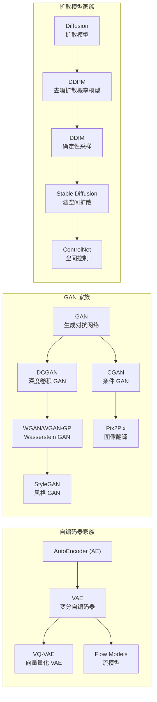
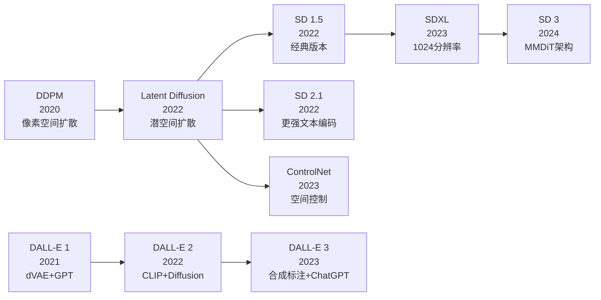
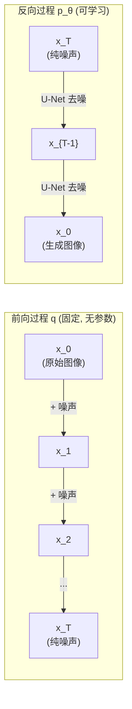
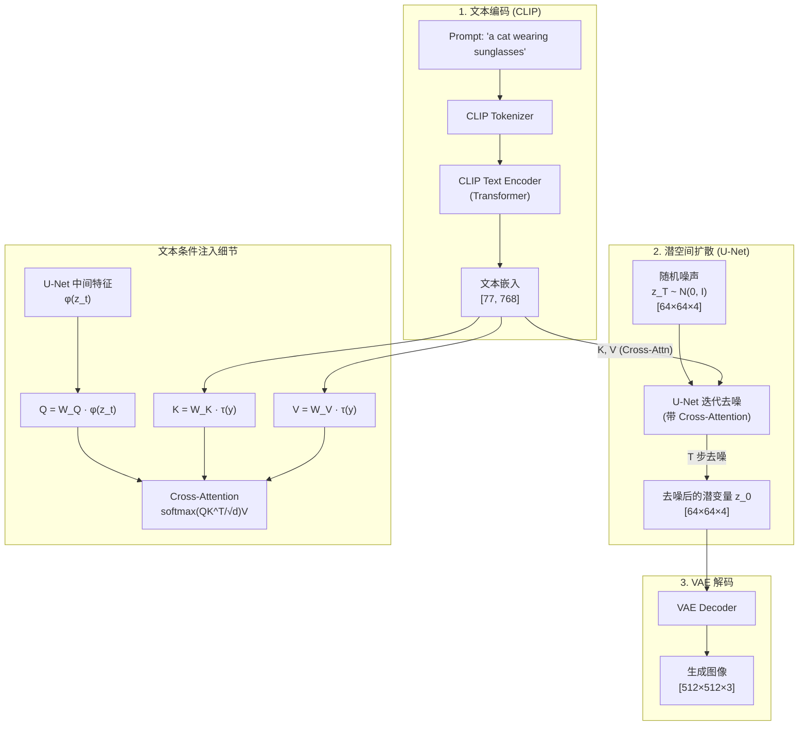
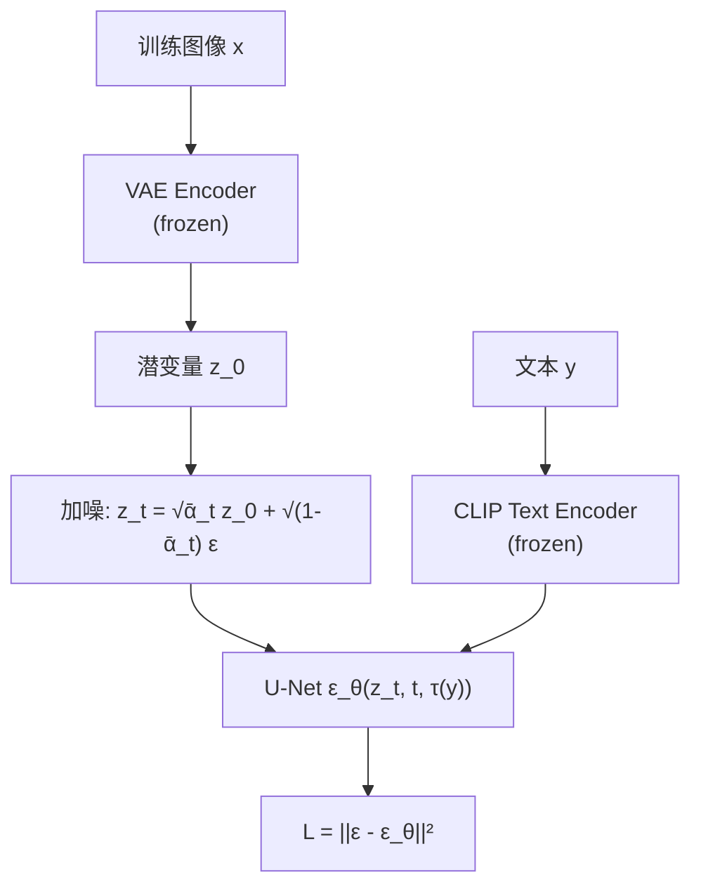

# Stable Diffusion / DALL-E / Midjourney

## 知识地图



## 前置知识

- **扩散模型 (DDPM / DDIM)**：前向加噪 + 反向去噪的基本流程；$L_{\text{simple}} = \|\epsilon - \epsilon_\theta(x_t, t)\|^2$。
- **VAE (变分自编码器)**：编码器将图像压缩为隐变量，解码器从隐变量重建图像。
- **U-Net**：去噪网络的核心架构，跳跃连接保留细节信息。
- **Cross-Attention**：Query 来自 U-Net 特征，Key/Value 来自文本编码器，实现文本条件注入。
- **CLIP**：对比学习训练的图文对齐模型，理解文本和图像的语义对应关系。
- **Classifier-Free Guidance (CFG)**：无需额外分类器即可用文本引导生成方向。

## 模型演化路线



| Model | Year | Key Innovation | Solved Problem |
|-------|------|----------------|----------------|
| DDPM | 2020 | 像素空间扩散-去噪 | 高质量生成新范式 |
| Latent Diffusion (SD) | 2022 | VAE 潜空间扩散 | 高分辨率生成计算量过大 |
| SD 1.5 | 2022 | 社区生态 + LoRA | 实用部署 |
| SDXL | 2023 | 更大 U-Net + 双文本编码器 | 1024 分辨率生成 |
| SD 3 | 2024 | MMDiT 多模态扩散 Transformer | 统一图文理解与生成 |
| DALL-E 2 | 2022 | CLIP + unCLIP | 文生图质量飞跃 |
| DALL-E 3 | 2023 | 合成标注数据 + ChatGPT 优化 prompt | 指令遵循 |

## 为什么会出现 (Why)

DDPM 虽然生成质量高，但有一个致命瓶颈：扩散过程在**像素空间**进行。一张 512x512 的 RGB 图像有 $512 \times 512 \times 3 \approx 786,432$ 个维度。在如此高维空间做 1000 步迭代去噪，计算量极大、显存消耗极高——单张图像生成可能需要几十秒甚至几分钟。

**Stable Diffusion 的核心洞察**：图像像素的绝大部分信息是冗余的（相邻像素高度相关，高频细节非感知关键）。如果先在 VAE 的压缩隐空间（如 64x64x4，约 48 倍压缩）进行扩散，再通过 VAE 解码器重建到原分辨率，计算量可以降低几十倍。

DALL-E 2 走的是另一条路：用 CLIP 学到的图文联合空间作为生成桥梁，而非直接在潜空间中扩散。

## 解决什么问题 (Problem)

| 技术 | 解决的核心问题 |
|------|-------------|
| Stable Diffusion (LDM) | 像素空间扩散计算量太大——将扩散转移到 VAE 潜空间 |
| CFG (Classifier-Free Guidance) | 如何用文本精确控制生成方向——外推条件/无条件预测 |
| DALL-E 2 (unCLIP) | 文本到图像的直接映射——通过 CLIP 嵌入空间桥接 |
| DALL-E 3 | 复杂指令遵循失败——用合成标注 + LLM 改写 prompt |

## 核心思想 (Core Idea)

**将扩散过程从高维像素空间搬到 VAE 压缩的低维潜空间，用 Cross-Attention 将文本条件注入 U-Net 的每一层，实现文到图的高效生成。**

---

## 扩散模型基础: DDPM 前向/反向过程

扩散模型的核心思想来自非平衡热力学: **前向过程**逐步向数据添加高斯噪声, 直至完全破坏信息; **反向过程**学习从噪声中逐步恢复原始数据。



### 前向过程 (Forward Process)

给定真实数据分布 $x_0 \sim q(x)$, 前向过程是一个固定的马尔可夫链, 逐步添加高斯噪声:

$$q(x_t | x_{t-1}) = \mathcal{N}(x_t; \sqrt{1 - \beta_t}x_{t-1}, \beta_t \mathbf{I})$$

其中 $\beta_t \in (0, 1)$ 是噪声调度参数, 随时间步 $t$ 递增。

**通俗解释:** 前向过程就像给一张照片反复"打码"。每一步把上一帧的图像按比例缩小一点, 再加入一些随机噪声。$\beta_t$ 控制每步噪声的量——T 越大噪声越多, 到最后 $x_T$ 完全变成高斯噪声。这个过程是预先定义好的, 不需要学习。

### 反向过程 (Reverse Process)

反向过程学习从噪声恢复数据:

$$p_\theta(x_{t-1} | x_t) = \mathcal{N}(x_{t-1}; \mu_\theta(x_t, t), \Sigma_\theta(x_t, t))$$

**通俗解释:** 反向过程像"修复老照片"——给定一张全是噪点的模糊图片($x_T$), 模型要猜测上一帧稍微清晰一点的图片($x_{T-1}$)长什么样。反复这个过程 T 次, 最终得到清晰的图像 $x_0$。U-Net 就是那个会"猜测去噪方向"的神经网络, 它输出均值 $\mu_\theta$ 和方差 $\Sigma_\theta$。

### 简化训练目标: $L_{simple}$

DDPM 的简化训练损失:

$$L_{simple} = \mathbb{E}_{x_0, \epsilon, t} \left[ \|\epsilon - \epsilon_\theta(x_t, t)\|^2 \right]$$

**通俗解释:** 与其让模型学习均值和方差, 不如直接让它**预测每一步添加的噪声**。这个设计是 DDPM 成功的关键——预测"噪声是什么样子"比预测"去噪后图像是什么样子"要容易得多。U-Net 输入是加了噪声的图像 $x_t$ 和时间步 $t$, 输出是对噪声的估计 $\epsilon_\theta$, 目标是让它尽可能接近真实的噪声 $\epsilon$。

---

## Latent Diffusion Model (Stable Diffusion)

### 三个核心组件

#### 1. VAE (变分自编码器)

- **编码器**：将 512x512x3 图像压缩到 64x64x4 隐变量（~48x 压缩）
- **解码器**：从隐变量重建图像

#### 2. U-Net (去噪网络)

在隐空间中去噪，每个分辨率层通过 Cross-Attention 注入文本条件：

$$\text{Attention}(Q, K, V) = \text{softmax}\left(\frac{QK^T}{\sqrt{d}}\right)V$$

其中 $Q$ 来自 U-Net 特征，$K$ 和 $V$ 来自文本编码器。

#### 3. CLIP Text Encoder

将文本 prompt 编码为语义向量。

---

## 数学模型/公式

### 潜空间扩散训练目标

SD 的训练损失与 DDPM 相同，但在 VAE 的潜空间 $z$ 中：

$$\mathcal{L}_{\text{LDM}} = \mathbb{E}_{\mathcal{E}(x), \epsilon \sim \mathcal{N}(0,1), t}\left[ \|\epsilon - \epsilon_\theta(z_t, t, \tau_\theta(y))\|^2 \right]$$

**通俗解释：** 和 DDPM 的 $L_{\text{simple}}$ 几乎一样——随机抽一个时间步 $t$，给潜变量 $z_0$ 加噪声得到 $z_t$，让 U-Net 预测噪声。唯一的区别：(1) 一切操作都在 VAE 压缩后的潜空间中（省几十倍计算）；(2) 额外的 $\tau_\theta(y)$ 是文本编码——告诉 U-Net "这张图对应什么文字"，通过 Cross-Attention 注入。

其中 $z_t$ 是加噪后的潜变量，$\tau_\theta(y)$ 是文本编码器输出的文本嵌入。

### Classifier-Free Guidance (CFG)

$$\hat{\epsilon}_\theta(x_t, c) = \epsilon_\theta(x_t, \varnothing) + w \cdot (\epsilon_\theta(x_t, c) - \epsilon_\theta(x_t, \varnothing))$$

**通俗解释：** 训练时随机把 10-20% 的文本条件替换为空文本（让 U-Net 学会无条件生成）。推理时，同时用有条件和无条件做两次预测，取它们的加权组合。参数 $w$（guidance scale）控制"跟着 prompt 走"的程度：
- $w=1$：标准条件生成
- $w > 1$：增强文本遵循（通常 $w=7.5$）——模型朝"有条件预测"的方向外推
- $w$ 过大：图像过饱和、不自然——因为过度偏离无条件分布

### Cross-Attention 文本注入

$$\text{Attention}(Q, K, V) = \text{softmax}\left(\frac{QK^T}{\sqrt{d}}\right)V$$

$$Q = W_Q \cdot \phi_i(z_t), \quad K = W_K \cdot \tau_\theta(y), \quad V = W_V \cdot \tau_\theta(y)$$

**通俗解释：** U-Net 的每一层都会问一个问题 $Q$（"我这一层的特征是什么？"），然后去文本编码中找相关的 Key（"文本中哪部分描述和我相关？"），最后把相关文本的 Value 加权求和注入到特征中。这样文本信息就渗透到了 U-Net 的每个分辨率层——低层控制整体构图，高层控制纹理细节。

---

## 模型结构图

### Stable Diffusion 完整推理管道



### SD 训练流程



---

## 可视化展示

### SD 潜空间压缩率

```echarts
return {
  tooltip: { trigger: "axis", confine: true },
  title: { top: 5,  text: 'Stable Diffusion 潜空间压缩效率', left: 'center', textStyle: { fontSize: 12 } },
  xAxis: { type: 'category', data: ['原始像素空间', 'VAE 潜空间'] },
  yAxis: { type: 'value', name: '维度总数' },
  series: [{
    type: 'bar',
    data: [786432, 16384],
    itemStyle: { color: '#2980b9' },
    label: { show: true, position: 'top', formatter: '{c}' }
  }],
  grid: { left: 60, right: 20, top: 55, bottom: 55 }
}
```

VAE 将 512x512x3 (786,432 维) 压缩到 64x64x4 (16,384 维)，约 48 倍压缩。

### CFG Scale 对生成的影响

```echarts
return {
  tooltip: { trigger: "axis", confine: true },
  title: { top: 5,  text: 'CFG Scale w 对生成的影响', left: 'center', textStyle: { fontSize: 12 } },
  xAxis: { type: 'category', data: ['w=1', 'w=3', 'w=5', 'w=7.5', 'w=10', 'w=15', 'w=20'] },
  yAxis: [
    { type: 'value', name: '文本一致性', min: 0, max: 1 },
    { type: 'value', name: 'FID', min: 0 }
  ],
  legend: { top: 28,  data: ['文本一致性 (CLIP Score)', '图像自然度 (FID 越低越好)'] },
  grid: { left: 60, right: 60, top: 55, bottom: 55 },
  series: [
    { name: '文本一致性 (CLIP Score)', type: 'line', yAxisIndex: 0, data: [0.15, 0.25, 0.28, 0.32, 0.33, 0.34, 0.34], smooth: true, itemStyle: { color: '#2980b9' } },
    { name: '图像自然度 (FID 越低越好)', type: 'line', yAxisIndex: 1, data: [5, 5.5, 6, 7, 9, 14, 22], smooth: true, itemStyle: { color: '#e74c3c' } }
  ]
}
```

$w=7.5$ 是文本一致性与图像自然度的最佳平衡点。

---

## SD 版本演进

| 版本 | 分辨率 | 关键改进 |
|------|--------|----------|
| SD 1.5 | 512x512 | 经典版本，社区生态最丰富（LoRA/ControlNet 支持最全） |
| SD 2.1 | 768x768 | 更强文本编码器，去除 NSFW 数据 |
| SDXL | 1024x1024 | 更大的 U-Net + 双文本编码器（CLIP + OpenCLIP） |
| SD 3 | 1024+ | MMDiT 架构，多模态扩散 Transformer，统一图文理解与生成 |

---

## 最小可运行代码

### Stable Diffusion 推理 (Diffusers)

```python
import torch
from diffusers import StableDiffusionPipeline

# 加载预训练模型
pipe = StableDiffusionPipeline.from_pretrained(
    "runwayml/stable-diffusion-v1-5",
    torch_dtype=torch.float16
)
pipe = pipe.to("cuda")

# 生成图像
prompt = "a cat wearing sunglasses, digital art, trending on artstation"
image = pipe(
    prompt,
    num_inference_steps=50,          # DDIM 采样步数
    guidance_scale=7.5,              # CFG scale
    height=512,
    width=512,
).images[0]

image.save("cat_sunglasses.png")
```

### CFG 推理的核心实现 (PyTorch)

```python
def classifier_free_guidance(unet, z_t, t, text_embeds, uncond_embeds, guidance_scale=7.5):
    """
    CFG 推理的核心逻辑
    z_t: 带噪潜变量 [B, 4, 64, 64]
    t: 时间步
    text_embeds: 文本嵌入 [B, 77, 768]
    uncond_embeds: 空文本嵌入 [B, 77, 768]
    """
    # 拼接条件和无条件嵌入 → 一次性批量推理
    embeds = torch.cat([uncond_embeds, text_embeds], dim=0)
    z_t_double = torch.cat([z_t, z_t], dim=0)
    t_double = torch.cat([t, t], dim=0)

    # U-Net 一次前向，同时得到条件和无条件预测
    noise_pred = unet(z_t_double, t_double, encoder_hidden_states=embeds)
    noise_pred_uncond, noise_pred_cond = noise_pred.chunk(2, dim=0)

    # CFG 公式: ε̂ = ε_uncond + w · (ε_cond - ε_uncond)
    return noise_pred_uncond + guidance_scale * (noise_pred_cond - noise_pred_uncond)
```

### U-Net Cross-Attention 注入 (简化实现)

```python
import torch
import torch.nn as nn

class CrossAttention(nn.Module):
    """Stable Diffusion U-Net 中的 Cross-Attention 模块"""
    def __init__(self, query_dim, context_dim, heads=8, dim_head=64):
        super().__init__()
        inner_dim = dim_head * heads
        self.heads = heads
        self.scale = dim_head ** -0.5

        self.to_q = nn.Linear(query_dim, inner_dim, bias=False)
        self.to_k = nn.Linear(context_dim, inner_dim, bias=False)
        self.to_v = nn.Linear(context_dim, inner_dim, bias=False)
        self.to_out = nn.Linear(inner_dim, query_dim)

    def forward(self, x, context):
        """
        x: U-Net 特征 [B, N, query_dim]
        context: 文本嵌入 [B, L, context_dim]
        """
        h = self.heads
        q = self.to_q(x).view(x.shape[0], -1, h, x.shape[-1] // h).transpose(1, 2)
        k = self.to_k(context).view(context.shape[0], -1, h, context.shape[-1] // h).transpose(1, 2)
        v = self.to_v(context).view(context.shape[0], -1, h, context.shape[-1] // h).transpose(1, 2)

        # Q 来自图像特征, K/V 来自文本
        attn = torch.matmul(q, k.transpose(-2, -1)) * self.scale
        attn = attn.softmax(dim=-1)

        out = torch.matmul(attn, v)
        out = out.transpose(1, 2).reshape(x.shape)
        return self.to_out(out)
```

---

## DALL-E 2/3

### DALL-E 2

- **CLIP + Diffusion**：先训练 CLIP 学习图文对齐，再用 Diffusion 从 CLIP 图像嵌入生成图像
- **unCLIP 解码器**：从 CLIP 嵌入反向生成图像——先预测 CLIP 图像嵌入，再从此嵌入扩散生成

### DALL-E 3

- 用合成标注数据训练（图像 -> 详细的文本描述 -> 模型学习）
- 极其出色的指令遵循能力
- 集成 ChatGPT 进行 prompt 优化——用户简单描述被 GPT 扩展为详细准确的 prompt

---

## Midjourney

- 闭源商业产品
- 艺术质量和审美表现力领先
- 不断迭代（v1 -> v6 质量持续飞跃）
- 使用扩散模型 + 独特的审美微调管线

---

## 工业界应用

| 应用领域 | 使用模型 | 为什么 | 知名产品 |
|---------|---------|-------|---------|
| 文生图 | Stable Diffusion | 开源可本地部署，社区生态丰富 | Stable Diffusion, Midjourney, DALL-E 3 |
| 图像编辑 | SD + InstructPix2Pix | 基于扩散的在画布编辑 | Photoshop AI, InstructPix2Pix |
| 游戏资产 | SD + ControlNet | 可控生成角色/场景概念图 | 游戏概念设计流程 |
| 广告创意 | Midjourney / DALL-E 3 | 高审美质量，快速迭代创意 | 广告素材生成 |
| 建筑设计 | SD + ControlNet (深度图) | 草图上色渲染 | 建筑可视化 |
| 电影预可视化 | SD + 视频扩展 | 快速生成场景概念图/故事板 | 影视前期制作 |

---

## 对比表格

| 特性 | Stable Diffusion | DALL-E 3 | Midjourney |
|------|-----------------|----------|------------|
| 开源 | 是 | 否 | 否 |
| 本地运行 | 可 | 否 | 否 |
| 提示遵循 | 中 | 极高 | 高 |
| 艺术品质 | 中（取决于模型） | 高 | 极高 |
| 社区生态 | 极丰富 (LoRA/ControlNet) | 有限 | 有限 |
| 定制化 | 高度可定制 | 仅 API | 仅 Discord |
| 推理速度 | 可优化 | 云端 | 云端 |
| 核心架构 | LDM (潜空间扩散) | CLIP + unCLIP | 专有扩散模型 |

### 像素扩散 vs 潜空间扩散

| 特性 | DDPM (像素空间) | Stable Diffusion (潜空间) |
|------|---------------|-------------------------|
| 扩散空间 | 像素 (512x512x3) | 潜变量 (64x64x4) |
| 维度 | ~786K | ~16K |
| 单张生成时间 | 数十秒~数分钟 | 数秒 (GPU) |
| 显存占用 | 极高 | 可接受 (4-8GB) |
| 训练成本 | 极高 | 可承受 |
| 注入条件 | 困难 | Cross-Attention 自然融入 |
| 压缩损失 | 无 | VAE 编解码有微小损失 |

---

## 学完后建议继续学习

1. **ControlNet** — 在 SD 上添加精确的空间控制（线稿、骨架、深度图），让 SD 从"开盲盒"变成"精确作画"。
2. **LoRA / DreamBooth** — 用少量图片微调 SD 生成特定人物/风格，理解低秩适配的原理。
3. **IP-Adapter** — 用图像而非文本作为条件引导 SD 生成，实现"以图生图"的风格迁移。
4. **Video Diffusion Models** — 将潜空间扩散扩展到时间维度，生成视频（Sora 的基础）。
5. **SDXL / SD3 架构深入** — 理解双文本编码器、MMDiT Transformer 等最新架构设计。

---

## 高频面试题

### Q1: Stable Diffusion 为什么要在潜空间 (Latent Space) 做扩散而不是在像素空间？

**标准答案：**
三个关键原因：
1. **计算效率**：512x512x3 像素空间有 ~786K 维，而 VAE 压缩后的潜空间 (64x64x4) 仅 ~16K 维，约 48 倍压缩。扩散步数相同时计算量降低 48 倍。
2. **感知压缩**：图像像素中存在大量冗余。VAE 将图像压缩时丢弃的是人类视觉不太敏感的高频细节，保留的是语义上有意义的结构。在潜空间扩散意味着 U-Net 处理的是"有意义的信息"而非"像素噪声"。
3. **训练成本**：像素空间训练 DDPM 需要大量 GPU（DDPM 原论文在 ImageNet 256x256 上训练需要数百 GPU 天）。潜空间扩散使单张消费级 GPU 即可进行有意义的训练。

### Q2: Classifier-Free Guidance (CFG) 的原理是什么？为什么 guidance scale 大于 1？

**标准答案：**
CFG 的核心公式：$\hat{\epsilon} = \epsilon_{\text{uncond}} + w (\epsilon_{\text{cond}} - \epsilon_{\text{uncond}})$。

训练时随机以 10-20% 的概率将文本条件替换为空文本，让模型同时学会条件生成和无条件生成。推理时，条件预测 $\epsilon_{\text{cond}}$ 指向"符合文本的高概率区域"，无条件预测 $\epsilon_{\text{uncond}}$ 指向"所有图像的高概率区域"。差值 $\epsilon_{\text{cond}} - \epsilon_{\text{uncond}}$ 指向"文本特有的方向"。

$w > 1$ 意味着沿"文本特有方向"外推——超出标准条件采样的范围，更强地偏向文本描述。$w=7.5$ 是经验最优值；$w$ 过大时生成图像偏离自然图像分布，出现过饱和、伪影。

### Q3: Stable Diffusion 中的 Cross-Attention 是如何工作的？为什么不用简单的拼接？

**标准答案：**
Cross-Attention 让 U-Net 的每个空间位置动态"查询"文本中的相关部分：
- Q (Query) 来自 U-Net 中间层特征——询问"我这个空间位置需要关注文本的哪部分？"
- K/V (Key/Value) 来自 CLIP 文本编码器输出——提供所有 token 的语义信息。

不用简单拼接的原因：(1) 文本长度可变（不同 prompt 长度不同），拼接难以处理变长输入；(2) Attention 自动学习空间位置与文本 token 的对齐关系——U-Net 的左上角像素自动学会关注"天空"这个词，右下角关注"草地"；(3) 拼接把所有文本信息无差别地灌入每个空间位置，而 Attention 让每个位置有选择地提取相关文本信息。

### Q4: 为什么 SD 用 VAE 的编码器和解码器都是冻结的（不参与扩散训练）？有什么好处？

**标准答案：**
1. **解耦训练**：VAE 单独预训练（在大规模图像上做重建 + KL 惩罚 + 感知损失 + 对抗损失），收敛到稳定的压缩-重建能力后冻结。这样扩散模型的训练不需要担心 VAE 在训练期间"漂移"导致潜空间含义改变。
2. **降低训练成本**：冻结 VAE 意味着 U-Net 只需要在固定的潜空间中学习——预提取所有图像的潜变量 $z_0 = \mathcal{E}(x)$，训练时直接加载，避免每次都跑 VAE 编码器。
3. **模块化**：VAE 和 U-Net 可以独立升级。例如 SDXL 升级了 VAE 而不需要重新训练 U-Net 的架构核心。

但代价是：VAE 的压缩质量成为整个系统的上限——如果 VAE 压缩时丢失了关键细节（如小文字、细纹理），SLD 无法在生成时恢复。

### Q5: 比较 Stable Diffusion、DALL-E 3 和 Midjourney 的技术路线差异。

**标准答案：**
- **Stable Diffusion**：LDM（潜空间扩散）。完全开源，在 VAE 潜空间中用 U-Net 去噪，通过 Cross-Attention 注入文本条件。优势是可本地部署、社区生态极丰富（LoRA/ControlNet/IP-Adapter 等数千个微调模型）。弱势是原始模型提示遵循一般（需要精心设计 prompt）。
- **DALL-E 3**：论文描述了用合成标注（图像 -> 详细文本描述）训练 + ChatGPT 自动优化 prompt 的流程。具体架构未完全公开（DALL-E 2 用 unCLIP：从 CLIP 图像嵌入反向扩散）。最大优势是指令遵循能力极强——即使用户给出模糊的 prompt，ChatGPT 也能将其扩展为详细描述。
- **Midjourney**：闭源商业产品，具体技术细节未公开。基于扩散模型，但有一个独特的审美微调管线——从用户反馈中持续学习"什么样的图好看"。审美质量是三者中最高的，但控制性最弱（基本只能靠 prompt）。
