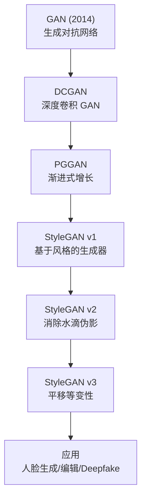
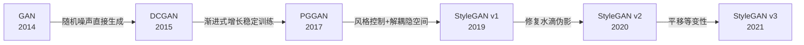
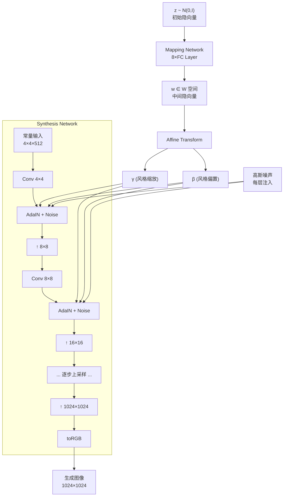

# StyleGAN (v1-v3)

## 知识地图



## 前置知识

- **GAN 基础**：生成器与判别器的对抗训练原理
- **卷积神经网络 (CNN)**：卷积、上采样、归一化层
- **风格迁移**：AdaIN（自适应实例归一化）的基本概念
- **隐空间 (Latent Space)**：$z$ 空间、$w$ 空间的概念

## 模型演化路线



| Model | Year | Key Innovation |
|-------|------|---------------|
| GAN | 2014 | 对抗训练框架，生成器 vs 判别器 |
| DCGAN | 2015 | 用 CNN 替代全连接，稳定训练 |
| PGGAN | 2017 | 渐进式增长，从低分辨率逐步提升 |
| StyleGAN v1 | 2019 | Mapping Network + AdaIN，解耦风格与内容 |
| StyleGAN v2 | 2020 | 权重解调替代 AdaIN，路径长度正则化 |
| StyleGAN v3 | 2021 | 强制平移等变性，消除纹理粘连 |

## 为什么会出现 (Why)

传统 GAN 的隐空间是**纠缠的 (entangled)**——改变 $z$ 的一个维度会同时影响多个视觉属性（如同时改变发色和脸型）。StyleGAN 的目标是构建一个**解耦的 (disentangled)** 隐空间，让不同视觉属性可以独立控制。此外，传统 GAN 直接将噪声向量输入生成器的第一层，缺乏对生成过程的多层级控制能力。

## 解决什么问题 (Problem)

1. **隐空间纠缠**：无法独立控制生成图像的不同属性（如年龄、发色、姿态）
2. **缺乏层级控制**：粗粒度特征（脸型）和细粒度特征（皮肤纹理）无法分别操控
3. **生成多样性不足**：难以在保持身份的同时改变特定风格

## 核心思想 (Core Idea)

**借鉴风格迁移的 AdaIN 机制，将隐向量通过映射网络转换为风格向量，在不同分辨率层级注入生成过程，实现粗粒度到细粒度的分层风格控制。**

---

## 模型结构图



## 数学模型/公式

### StyleGAN v1 — AdaIN (自适应实例归一化)

$$\text{AdaIN}(x_i, y) = y_{s,i} \cdot \frac{x_i - \mu(x_i)}{\sigma(x_i)} + y_{b,i}$$

- $y_s$（风格缩放）和 $y_b$（风格偏置）从风格向量 $w$ 通过 Affine Transform 计算
- 改变统计量即改变图像的"风格"：缩放控制对比度，偏置控制亮度

**通俗解释：** AdaIN 相当于给特征图做"标准化 + 重新上色"。先减均值除标准差把图像"洗白"（去除现有的风格信息），再乘以新的缩放系数加上新的偏置（涂上新风格）。这就像先把画布擦干净，再用新的颜料重新画。

### StyleGAN v2 — 权重解调 (Weight Demodulation)

$$w'_{ijk} = s_i \cdot w_{ijk}, \quad w''_{ijk} = \frac{w'_{ijk}}{\sqrt{\sum_{i,k} w_{ijk}'^2 + \epsilon}}$$

**通俗解释：** AdaIN 虽然好用，但会在生成图像上留下"水滴状"的斑块伪影。StyleGAN v2 不再对特征图做归一化，而是直接修改卷积权重：先用风格系数缩放权重，再除以权重的 L2 范数做归一化。效果相同但没有伪影——相当于从"改图"变成了"改画笔"。

### StyleGAN v3 — 平移等变性

$f$ 是生成器，$T$ 是平移操作。等变性要求：

$$f(T(x)) = T(f(x))$$

**通俗解释：** 在 v1/v2 中，如果你把输入平移一个像素，输出图像的纹理（如头发丝）可能不会跟着平移，而是"粘"在原地。v3 强制生成器满足平移等变性——无论怎么平移输入，输出图像的每个细节都会跟着平移，这保证了视频动画中纹理的自然流动。

### 截断技巧 (Truncation Trick)

$$\bar{w} + \psi \cdot (w - \bar{w})$$

- $\bar{w}$：所有训练样本的 $w$ 均值（"平均脸"）
- $\psi$：截断系数，取值范围 $[0, 1]$
- $\psi=1$：全多样性但可能产生畸变；$\psi=0.7$：质量和多样性平衡

**通俗解释：** 截断技巧就像"向平均脸靠拢"。$\psi$ 越小，生成的图像越接近"平均脸"，质量更高但多样性更低（都是帅哥美女但长得很像）。$\psi$ 越大，多样性越高但可能出现奇怪的脸。工业界通常用 $\psi=0.7$ 作为折中。

---

## 可视化展示

### 关键概念表

| 概念 | 说明 |
|------|------|
| $W$ 空间 | 映射网络输出的中间隐空间，比 $z$ 空间更解耦 |
| $W+$ 空间 | 每层不同风格向量的扩展空间，更灵活但可能偏离分布 |
| 样式混合 (Style Mixing) | 不同层用不同的 $w$ 向量，如粗层用 A、细层用 B |
| 截断技巧 | $\bar{w} + \psi \cdot (w - \bar{w})$，控制多样性与质量的平衡 |
| 噪声注入 | 每层加入高斯噪声，控制随机细节（头发纹理、皮肤毛孔） |

---

## 最小可运行代码

```python
# StyleGAN3 生成
import dnnlib, legacy
import torch

with dnnlib.util.open_url('stylegan3-t.pkl') as f:
    G = legacy.load_network_pkl(f)['G_ema']
z = torch.randn([1, G.z_dim])
img = G(z, c=None)  # [1, 3, 1024, 1024]
```

---

## 工业界应用

| 产品/项目 | 说明 |
|-----------|------|
| **This Person Does Not Exist** | StyleGAN 生成的完全虚构人脸，每刷新一次生成一张新脸 |
| **NVIDIA Canvas** | 用 GauGAN（基于 StyleGAN）将涂鸦转写实风景 |
| **Artbreeder** | 用户交互式混合和编辑 StyleGAN 生成的人脸/艺术作品 |
| **Generated Photos** | 商业用途的 AI 生成人脸素材库 |
| **Adobe Photoshop** | Neural Filters 中的"智能肖像"等功能使用 StyleGAN 技术 |
| **Deepfake 工具** | FaceSwap 等应用利用 StyleGAN 的隐空间编辑能力 |

---

## 对比表格

| | StyleGAN v1 | StyleGAN v2 | StyleGAN v3 |
|------|------------|------------|------------|
| 归一化方式 | AdaIN (特征图层) | Weight Demodulation (权重层) | Weight Demodulation |
| 主要问题 | 水滴伪影 | 纹理粘连 | 计算量增大 |
| 渐进式增长 | 有 | 无 (端到端) | 无 |
| 平移等变性 | 无 | 无 | 有 |
| FID (FFHQ) | 4.40 | 2.84 | ~3.0 |
| 视频/动画质量 | 差 | 中 | 优 |
| 训练难度 | 中 | 中 | 高 |

---

## 学完后建议继续学习

- **CycleGAN / Pix2Pix** — 学习图像翻译（域迁移）技术
- **Stable Diffusion** — 了解从 GAN 到扩散模型的范式转变
- **ControlNet / IP-Adapter** — 学习如何控制生成图像的具体内容
- **Video Generation (Sora/SVD)** — 将图像生成扩展到时间维度

---

## 高频面试题

### Q1: StyleGAN 的 Mapping Network 为什么是必要的？为什么不直接用 $z$？

**标准答案：**
$z$ 空间服从标准正态分布 $N(0, I)$，但训练数据的分布不一定符合这个分布。Mapping Network 将 $z$ 映射到一个**学习到的中间隐空间 $W$**，这个空间更接近训练分布，也更容易解耦。此外，直接用 $z$ 意味着强制数据分布服从高斯分布，会限制表达能力。Mapping Network 通过 8 层全连接提供了足够的非线性变换能力，使得 $W$ 空间更"线性"——两个 $w$ 的插值能产生平滑的视觉过渡。

### Q2: StyleGAN v2 为什么用 Weight Demodulation 替代 AdaIN？

**标准答案：**
AdaIN 在特征图 level 进行归一化时，均值和方差的局部变化会在生成图像中产生**水滴状伪影 (water droplet artifacts)**。根本原因是 AdaIN 操作实际上改变特征图的局部统计量，破坏了特征的幅度信息，导致卷积无法正确利用这些信息。Weight Demodulation 在权重层面进行归一化（修改卷积核而非特征图），数学上等价但不会产生伪影。此外，v2 还去除了渐进式增长，使用端到端训练。

### Q3: 什么是 Style Mixing（样式混合）？有什么实际用途？

**标准答案：**
Style Mixing 是指在生成图像时，不同分辨率层级使用不同的 $w$ 向量。例如，低分辨率层（4x4-32x32）用 $w_A$ 控制粗粒度特征（脸型、姿态），高分辨率层（64x64-1024x1024）用 $w_B$ 控制细粒度特征（肤色、头发纹理）。实际用途包括：保持 A 的身份同时应用 B 的发色，或将 A 的姿态与 B 的年龄结合。这在人脸编辑、虚拟试妆等场景非常有用。

### Q4: StyleGAN v3 的平移等变性 (translation equivariance) 是什么意思？为什么重要？

**标准答案：**
平移等变性是指：如果输入隐向量发生平移，输出图像的全部内容（包括纹理细节）也应当等量平移。v1/v2 存在"纹理粘连"——平移图像时，头发丝、皮肤纹理等高频细节不随平移变化，导致视频帧间纹理原地跳变。v3 通过：1) 用连续信号表示替代离散像素网格，2) 对所有卷积层应用理想低通滤波，强制生成器满足平移等变性。这使 v3 在视频生成和 latent 插值中产生更自然的动画效果。

### Q5: 截断技巧 (Truncation Trick) 的原理和参数 $\psi$ 如何选择？

**标准答案：**
截断技巧通过向 $W$ 空间的均值 $\bar{w}$ 收缩来控制生成多样性：$w' = \bar{w} + \psi(w - \bar{w})$。原理是 $W$ 空间的中心区域（靠近 $\bar{w}$）密度最高、样本质量最稳定，而边缘区域样本多样性大但质量不稳定。$\psi=1$ 保持原始分布，$\psi=0$ 只生成"平均脸"。实践中 $\psi=0.7$ 是最常用的折中值。太小的 $\psi$（如 0.5）会导致所有样本趋同，太大的 $\psi$（如 0.9）可能导致畸形样本。
