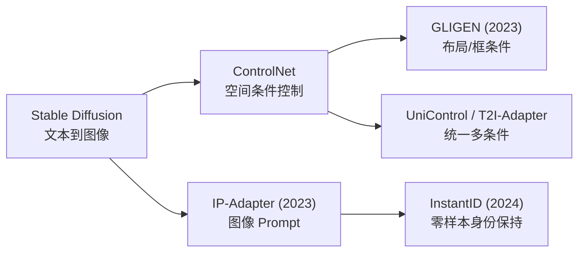
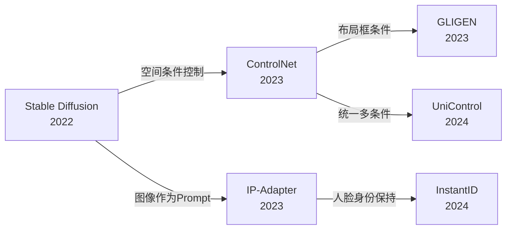
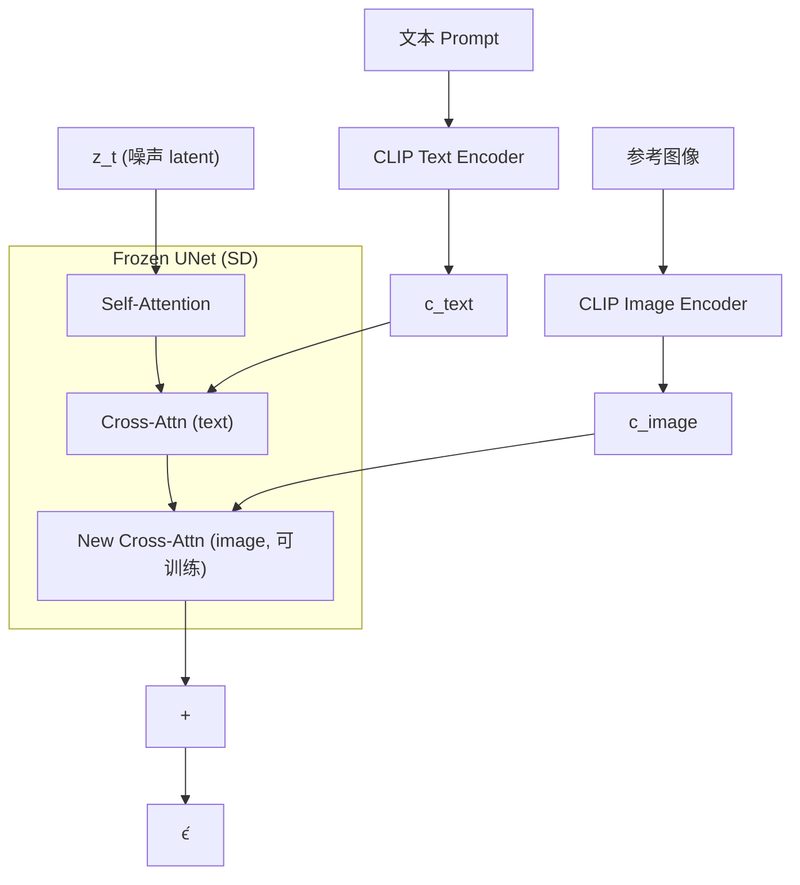
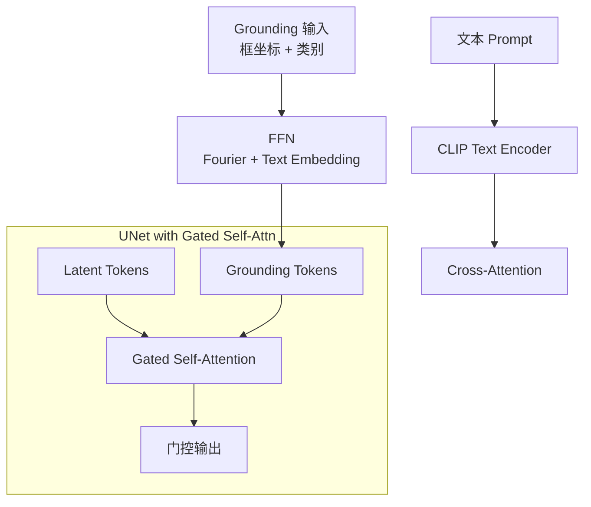
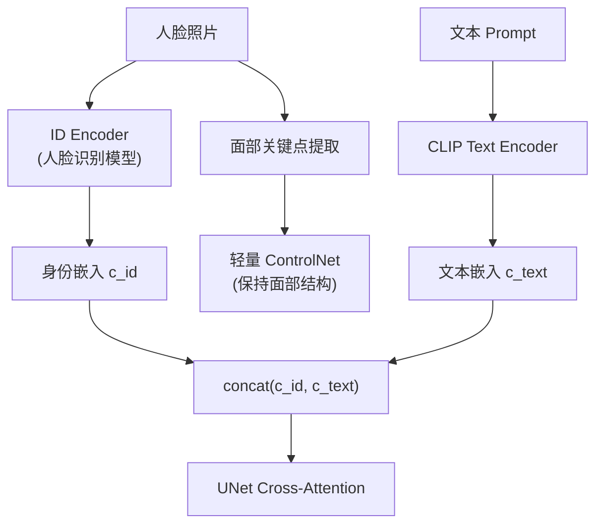

# T2I Adapters (IP-Adapter / GLIGEN / InstantID)

## 知识地图



## 前置知识

- **Stable Diffusion**：UNet + VAE + CLIP 文本编码的基本架构
- **Cross-Attention**：Q (图像 token) 与 K, V (条件 token) 的交互机制
- **ControlNet**：通过复制 UNet 编码器并引入 Zero-Convolution 注入空间条件
- **CLIP 模型**：文本和图像共享的嵌入空间

## 模型演化路线



| Model | Year | Key Innovation |
|-------|------|---------------|
| Stable Diffusion | 2022 | 隐空间扩散 + CLIP 文本条件 |
| ControlNet | 2023 | 复制编码器 + Zero-Convolution，空间条件注入 |
| GLIGEN | 2023 | 门控自注意力 + Grounding Token，可变数量布局条件 |
| IP-Adapter | 2023 | 解耦交叉注意力，图像作为 Prompt，仅训练投影层 |
| InstantID | 2024 | 人脸 ID 编码器 + 轻量 ControlNet，零样本保持身份 |

## 为什么会出现 (Why)

ControlNet 解决了**空间条件控制**（边缘图、深度图驱动生成），但实际场景中有更细分的需求：
1. 用户有一张参考图，想保持其"风格/内容"生成新图——ControlNet 处理不了"图像作为 prompt"
2. 用户想指定物体的位置和大小（布局控制）——需要可变数量的空间 grounding
3. 用户有一张人脸照，想生成该人物在不同场景/风格中的照片——需要身份保持

这些需求超出了 ControlNet 单一空间控制的范围，需要更专门化的适配器设计。

## 解决什么问题 (Problem)

1. **IP-Adapter**：用图像替代文本作为生成条件（"画一张像这张参考图风格的猫"）
2. **GLIGEN**：用边界框指定物体的位置和大小，支持任意数量的空间 grounding
3. **InstantID**：用一张人脸照片实现零样本身份保持的图像生成（无需微调）

## 核心思想 (Core Idea)

**在不破坏预训练扩散模型的前提下，通过解耦交叉注意力（IP-Adapter）、门控自注意力（GLIGEN）、或专用 ID 编码器（InstantID）注入额外的控制信号，实现图像风格参考、空间布局和人脸身份保持。**

---

## 模型结构图

### IP-Adapter 架构



### GLIGEN 架构



### InstantID 架构



## 数学模型/公式

### IP-Adapter — 解耦交叉注意力

传统交叉注意力将文本特征 $c_{text}$ 和视觉 token 交互。IP-Adapter **新增一条独立的交叉注意力路径**处理图像特征 $c_{image}$：

目标函数：

$$
\epsilon_\theta(\mathbf{z}_t, c_{text}, c_{image})
$$

IP-Adapter 的注意力层：

$$
\mathbf{Z}_{new} = \text{Softmax}\left(\frac{\mathbf{Q} \mathbf{K}_{text}^T}{\sqrt{d}}\right) \mathbf{V}_{text} + \lambda \cdot \text{Softmax}\left(\frac{\mathbf{Q} \mathbf{K}_{image}^T}{\sqrt{d}}\right) \mathbf{V}_{image}
$$

关键设计：**可训练的只有 image cross-attention 的投影层**（$\mathbf{W}_K^{image}, \mathbf{W}_V^{image}$），UNet 其他参数全部冻结。$\lambda$ 控制图像条件强度。

**通俗解释：** IP-Adapter 不修改原有的文本交叉注意力，而是在旁边加了一个"附加通道"。图像特征通过这个附加通道也参与注意力计算，结果和文本通道的结果相加。这就像给 UNet 配了一个"副驾驶"——文字说画什么，参考图说画成什么风格。$\lambda$ 是副驾驶的音量旋钮：$\lambda=0$ 时完全忽略参考图，$\lambda=1$ 时完全跟随参考图风格。

### GLIGEN — 门控自注意力

在 UNet 的门控自注意力层中插入**grounding tokens**（表示空间位置条件）：

$$
\mathbf{A}_{gated} = \text{Softmax}\left(\frac{\mathbf{Q} \mathbf{K}^T}{\sqrt{d}} + \gamma \cdot \mathbf{G}\right) \mathbf{V}
$$

其中 $\mathbf{G}$ 是 grounding attention mask——指定哪些 token 应该 attend 到 grounding tokens。$\gamma$ 是可学习的门控参数（初始化为 0，训练中逐渐生效）。

Grounding token 的表示：$\mathbf{h}_g = \text{FFN}([\text{Fourier}(x,y,w,h), \mathbf{e}_{text}])$

**通俗解释：** GLIGEN 在自注意力层中插入特殊的 grounding token，它们编码了"在 (x,y) 位置有一个大小为 (w,h) 的物体"。$\mathbf{G}$ 矩阵规定哪些图像 token 应该关注这些 grounding token——靠近框的 token 被鼓励关注对应的 grounding token。$\gamma$ 初始化为 0，意味着刚开始训练时 grounding 不起作用（保护预训练质量），随着训练逐渐生效。

### InstantID — 身份保持

用专用的 **ID Encoder**（基于人脸识别模型）提取人脸身份嵌入，与 CLIP 文本嵌入一起指导扩散模型：

$$
c_{combined} = \text{concat}(c_{id}, c_{text})
$$

**通俗解释：** $c_{id}$ 是人脸识别模型提取的身份特征向量（类似于人脸识别中的特征模板），它编码了"这个人是谁"而忽略了表情、光照、姿态。将这个向量与文本 embedding 拼接后输入 UNet，模型既能理解"生成一个在沙滩上的照片"（来自文本），又能保持"这必须是张三的脸"（来自 $c_{id}$）。

---

## 可视化展示

### IP-Adapter 架构

（保留原有 Mermaid 架构图）

### 适配器对比

```echarts
return {
  tooltip: { trigger: "axis", confine: true },
  title: { top: 5,  text: 'T2I 适配器对比', left: 'center', textStyle: { fontSize: 12 } },
  xAxis: { type: 'category', data: ['Prompt 控制', '空间控制', '身份保持', '可训练参数'] },
  yAxis: { type: 'value', min: 0, max: 1, name: '能力得分' },
  legend: { top: 28,  data: ['ControlNet', 'GLIGEN', 'IP-Adapter', 'InstantID'] },
  series: [
    { name: 'ControlNet', type: 'bar', data: [0.3, 1, 0, 0.5], itemStyle: { color: '#2c3e50' } },
    { name: 'GLIGEN', type: 'bar', data: [0.5, 1, 0, 0.6], itemStyle: { color: '#2980b9' } },
    { name: 'IP-Adapter', type: 'bar', data: [0.3, 0, 1, 0.1], itemStyle: { color: '#d35400' } },
    { name: 'InstantID', type: 'bar', data: [0.3, 0.5, 1, 0.3], itemStyle: { color: '#16a085' } }
  ],
  grid: { left: 60, right: 20, top: 55, bottom: 55 }
}
```

---

## 最小可运行代码

### PyTorch — IP-Adapter 解耦交叉注意力

```python
import torch
import torch.nn as nn

class IPAdapterCrossAttention(nn.Module):
    def __init__(self, query_dim, context_dim, n_heads=8):
        super().__init__()
        self.to_q = nn.Linear(query_dim, query_dim)
        self.to_k = nn.Linear(context_dim, query_dim)
        self.to_v = nn.Linear(context_dim, query_dim)
        self.to_out = nn.Linear(query_dim, query_dim)
        self.n_heads = n_heads
        self.head_dim = query_dim // n_heads

    def forward(self, x, image_context, scale=1.0):
        # x: [B, N, D] — UNet 的 latent token
        # image_context: [B, M, D'] — CLIP 图像特征
        B = x.shape[0]
        Q = self.to_q(x).view(B, -1, self.n_heads, self.head_dim).transpose(1, 2)
        K = self.to_k(image_context).view(B, -1, self.n_heads, self.head_dim).transpose(1, 2)
        V = self.to_v(image_context).view(B, -1, self.n_heads, self.head_dim).transpose(1, 2)

        attn = Q @ K.transpose(-2, -1) * (self.head_dim ** -0.5)
        attn = torch.softmax(attn, dim=-1)
        out = (attn @ V).transpose(1, 2).contiguous().view(B, -1, self.n_heads * self.head_dim)
        return self.to_out(out) * scale
```

### GLIGEN Grounding Token

```python
class GLIGENGrounding(nn.Module):
    def __init__(self, dim):
        super().__init__()
        self.gamma = nn.Parameter(torch.zeros(1))

    def forward(self, attn_map, grounding_tokens, grounding_mask):
        # grounding_tokens 插入 latent 序列中
        # grounding_mask: [B, N, N_g] — 哪些 latent token attend 到 grounding token
        gate = torch.tanh(self.gamma)
        return attn_map + gate * grounding_mask
```

---

## 工业界应用

| 产品/项目 | 说明 |
|-----------|------|
| **ComfyUI** | 集成 IP-Adapter / ControlNet / InstantID 的可视化工作流平台 |
| **Stable Diffusion WebUI (A1111)** | 通过 ControlNet 和 IP-Adapter 插件实现参考图生成 |
| **Midjourney** | "Style Reference" 功能类似 IP-Adapter 的图像条件生成 |
| **Replicate** | 提供 InstantID API，用户上传人脸照片即可生成该人物的各种风格照片 |
| **CivitAI** | 提供 GLIGEN / IP-Adapter 模型的社区下载和在线推理 |
| **Hugging Face Diffusers** | 官方支持 IP-Adapter / ControlNet / GLIGEN 的 pipeline |

---

## 对比表格

| | ControlNet | GLIGEN | IP-Adapter | InstantID |
|------|-----------|--------|------------|-----------|
| 控制类型 | 空间结构 (边缘/深度/姿态) | 布局 (框位置+大小) | 图像风格/内容参考 | 人脸身份保持 |
| 条件输入 | 边缘图/深度图/姿态图 | 边界框 + 文本标签 | 任意参考图像 | 人脸照片 |
| 可训练参数量 | 中等 (复制编码器) | 少 (门控+Grounding) | 极少 (仅投影层) | 少 (ID Encoder + 轻量 ControlNet) |
| 是否需要文本 Prompt | 是 | 是 | 需要（文本+图像） | 需要 |
| 多实例支持 | 控制单个结构 | 支持任意数量框 | 单张或多张参考图 | 单人脸 |
| 推理速度 | 慢 (额外编码器) | 快 | 快 (仅额外投影) | 中等 |

---

## 学完后建议继续学习

- **LoRA / DreamBooth** — 通过微调实现角色/风格一致性（补全 InstantID 的不足）
- **AnimateDiff** — 将 ControlNet/IP-Adapter 的控制能力扩展到视频
- **Self-Attention Guidance** — 无需额外模型即可增强生成质量
- **Video-to-Video Translation** — 在视频中保持身份和风格一致性

---

## 高频面试题

### Q1: IP-Adapter 和 ControlNet 的核心区别是什么？各自适合什么场景？

**标准答案：**
IP-Adapter 和 ControlNet 解决的是不同类型的问题：
- **ControlNet** 处理**空间条件控制**——输入是一张条件图（边缘图、深度图、姿态骨架），要求生成图像的**空间布局**与条件图对齐。训练时需要复制整个 UNet 编码器。
- **IP-Adapter** 处理**内容/风格条件控制**——输入是一张参考图像，要求生成图像的**风格/内容**与参考图相似，但不要求空间对齐。训练时只训练新增的交叉注意力投影层（$\mathbf{W}_K, \mathbf{W}_V$）。

场景选择：
- 需要精确空间控制（如"在这个姿态下画一个人"）→ ControlNet
- 需要风格/内容参考（如"画得像这张图"）→ IP-Adapter
- 需要同时控制两者 → 两者可以叠加使用

### Q2: GLIGEN 的门控参数 $\gamma$ 为什么初始化为 0？

**标准答案：**
$\gamma$ 初始化为 0 是因为 GLIGEN 在预训练好的 Stable Diffusion 基础上添加 grounding 功能。如果 $\gamma$ 初始化为非零值，grounding mask 会在训练初期破坏预训练的自注意力分布，导致模型从头开始学习而丧失了预训练的优势。初始化为 0 意味着训练开始时 grounding 完全不起作用，模型行为与原始 SD 一致。通过 $\tanh(\gamma)$ 作为门控，$\gamma$ 在训练中逐渐增长，grounding 能力平稳注入，保护了预训练质量。

### Q3: InstantID 如何实现零样本 (zero-shot) 身份保持？与 DreamBooth 微调的区别是什么？

**标准答案：**
InstantID 的零样本能力来自两个设计：
1. **专用 ID Encoder**：使用预训练的人脸识别模型（如 ArcFace）提取人脸身份嵌入 $c_{id}$。这个嵌入本身具有高度判别性——同一个人的不同照片产生的 $c_{id}$ 非常接近，不同人的 $c_{id}$ 差异很大。且这个编码器是冻结的（不参与训练）。
2. **轻量 ControlNet**：从人脸照片提取关键点（眼睛、鼻子、嘴巴位置），通过一个小型 ControlNet 保持面部结构。

与 DreamBooth 的区别：
- **DreamBooth**：需要 3-5 张该人物的照片进行微调（约 10-30 分钟），学到一个该人物专属的 token。泛化好，但需要微调。
- **InstantID**：零样本——仅需一张人脸照片，无需任何训练。速度快（秒级），但身份保持的精度和泛化略逊于 DreamBooth。

### Q4: 什么是解耦交叉注意力 (Decoupled Cross-Attention)？为什么 IP-Adapter 要解耦文本和图像特征？

**标准答案：**
解耦交叉注意力是指文本和图像特征通过**两条独立的交叉注意力路径**处理，而非简单地将它们拼接后送入同一个交叉注意力层。

公式 $\mathbf{Z}_{new} = \text{Attn}_{text} + \lambda \cdot \text{Attn}_{image}$ 中的 "+" 是关键——文本和图像注意力独立计算后相加。

解耦的好处：
1. **训练分离**：文本路径来自预训练 SD（冻结），图像路径是新训练的。两者独立避免了图像训练破坏文本理解能力。
2. **灵活控制**：$\lambda$ 可以独立调节图像条件的强度而不影响文本条件。
3. **可组合性**：图像和文本可以任意组合——同一个文本 prompt 配不同参考图，或同一个参考图配不同文本。

### Q5: T2I Adapter 和 ControlNet 的架构差异是什么？哪个更好？

**标准答案：**
两者都解决空间条件控制，但架构不同：
- **ControlNet**：复制整个 UNet 编码器，每层输出通过 Zero-Convolution 注入 UNet 的对应层。参数量大（约原 SD UNet 的 ~50% 额外参数），但控制能力强。
- **T2I Adapter**：使用一个轻量的独立编码网络（小型 CNN）处理条件输入，输出固定数量的特征图注入 UNet。参数量小，但控制精度略低于 ControlNet。

选择建议：精度优先选 ControlNet，速度/显存优先选 T2I Adapter。大多数实际应用中使用 ControlNet 因其更好的控制力。两者可以处理相同的条件类型（边缘、深度、姿态等）。
