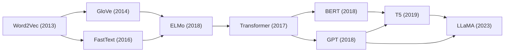
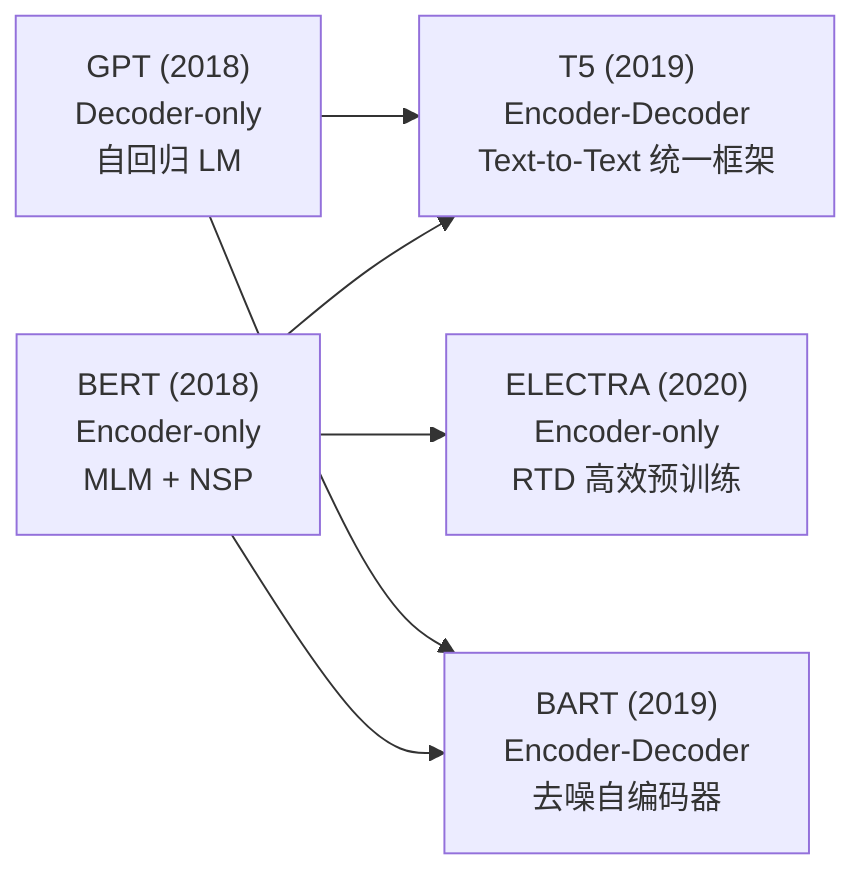
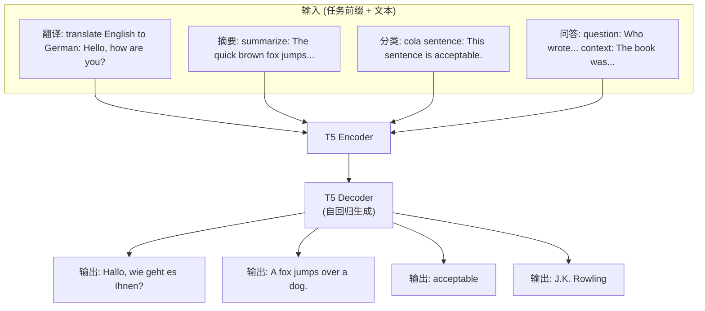
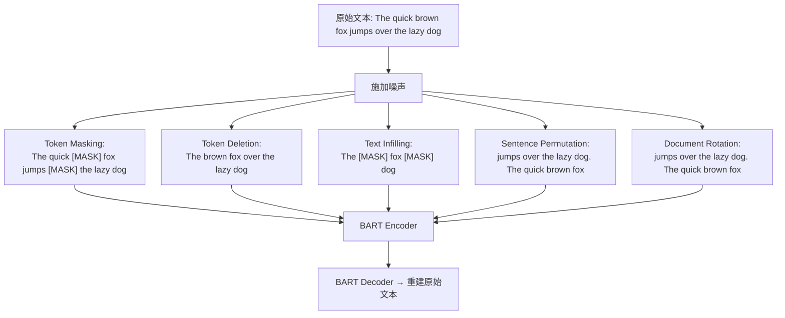
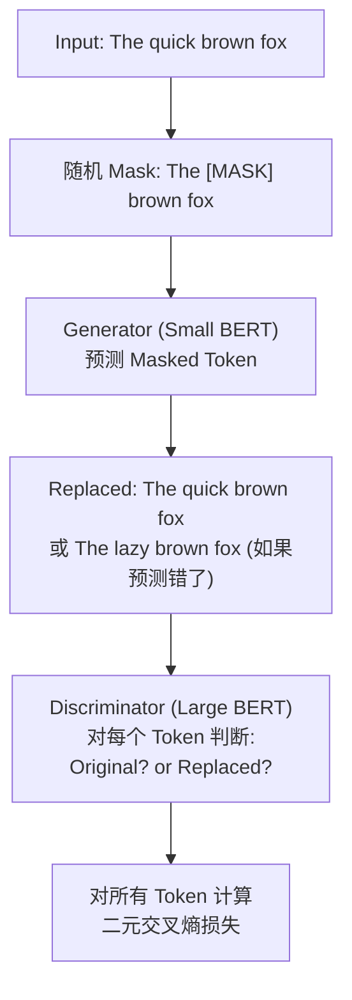

# T5 / BART / ELECTRA

## 知识地图



## 前置知识

- **Transformer 架构**：深入理解 Encoder-Decoder 结构，Self-Attention、Cross-Attention、FFN、残差连接。
- **BERT**：理解 MLM (Masked Language Model) 预训练任务和 Encoder-only 架构。
- **GPT**：理解自回归语言模型 (Autoregressive LM) 预训练和 Decoder-only 架构。
- **迁移学习**：理解"预训练 + 微调"范式。
- **BPE / SentencePiece Tokenization**：理解子词分词算法，T5 使用 SentencePiece。

## 模型演化路线



| 阶段 | 模型 | 架构 | 核心突破 |
|------|------|------|----------|
| 双向理解 | BERT | Encoder-only | MLM 预训练，统一理解任务 |
| 单向生成 | GPT | Decoder-only | 自回归 LM，强大生成能力 |
| 统一框架 | T5 | Encoder-Decoder | Text-to-Text，所有任务统一为 seq2seq |
| 去噪重建 | BART | Encoder-Decoder | 多种噪声 + 重建，兼顾理解生成 |
| 高效判别 | ELECTRA | Encoder-only | RTD，所有 token 参与损失，效率高 |

## 为什么会出现 (Why)

### T5 的动机

在 T5 (2019) 之前，NLP 领域存在一个割裂的局面：
- **BERT** 擅长理解任务（分类、QA、NER），但没法做生成（只有 Encoder）
- **GPT** 擅长生成任务（文本续写、摘要），但没法做双向理解（只有 Decoder）
- 每个任务都需要特定的模型架构和训练方式，没有一个统一的框架

T5 提出"**万物皆 Text-to-Text**"：所有 NLP 任务（翻译、摘要、问答、分类）都转化为"输入文本 → 输出文本"的 seq2seq 格式，用统一的 Transformer Encoder-Decoder 架构解决所有任务。

### BART 的动机

BERT 的 MLM 只用单一的噪声类型（[MASK] 替换），限制了模型对文本结构的理解能力。GPT 虽然能做生成，但缺乏编码器来消化输入文本。BART 提出：**用多种噪声方式破坏输入，然后用 Encoder-Decoder 学习重建**，使模型同时具备双向理解和自回归生成能力。

### ELECTRA 的动机

BERT 的 MLM 只对 15% 的被遮盖 token 计算损失，其余 85% 的 token 不参与损失计算，**训练效率低**。ELECTRA 提出：用一个判别器对所有 token 判断是否被替换，**每个 token 都参与损失**，大幅提升训练效率。

## 解决什么问题 (Problem)

- **T5**：将所有 NLP 任务统一为 Text-to-Text 格式，用单一模型解决所有任务
- **BART**：同时具备 BERT 的理解能力和 GPT 的生成能力，特别适合序列到序列任务
- **ELECTRA**：在相同计算量下，比 BERT 训练效率更高、效果更好

## 核心思想 (Core Idea)

- **T5**：将所有 NLP 任务统一为 Text-to-Text（文本输入 → 文本输出）格式，用 Encoder-Decoder Transformer 和 Span Corruption 预训练解决所有任务。
- **BART**：用多种噪声方式破坏输入文本，训练 Encoder-Decoder 模型从损坏文本中重建原始文本，同时具备理解和生成能力。
- **ELECTRA**：用 Replaced Token Detection (RTD) 替代 MLM——小生成器替换部分 token，大判别器对所有 token 做二分类判断是否被替换，所有 token 参与损失计算。

---

## T5 (Text-to-Text Transfer Transformer)

### 核心思想：万物皆文本到文本

将所有 NLP 任务统一为 **Text-to-Text 格式**：

```
翻译:    "translate English to German: Hello" → "Hallo"
摘要:    "summarize: ..." → "摘要文本"
分类:    "mnli premise: ... hypothesis: ..." → "entailment"
问答:    "question: ... context: ..." → "答案"
```

**通俗解释：** 不管什么 NLP 任务，输入都加上一个**任务前缀 (task prefix)**告诉模型要做什么，输出自然语言文本。翻译任务前缀是 "translate English to German:"，摘要任务是 "summarize:"，分类任务输出的是类别名称而非数字 ID。这让所有任务可以混合训练，一个模型打天下。

### 预训练目标：Span Corruption

随机掩盖连续的 token span（而非单 token），用一个特殊 token 替换：

```
Input:  "Thank you [X] me to your party [Y] week"
Output: "[X] for inviting [Y] last [Z]"  (Z 表示结束)
```

平均 span 长度 = 3，掩盖 15% token。

**通俗解释：** 不同于 BERT 的 MLM（每次只遮一个 token），T5 的 Span Corruption 是把连续的几个词作为一个整体遮掉。例如 "Thank you for inviting me to your party last week" → 遮掉 "for inviting" 和 "last"，出来的是 "Thank you [X] me to your party [Y] week"。模型需要在 Decoder 中输出 "[X] for inviting [Y] last [Z]"。这种方式更接近真实的文本生成场景。

### 架构

标准 Transformer Encoder-Decoder：

| 配置 | 层数 | $d_{model}$ | 头数 | 参数量 |
|------|------|-------------|------|--------|
| Small | 6+6 | 512 | 8 | 60M |
| Base | 12+12 | 768 | 12 | 220M |
| Large | 24+24 | 1024 | 16 | 770M |
| 3B | 24+24 | 1024 | 32 | 2.8B |
| 11B | 24+24 | 1024 | 128 | 11B |

### T5 的相对位置编码

不同于 Transformer 原版的正弦位置编码，T5 使用**相对位置偏置 (Relative Position Bias)**：

- 不把位置信息加到输入 embedding 上
- 而是在 Self-Attention 的 softmax 之前，给 attention score 加上一个可学习的标量偏置，该偏置只依赖于两个位置的相对距离
- 这使模型更容易学到"相邻词的交互模式"和"远距离词的交互模式"之间的差异

---

## BART

### 核心思想

BART 是结合 BERT（编码器）和 GPT（解码器）的序列到序列模型。关键在于**破坏输入的多种噪声方式**：

1. **Token Masking**：像 BERT 一样随机替换 token 为 [MASK]
2. **Token Deletion**：随机删除 token，模型需要知道"少了什么"
3. **Text Infilling**：用单个 [MASK] 替换连续 span（类似 T5）
4. **Sentence Permutation**：打乱句子顺序，模型需要重新排序
5. **Document Rotation**：随机旋转文档（选择一个 token，从该处切开并交换前后两段）

模型学习从损坏文本中重建原始文本。

**通俗解释：** BART 像是一个"文档修复专家"。训练时，给它看各种被破坏的文档（词被遮住、词被删除、句子顺序打乱、文档被旋转），让它修复成原始文本。通过这种方式，BART 学会了：(1) Encoder 理解损坏文本的意思；(2) Decoder 生成修复后的文本。预训练后，BART 在理解和生成任务上都很强——做文本分类时用 Encoder 输出，做摘要/翻译时用完整的 Encoder-Decoder pipeline。

---

## ELECTRA

### 核心思想：效率优先

不是预测被掩盖的 token（MLM），而是训练一个**判别器**判断每个 token 是否被替换：

1. 用一个小的 MLM Generator 替换部分 token
2. 用大的 Discriminator 判断每个 token 是否被替换
3. 对所有 token 做二分类（而非仅 15%）

所有 token 都参与损失计算，效率远高于 MLM。

**通俗解释：** BERT 只对 15% 的被遮词进行学习和更新（打分的 15% 的题有效）。ELECTRA 的思路是：让一个小 Generator 模仿 BERT 去瞎猜替换，然后让一个大 Discriminator 对**所有词**逐一判断"你是不是被换过的"。这样所有 token 都参与损失——就像批改全部 100 道题而不仅仅是 15 道填空题。因此在相同算力下，ELECTRA 学到的信号比 BERT 多得多。

### 损失函数

$$L = L_{MLM}(G) + \lambda L_{Disc}(D)$$

Generator 的损失不反向传播到 Discriminator。

**通俗解释：** 损失函数有两部分：(1) $L_{MLM}(G)$ 是 Generator 的 MLM 损失——让 Generator 学会预测被遮掉的词。(2) $L_{Disc}(D)$ 是 Discriminator 的二元交叉熵损失——对每个位置判断"这个词是不是被 Generator 换过的"。Generator 的梯度流向 Discriminator 会被截断（因为如果 Discriminator 知道 Generator 在想什么就太好猜了）。

参数量与 BERT 相同的情况下，ELECTRA 效果更好（或同等效果更快）。

---

## 可视化展示

### T5 Text-to-Text 统一框架



### BART 多种噪声训练



### ELECTRA 训练流程



## 最小可运行代码

### T5 — HuggingFace 使用

```python
from transformers import T5Tokenizer, T5ForConditionalGeneration

tokenizer = T5Tokenizer.from_pretrained("t5-base")
model = T5ForConditionalGeneration.from_pretrained("t5-base")

# 翻译
input_text = "translate English to German: Hello, how are you?"
inputs = tokenizer(input_text, return_tensors="pt")
outputs = model.generate(**inputs, max_length=40)
result = tokenizer.decode(outputs[0], skip_special_tokens=True)
print(result)  # "Hallo, wie geht es Ihnen?"

# 摘要
input_text = "summarize: The quick brown fox jumps over the lazy dog. " \
             "This sentence contains every letter of the alphabet."
inputs = tokenizer(input_text, return_tensors="pt")
outputs = model.generate(**inputs, max_length=40)
print(tokenizer.decode(outputs[0], skip_special_tokens=True))
```

### BART — HuggingFace 使用

```python
from transformers import BartTokenizer, BartForConditionalGeneration

tokenizer = BartTokenizer.from_pretrained("facebook/bart-base")
model = BartForConditionalGeneration.from_pretrained("facebook/bart-base")

# 文本摘要
text = "The quick brown fox jumps over the lazy dog. " \
       "This pangram contains every letter of the English alphabet."
inputs = tokenizer(text, return_tensors="pt", max_length=1024, truncation=True)
summary_ids = model.generate(inputs["input_ids"], max_length=50, num_beams=4)
summary = tokenizer.decode(summary_ids[0], skip_special_tokens=True)
print(summary)
```

## 工业界应用

| 模型 | 应用场景 | 说明 |
|------|----------|------|
| T5 | 多语言翻译 | 用任务前缀统一多语种翻译 |
| T5 | 文本摘要 | SOTA 性能，Encoder-Decoder 架构天然适合 |
| T5 | 问答系统 | 将 QA 转化为"问题+上下文 → 答案" |
| T5 | 代码生成 | CodeT5 在代码理解和生成任务上表现优异 |
| BART | 对话摘要 | Facebook 使用 BART 做 Messenger 对话摘要 |
| BART | 文本生成 | 文案撰写、故事创作等生成任务 |
| BART | 机器翻译 | mBART 是多语言翻译的强大基线 |
| ELECTRA | 文本分类 | 训练效率高，适合快速迭代的中小规模场景 |
| ELECTRA | NER / 信息抽取 | 比同参数量的 BERT 效果更好 |
| ELECTRA | 资源受限场景 | 用更少的训练时间达到 BERT 级性能 |

## 对比表格

| 维度 | T5 | BART | ELECTRA |
|------|-----|------|---------|
| 架构 | Encoder-Decoder | Encoder-Decoder | Encoder-only |
| 预训练任务 | Span Corruption | 多种噪声 + 重建 (Denoising Autoencoder) | RTD (Replaced Token Detection) |
| 参数量 (Base) | 220M | 139M | 110M |
| 训练效率 | 中等 (仅 15% token 参与损失) | 中等 | 高 (所有 token 参与损失) |
| 理解任务 | 好 | 好 | 很好 |
| 生成任务 | 很好 | 很好 | 不支持 (无 Decoder) |
| 统一框架 | Text-to-Text (最统一) | Seq2Seq | 同 BERT 分类 |
| 最佳使用场景 | 统一理解和生成，多任务 | 摘要、翻译、对话 | 仅需理解的场景，追求训练效率 |

### T5 vs BART 详细对比

| 维度 | T5 | BART |
|------|-----|------|
| 噪声方式 | 一种 (Span Corruption) | 五种 (Mask/Delete/Infilling/Permutation/Rotation) |
| 位置编码 | 相对位置偏置 | 可学习绝对位置编码 |
| 分词器 | SentencePiece (T5 专用) | BPE (同 RoBERTa) |
| 任务格式化 | Text-to-Text 前缀 | 不强制前缀 |
| 预训练数据 | C4 (Colossal Clean Crawled Corpus) | 同 RoBERTa 数据 |
| 设计哲学 | 统一所有 NLP 任务 | 兼顾理解与生成的最强 seq2seq |

## 学完后建议继续学习

1. **GPT-3 / In-Context Learning**：了解"不微调也能做下游任务"的新范式，对比 T5 的文本前缀思路
2. **LLaMA 系列**：了解 Decoder-only 架构如何统治大语言模型时代
3. **多模态模型**：了解 T5 的 Text-to-Text 思想如何扩展到图像、语音等领域
4. **指令微调 (Instruction Tuning)**：理解 T5 的思想如何在 ChatGPT 等指令遵循模型中得到继承和发展

## 高频面试题

### Q1: T5 的 "Text-to-Text" 框架和 BERT 的微调方式有什么本质不同？

**标准答案：**
- **BERT 的微调**：不同任务需要在预训练模型上添加不同的任务头（如文本分类加线性层、QA 加 Span 预测头、NER 加 CRF 层）。每个任务有自己独立的输出结构。
- **T5 的 Text-to-Text**：所有任务的输入和输出都是自然语言文本。分类任务输出类别名称（如 "positive"），QA 任务输出答案文本，翻译任务输出译文。不需要任何任务特定的结构——完全相同的模型、相同的损失函数（交叉熵），只需改变任务前缀。
- **优势与代价**：T5 的统一性带来了极大的工程简化（一个模型、一套代码解决所有任务），但输出文本的方式使得严格约束输出空间（如分类任务的固定类别）比较困难，且生成式推理比 BERT 的直接分类要慢。

### Q2: BART 的"多种噪声"设计有什么道理？为什么不用单一种噪声？

**标准答案：**
- 不同类型的噪声迫使模型学习文本的不同结构层面：
  - **Token Masking**：学习词的语义和上下文关系（类似 BERT MLM）
  - **Token Deletion**：学习哪些位置应该有词，培养对文本完整性的感知
  - **Text Infilling**：学习 span 长度预测和文本补全（类似 T5 Span Corruption）
  - **Sentence Permutation**：学习句间逻辑关系和篇章结构
  - **Document Rotation**：学习文档的起始点识别和全局连贯性
- 噪声多样性使得模型学到的表示更加鲁棒，因为模型无法依赖单一的修复策略——必须在不同噪声下都能重建原文。

### Q3: ELECTRA 为什么比 BERT 训练更高效？效率提升的本质是什么？

**标准答案：**
- **BERT 的 MLM**：每次只对 15% 的被遮盖位置计算损失，其余 85% 的 token 不参与损失。假设一个 batch 有 256 个 token，只有约 38 个 token 在"被学习"。
- **ELECTRA 的 RTD**：对所有 token（256 个）都进行二分类判断（是否被 Generator 替换），所有 token 都参与损失计算。每个 token 都在"被学习"。
- **效率提升的本质**：在相同的前向/反向传播计算量下，BERT 只有 15% 的 token 有梯度更新，ELECTRA 有 100% 的 token 有梯度更新。这意味着同样的 GPU 时间，ELECTRA 获得了约 6-7 倍的训练信号。
- 实践中，ELECTRA 通常用 1/4 的训练步数就能达到 BERT 同等性能。

### Q4: T5 的 Span Corruption 和 BERT 的 MLM 有什么不同？为什么 T5 选择 Span Corruption？

**标准答案：**
- **BERT MLM**：每次随机掩盖**单个 token**，被掩盖的 token 之间互相独立。例："The [MASK] brown [MASK] jumps" 需要分别预测两个 [MASK]。
- **T5 Span Corruption**：每次掩盖**连续的 token span**，整个 span 被替换为一个哨兵 token，且模型需要输出被替换的完整 span。例："Thank you [X] me to your party [Y] week" → 输出 "[X] for inviting [Y] last [Z]"。
- **为什么 T5 选 Span Corruption**：
  1. 更接近生成任务的实际场景（生成连续的文本片段）
  2. 迫使模型学习 span 边界和长度预测
  3. 每个 masked span 需要生成多个 token，训练信号的连续性和连贯性更强

### Q5: Encoder-Decoder (T5/BART) 和 Encoder-only (BERT)、Decoder-only (GPT) 在什么场景下选择哪种架构？

**标准答案：**
- **Encoder-only (BERT/ELECTRA)**：
  - 适用：纯理解任务——文本分类、NER、QA（抽取式）、情感分析
  - 优势：双向上下文建模最充分，训练简单
  - 不足：无法做文本生成
- **Decoder-only (GPT/LLaMA)**：
  - 适用：纯生成任务——文本续写、故事创作、对话
  - 优势：自回归生成最自然，In-Context Learning 能力强
  - 不足：无法直接"理解"输入文本后再生成（需将输入拼到 prompt 中）
- **Encoder-Decoder (T5/BART)**：
  - 适用：需要"理解输入→生成输出"的任务——翻译、摘要、结构化的 Seq2Seq 任务
  - 优势：Encoder 充分理解输入，Decoder 基于理解生成，分工明确
  - 不足：参数量大（Encoder 和 Decoder 各一套参数），生成任务上被 Decoder-only 架构追赶
