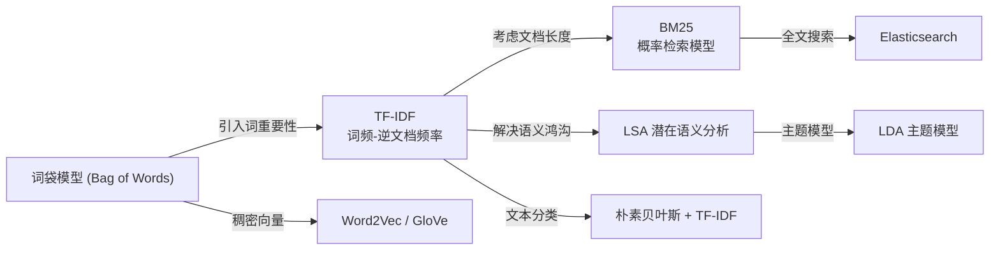
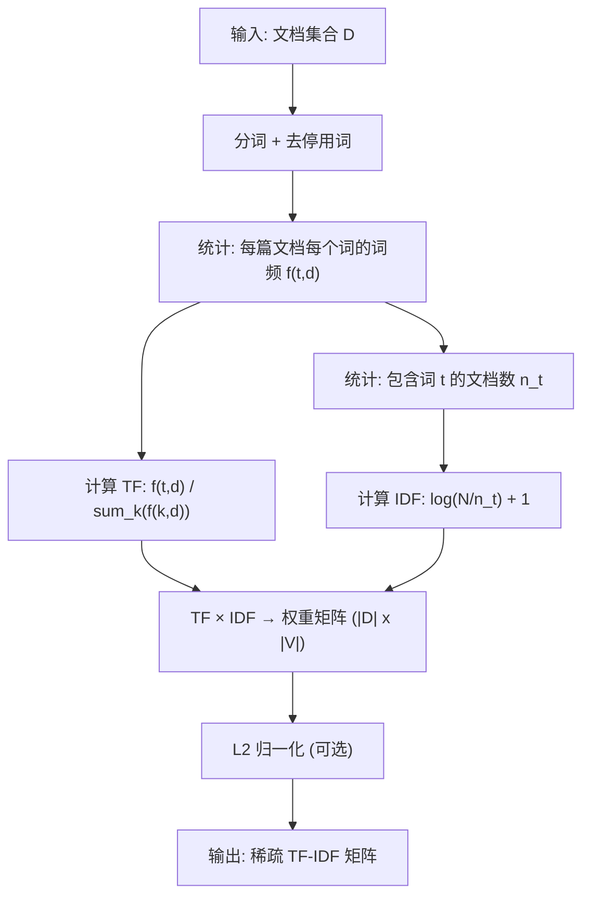

# TF-IDF

## 知识地图



## 前置知识

- 词袋模型 (Bag of Words)：将文本表示为词的集合，忽略词序
- 基本的概率和信息论概念（频率、对数）
- 文本预处理（分词、去掉停用词）
- 向量空间模型 (VSM)：文档表示为高维空间中的向量

## 为什么会出现 (Why)

最简单的文本向量化是 One-Hot（每个词一个独立维度）或词频计数。但"词频"方法有严重缺陷：像"的"、"是"、"在"这样的词出现频率极高，但它们几乎不携带任何语义信息——一篇关于"机器学习"的文档和一篇关于"烹饪"的文档，两者的"的"出现频率差不多。需要一个机制来自动"惩罚"这些到处出现、无法区分文档的高频词。

## 解决什么问题 (Problem)

评估一个词对其所在文档的"重要性"。TF-IDF 值越高，表示这个词对该文档越重要、越有代表性。它解决了纯词频方法的两个问题：(1) 高频但不重要的停用词被自动降权（IDF 惩罚）；(2) 在某个文档中频繁出现但在整个语料库中罕见的专业术语被突出（TF 和 IDF 协同效应）。

## 核心思想 (Core Idea)

**一个词在一篇文档中出现的频率越高（TF），同时在整体语料库中出现的文档数越少（IDF），这个词对该文档就越重要。**

---

## 数学定义与原理解析

### 词频 (TF)

$$\text{TF}(t, d) = \frac{\text{词 } t \text{ 在文档 } d \text{ 中出现的次数}}{\text{文档 } d \text{ 的总词数}}$$

**通俗解释：** 在一篇 100 词的文档中，"机器学习"出现了 3 次，TF = 3/100 = 0.03。频率越高，说明这个词在文档中被反复提及，可能越重要。分母用来做文档长度归一化——长文档天然有更高的词频，除以总词数后不同长度的文档可以公平比较。

### 逆文档频率 (IDF)

$$\text{IDF}(t) = \log \frac{N}{|\{d \in D: t \in d\}|} + 1$$

其中 $N$ 是总文档数。加 1 平滑防止值为 0。

**通俗解释：** 如果"机器学习"在 1000 篇文档中只出现在 10 篇里，IDF = log(1000/10) + 1 = log(100) + 1 = 2 + 1 = 3。如果"的"出现在了 1000 篇中的 950 篇里，IDF = log(1000/950) + 1 = log(1.05) + 1 = 0.02 + 1 = 1.02。可以看到，"的"的 IDF 远低于"机器学习"——这个机制自动惩罚了那些"到处可见"、缺乏区分度的词。

### TF-IDF

$$\text{TF-IDF}(t, d) = \text{TF}(t, d) \times \text{IDF}(t)$$

**通俗解释：** TF 和 IDF 相乘，两个条件同时满足时才得分高——既要在这篇文档中出现频繁（TF 高），又要在整个语料库中罕见（IDF 高）。例如"机器学习"在本文中出现很多次（高 TF），但大多数文档不讲机器学习（高 IDF），所以它的 TF-IDF 极高，完美代表了本文的"主题词"。

---

## 变体与平滑

| 变体 | TF | IDF |
|------|-----|-----|
| 标准 | $f_{t,d} / \sum_k f_{k,d}$ | $\log(N/n_t)$ |
| 次线性 TF | $1 + \log f_{t,d}$ | 同上 |
| 归一化 TF | $\frac{0.5 + 0.5 \cdot f_{t,d}}{\max_k f_{k,d}}$ | $\log\frac{N-n_t+0.5}{n_t+0.5}$ |
| BM25 | $\frac{f_{t,d}(k_1+1)}{f_{t,d} + k_1(1-b+b\cdot dl/avgdl)}$ | $\log\frac{N-n_t+0.5}{n_t+0.5}$ |

---

## BM25 公式

$$\text{BM25}(q, d) = \sum_{t \in q} \text{IDF}(t) \cdot \frac{f_{t,d} (k_1+1)}{f_{t,d} + k_1(1-b+b \cdot \frac{|d|}{avgdl})}$$

其中 $k_1=1.5$（词频饱和度），$b=0.75$（长度归一化强度）。

**通俗解释：** BM25 是 TF-IDF 的"概率论升级版"。它改进了两点：(1) TF 部分用非线性饱和函数替代了简单线性——一个词出现 20 次和 100 次的区别不大（$k_1$ 控制饱和速度）；(2) 文档长度归一化不再简单除法，而是通过参数 $b$ 灵活控制——$b=0$ 不做长度归一化，$b=1$ 完全按长度比例惩罚。

---

## 算法流程图



---

## 可视化展示

### 高频词 vs 关键词的 TF-IDF 对比

```echarts
return {
  tooltip: { trigger: "axis", confine: true },
  title: { top: 5,  text: 'TF-IDF 权重对比: 停用词 vs 关键词', left: 'center', textStyle: { fontSize: 12 } },
  xAxis: { type: 'category', data: ['的', '是', '学习', '机器学习', '人工智能', '神经网络'] },
  yAxis: { type: 'value', name: 'TF-IDF 得分' },
  series: [
    { type: 'bar', data: [0.02, 0.03, 0.15, 0.45, 0.42, 0.38], itemStyle: { color: '#2c3e50' },
      label: { show: true, position: 'top' } }
  ],
  grid: { left: 60, right: 20, top: 55, bottom: 55 }
}
```

---

## 最小可运行代码

### Python -- sklearn 实现

```python
from sklearn.feature_extraction.text import TfidfVectorizer

corpus = [
    "机器学习是人工智能的子领域",
    "深度学习使用神经网络进行学习",
    "人工智能包括机器学习和深度学习",
]
vectorizer = TfidfVectorizer()
X = vectorizer.fit_transform(corpus)
# X.shape = (3, vocab_size)

# 获取词和权重
words = vectorizer.get_feature_names_out()
```

### NumPy 手写 TF-IDF

```python
import numpy as np
from collections import Counter

def compute_tfidf(documents):
    """手写 TF-IDF 计算过程"""
    N = len(documents)
    # 统计每个文档的词频
    tfs = [Counter(doc.split()) for doc in documents]
    # 统计文档频率 (DF)
    dfs = Counter()
    for tf in tfs:
        dfs.update(tf.keys())
    # 计算 IDF
    idf = {word: np.log(N / df) + 1 for word, df in dfs.items()}
    # 计算 TF-IDF
    tfidfs = []
    for tf in tfs:
        total = sum(tf.values())
        doc_tfidf = {word: (freq / total) * idf[word] for word, freq in tf.items()}
        tfidfs.append(doc_tfidf)
    return tfidfs, idf

# 示例
docs = [
    "机器学习 人工智能",
    "深度学习 神经网络 学习",
    "人工智能 机器学习 深度学习",
]
tfidfs, idf = compute_tfidf(docs)
```

---

## 局限性

- **词袋模型**：忽略词序（"不好" vs "好不"在 TF-IDF 中完全相同）
- **语义鸿沟**："汽车"和"轿车"在 TF-IDF 向量空间中是完全不相关的维度，尽管它们语义非常接近
- **维度灾难**：词汇量大时矩阵稀疏（几十万维），存储和计算效率低
- **OOV 问题**：无法处理未见词（未在训练语料库中出现过的词）

这些问题催生了 Word2Vec 等稠密向量方法。

---

## 工业界应用

| 应用场景 | 具体使用方式 | 代表系统 |
|----------|-------------|----------|
| 全文搜索引擎 | BM25 作为相关性排序核心 | Elasticsearch, Lucene, Solr |
| 文本分类 | TF-IDF 向量 + 朴素贝叶斯/SVM | 垃圾邮件过滤、新闻分类 |
| 关键词提取 | 取每个文档 TF-IDF Top-K 词 | 论文关键词自动抽取 |
| 文档相似度 | TF-IDF 向量余弦相似度 | 论文查重、推荐系统 |
| 推荐系统 | 物品描述 TF-IDF + 用户画像匹配 | 内容推荐冷启动 |

---

## 对比表格

| | One-Hot | TF | TF-IDF | BM25 | Word2Vec |
|------|---------|-----|--------|------|----------|
| 向量类型 | 稀疏 | 稀疏 | 稀疏 | 稀疏(检索用) | 稠密 |
| 考虑词频 | 否 | 是 | 是 | 是 (饱和) | 间接 |
| 考虑文档频率 | 否 | 否 | 是 (IDF) | 是 (IDF) | 否 |
| 词序信息 | 否 | 否 | 否 | 否 | 部分 (上下文窗口) |
| 语义关系 | 否 | 否 | 否 | 否 | 是 |
| 可解释性 | 低 | 中 | 高 | 高 | 低 |
| 计算成本 | 低 | 低 | 低 | 低 | 高 (需训练) |
| 典型用途 | 最基础表示 | 简单计数 | 文本分类/检索 | 搜索引擎 | 深度学习输入 |

---

## 学完后建议继续学习

1. **BM25** -- TF-IDF 的"工业强化版"，现代搜索引擎的标配排序算法
2. **Word2Vec / GloVe** -- 从稀疏向量到稠密语义向量的跨越
3. **TextCNN** -- 用 CNN 对 TF-IDF 替代：在词向量上做文本分类
4. **BERT 的 Token 表示** -- 从静态词向量到上下文相关表示的飞跃

---

## 高频面试题

### Q1: TF-IDF 中的 IDF 为什么要取对数？

**答：** 两个原因：(1) **抑制极端值**：如果不用对数，IDF = N / n_t。假设语料库有 100 万篇文档，一个只出现在 1 篇文档中的罕见词 IDF = 1000000，而出现在 1000 篇中的词 IDF = 1000，两者相差 1000 倍。取对数后差距缩小为 log(1000000) / log(1000) = 6 / 3 = 2 倍，更合理地反映重要性差异；(2) 对数遵循 Weber-Fechner 定律——人类对信息重要性的感知是对数级的，词在 10 篇中出现 vs 100 篇，其区分度的变化程度更接近"差一档"而非"差 10 倍"。信息论中 log 也具有"信息量"的物理含义。

### Q2: TF-IDF 和 One-Hot 编码的本质区别是什么？

**答：** One-Hot 只记录了"词是否出现"（0/1），同一篇文档中的所有词权重相同。TF-IDF 给每个词分配了一个实数权重，这个权重反映了该词对该文档的**重要性**。例如"机器学习"在 100 篇技术文章中有高 TF-IDF，但"的"在所有文档中都是低 TF-IDF。在文本分类中，TF-IDF 的效果通常显著优于 One-Hot（因为权重区分了重要信息词和冗余停用词）。

### Q3: 为什么 TF-IDF 使用 sublinear TF（如 $1+\log f$）而不是原始频次？

**答：** 降噪和饱和效应。如果一个词在文档中出现 100 次，它的重要性一般不是出现 1 次的 100 倍——可能是 5 倍或 10 倍。原始 TF 对出现次数过于敏感（高频词的权重可能过大），Sublinear TF 用 $1 + \log f$ 非线性压缩——出现 1 次得分 1.0，10 次得分 2.0，100 次得分 3.0。这种饱和特性更符合实际：重复提及同一词带来的信息增益是递减的。

### Q4: 为什么 BM25 比 TF-IDF 更好？核心改进在哪？

**答：** BM25 作为 TF-IDF 的"概率论升级版"，有两个核心改进：(1) **TF 饱和函数**：$\frac{f(k_1+1)}{f + k_1(\cdots)}$ 使得词频从 1 次到 2 次有显著增益，但从 20 次到 100 次增益趋于饱和，$k_1$ 控制饱和速度；(2) **文档长度归一化**：$b$ 参数灵活控制长度惩罚强度——短文档的词天然"浓度"更高，BM25 通过 $b$ 在惩罚不足（$b=0$）和惩罚过度（$b=1$）之间调节。实际搜索引擎中 BM25 在 95% 的场景下显著优于 TF-IDF。

### Q5: TF-IDF 的局限性是什么？怎么改进？

**答：** 主要局限：(1) 词袋假设：忽略词序和上下文——"不喜欢"和"喜欢"在 TF-IDF 中仅差一个维度，但语义相反；(2) 语义独立假设：词汇被视为完全独立的维度——"汽车"和"轿车"在向量空间中毫无关系；(3) 无法处理同义词和多义词。

改进方向：(1) 对于词序问题，N-gram TF-IDF 加入短语特征；(2) 对于语义鸿沟，Word2Vec 和 BERT 提供了稠密语义向量；(3) 对于文档级别语义，LSA（对 TF-IDF 矩阵做 SVD 降维）可以捕捉到一些高层的语义结构（如"汽车"和"轿车"的共现模式会被压缩到同一维度）。
