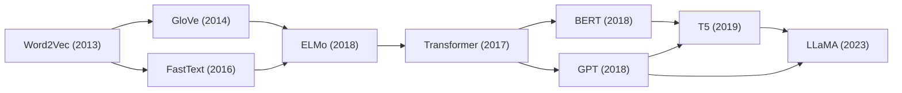
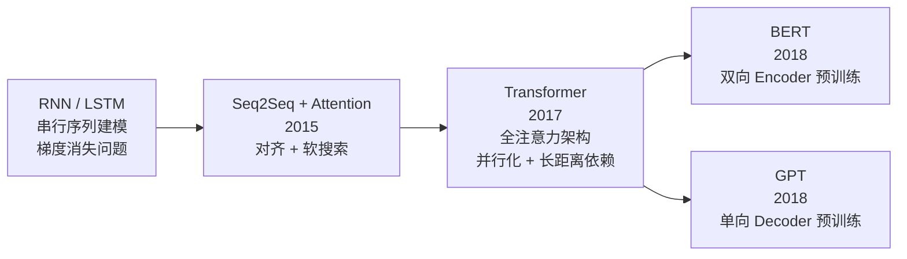
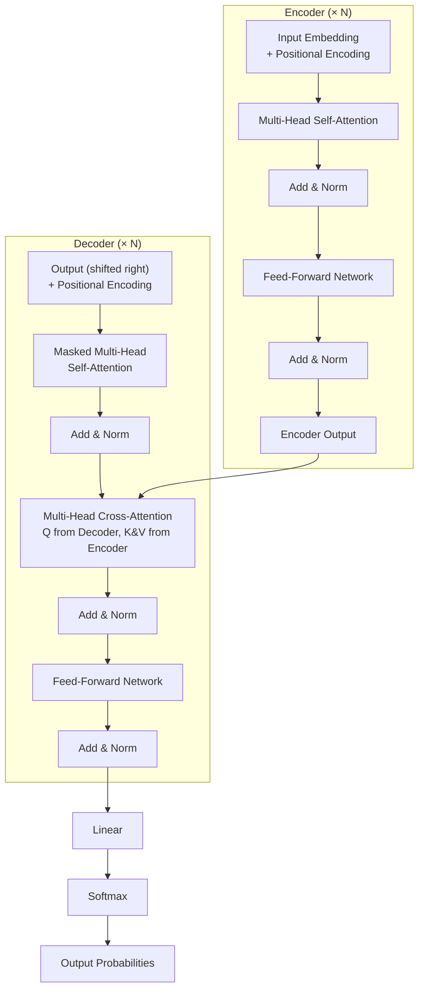
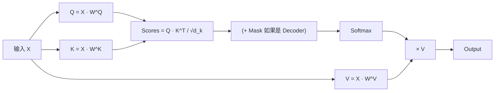

# Transformer

## 知识地图



## 前置知识

- **RNN / LSTM**：理解 RNN 的循环结构、LSTM 的门控机制，以及它们的核心局限——串行计算和时间步上的梯度消失。
- **Attention 机制**：理解 Seq2Seq 模型中的注意力机制（Bahdanau Attention, 2015），尤其是 Query-Key-Value 的基本概念。
- **Word Embedding**：理解 Word2Vec/GloVe 等词向量，以及将离散 token 映射为稠密向量的基本方法。
- **Layer Normalization**：理解对每个样本的特征维度做归一化，与 Batch Normalization 的区别。
- **残差连接 (Residual Connection)**：理解 ResNet 中的残差连接原理 $y = x + F(x)$，为何能缓解梯度消失。

## 模型演化路线



| 阶段 | 模型 | 核心突破 |
|------|------|----------|
| 序列建模 | RNN / LSTM / GRU | 处理变长序列，建模时序依赖 |
| 注意力引入 | Seq2Seq + Attention | 解码器可动态关注编码器的不同位置 |
| 全注意力 | Transformer | 完全摒弃循环，仅靠自注意力建模 |
| 预训练时代 | BERT / GPT | Transformer + 大规模预训练 = 范式革命 |

## 为什么会出现 (Why)

### RNN/LSTM 的三大根本缺陷

在 Transformer (2017) 之前，序列建模的标准方案是 RNN 及其变体 (LSTM/GRU)。它们存在三个不可逾越的问题：

**1. 串行计算，无法并行化（性能瓶颈）**

RNN 的计算是严格的时序串行：第 $t$ 步的隐状态 $h_t$ 必须等第 $t-1$ 步的 $h_{t-1}$ 计算完成后才能计算。这意味着：
- 一条 1000 个 token 的句子，需要 1000 个顺序步骤才能完成编码
- GPU 有成千上万个核心，但 RNN 只能用其中一个核心一步步算，其他核心全部闲置
- 训练时无法利用 GPU 的并行优势，大模型训练时间以周甚至月计

**2. 长距离依赖衰减（梯度消失）**

虽然 LSTM 设计了门控机制来缓解梯度消失，但在序列长度 $n$ 较大时，信息从位置 1 传到位置 $n$ 需要经过 $n$ 步隐状态更新。每一步都可能损失信息：
- 梯度在反向传播时连乘 $n$ 次，小梯度会指数级缩小
- 句子开头的词对句子结尾的预测几乎没有影响
- 典型 LSTM 的实际有效上下文长度只有约 30-50 个 token

**3. 信息传递路径过长**

RNN 中位置 $i$ 和位置 $j$ 之间的交互需要经过 $|i-j|$ 步隐状态传递。每个中间位置都是潜在的"信息瓶颈"——信息要么丢失，要么被扭曲。

### 为什么注意力机制能解决这些问题

Transformer 用**自注意力 (Self-Attention)** 同时解决以上三个问题：
- **并行化**：所有位置的注意力计算可以同时进行（$O(1)$ 并行步骤）
- **长距离依赖**：任意两个位置的交互路径长度恒为 $O(1)$（直接计算注意力权重）
- **信息传递**：每个位置的输出是所有位置的加权和，信息流无需经过中间位置接力

## 解决什么问题 (Problem)

用**全注意力架构**替代循环神经网络，实现：
1. 训练时完全并行化（相比 RNN 训练速度提升 10-100 倍）
2. 任意远距离的 token 之间直接交互（信息路径长度恒为 $O(1)$）
3. 一个统一的架构同时处理编码和解码（取代编码器用 RNN、解码器用另一个 RNN 的复杂设计）

## 核心思想 (Core Idea)

2017 年 "Attention Is All You Need" 论文提出的 Transformer 架构，完全基于自注意力机制，摒弃了 RNN 的递归结构，使得序列中任意两个位置的交互路径长度恒为 $O(1)$，开启了 NLP 和整个深度学习的新纪元。

---

## 数学模型 / 公式

### 缩放点积注意力 (Scaled Dot-Product Attention)

$$\text{Attention}(Q, K, V) = \text{softmax}\left(\frac{QK^T}{\sqrt{d_k}}\right)V$$

**通俗解释：** 把注意力机制想象成"用查询去搜索"。$Q$ 是你要找什么（查询），$K$ 是每个位置"是什么"的标签（键），$V$ 是每个位置的"内容"（值）。先用 $Q$ 和所有 $K$ 做点积（计算相似度），除以 $\sqrt{d_k}$ 防止内积太大导致 softmax 梯度消失，用 softmax 把相似度变成权重（和为 1），最后用这些权重对 $V$ 做加权求和。结果就是"对所有位置信息的按关注度加权组合"。

**为什么要除以 $\sqrt{d_k}$？**
- 当 $d_k$ 较大时（如 64），$QK^T$ 的元素值会很大（期望值为 0、方差为 $d_k$ 的随机向量内积）
- 大值进入 softmax 后，输出会极度接近 one-hot（梯度极小，近似饱和区）
- 除以 $\sqrt{d_k}$ 将方差缩放到 1，保持 softmax 输出在合理的平滑区

在 Encoder 的 Self-Attention 中 $Q = K = V$（都来自同一层的前一层输出）。

### 多头注意力 (Multi-Head Attention)

$$\text{MultiHead}(Q, K, V) = \text{Concat}(\text{head}_1, \ldots, \text{head}_h) W^O$$
$$\text{head}_i = \text{Attention}(Q W_i^Q, K W_i^K, V W_i^V)$$

**通俗解释：** 为什么要"多头"？因为单一的注意力只能关注一种关系模式。比如一句话里，某个词可能同时需要关注"语法上谁修饰谁"和"语义上谁和谁相关"。多头注意力就是把 $Q$、$K$、$V$ 分别投影到 $h$ 个不同的子空间（每个子空间维度为 $d_k = d_{model}/h$），在每个子空间里独立做注意力，最后把所有头的结果拼接起来。不同的头会学到不同的关系模式（有的头关注句法依存，有的头关注指代消解等）。

### 前馈网络 (Feed-Forward Network, FFN)

$$\text{FFN}(x) = \max(0, xW_1 + b_1)W_2 + b_2$$

（原始论文用 ReLU，现代实现用 GELU 等激活函数）

**通俗解释：** 自注意力做了信息的混合和重组（不同的 token 之间交换信息），FFN 则对每个 token 独立做非线性变换（相当于"消化和加工"刚收到的信息）。$W_1$ 把维度从 $d_{model}$ 扩到 $d_{ff}$（如 512→2048，给网络更大的容量），经过激活函数（引入非线性），$W_2$ 再压回 $d_{model}$。FFN 是 Transformer 中参数量最大的部分。

### 残差连接 + 层归一化

每个子层后：

$$\text{Output} = \text{LayerNorm}(x + \text{Sublayer}(x))$$

**通俗解释：** 残差连接 ($x + F(x)$) 让梯度可以直接通过"短路"回传，不用全部经过复杂的注意力或 FFN 计算，大大缓解深层网络的梯度消失问题。层归一化 (LayerNorm) 对每个 token 的特征维度做标准化，稳定训练。

- **Post-Norm**（原始论文）：先加子层再归一化 → $\text{LayerNorm}(x + F(x))$
- **Pre-Norm**（现代做法）：先归一化再加子层 → $x + F(\text{LayerNorm}(x))$ → 训练更稳定，GPT/LLaMA 采用

### 位置编码 (Positional Encoding)

$$\text{PE}(pos, 2i) = \sin(pos / 10000^{2i/d_{model}})$$
$$\text{PE}(pos, 2i+1) = \cos(pos / 10000^{2i/d_{model}})$$

**通俗解释：** 注意力机制本身是**位置无关**的——它只看内容相似度，不管词在什么位置。但语言中词序至关重要（"狗咬人" vs "人咬狗"）。位置编码就是在每个 token 的 embedding 上加一个与位置相关的向量。正弦/余弦函数被选中是因为：(1) 不同频率的正弦波可以让模型区分不同位置；(2) $\sin(a+b) = \sin a\cos b + \cos a\sin b$ 的性质使模型能学到相对位置关系；(3) 可以外推到比训练时更长的序列。

### 解码器中的因果掩膜 (Causal Masking)

确保位置 $i$ 只能关注 $< i$ 的位置（自回归生成）：

```python
mask = torch.triu(torch.ones(seq_len, seq_len), diagonal=1).bool()
scores = scores.masked_fill(mask, float('-inf'))
```

**通俗解释：** 在生成文本时，模型只能看到"已经写出来的部分"，不能偷看未来的词。因果掩膜就是在上三角矩阵中填入 $-\infty$，softmax 后这些位置的注意力权重变为 0，强制位置 $i$ 只能看到位置 $0,1,\ldots,i-1$。

### 交叉注意力 (Cross-Attention)

解码器从编码器输出中获取输入序列信息。Q 来自解码器，K、V 来自编码器。

**通俗解释：** 自注意力是"自己看自己"，交叉注意力是"解码器的每个位置去看编码器的所有位置"。翻译任务中，解码器在生成每个译文词时，通过交叉注意力去查看源语言句子的哪些词与当前生成的词最相关。

---

## 超参数

| 参数 | Base | Big |
|------|------|-----|
| $d_{model}$ | 512 | 1024 |
| $h$ (头数) | 8 | 16 |
| $d_{ff}$ | 2048 | 4096 |
| $N$ (层数) | 6 | 6 |
| Dropout | 0.1 | 0.3 (BIG)|

## 可视化展示

### Transformer 完整架构图



### 自注意力计算流程



## 为什么 Transformer 替代了 RNN/LSTM？

| 维度 | RNN / LSTM | Transformer |
|------|----------|-------------|
| **并行度** | 串行，$O(n)$ 时间步 | 并行，$O(1)$ 时间步（所有位置同时计算） |
| **长距离依赖** | 间接，需要 $O(n)$ 步隐状态传递，信息衰减 | 直接，任意两个位置 $O(1)$ 路径，无衰减 |
| **训练速度** | 慢（无法利用 GPU 并行） | 快（GPU 友好，可大批量训练） |
| **梯度传播** | 通过时间反向传播 (BPTT)，$n$ 步连乘 | 残差连接 + 直接路径 |
| **有效上下文** | 实际约 30-50 token（LSTM） | 理论上无限（受计算量和显存限制） |
| **可解释性** | 隐状态是"黑盒" | 注意力权重可视化，可看出哪些词互相影响 |

Transformer 是现代 AI（BERT, GPT, ViT, DALL-E, Sora）的统一架构基础。

## 最小可运行代码

### PyTorch — 缩放点积注意力

```python
import torch
import torch.nn as nn
import torch.nn.functional as F

def scaled_dot_product_attention(Q, K, V, mask=None):
    """
    Q, K, V: [batch, heads, seq_len, d_k]
    """
    d_k = Q.size(-1)
    scores = torch.matmul(Q, K.transpose(-2, -1)) / torch.sqrt(torch.tensor(d_k, dtype=torch.float32))

    if mask is not None:
        scores = scores.masked_fill(mask == 0, float('-inf'))

    attn_weights = F.softmax(scores, dim=-1)
    output = torch.matmul(attn_weights, V)
    return output, attn_weights


class MultiHeadAttention(nn.Module):
    def __init__(self, d_model=512, n_heads=8):
        super().__init__()
        assert d_model % n_heads == 0
        self.d_k = d_model // n_heads
        self.n_heads = n_heads

        self.W_Q = nn.Linear(d_model, d_model)
        self.W_K = nn.Linear(d_model, d_model)
        self.W_V = nn.Linear(d_model, d_model)
        self.W_O = nn.Linear(d_model, d_model)

    def forward(self, Q, K, V, mask=None):
        batch_size = Q.size(0)

        # 线性投影 + 分头
        Q = self.W_Q(Q).view(batch_size, -1, self.n_heads, self.d_k).transpose(1, 2)
        K = self.W_K(K).view(batch_size, -1, self.n_heads, self.d_k).transpose(1, 2)
        V = self.W_V(V).view(batch_size, -1, self.n_heads, self.d_k).transpose(1, 2)

        # 缩放点积注意力
        attn_output, attn_weights = scaled_dot_product_attention(Q, K, V, mask)

        # 合并多头
        attn_output = attn_output.transpose(1, 2).contiguous().view(batch_size, -1, self.n_heads * self.d_k)
        return self.W_O(attn_output), attn_weights
```

## 工业界应用

| 应用场景 | 说明 | 基于 Transformer 的典型模型 |
|----------|------|---------------------------|
| 机器翻译 | Transformer 最初设计的任务 | 原版 Transformer, mBART |
| 文本生成 | 自回归生成高质量长文本 | GPT 系列 (GPT-3, GPT-4) |
| 文本理解 | 分类、问答、NER、情感分析 | BERT, RoBERTa |
| 代码生成 | 根据自然语言描述生成代码 | Codex, CodeLlama |
| 计算机视觉 | 图像分类、目标检测、生成 | ViT, DETR, DALL-E |
| 语音处理 | 语音识别、合成 | Whisper, SpeechT5 |
| 多模态 | 图文理解与生成 | CLIP, GPT-4V, Sora |

## 对比表格

| | RNN | LSTM | Transformer |
|------|-----|------|-------------|
| 核心机制 | 循环隐状态 | 门控 + 记忆单元 | 自注意力 |
| 并行度 | 串行 $O(n)$ | 串行 $O(n)$ | 并行 $O(1)$ |
| 长距离依赖 | 差 | 中等（30-50 token） | 优秀（$O(1)$ 路径） |
| 参数量 | 少 | 中等 | 多（FFN 层占大头） |
| 训练速度 | 慢 | 中等 | 快（GPU 友好） |
| 推理速度 | 快（单步计算量小） | 中等 | 慢（逐 token 生成时需 KV Cache） |
| 年份 | 1986 | 1997 | 2017 |

## 学完后建议继续学习

1. **BERT**：理解如何用 Transformer Encoder 做双向预训练（MLM + NSP）
2. **GPT**：理解如何用 Transformer Decoder 做自回归语言模型预训练
3. **T5 / BART**：理解如何用 Transformer Encoder-Decoder 统一 NLP 任务
4. **Vision Transformer (ViT)**：理解 Transformer 如何从 NLP 迁移到计算机视觉

## 高频面试题

### Q1: Transformer 为什么要用多头注意力而不是单头？

**标准答案：**
- 单头注意力只能学习一种注意力分布模式，但实际上序列中不同位置之间存在**多种关系**（如句法依存、指代消解、语义关联等）。
- 多头注意力通过 $h$ 组独立的 $W^Q$、$W^K$、$W^V$ 投影矩阵，将输入映射到 $h$ 个不同的子空间，每个头可以学到不同的关系模式。
- 实验表明：(1) 多头比单头效果好；(2) 一定范围内头数越多效果越好；(3) 不同头确实学到了不同的模式（通过注意力权重可视化验证）。
- 代价：计算量和参数量与头数成正比（但 $d_k = d_{model} / h$，总计算量 $h \cdot n \cdot d_k^2$ 与单头 $n \cdot d_{model}^2$ 相同）。

### Q2: 为什么 Transformer 的位置编码用 sin/cos 而不是可学习的 embedding？

**标准答案：**
- **外推能力**：sin/cos 是确定性函数，给定位置 pos 可直接计算。训练时见过最大长度 512，推理时可以外推到更长的序列（虽然不完美，但有一定的泛化性）。可学习的位置 embedding 表大小固定，无法处理训练时未见过的位置。
- **相对位置信息**：$\sin(\alpha+\beta) = \sin\alpha\cos\beta + \cos\alpha\sin\beta$，这使得模型可以通过线性变换学习相对位置关系。两个位置的 PE 之间的点积仅依赖于它们的位置差 $pos_2 - pos_1$。
- 实际上，后续研究（如 BERT 用可学习位置 embedding，RoPE 用旋转位置编码）在不同场景下各有优劣。

### Q3: Transformer 中的 LayerNorm 和 BatchNorm 有什么区别？为什么 Transformer 用 LayerNorm？

**标准答案：**
- **BatchNorm**：对同一个特征维度，在一个 batch 的所有样本上做归一化。问题：(1) 依赖 batch size，小 batch 时统计量不稳定；(2) 在 NLP 中序列长度不一，padding 位置会干扰统计量；(3) 训练和推理行为不一致（推理时用训练集统计的滑动平均）。
- **LayerNorm**：对同一个样本，在所有特征维度上做归一化。优势：(1) 不依赖 batch size，单个样本即可计算；(2) 序列长度可变不影响；(3) 训练和推理行为一致。
- **Pre-Norm vs Post-Norm**：原始 Transformer 用 Post-Norm ($\text{LayerNorm}(x+F(x))$)，但现代模型（GPT-2/3, LLaMA）普遍用 Pre-Norm ($x+F(\text{LayerNorm}(x))$)，因为 Pre-Norm 训练更稳定、收敛更快、对学习率不那么敏感。

### Q4: 为什么 Transformer 的 FFN 要先升维再降维？

**标准答案：**
- FFN 的设计是 $d_{model} \rightarrow d_{ff} \rightarrow d_{model}$（如 512→2048→512）。中间的升维给了网络更大的容量，让它能学习更丰富的非线性变换。
- 这是借鉴了 SVM 的核函数思想：在低维空间线性不可分的数据，投影到高维空间后可能变得线性可分。
- 如果 FFN 只是 $d_{model} \rightarrow d_{model}$ 的恒等映射附近的变换，网络容量不足，无法充分加工自注意力层传递来的信息。
- 典型比例：$d_{ff} / d_{model} = 4$（如 BERT 中 768→3072→768）。

### Q5: Transformer 的 Decoder 在推理时为什么要用 KV Cache？

**标准答案：**
- 自回归生成时，每生成一个新 token，需要把它拼接到已有序列后面，重新跑一遍完整的 Decoder。
- **不用 KV Cache**：每次生成第 $t$ 个 token 时，要对长度为 $t$ 的序列做完整的自注意力计算，计算量为 $O(t^2)$。生成 $N$ 个 token 的总计算量为 $O(N^3)$。
- **使用 KV Cache**：将之前计算过的 Key 和 Value 缓存起来。生成第 $t$ 个 token 时，新 token 只计算自己的 Q，与缓存的 K 做注意力，与缓存的 V 做加权求和。这一步的计算量为 $O(t)$。生成 $N$ 个 token 的总计算量降至 $O(N^2)$。
- KV Cache 是自回归 Transformer 推理时最重要的优化之一，几乎所有 LLM 推理框架都依赖它。
