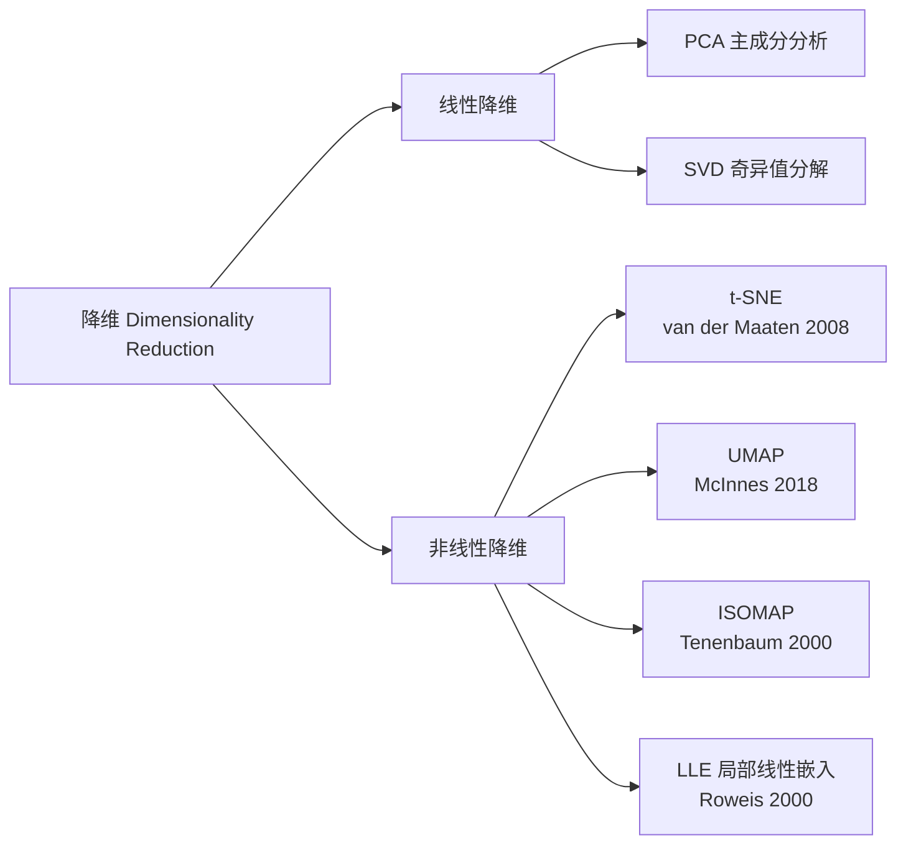

# t-SNE / UMAP

## 知识地图



## 前置知识

- **PCA 与线性降维**：理解 PCA 为什么只能捕获线性结构，以及在什么场景下非线性降维是必要的。
- **概率与信息论**：KL 散度 (Kullback-Leibler Divergence) 的定义和性质——衡量两个概率分布之间差异的度量。$KL(P\|Q) \neq KL(Q\|P)$（不对称）。
- **梯度下降 (Gradient Descent)**：t-SNE 和 UMAP 都是通过梯度下降优化低维嵌入坐标。
- **流形学习 (Manifold Learning)**：理解"高维数据通常分布在远低于原始维度的低维流形上"这一核心假设。
- **t 分布 vs 高斯分布**：t 分布的重尾特性（自由度越低，尾部越重）——这是 t-SNE 解决"拥挤问题"的关键。

## 为什么会出现 (Why)

PCA 虽然高效，但有一个根本性的限制：**它只能发现数据中的线性结构**。想象一群点分布在一个弯曲的"瑞士卷"表面上——这个表面在 3D 中占用的体积很大，但如果沿着表面"展开"，它本质上是一个 2D 的平面。PCA 会直接"切"过这个表面进行投影（因为它是线性的），而 t-SNE 和 UMAP 则可以沿着流形"展开"它，将弯曲的表面映射到平坦的 2D 平面上。**非线性降维的动机就是：保留数据在高维空间中的"邻居关系"，而非"欧氏距离"**。

## 解决什么问题 (Problem)

- **高维数据的 2D/3D 可视化**：使人类可以直观地观察数据中的聚类结构、异常点、趋势。
- **保留局部邻域结构**：在高维空间中靠得很近的点，在低维嵌入中也应靠得很近。
- **揭示数据的内在流形结构**：发现数据中存在的非线性低维子空间。

## 核心思想 (Core Idea)

- **t-SNE**：将高维和低维空间中的点对相似度分别建模为两个概率分布（高维用高斯核，低维用 t 分布），然后通过最小化两者之间的 KL 散度来"对齐"这两个分布——本质上是在低维空间中"复原"高维空间中的邻域关系。
- **UMAP**：基于黎曼几何和拓扑数据分析构建高维数据的"模糊拓扑表示"，在低维空间中用一个相似的表示去逼近它，使用交叉熵而非 KL 散度作为损失函数，更好地保留了全局结构。

---

## t-SNE (t-Distributed Stochastic Neighbor Embedding)

t-SNE 是一种**非线性降维**方法，专门用于**可视化**高维数据。它在低维空间中保持高维空间中点的**局部邻域关系**，使用 t 分布避免低维空间的"拥挤问题"。

---

### t-SNE 数学模型

**Step 1 --- 高维空间的条件概率**（高斯核）：

$$p_{j|i} = \frac{\exp(-\|x_i - x_j\|^2 / 2\sigma_i^2)}{\sum_{k \neq i} \exp(-\|x_i - x_k\|^2 / 2\sigma_i^2)}$$

对称化：$p_{ij} = \frac{p_{j|i} + p_{i|j}}{2n}$

> **通俗解释：** $p_{j|i}$ 表示"在高维空间中，$x_i$ 选择 $x_j$ 作为邻居的概率"。这个概率是通过高斯核计算的——距离越近，概率越大。每个点 $x_i$ 有自己的 $\sigma_i$（由困惑度控制），在高密度区域的点 $\sigma_i$ 更小（只看很近的邻居），低密度区域的点 $\sigma_i$ 更大（看更远的邻居）。

**Step 2 --- 低维空间的相似度**（t 分布，1 个自由度）：

$$q_{ij} = \frac{(1 + \|y_i - y_j\|^2)^{-1}}{\sum_{k \neq l} (1 + \|y_k - y_l\|^2)^{-1}}$$

> **通俗解释：** 低维空间用的是 t 分布（自由度=1），而不是高斯分布。t 分布的重尾意味着：在低维空间中，距离较远的点对也允许有非零的相似度（而高斯核会将其压缩为零）。这解决了"拥挤问题"——如果低维空间用高斯核，距离中等的点会被无差别地挤在一起，无法区分。

> **为什么用 t 分布？** t 分布的重尾特性使得高维空间中中远距离的点在低维中被拉开，解决了"拥挤问题"（高斯核把所有点挤在一起）。

**Step 3 --- 最小化 KL 散度**：

$$\text{KL}(P \| Q) = \sum_{i \neq j} p_{ij} \log \frac{p_{ij}}{q_{ij}}$$

> **通俗解释 --- KL 散度的不对称性：** KL(P\|Q) 的含义是"用概率分布 Q 来近似 P 时所损失的信息量"。t-SNE 选择了 KL(P\|Q) 而非 KL(Q\|P)，这种选择有其后果：
> - 当 $p_{ij}$ 很大（高维中很近）而 $q_{ij}$ 很小（低维中很远）时，损失巨大——t-SNE 会"不惜代价"地把高维邻居在低维中也拉到一起。**这解释了为什么 t-SNE 非常善于保留局部结构。**
> - 当 $p_{ij}$ 很小（高维中很远）而 $q_{ij}$ 很大（低维中很近）时，损失很小——t-SNE 不太关心"把不相关的东西拉开了多少"。**这解释了为什么 t-SNE 的全局结构可能失真。**

梯度下降更新低维嵌入：

$$\frac{\partial C}{\partial y_i} = 4 \sum_j (p_{ij} - q_{ij}) (y_i - y_j)(1 + \|y_i - y_j\|^2)^{-1}$$

> **通俗解释 --- 梯度：** 梯度由 $(p_{ij} - q_{ij})$ 主导——如果 $p_{ij} > q_{ij}$（高维相似度 > 低维相似度），梯度会将 $y_i$ 和 $y_j$ 拉近（吸引力）；如果 $p_{ij} < q_{ij}$（低维中太近了），梯度会将它们推开（排斥力）。$(1 + \|y_i - y_j\|^2)^{-1}$ 这个因子使得力和距离的关系服从 t 分布而非高斯分布。

### 困惑度 (Perplexity)

控制 $\sigma_i$ 的参数，典型值 5~50：

$$\text{Perp}(P_i) = 2^{H(P_i)}, \quad H(P_i) = -\sum_j p_{j|i} \log_2 p_{j|i}$$

> **通俗解释：** 困惑度 roughly 等于"每个点有多少个有效的邻居"。困惑度为 30 意味着每个点大约有 30 个邻居在定义其局部结构时起作用。困惑度太小（如 5），只看极近邻，低维图过于分散；困惑度太大（如 100），全局结构会主导，但局部细节消失。t-SNE 对困惑度的变化是"渐变式"的（不是灾难性的），所以推荐在 5~50 之间尝试不同的值。

---

## UMAP (Uniform Manifold Approximation and Projection)

### 核心思想

UMAP 基于**黎曼几何和拓扑数据分析**，比 t-SNE 更快且更好地保留了全局结构。

> **通俗解释：** t-SNE 的底层逻辑是"概率分布匹配"（有点像统计学家做的东西），UMAP 的底层逻辑是"拓扑结构匹配"（有点像数学家做的东西）。UMAP 首先在高维空间中构建一个"模糊单纯形集"（fuzzy simplicial set）——你可以把它想象成一种带有"不确定度"的图，节点是数据点，边的权重表示两个点之间的"连通性"。然后，UMAP 在低维空间中构建一个类似的图，并最小化两个图的差异。

### 关键步骤

1. **构建模糊单纯形集**（fuzzy simplicial set）表示高维拓扑结构
2. **优化低维嵌入**使得低维模糊单纯形集尽可能匹配高维

UMAP 使用**交叉熵**而非 KL 散度作为损失：

$$L = \sum_{i,j} \left[ p_{ij} \log\frac{p_{ij}}{q_{ij}} + (1-p_{ij})\log\frac{1-p_{ij}}{1-q_{ij}} \right]$$

> **通俗解释 --- 交叉熵 vs KL 散度：** t-SNE 的 KL 散度只关注 $p_{ij} \log(p_{ij}/q_{ij})$ 这一项，对"高维很近但低维很远"的惩罚很重，但对"高维很远但低维很近"几乎不惩罚。UMAP 的交叉熵加了第二项 $(1-p_{ij})\log((1-p_{ij})/(1-q_{ij}))$——这一项专门惩罚"高维中不连接的边缘但在低维中被错误地放在一起"。这迫使 UMAP 在保留局部结构的同时，也努力保持全局结构（"不是邻居的东西不要靠在一起"）。**这就是 UMAP 比 t-SNE 更好地保留全局结构的数学原因。**

---

## 算法流程图 (t-SNE)

```mermaid
graph TD
    Start[🎯 开始: 高维数据 X<br/>设定困惑度 Perplexity] --> CalcP[📐 Step 1: 计算高维条件概率 p_{j|i}<br/>为每个点自适应选择 σᵢ<br/>使得每个点的困惑度 ≈ Perp]
    CalcP --> SymP[📊 对称化: p_{ij} = (p_{j|i} + p_{i|j}) / 2n]
    SymP --> EarlyExag[🔍 早期放大: p_{ij} ← p_{ij} × 放大因子<br/>先用更大的 p 拉开初始簇]
    EarlyExag --> InitY[🎲 初始化低维嵌入 Y<br/>通常用 PCA 初始化]
    InitY --> Optim{梯度下降循环}
    Optim --> CalcQ[📐 Step 2: 计算低维相似度 q_{ij}<br/>使用 t 分布, 自由度 = 1]
    CalcQ --> KL[📉 Step 3: 计算 KL 散度<br/>梯度 ∂C/∂yᵢ]
    KL --> Update[🔄 更新低维坐标 yᵢ<br/>yᵢ ← yᵢ - η·∂C/∂yᵢ + momentum]
    Update --> Check{达到最大迭代次数<br/>或收敛?}
    Check -->|否| Optim
    Check -->|是| End[✅ 输出: 低维嵌入 Y<br/>用于 2D/3D 可视化]
```

---

## 可视化展示

### t-SNE vs UMAP 在不同数据集上的对比

- **MNIST (手写数字)**：t-SNE 通常生成更紧凑的"团块"（每个数字聚成一个紧团），团块之间的距离没有明确含义。UMAP 的簇之间会保持相对位置关系——相似的数字（如 4 和 9）在 UMAP 中通常靠得比不相似的（如 1 和 8）更近。
- **scRNA-seq (单细胞 RNA 测序)**：UMAP 是生物信息学界的"标配"——它不仅聚类了细胞类型，还保持了发育轨迹（细胞分化路径）在低维图中的连续性，而 t-SNE 会打破这些轨迹。

### 困惑度对 t-SNE 结果的影响

- Perplexity = 5：只保留极局部结构，簇被过度打散成小碎片
- Perplexity = 30（默认）：通常是最平衡的选择
- Perplexity = 100：全局结构更明显，但局部细节模糊

---

## 最小可运行代码

```python
# t-SNE: 可视化，小数据
from sklearn.manifold import TSNE
embedding = TSNE(perplexity=30, random_state=42).fit_transform(X)

# UMAP: 大数据，需保留全局结构
import umap
embedding = umap.UMAP(n_neighbors=15, min_dist=0.1, random_state=42).fit_transform(X)
```

> **注意**：两者都是随机算法，多次运行结果可能不同。且它们主要用于可视化，**不适合**作为其他 ML 流程中的降维步骤。

---

## t-SNE vs UMAP

| | t-SNE | UMAP |
|------|-------|------|
| 速度 | 慢 ($O(n^2)$) | 快 |
| 全局结构 | 差 | 较好 |
| 可扩展性 | 受限 | 支持新点嵌入 |
| 超参数 | 困惑度 | n_neighbors + min_dist |
| 理论基础 | 概率 | 拓扑 |
| 损失函数 | KL 散度 (不对称) | 交叉熵 (对称惩罚) |
| 新点映射 | 不支持 | 支持 (transform 方法) |

---

## 工业界应用

| 场景 | 说明 | 推荐方法 |
|------|------|----------|
| **生物信息学** | 单细胞 RNA 测序可视化、细胞类型聚类 | UMAP（保留发育轨迹） |
| **计算机视觉** | CNN 特征嵌入可视化、模型调试 | t-SNE（小规模精细可视化） |
| **自然语言处理** | 词向量可视化、文档聚类探索 | t-SNE / UMAP |
| **异常检测探索** | 高维特征空间中查找异常的直观分布 | UMAP（支持新点投影） |
| **推荐系统** | 用户/物品嵌入的聚类可视化分析 | UMAP（速度快，支持大规模） |

---

## 对比表格

### PCA vs t-SNE vs UMAP

| 维度 | PCA | t-SNE | UMAP |
|------|-----|-------|------|
| **降维类型** | 线性 | 非线性 | 非线性 |
| **保什么** | 全局方差（欧氏距离） | 局部邻域关系 | 局部 + 部分全局结构 |
| **速度** | 极快 $O(d^3 + nd^2)$ | 慢 $O(n^2)$ | 快（比 t-SNE 快很多） |
| **可解释性** | 主成分有明确物理含义 | 坐标无直接物理含义 | 坐标无直接物理含义 |
| **新点嵌入** | 支持（直接投影） | 不支持 | 支持（transform 方法） |
| **确定性** | 确定 | 随机 | 随机（种子可控制） |
| **主要用途** | 预处理 + 压缩 + 探索 | 纯可视化 | 可视化 + 下游特征 |
| **大数据的适用性** | 极好 | 差 | 好 |
| **全局距离保留** | 好 | 差 | 中等 |

---

## 学完后建议继续学习

1. **PaCMAP / TriMAP**——新一代降维方法，在保留局部和全局结构上都优于 t-SNE 和 UMAP，且速度更快（计算复杂度更低）。
2. **PHATE**——专门为生物数据（如单细胞 RNA-seq）设计的降维方法，保留"发育轨迹"中的分支和进展信息。
3. **对比学习 (Contrastive Learning) 中的表示学习**——SimCLR、t-SNE/UMAP 常用于可视化对比学习得到的嵌入空间。
4. **DensMAP / densMAP**——UMAP 的密度感知扩展，在保持全局和局部结构的同时还保留数据的密度信息。
5. **大模型时代的嵌入可视化**——如何使用 t-SNE/UMAP 分析 LLM 的隐藏层表示、对比不同模型或不同层的嵌入空间。

---

## 高频面试题

### Q1: t-SNE 的"拥挤问题"是什么？为什么用 t 分布可以解决？

**标准答案：** 拥挤问题 (Crowding Problem) 是指：当将高维数据降维到低维（如 2D）时，低维空间中"可用的空间"远小于高维空间，导致中远距离的点对在低维中无法被正确展开——它们会被"挤"到一起，使得不同簇之间的边界模糊。t 分布（自由度=1）的解决方案：t 分布的重尾意味着即使两点在低维空间中距离很远，它们之间的相似度 $q_{ij}$ 也不会迅速衰减为 0，这使得中等距离的点对仍然可以在梯度中有非零的贡献（排斥力），从而在优化过程中自然地被"推开"。相比之下，高斯分布的尾部是指数衰减的——如果两点在低维中距离超过 3 个 sigma，$q_{ij}$ 基本为 0，梯度消失，这两点永远无法被推开。

### Q2: t-SNE 和 UMAP 的核心区别是什么？各适合什么场景？

**标准答案：**
- **损失函数不同**：t-SNE 用 KL 散度，只对"高维很近但低维很远"有强惩罚（重局部）；UMAP 用交叉熵，同时对"高维很远但低维很近"也施加惩罚（兼顾全局）。
- **速度不同**：t-SNE 的复杂度是 $O(n^2)$，UMAP 远快于 t-SNE，可以在百万级数据上运行。
- **可扩展性不同**：t-SNE 不支持新点嵌入（新的点必须从头重新运行），UMAP 支持 `transform()` 方法将新点映射到已有嵌入空间。
- **应用场景不同**：
  - t-SNE：小数据（n < 10,000）的精细可视化，需要紧凑的簇分离效果。
  - UMAP：大数据集、需要保持全局轨迹（如发育生物学中的细胞分化路径）、需要将测试集投影到训练集的嵌入空间中。

### Q3: t-SNE 的困惑度 (Perplexity) 怎么选？太大或太小会有什么影响？

**标准答案：** 困惑度 roughly 定义为每个点的"有效邻居数量"。典型值范围是 5~50，默认值是 30。
- **太小（如 2~5）**：只有最近的几个邻居影响嵌入，结果会过度分散——即使本应是同一簇的点也会被拆散为多个小碎片，因为每个点只和极少数邻居"对话"。
- **太大（如 100~200）**：每个点会关注较多的邻居，局部结构的细节会丢失，全局结构会被拉得更"平"。对于大样本量（n > 10,000），推荐用较大的困惑度（50~100），因为数据密度已经很高。
- **建议**：t-SNE 对困惑度的变化是"稳健"的（不会在 25 和 35 之间产生剧变），建议在 [5, 10, 30, 50, 100] 上分别运行并观察结果的稳定性。

### Q4: 为什么 PCA 过后再用 t-SNE/UMAP 是一个好习惯？

**标准答案：** 有两个原因：
1. **降噪**：PCA 的前几个主成分保留了大部分信息，而噪声通常集中在方差最小的主成分上。先 PCA 到 50~100 维再 t-SNE/UMAP，相当于滤掉了高频噪声，低维嵌入的质量通常更好。
2. **加速**：t-SNE 的第一步（高维概率计算）需要计算所有点对的距离，复杂度是 $O(n^2 d)$。如果先用 PCA 将维度从几万降到 50，距离计算的时间会大幅缩短（从 $d=10000$ 降为 $d=50$，速度提升 200 倍）。

### Q5: t-SNE 和 UMAP 能替代 PCA 作为 ML 管道中的特征降维步骤吗？

**标准答案：** **通常不能。** 原因如下：
1. **非确定性**：两者都是随机算法，多次运行结果不同——这会使得下游模型的评估和调参变得不可靠（同样的数据每次训练得到不同特征）。
2. **不保留全局距离**：t-SNE 几乎不保留全局距离信息（两个簇在低维中的距离与高维中的距离毫无关系），UMAP 部分保留但仍不如 PCA。
3. **不适合新点嵌入（t-SNE）**：训练后的 t-SNE 模型无法将新的测试样本映射到相同的嵌入空间。
4. **维度限制**：t-SNE 和 UMAP 通常只降到 2D/3D（用于可视化），极少降到更高维度。

它们的主要用途是**可视化和探索性分析**，而非特征工程。如果需要在 ML 管道中做非线性降维，可以考虑 Kernel PCA、AutoEncoder 或保留 UMAP（因为 UMAP 支持 transform 且对全局结构保留更好）。
