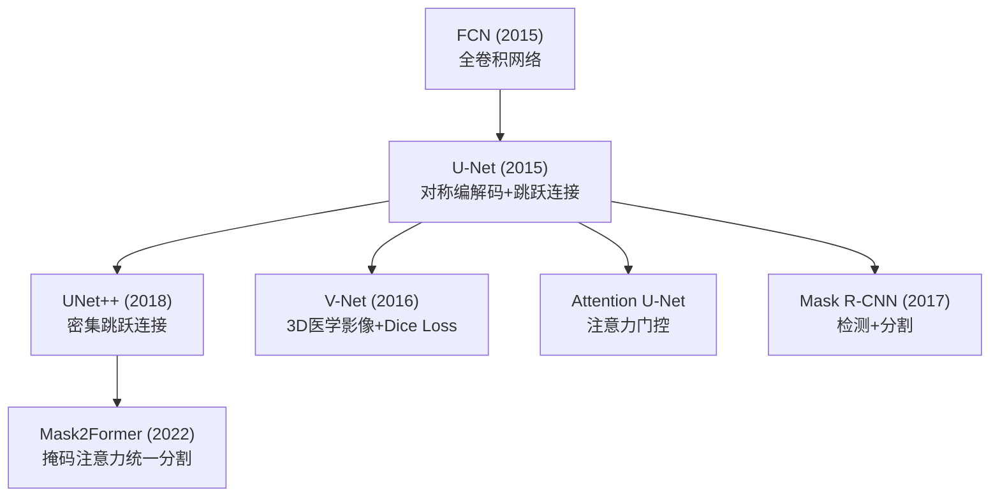
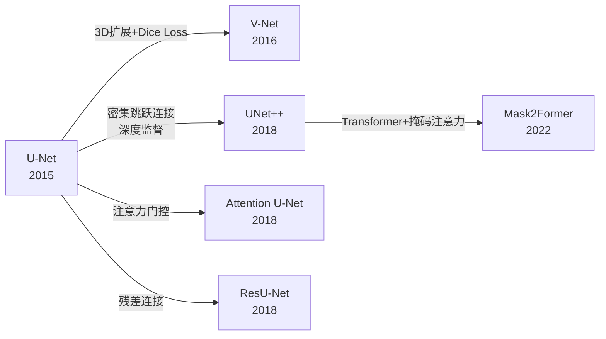
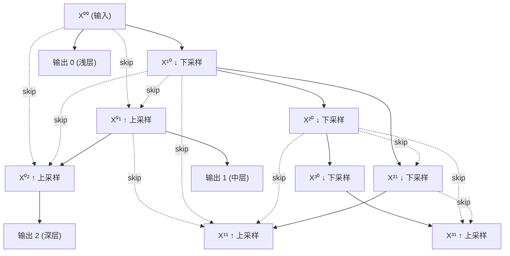
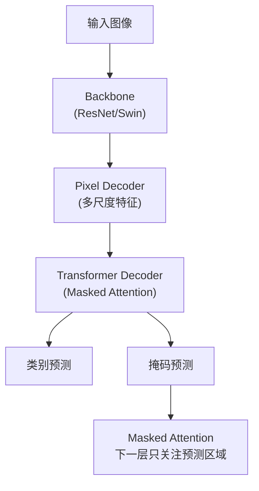

# U-Net Variants (UNet++ / V-Net / Mask2Former)

## 知识地图



## 前置知识

- **U-Net**：编码器-解码器 + 跳跃连接的基本架构
- **语义分割**：逐像素分类任务
- **实例分割与全景分割**：区分同一类别的不同实例
- **Transformer Decoder**：交叉注意力、自注意力机制

## 模型演化路线



| Model | Year | Key Innovation |
|-------|------|---------------|
| U-Net | 2015 | 对称编解码 + 跳跃连接，生物医学分割基准 |
| V-Net | 2016 | 3D 卷积 + Dice Loss，处理类不平衡 |
| UNet++ | 2018 | 密集跳跃连接 + 深度监督，自适应网络深度 |
| Attention U-Net | 2018 | 注意力门控，抑制无关区域激活 |
| ResU-Net | 2018 | 残差连接增强梯度流动 |
| Mask2Former | 2022 | 掩码注意力，统一语义/实例/全景分割 |

## 为什么会出现 (Why)

原始 U-Net 虽然设计优雅，但有三个核心局限：(1) **最优深度未知**——不同任务需要不同感受野和抽象层级，固定深度无法适应所有场景；(2) **仅限 2D**——医学影像（CT/MRI）是 3D 数据，2D 切片分割忽视体积上下文；(3) **只能语义分割**——无法区分同一类别的不同实例（如两张重叠的桌子）。

## 解决什么问题 (Problem)

1. **UNet++**：不同任务需要不同的网络深度，UNet++ 通过密集跳跃连接让网络自动学习最优深度
2. **V-Net**：3D 医学影像（CT/MRI）的体素分割 + 前景/背景极度不平衡（器官 < 1% 体积）
3. **Mask2Former**：用一个统一的架构处理语义分割、实例分割、全景分割三种任务

## 核心思想 (Core Idea)

**UNet++ 用密集跳跃连接 + 深度监督解决网络深度不确定性问题，V-Net 将 U-Net 扩展到 3D 并用 Dice Loss 处理极度类不平衡，Mask2Former 引入掩码注意力将三种分割任务统一为掩码分类问题。**

---

## 模型结构图

### UNet++ 密集连接架构



### Mask2Former 架构



## 数学模型/公式

### UNet++ — 密集跳跃连接

在第 $j$ 层，节点 $\mathbf{x}^{i,j}$ 的输入来自**所有浅层同分辨率节点的拼接**：

$$
\mathbf{x}^{i,j} =
\begin{cases}
H(\mathbf{x}^{i-1,j}) & \text{if } j=0 \text{ (纯下采样路径)} \\
H([\mathbf{x}^{i,k}]_{k=0}^{j-1}, \mathcal{U}(\mathbf{x}^{i+1,j-1})) & \text{if } j>0
\end{cases}
$$

**通俗解释：** UNet++ 中每个节点不只接收上一层的一个输入，而是接收所有同一分辨率的前序节点输出。这就像一个学生在写论文时不仅参考导师的意见，还参考所有学长学姐的笔记——信息越丰富，决策越准。$j=0$ 的节点在纯下采样路径上，只有前一个编码器节点作为输入。$j>0$ 的节点则接收 $j$ 个同层 skip 连接 + 1 个更深层的上采样输入。

### V-Net — 3D 卷积 + Dice Loss

将 U-Net 所有 2D 操作替换为 3D 卷积。关键创新是 **Dice Loss**：

$$
\text{Dice} = \frac{2 \sum_i p_i g_i}{\sum_i p_i + \sum_i g_i}
$$

**通俗解释：** Dice 系数衡量两个集合的重叠程度。$p_i$ 是预测为前景的概率，$g_i$ 是真实标记（0 或 1）。分子是预测和真实的交集（2 倍），分母是两者大小的总和。完美重合时 Dice = 1，完全不重合时 Dice = 0。

Dice Loss = 1 - Dice。与交叉熵对比：CE 对每个体素独立计算误差，在背景占 99% 体积的器官分割任务中，模型只需预测"全是背景"就能获得 99% 准确率但 Dice 接近 0。Dice 直接优化重叠度，天然处理类不平衡。

### Mask2Former — 掩码注意力

Mask2Former 将分割统一为**掩码分类**问题。Transformer decoder 中的 cross-attention 被替换为 **masked attention**——每个 query 只关注它预测的掩码区域：

$$
\text{MaskedAttn}(\mathbf{Q}, \mathbf{K}, \mathbf{V}) = \text{softmax}\left(\frac{\mathbf{QK}^T}{\sqrt{d}} + M\right)\mathbf{V}
$$

**通俗解释：** 标准注意力中每个 query 可以 attend 到所有 key。掩码注意力在 softmax 前加一个矩阵 $M$——在掩码区域内 $M=0$（正常参与注意力），掩码区域外 $M=-\infty$（softmax 后权重为 0，完全被忽略）。这样每层的 query 只能"看到"与之相关的图像区域，强制模型学习局部化特征。且每层 mask 由上一层的掩码预测提供，实现迭代式精度提升。

---

## 可视化展示

### UNet++ 密集连接

（保留原有 Mermaid 图）

### 分割模型对比

```echarts
return {
  tooltip: { trigger: "axis", confine: true },
  title: { top: 5,  text: '分割架构对比', left: 'center', textStyle: { fontSize: 12 } },
  xAxis: { type: 'category', data: ['语义分割', '实例分割', '全景分割', '3D分割'] },
  yAxis: { type: 'value', min: 0, max: 1, name: '支持度' },
  legend: { top: 28,  data: ['U-Net', 'DeepLab', 'Mask R-CNN', 'Mask2Former'] },
  series: [
    { name: 'U-Net', type: 'bar', data: [1, 0, 0, 1], itemStyle: { color: '#2c3e50' } },
    { name: 'DeepLab', type: 'bar', data: [1, 0, 0, 0], itemStyle: { color: '#2980b9' } },
    { name: 'Mask R-CNN', type: 'bar', data: [0, 1, 0, 0], itemStyle: { color: '#95a5a6' } },
    { name: 'Mask2Former', type: 'bar', data: [1, 1, 1, 0], itemStyle: { color: '#16a085' } }
  ],
  grid: { left: 60, right: 20, top: 55, bottom: 55 }
}
```

Mask2Former 是第一个单架构统一三种分割任务的方法。

---

## 最小可运行代码

### PyTorch — UNet++ Block

```python
import torch
import torch.nn as nn

class UNetPlusPlus(nn.Module):
    def __init__(self, in_channels=3, num_classes=1, init_features=32):
        super().__init__()
        f = init_features
        self.enc0 = self._conv_block(in_channels, f)
        self.enc1 = self._conv_block(f, f*2)
        self.enc2 = self._conv_block(f*2, f*4)
        self.pool = nn.MaxPool2d(2)

        # 上采样路径: x[i,j] 来自 x[i,j-1] (同层) 和 x[i+1,j-1] (上一层)
        self.up1_0 = nn.ConvTranspose2d(f*2, f, 2, stride=2)
        self.up2_0 = nn.ConvTranspose2d(f*4, f*2, 2, stride=2)
        self.up2_1 = nn.ConvTranspose2d(f*4, f*2, 2, stride=2)

        self.dec0_1 = self._conv_block(f*2, f)      # [x00, up(x10)]
        self.dec1_1 = self._conv_block(f*4, f*2)    # [x10, up(x20)]
        self.dec0_2 = self._conv_block(f*3, f)      # [x00, x01, up(x11)]

        self.outputs = nn.ModuleList([
            nn.Conv2d(f, num_classes, 1),   # x[0,0]
            nn.Conv2d(f, num_classes, 1),   # x[0,1]
            nn.Conv2d(f, num_classes, 1),   # x[0,2]
        ])

    def _conv_block(self, in_c, out_c):
        return nn.Sequential(
            nn.Conv2d(in_c, out_c, 3, padding=1), nn.BatchNorm2d(out_c), nn.ReLU(inplace=True),
            nn.Conv2d(out_c, out_c, 3, padding=1), nn.BatchNorm2d(out_c), nn.ReLU(inplace=True))

    def forward(self, x):
        x00 = self.enc0(x)
        x10 = self.enc1(self.pool(x00))
        x20 = self.enc2(self.pool(x10))

        x01 = self.dec0_1(torch.cat([x00, self.up1_0(x10)], dim=1))
        x11 = self.dec1_1(torch.cat([x10, self.up2_0(x20)], dim=1))
        x02 = self.dec0_2(torch.cat([x00, x01, self.up2_1(x11)], dim=1))

        # 深度监督: 三个不同深度的输出
        return [self.outputs[i](out) for i, out in enumerate([x00, x01, x02])]
```

### Dice Loss

```python
def dice_loss(pred, target, smooth=1e-5):
    """pred: [B, C, H, W] after sigmoid, target: [B, C, H, W]"""
    intersection = (pred * target).sum(dim=(2, 3))
    union = pred.sum(dim=(2, 3)) + target.sum(dim=(2, 3))
    dice = (2 * intersection + smooth) / (union + smooth)
    return 1 - dice.mean()
```

---

## 工业界应用

| 产品/项目 | 说明 |
|-----------|------|
| **nnU-Net** | 自适应 U-Net 框架，医学影像分割竞赛冠军，自动配置预处理/网络/后处理 |
| **MONAI** | NVIDIA 开源的医学影像 AI 框架，集成 UNet++/V-Net 等变体 |
| **Meta Segment Anything (SAM)** | 基于 Transformer 的通用分割模型，受 Mask2Former 启发 |
| **TotalSegmentator** | 基于 nnU-Net 的全身 CT 多器官分割工具 |
| **DeepMind AlphaFold** | 虽非直接使用 U-Net，但其结构预测受 U-Net 架构思想影响 |
| **Slicer / ITK** | 开源医学影像平台，集成多种 U-Net 变体用于手术规划 |

---

## 对比表格

| | U-Net | UNet++ | V-Net | Mask2Former |
|------|-------|--------|-------|-------------|
| 主要任务 | 2D 语义分割 | 2D 语义分割 | 3D 医学分割 | 语义/实例/全景 |
| 跳跃连接 | 直接 skip | 密集嵌套 skip | 直接 skip | Pixel Decoder |
| 输入维度 | 2D | 2D | 3D (体积) | 2D |
| 核心 Loss | CE | CE + 深度监督 | Dice + CE | 掩码分类 Loss |
| 类不平衡 | 不擅长 | 不擅长 | Dice Loss 天然鲁棒 | 匹配 Loss |
| 需要外部分类头 | 否 | 否 | 否 | 是 (Transformer Decoder) |
| 深度自适应 | 否 | 是 (深度监督) | 否 | 否 (固定层数) |

---

## 学完后建议继续学习

- **nnU-Net** — 了解 U-Net 如何在实际医学影像竞赛中配置和优化
- **Segment Anything (SAM)** — 从 U-Net 到通用大模型的范式转变
- **Diffusion Models for Segmentation** — 将扩散模型应用于分割任务
- **3D Detection / Point Cloud** — V-Net 之外的另一条 3D 视觉路线

---

## 高频面试题

### Q1: UNet++ 的密集跳跃连接与 U-Net 的普通跳跃连接有什么区别？各自优缺点？

**标准答案：**
U-Net 只在编解码器的同分辨率层之间有一条直接跳跃连接。UNet++ 使用密集跳跃连接，每个节点接收所有同一分辨率前序节点的输出。

区别：
- **U-Net**：简单高效，一跳直连。缺点是最优深度固定，浅层任务（如边界检测）和深层任务（如类别判断）无法独立优化。
- **UNet++**：信息流更丰富，每个节点可以利用所有之前的特征。通过深度监督训练，推理时可根据任务复杂度选择合适的深度剪枝——简单样本用浅层输出（速度快），复杂样本用深层输出（精度高）。
- **代价**：参数量和计算量更大（更多卷积层处理更多拼接输入）。

### Q2: Dice Loss 相比交叉熵有什么优势？在什么场景下必须使用？

**标准答案：**
交叉熵对每个像素独立评估，在类别极度不平衡时会失败——模型只需将全部像素预测为背景就能获得 99% 的准确率，但实际分割完全无用。Dice Loss 直接优化预测和真实标签之间的重叠度（Dice 系数 = 2|A∩B|/(|A|+|B|)），天然对类不平衡鲁棒。Dice Loss 在以下场景必须使用或优先考虑：(1) 医学影像中小器官/病变分割（前景 < 1%），(2) 遥感图像中的小目标检测，(3) 任何前景-背景体积比超过 1:100 的场景。实践中常使用 Dice + CE 的联合 Loss（如 0.7×Dice + 0.3×CE），兼顾重叠度优化和像素级精度。

### Q3: Mask2Former 如何用一个模型同时处理语义、实例、全景分割？核心机制是什么？

**标准答案：**
Mask2Former 将三种分割任务统一为**掩码分类**：模型输出 N 个预测对 (class, mask)，每个预测对应一个类别标签和一个二值掩码。

三种任务的区别只在后处理：
- **语义分割**：合并同类的多个掩码（取并集/argmax）
- **实例分割**：保持每个掩码独立，每个对应一个物体实例
- **全景分割**：stuff 类（背景）掩码合并，thing 类（物体）掩码保持独立

核心机制是**掩码注意力 (Masked Attention)**——Transformer decoder 中的每个 query 只关注它预测的掩码区域内的图像特征（非掩码区域被 $M=-\infty$ 屏蔽），这强制 query 聚焦特定区域，自然形成实例级别的特征提取。该 mask 由上一层的掩码预测提供，实现迭代式精度提升。

### Q4: 3D 医学影像分割的核心挑战是什么？V-Net 如何解决？

**标准答案：**
三大核心挑战：(1) **体素级类不平衡**：器官/病变通常占总体积 < 1%，背景占 > 99%；(2) **计算量巨大**：CT 扫描可达 512×512×500 体素，3D 卷积计算量是 2D 的 $T_k$ 倍；(3) **标注成本极高**：3D 标注需要逐层勾画。

V-Net 的解决方案：(1) Dice Loss 替代交叉熵——直接优化重叠度，天然鲁棒于类不平衡；(2) 在瓶颈层使用 3D 卷积，保留体积上下文信息；(3) 残差连接加速收敛。同时配合数据增强（旋转、弹性形变）缓解标注稀疏问题。

### Q5: 深度监督 (Deep Supervision) 在 UNet++ 中如何实现？有什么好处？

**标准答案：**
深度监督是指在网络的多个深度（UNet++ 中是 $X^{0,0}, X^{0,1}, X^{0,2}$ 三个输出节点）都计算损失并反向传播。每个输出节点通过一个 1x1 卷积将特征映射到类别通道，与下采样后的 ground truth 计算损失。

好处：
1. **加速收敛**：梯度可以直接注入浅层，不需要经过很深的路径
2. **自适应深度**：推理时可以根据任务复杂度选择使用哪个输出——简单案例用浅层 $X^{0,0}$（速度更快），复杂案例用深层 $X^{0,2}$（精度更高）
3. **防止梯度消失**：早期层的梯度不会经过太多层就被衰减
