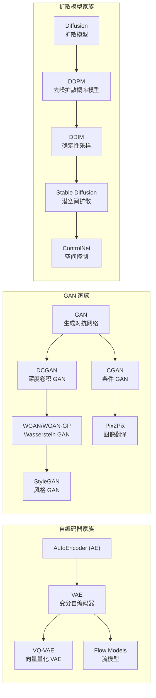
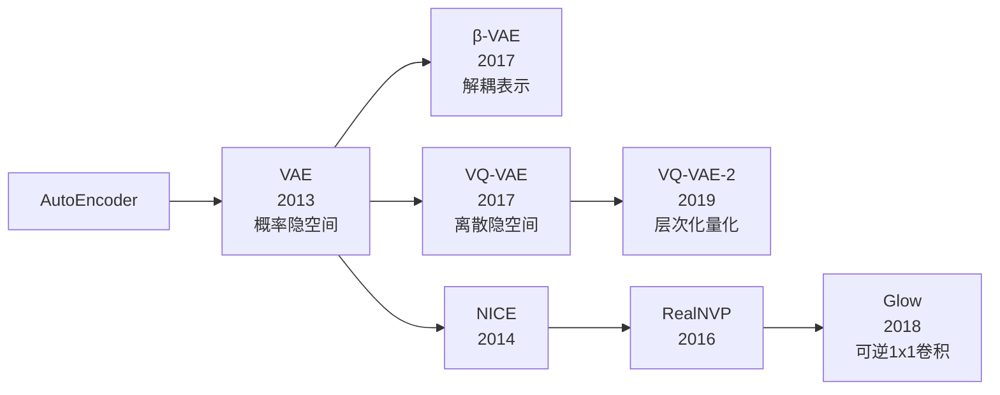
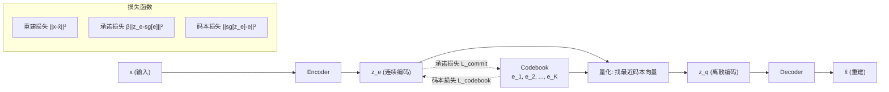
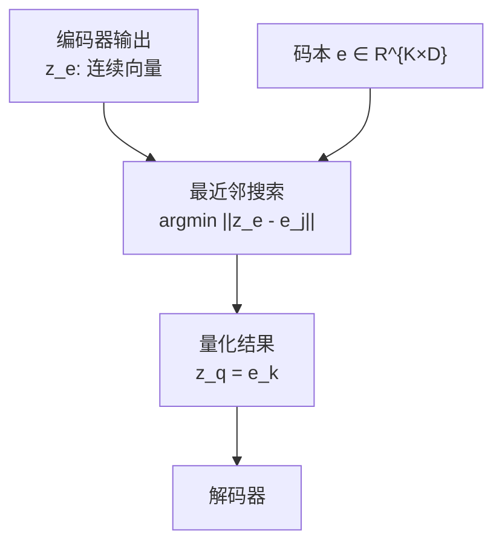

# VAE / VQ-VAE / 流模型

## 知识地图



## 前置知识

- **自编码器 (AutoEncoder)**：编码-解码对称结构，用于降维和重建。
- **高斯分布与 KL 散度**：VAE 以 $\mathcal{N}(0, I)$ 为先验，KL 散度度量分布间距离。
- **重参数化技巧**：$\mathbf{z} = \mu + \sigma \odot \epsilon$，使采样可导。
- **向量量化 (Vector Quantization)**：将连续向量映射为离散码本中最接近的条目。
- **可逆神经网络**：流模型的基础——变换必须可逆且雅可比行列式易算。

## 模型演化路线



| Model | Year | Key Innovation | Solved Problem |
|-------|------|----------------|----------------|
| VAE | 2013 | 概率隐变量 + 重参数化 | 隐空间连续平滑，可采样生成 |
| β-VAE | 2017 | 加权 KL 散度 | 解耦表示学习 |
| VQ-VAE | 2017 | 离散码本 + stop-gradient | 避免后验坍塌，适合离散数据 |
| VQ-VAE-2 | 2019 | 层次化量化 | 多尺度生成，质量大幅提升 |
| NICE | 2014 | 加法耦合层 | 首个可逆生成模型 |
| RealNVP | 2016 | 仿射耦合层 | 更强的表达能力 |
| Glow | 2018 | 可逆 1x1 卷积 | 完全可逆的生成模型 |

## 为什么会出现 (Why)

VAE 虽然提供了连续隐空间，但生成的图像往往**模糊**——因为逐像素重建损失（MSE/BCE）倾向于输出所有可能样本的平均值。此外，VAE 的连续隐空间对于文本、语音等**离散模态**并不自然。

- **VQ-VAE 为什么出现**：用离散码本替代连续隐变量，更适合语言、音乐等离散结构。同时引入 stop-gradient 操作，避免 VAE 常见的"后验坍塌"（posterior collapse）问题。
- **流模型为什么出现**：VAE 只给出似然的下界（ELBO），无法精确计算 $\log p(x)$。流模型通过可逆变换实现精确似然估计，且生成时不需要采样噪声。

## 解决什么问题 (Problem)

| 模型 | 解决的核心问题 |
|------|-------------|
| VAE | 连续、可采样生成的隐空间 |
| VQ-VAE | 将连续隐变量离散化，适配离散模态，避免后验坍塌 |
| 流模型 | 精确似然计算、可逆生成、无损编码与生成 |

## 核心思想 (Core Idea)

- **VAE**：将编码器输出从一个确定点变为概率分布，通过采样实现生成。
- **VQ-VAE**：维护一个可学习离散码本，Encoder 输出被量化为最近码本向量，将连续生成问题转化为离散序列建模。
- **流模型**：用一系列可逆变换将简单分布（高斯）逐步变换为复杂数据分布，实现精确似然计算。

---

## VAE (变分自编码器)

### 数学模型/公式

#### 重参数化技巧

$$\mathbf{z} = \mu + \sigma \odot \epsilon, \quad \epsilon \sim \mathcal{N}(0, \mathbf{I})$$

**通俗解释：** 采样本身不可导。把随机性全部塞进 $\epsilon$（不参与梯度计算），$z$ 对 $\mu$ 和 $\sigma$ 就可导了。这是 VAE 能端到端训练的基础。

#### ELBO 损失

$$\mathcal{L} = \mathbb{E}_{q(z|x)}[\log p(x|z)] - D_{KL}(q(z|x) \| p(z))$$

**通俗解释：** 第一项教解码器从 $z$ 重建 $x$（要像），第二项逼编码器的输出分布靠近标准正态（要规整）。两项在博弈中达成平衡。

- 第一项：重建损失
- 第二项：KL 散度，推动后验逼近先验 $\mathcal{N}(0, \mathbf{I})$

#### KL 散度闭式解

$$D_{KL} = -\frac{1}{2} \sum_{j=1}^{d} (1 + \log \sigma_j^2 - \mu_j^2 - \sigma_j^2)$$

**通俗解释：** 不需要蒙特卡洛估计，直接套公式。每一项都在约束隐变量：$\log \sigma_j^2$ 防止方差过小，$\mu_j^2$ 把均值拉向 0，$-\sigma_j^2$ 防止方差爆炸。

#### β-VAE

$$\mathcal{L} = \mathbb{E}_{q(z|x)}[\log p(x|z)] - \beta D_{KL}(q(z|x) \| p(z))$$

**通俗解释：** $\beta > 1$ 时更执着于"每个隐维度独立有意义"（解耦），但重建会变差。$\beta = 4$ 是常见设定。

$\beta > 1$ 鼓励解耦的（disentangled）表示学习。

---

## VQ-VAE (Vector Quantized VAE)

### 数学模型/公式

#### 量化过程

$$\mathbf{z}_q = \mathbf{e}_k, \quad k = \arg\min_j \|\mathbf{z}_e(\mathbf{x}) - \mathbf{e}_j\|_2$$

**通俗解释：** 编码器输出 $\mathbf{z}_e$，在码本 $\{\mathbf{e}_1, ..., \mathbf{e}_K\}$ 中找最近的向量替代它。这个"查找-替换"操作使隐空间变成离散的——要么是码本中的第 3 个向量，要么是第 7 个，没有中间值。

#### 损失函数

$$\mathcal{L} = \|\mathbf{x} - \hat{\mathbf{x}}\|^2 + \|\text{sg}[\mathbf{z}_e] - \mathbf{e}\|^2 + \beta \|\mathbf{z}_e - \text{sg}[\mathbf{e}]\|^2$$

**通俗解释：** 三项各管各的：
1. **重建损失**：生成的图和原图像不像，罚！
2. **码本损失**：码本向量去追编码器输出（sg 阻断反向梯度），把码本"拉"向数据。
3. **承诺损失**：编码器输出去追码本向量（sg 阻断向码本梯度），把编码器"拉"向码本。

sg[·] 是 stop-gradient 操作。

- 重建损失
- 码本损失（更新码本向量）
- 承诺损失（更新 Encoder，约束不偏离码本太远）

### VQ-VAE-2

层次化 VQ-VAE：先学习全局结构（顶层码），再学习局部细节（底层码）。配合 PixelCNN 在离散隐空间做自回归生成。

---

## 流模型 (Normalizing Flows)

### 数学模型/公式

#### 核心变换

$$\mathbf{z}_K = f_K \circ \cdots \circ f_2 \circ f_1(\mathbf{z}_0), \quad \mathbf{z}_0 \sim p_0$$

**通俗解释：** 从简单分布（如标准正态）采样一个 $\mathbf{z}_0$，经过 $K$ 步可逆变换，逐步"雕琢"成复杂的数据分布。就像把一块黏土（高斯分布）反复揉捏 $K$ 次，最终变成目标形状（数据分布）。

#### 变量替换公式

$$\log p(\mathbf{x}) = \log p_0(\mathbf{z}_0) - \sum_{i=1}^{K} \log \left| \det \frac{\partial f_i}{\partial \mathbf{z}_{i-1}} \right|$$

**通俗解释：** 这个公式精确计算 $p(\mathbf{x})$ 的对数似然（不是下界！）。第一项是先验概率，第二项是每次变换对体积的"放大/缩小"——雅可比行列式的绝对值告诉我们这步变换是压缩还是扩张了原始空间。关键是每个 $f_i$ 的雅可比行列式必须容易算。

#### 关键约束

每个 $f_i$ 必须可逆且雅可比行列式易于计算。

---

## 模型结构图

### VQ-VAE 架构



### 流模型架构

```mermaid
%%{init: {'flowchart': {'nodeSpacing': 30, 'rankSpacing': 50}}}%%
graph LR
    Z0["z_0 ~ N(0,I)"] --> F1["f_1 (耦合层)"]
    F1 --> F2["f_2 (耦合层)"]
    F2 --> DOTS["... K 层可逆变换 ..."]
    DOTS --> FK["f_K (耦合层)"]
    FK --> X["x ~ p_data"]

    X --> FINV1["f_K⁻¹"] --> FINV2["f_{K-1}⁻¹"] --> FINVDOTS["..."] --> FINVK["f_1⁻¹"] --> Z0PRIOR["z_0 ~ N(0,I)"]
```



---

## 可视化展示

### VQ-VAE 量化示意



---

## 最小可运行代码

### VQ-VAE 量化模块 (PyTorch)

```python
import torch
import torch.nn as nn

class VectorQuantizer(nn.Module):
    """VQ-VAE 的向量量化层"""
    def __init__(self, num_embeddings, embedding_dim, commitment_cost=0.25):
        super().__init__()
        self.num_embeddings = num_embeddings
        self.embedding_dim = embedding_dim
        self.commitment_cost = commitment_cost

        # 可学习的码本
        self.embeddings = nn.Embedding(num_embeddings, embedding_dim)
        self.embeddings.weight.data.uniform_(-1 / num_embeddings, 1 / num_embeddings)

    def forward(self, z):
        # z: [B, D, H, W] -> [B, H, W, D]
        z = z.permute(0, 2, 3, 1).contiguous()
        z_flattened = z.view(-1, self.embedding_dim)

        # 计算距离 ||z_e - e_j||^2
        d = (
            torch.sum(z_flattened ** 2, dim=1, keepdim=True)
            + torch.sum(self.embeddings.weight ** 2, dim=1)
            - 2 * torch.matmul(z_flattened, self.embeddings.weight.t())
        )

        # 最近邻编码
        min_indices = torch.argmin(d, dim=1)
        z_q = self.embeddings(min_indices).view(z.shape)
        z_q = z_q.permute(0, 3, 1, 2).contiguous()

        # 损失计算
        codebook_loss = torch.mean((z_q.detach() - z) ** 2)
        commitment_loss = self.commitment_cost * torch.mean((z_q - z.detach()) ** 2)

        # Straight-through estimator: 前向用 z_q，反向梯度直通给 z
        z_q = z + (z_q - z).detach()

        return z_q, codebook_loss + commitment_loss
```

### 流模型 — RealNVP 仿射耦合层 (PyTorch)

```python
import torch
import torch.nn as nn

class AffineCouplingLayer(nn.Module):
    """RealNVP 仿射耦合层：可逆且雅可比行列式易算"""
    def __init__(self, dim, hidden_dim, mask):
        super().__init__()
        self.mask = mask  # 二值 mask 决定哪一半被转换
        self.scale_net = nn.Sequential(
            nn.Linear(dim, hidden_dim),
            nn.ReLU(),
            nn.Linear(hidden_dim, hidden_dim),
            nn.ReLU(),
            nn.Linear(hidden_dim, dim),
            nn.Tanh(),
        )
        self.translate_net = nn.Sequential(
            nn.Linear(dim, hidden_dim),
            nn.ReLU(),
            nn.Linear(hidden_dim, hidden_dim),
            nn.ReLU(),
            nn.Linear(hidden_dim, dim),
        )

    def forward(self, x):
        x_masked = x * self.mask
        s = self.scale_net(x_masked) * (1 - self.mask)
        t = self.translate_net(x_masked) * (1 - self.mask)
        y = x_masked + (1 - self.mask) * (x * torch.exp(s) + t)
        # log|det| = sum(s) —— 雅可比行列式仅依赖对角线
        log_det = torch.sum(s, dim=1)
        return y, log_det

    def inverse(self, y):
        y_masked = y * self.mask
        s = self.scale_net(y_masked) * (1 - self.mask)
        t = self.translate_net(y_masked) * (1 - self.mask)
        x = y_masked + (1 - self.mask) * ((y - t) * torch.exp(-s))
        return x
```

---

## 工业界应用

| 应用领域 | 模型 | 为什么 | 知名产品/项目 |
|---------|------|-------|-------------|
| 语音合成 | VQ-VAE | 离散码本天然适配语音的离散结构 | VITS, WaveNet |
| 音乐生成 | VQ-VAE | MIDI/音频也是离散或半离散的 | Jukebox (OpenAI) |
| 图像生成 | VQ-VAE-2 | 层次化量化 + PixelCNN 自回归 | DALL-E 1 (dVAE) |
| 密度估计 | Flow | 精确对数似然，适合异常检测 | RealNVP, Glow (OpenAI) |
| 图像到图像翻译 | Flow | 可逆性保证无信息丢失 | 风格迁移研究 |
| 分子生成 | Flow | 精确似然利于分子属性优化 | 药物设计 |

---

## 对比表格

| 特性 | VAE | VQ-VAE | Flow | GAN | Diffusion |
|------|-----|--------|------|-----|-----------|
| 似然 | 近似 (ELBO) | 近似 | 精确 | N/A | 近似 (变分下界) |
| 隐空间 | 连续 | 离散 | 连续 | 连续 | 连续 (同维) |
| 生成质量 | 中 | 中 | 中 | 高 | 最高 |
| 推理速度 | 快 | 快 | 快 | 快 | 慢 |
| 可逆 | 否 | 否 | 是 | 否 | 否 |
| 后验坍塌风险 | 有 | 低 (stop-gradient) | 无 | 无 | 无 |
| 训练稳定性 | 高 | 高 | 高 | 低 | 高 |

---

## 学完后建议继续学习

1. **GAN (DCGAN / WGAN)** — VAE 生成模糊，GAN 通过对抗训练获得更高生成质量。
2. **扩散模型 (DDPM)** — 当前 SOTA 生成范式，Stable Diffusion 的基础。
3. **Stable Diffusion** — VAE 作为 SD 的核心组件（编码器/解码器），理解 VAE 是理解 SD 管道的前提。
4. **DALL-E 1 (dVAE)** — 使用离散 VAE 将图像转为离散 token，再配合自回归 Transformer。

---

## 高频面试题

### Q1: VAE 的"后验坍塌"(posterior collapse) 是什么？VQ-VAE 如何解决？

**标准答案：**
后验坍塌指训练过程中 $q(z|x)$ 退化为与输入无关的先验 $p(z)$，解码器忽略 $z$ 直接输出数据均值。原因是 KL 项太强或解码器太强，导致 $z$ 不携带任何信息。VQ-VAE 通过两个机制解决：(1) 离散量化——$z$ 只能是有限码本向量之一，无法坍塌到无信息分布；(2) stop-gradient 操作——码本损失和承诺损失分别来自不同梯度路径，防止一方主导。

### Q2: VQ-VAE 的 stop-gradient (sg[·]) 操作有什么作用？

**标准答案：**
sg 操作在不同损失项中截断不同方向的梯度：
- 码本损失 $\|\text{sg}[\mathbf{z}_e] - \mathbf{e}\|^2$：梯度只流向码本向量 $\mathbf{e}$，驱动码本靠近编码器输出。
- 承诺损失 $\|\mathbf{z}_e - \text{sg}[\mathbf{e}]\|^2$：梯度只流向编码器，驱动编码器输出靠近码本向量。
如果去掉 sg，梯度会从两端同时拉扯，导致码本向量和编码器输出同步漂移，训练不稳定。

### Q3: 流模型相比 VAE 的优势和劣势是什么？

**标准答案：**
**优势**：(1) 精确似然计算——不需要变分下界近似；(2) 可逆性——既能生成（前向），也能精确编码（反向），无信息丢失；(3) 不需要采样噪声，隐空间即是数据空间，维度相同。
**劣势**：(1) 每个变换层必须可逆且雅可比行列式易算，架构约束极强；(2) 与数据同维——无法像 VAE 那样降维压缩；(3) 层数 $K$ 受限，表达能力有限——在高分辨率图像上不如扩散模型和 GAN。

### Q4: VQ-VAE 中码本大小和码本向量维度如何选择？

**标准答案：**
- **码本大小 $K$**：通常 512-8192。$K$ 太小，表达能力不足，重建差；$K$ 太大，码本利用率降低（部分码本向量永远不会被选中）。VQ-VAE-2 论文中 $K=512$ 是常见设定。
- **向量维度 $D$**：通常 64-512。过大则量化失去意义（等同于保留连续值）；过小则信息损失严重。
- **评估指标**：perplexity（衡量码本利用率的均匀程度）和 codebook usage（被使用的码本条目比例）。

### Q5: 流模型的耦合层 (Coupling Layer) 是如何保证可逆的？

**标准答案：**
耦合层将输入 $\mathbf{x}$ 按 mask 分成两部分 $\mathbf{x}_1$ 和 $\mathbf{x}_2$。变换只修改其中一半，且修改方式以另一半为条件：$\mathbf{y}_1 = \mathbf{x}_1$，$\mathbf{y}_2 = \mathbf{x}_2 \odot \exp(s(\mathbf{x}_1)) + t(\mathbf{x}_1)$。由于 $\mathbf{y}_1 = \mathbf{x}_1$ 直接保留，反向求解时先恢复 $\mathbf{x}_1 = \mathbf{y}_1$，再计算 $\mathbf{x}_2 = (\mathbf{y}_2 - t(\mathbf{x}_1)) \odot \exp(-s(\mathbf{x}_1))$。整个过程不需要求 $s$ 和 $t$ 网络的逆——它们在正向和反向都以相同方向运行。雅可比矩阵是三角形，行列式 = $\sum s$，计算是 $O(D)$ 而非 $O(D^3)$。
