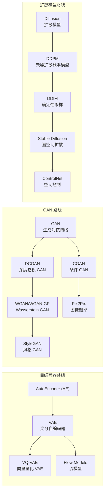
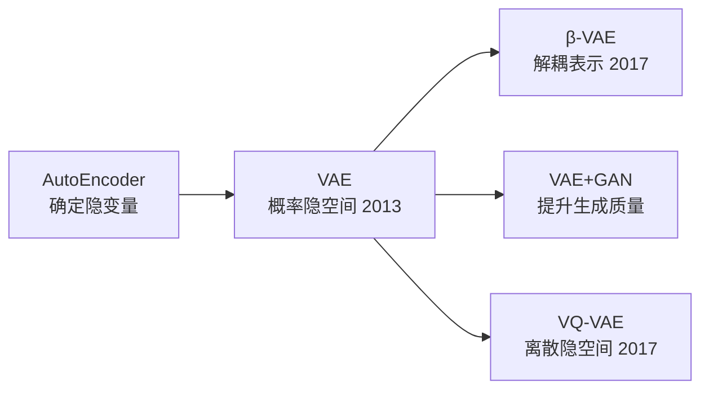
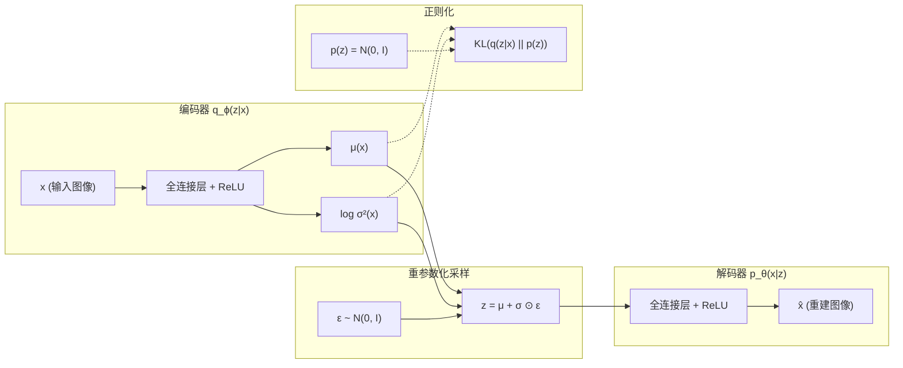
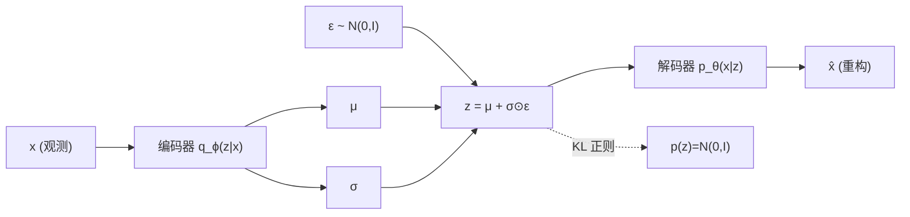

# VAE (变分自编码器)

## 知识地图



## 前置知识

- **概率论基础**：高斯分布、期望、KL 散度。
- **自编码器 (AutoEncoder)**：编码器将输入压缩为隐变量 $z$，解码器从 $z$ 重建输出。
- **贝叶斯推断**：先验 $p(z)$、后验 $q(z|x)$、似然 $p(x|z)$ 的基本概念。
- **最大似然估计 (MLE)**：理解"最大化 $\log p(x)$"的含义。

## 模型演化路线



| Model | Year | Key Innovation | Solved Problem |
|-------|------|----------------|----------------|
| AutoEncoder | 2006 | 编码-解码对称结构 | 降维与重建 |
| VAE | 2013 | 概率隐变量 + 重参数化 | 隐空间连续平滑，支持生成新样本 |
| β-VAE | 2017 | 加权 KL 散度 | 解耦表示学习，各隐维度控制独立因子 |
| VQ-VAE | 2017 | 离散码本量化 | 更适合文本/音频等离散模态 |

## 为什么会出现 (Why)

标准自编码器（AE）的瓶颈 $z$ 是一个**确定的点**——给定输入 $x$，编码器产生一个固定的 $z$。这意味着：

- **无法生成新样本**：AE 没有定义 $z$ 空间的概率分布，不知道如何在 $z$ 空间中采样生成新的合理数据。
- **隐空间不平滑**：两个 $z$ 之间的插值对应什么输出完全不可控，可能产生无意义的乱码。

VAE 的出现，将生成问题从"记住编码"变为**学习数据分布的参数化形式**。

## 解决什么问题 (Problem)

VAE 解决的核心问题是：**如何构建一个既能压缩/重建数据、又能在隐空间中采样生成新数据的模型？**

具体而言：
1. 学习数据 $x$ 的真实分布 $p(x)$ 的近似。
2. 提供一个**连续、平滑**的隐空间 $z$，使得 $z$ 附近的采样产生相似的输出，$z$ 之间可以平滑插值。
3. 端到端可训练——通过重参数化技巧让梯度流过采样操作。

## 核心思想 (Core Idea)

**把编码器的输出从一个确定的点变为一个概率分布（高斯分布的均值 $\mu$ 和方差 $\sigma$），并从该分布采样隐变量 $z$，使得隐空间连续、平滑、可采样生成。**

## 数学模型/公式

### ELBO（证据下界）

VAE 最大化 ELBO，而非直接最大化 $\log p(x)$：

$$
\log p(x) \geq \underbrace{\mathbb{E}_{q_\phi(z|x)}[\log p_\theta(x|z)]}_{\text{重构项}} - \underbrace{D_{KL}(q_\phi(z|x) \| p(z))}_{\text{KL 正则项}} = \text{ELBO}
$$

**通俗解释：** VAE 不直接优化"生成真实数据的概率"，而是优化它的下界（ELBO）。左边重构项说"从 $z$ 重建的图像和原图要像"；右边 KL 项说"编码器输出的分布别太放飞自我，要靠近标准正态分布"。两项博弈，最终得到规整的隐空间。

直观解读：
- **重构项**：给定采样的 $z$，解码器还原 $x$ 的能力
- **KL 项**：让后验 $q(z|x)$ 不要偏离先验 $p(z) = \mathcal{N}(0, I)$ 太远——这是正则化，保证 $z$ 空间的规整性

### 闭合形式 KL 散度

对于高斯先验和高斯后验：

$$
D_{KL}(\mathcal{N}(\mu, \sigma^2) \| \mathcal{N}(0, 1))
= -\frac{1}{2} \sum_{j=1}^{d} (1 + \log \sigma_j^2 - \mu_j^2 - \sigma_j^2)
$$

**通俗解释：** 这个公式可以直接算出两个高斯分布之间的"距离"，不需要采样估计。每一项都有含义：$\log \sigma_j^2$ 惩罚方差太小（趋于 0 则 $\log$ 趋近负无穷），$\mu_j^2$ 惩罚均值偏离 0，$-\sigma_j^2$ 惩罚方差太大。三者合力把每个隐维度推向 $\mathcal{N}(0,1)$。

### 重参数化技巧

$$
z = \mu_\phi(x) + \sigma_\phi(x) \odot \epsilon, \quad \epsilon \sim \mathcal{N}(0, I)
$$

**通俗解释：** 采样操作本身不可导——你无法对"随机"求梯度。重参数化的妙处是把随机性全部关进 $\epsilon$ 里，而 $\epsilon$ 不参与梯度计算。这样 $z$ 对 $\mu$ 和 $\sigma$ 就可导了——这是 VAE 能端到端反向传播的根基。

### β-VAE

$$
\mathcal{L}_{\beta} = \mathbb{E}_{q}[\log p(x|z)] - \beta \cdot D_{KL}(q(z|x) \| p(z))
$$

**通俗解释：** 给 KL 项乘以一个系数 $\beta$。$\beta > 1$ 时，模型更强调"每个隐维度独立有意义"（解耦），代价是重建质量下降。$\beta = 4$ 是常见选择，常用于需要可解释隐空间的场景。

$\beta > 1$ 强制更强的解耦（disentanglement），各维度对应独立的生成因子。

---

## 模型结构图



---

## 可视化展示

### 重参数化概率图模型



### KL 散度 vs 重构 Loss 的权衡

```echarts
return {
  tooltip: { trigger: "axis", confine: true },
  title: { top: 5,  text: 'β-VAE: β 对 KL 与重构的影响', left: 'center', textStyle: { fontSize: 12 } },
  xAxis: { type: 'category', data: ['β=0.1', 'β=0.5', 'β=1(VAE)', 'β=2', 'β=5', 'β=10'] },
  yAxis: { type: 'value', min: 0, max: 1, name: '归一化得分' },
  legend: { top: 28,  data: ['KL 散度', '重构质量', '解耦性'] },
  series: [
    { name: 'KL 散度', type: 'bar', data: [0.05, 0.15, 0.3, 0.5, 0.75, 0.92], itemStyle: { color: '#2980b9' } },
    { name: '重构质量', type: 'bar', data: [0.95, 0.90, 0.82, 0.65, 0.40, 0.20], itemStyle: { color: '#16a085' } },
    { name: '解耦性', type: 'bar', data: [0.10, 0.25, 0.45, 0.65, 0.80, 0.90], itemStyle: { color: '#d35400' } }
  ],
  grid: { left: 60, right: 20, top: 55, bottom: 55 }
}
```

$\beta$ 越大解耦越好但重构越差，这是"表示质量 vs 重构质量"的权衡。

---

## 最小可运行代码

### PyTorch VAE

```python
import torch
import torch.nn as nn

class VAE(nn.Module):
    def __init__(self, input_dim=784, hidden_dim=400, latent_dim=20):
        super().__init__()
        # Encoder
        self.enc_fc1 = nn.Linear(input_dim, hidden_dim)
        self.enc_mu = nn.Linear(hidden_dim, latent_dim)
        self.enc_logvar = nn.Linear(hidden_dim, latent_dim)
        # Decoder
        self.dec_fc1 = nn.Linear(latent_dim, hidden_dim)
        self.dec_out = nn.Linear(hidden_dim, input_dim)

    def encode(self, x):
        h = torch.relu(self.enc_fc1(x))
        return self.enc_mu(h), self.enc_logvar(h)

    def reparameterize(self, mu, logvar):
        std = torch.exp(0.5 * logvar)
        eps = torch.randn_like(std)
        return mu + eps * std

    def decode(self, z):
        h = torch.relu(self.dec_fc1(z))
        return torch.sigmoid(self.dec_out(h))

    def forward(self, x):
        mu, logvar = self.encode(x)
        z = self.reparameterize(mu, logvar)
        return self.decode(z), mu, logvar

    def loss(self, x):
        x_hat, mu, logvar = self.forward(x)
        recon = nn.functional.binary_cross_entropy(x_hat, x, reduction='sum')
        kl = -0.5 * torch.sum(1 + logvar - mu.pow(2) - logvar.exp())
        return (recon + kl) / x.size(0)
```

---

## 工业界应用

| 应用领域 | 为什么用 VAE | 知名产品/项目 |
|---------|-------------|-------------|
| 图像生成 | 隐空间平滑可插值，生成可控 | 早期 DeepMind 图像生成项目 |
| 异常检测 | 正常样本重建好，异常样本重建差（通过重建误差检测） | 工业缺陷检测系统 |
| 数据压缩 | 学习紧凑表示，压缩率可调 | 学术研究中的神经压缩方案 |
| 药物分子生成 | 隐空间连续，便于分子优化和属性插值 | 计算机辅助药物设计 |
| 推荐系统 | 协同过滤中的隐向量建模 | Netflix 早期推荐系统研究 |
| 语音合成 | VAE 建模音色和韵律的隐空间 | VITS (语音合成) |

---

## 对比表格

| 特性 | AE | VAE | VQ-VAE | GAN | Diffusion |
|------|----|-----|--------|-----|-----------|
| 生成新样本 | 不可 | 可 | 可 | 可 | 可 |
| 隐空间 | 确定的点 | 连续概率分布 | 离散码本 | 随机噪声 | 同维噪声 |
| 训练稳定性 | 稳定 | 稳定 | 稳定 | 不稳定 | 稳定 |
| 似然估计 | 无 | ELBO 近似 | ELBO 近似 | 无 | 变分下界 |
| 生成质量 | 模糊 | 模糊 | 中等 | 高 | 最高 |
| 推理速度 | 快 | 快 | 快 | 快 | 慢 |
| 隐空间可解释 | 否 | 是 (β-VAE) | 是 (离散) | 有限 | 有限 |

---

## 学完后建议继续学习

1. **VQ-VAE** — 将连续隐空间改为离散码本，适合文本/语音等离散数据生成。
2. **GAN (DCGAN / WGAN)** — 放弃显式似然，通过对抗训练获得更高质量的生成图像。
3. **扩散模型 (DDPM)** — 当前生成质量最高的范式，Stable Diffusion 的基石。
4. **Normalizing Flow** — 通过可逆变换实现精确似然计算，与 VAE 思路正交。

---

## 高频面试题

### Q1: VAE 和 AutoEncoder 的根本区别是什么？

**标准答案：**
AutoEncoder 将输入映射到确定的隐向量 $z$，模型没有学到 $z$ 空间的概率分布，因此无法在 $z$ 上采样生成新样本。VAE 将输入映射到一个概率分布 $q(z|x)$（通常是高斯分布，输出 $\mu$ 和 $\sigma$），训练时从分布中采样 $z$ 再解码。ELBO 损失中的 KL 散度项强制 $q(z|x)$ 接近标准正态先验，使得训练好的 VAE 可以直接从 $\mathcal{N}(0,I)$ 采样 $z$ 生成新数据。关键差异：AE 学的是"映射"，VAE 学的是"分布"。

### Q2: 什么是重参数化技巧 (Reparameterization Trick)？为什么需要它？

**标准答案：**
VAE 需要从 $z \sim \mathcal{N}(\mu, \sigma^2)$ 采样，但采样操作 $\sim$ 是不可导的，会阻断梯度回传。重参数化技巧将采样改写为 $z = \mu + \sigma \odot \epsilon$，其中 $\epsilon \sim \mathcal{N}(0, I)$。随机性被完全隔离在 $\epsilon$ 中（$\epsilon$ 不参与梯度计算），而 $z$ 对 $\mu$ 和 $\sigma$ 可导，因此梯度可以正常流过。这是 VAE 能够端到端用 SGD 训练的根本原因。

### Q3: ELBO 的两项分别起什么作用？如果只有其中一项会怎样？

**标准答案：**
- **重构项** $\mathbb{E}[\log p(x|z)]$：让解码器从 $z$ 恢复出逼真的 $x$。只有这一项时，编码器会把 $\sigma \to 0$，退化为普通 AE，$z$ 空间不连续，无法生成。
- **KL 项** $D_{KL}(q(z|x) \| p(z))$：约束 $q(z|x)$ 靠近标准正态先验，保证 $z$ 空间规整连续。只有这一项时，编码器输出始终为 $\mathcal{N}(0,I)$，$z$ 不包含任何输入信息，重建完全失败。
- 两项博弈达成平衡：$z$ 既有语义信息（可重建），又服从规整分布（可采样）。

### Q4: β-VAE 中的 β 参数有什么作用？

**标准答案：**
β-VAE 在标准 VAE 的 KL 项前乘以超参数 $\beta$。当 $\beta > 1$，模型被更强地约束去匹配先验，这迫使不同隐维度编码更独立的生成因子（解耦表示，disentanglement），代价是重建质量下降。当 $\beta < 1$，重建优先，隐空间规整性减弱。$\beta = 1$ 即标准 VAE。这是一个"表示质量 vs 重建质量"的权衡。

### Q5: VAE 生成的图像为什么通常比较模糊？

**标准答案：**
根本原因在于 VAE 使用逐像素的重建损失（如 MSE 或 Binary Cross-Entropy），这些损失函数假设像素之间独立，且对"接近但不完全准确"的预测取平均。模型的最优策略是输出所有可能合理图像的平均值，结果自然模糊。相比之下，GAN 用判别器学习感知损失，扩散模型在像素级别逐步细化，都能产出更清晰的图像。这也是 VQ-VAE 和后续结合对抗训练的 VAE 变体出现的原因——用更好的损失函数替代逐像素损失。
