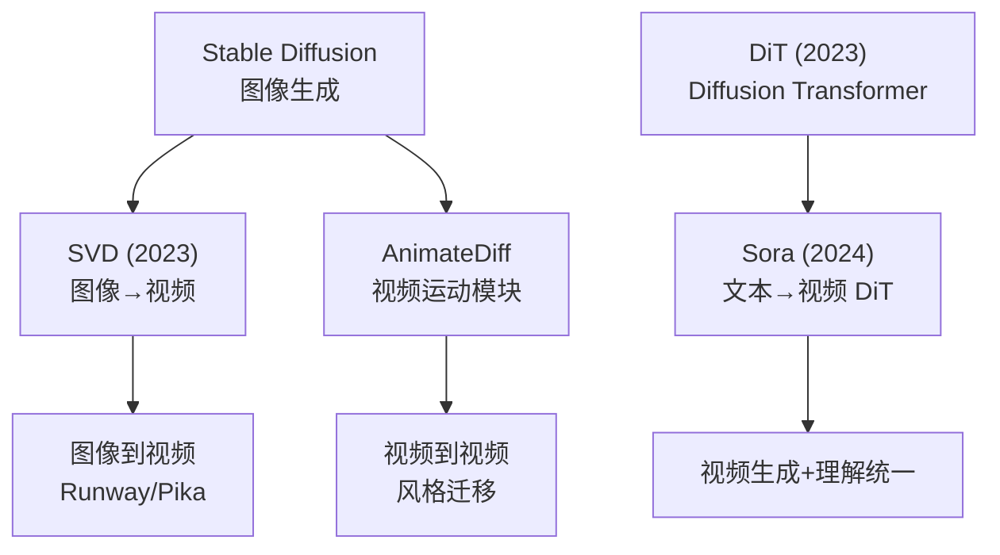
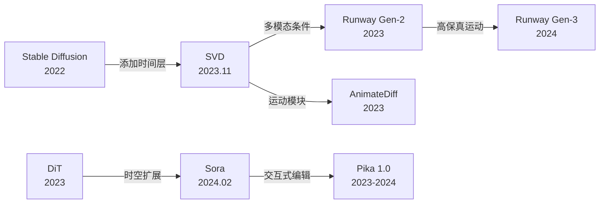
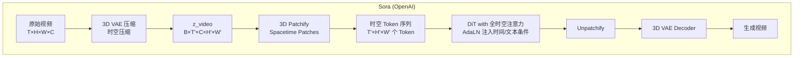
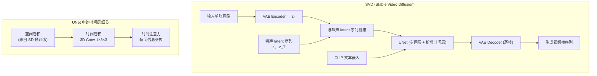

# Video Generation (Sora / Runway / Pika / SVD)

## 知识地图



## 前置知识

- **扩散模型 (DDPM/LDM)**：前向加噪、反向去噪、噪声预测
- **DiT (Diffusion Transformer)**：ViT + adaLN 替代 U-Net
- **Stable Diffusion**：VAE 压缩 + CLIP + UNet 架构
- **时间序列建模**：时间卷积、时间注意力、3D 卷积

## 模型演化路线



| Model | Year | Key Innovation |
|-------|------|---------------|
| SVD (Stable Video Diffusion) | 2023 | SD 权重复用 + 时间层，图像到视频 |
| AnimateDiff | 2023 | 可插拔时间运动模块，无需训练基础模型 |
| Runway Gen-2 | 2023 | 多模态条件（文本+图像+结构）驱动 |
| Pika 1.0 | 2023 | 交互式视频编辑，局部修改/风格转换 |
| Sora | 2024 | DiT 时空扩展，完整长视频生成 |
| Runway Gen-3 | 2024 | 高保真运动 + 物理世界模拟 |

## 为什么会出现 (Why)

从图像生成到视频生成，核心挑战是从**空间质量**到**时空一致性**的跨越。单帧画质再高，如果帧间出现人物抖动、纹理跳变、物体瞬移，视频就不可用。图像扩散模型已经解决了"画一张好图"的问题，但"画一连串连贯的好图"需要全新的时间维度建模。

## 解决什么问题 (Problem)

1. **时间一致性**：帧与帧之间的人物身份、物体运动、光照变化必须物理合理
2. **时空计算爆炸**：视频是 $T \times H \times W \times C$ 的 4D 张量，计算量随帧数线性增长
3. **运动建模**：物体应该如何移动、形变、交互（物理规律的隐式学习）
4. **条件控制**：如何用文本/图像/结构等多模态条件驱动视频生成

## 核心思想 (Core Idea)

**Sora 将视频视为时空块 (Spacetime Patches)，纯粹用 Diffusion Transformer 的全时空注意力建模——没有任何显式的时间组件；SVD/AnimateDiff 则在预训练图像 UNet 中插入时间层，以最小成本将图像模型扩展为视频模型。**

---

## 模型结构图

### Sora — DiT 时空扩展



### SVD — UNet + 时间层



### Sora DiT Architecture Detail

Sora 的 DiT block 核心仍然是 adaLN + Self-Attention + MLP，但与图像 DiT 的关键区别在于注意力的作用范围：

- **图像 DiT**：注意力在 $H' \times W'$ 个空间 token 上进行
- **Sora DiT**：注意力在全部 $T' \times H' \times W'$ 个时空 token 上进行（全时空注意力）

$$
\text{Attention}(\mathbf{Q}, \mathbf{K}, \mathbf{V}) = \text{Softmax}\left(\frac{\mathbf{Q} \mathbf{K}^T}{\sqrt{d}}\right) \mathbf{V}
$$

其中 $\mathbf{Q}, \mathbf{K}, \mathbf{V} \in \mathbb{R}^{(T' \cdot H' \cdot W') \times d}$，即所有帧的所有空间位置同时参与注意力计算。这使得模型可以学习任意帧之间、任意空间位置之间的关系——从物体运动轨迹到物理交互。

## 数学模型/公式

### Sora — 视频即时空块

将视频表示为 $T \times H \times W \times C$ 的 4D 张量，直接 3D patchify：

$$
\text{Video}(T, H, W, C) \Rightarrow \text{序列化的 Spacetime Patches}
$$

**通俗解释：** Sora 不把视频看作"一连串图像"，而是看作一个 4D 的时空立方体。就像 2D 图像被切成 square patches，视频被切成 spacetime cubes——每个 cube 包含一个小时间段内的一个小空间区域。这种表示让模型自然地学习空间和时间的关系，而不是人为将两者分开处理。

### 3D VAE 压缩

$$
\mathbf{z}_{video} = \text{VAE}_{3D}(video) \in \mathbb{R}^{B \times T' \times C \times H' \times W'}
$$

**通俗解释：** 与图像 VAE 只在空间维度压缩不同，3D VAE 同时在空间和时间维度压缩。如果原始视频是 64 帧 × 512 × 512，VAE 可能同时压缩为 16 帧 × 64 × 64 的 latent。压缩比越大，计算越快，但重建质量越低。Sora 的 3D VAE 是实现长视频生成的关键——没有压缩，全时空注意力的计算量不可承受。

### SVD — 时间注意力

在 UNet 的每个空间 block 中插入**时间卷积**和**时间注意力**。输入是单张图像 + 噪声 latent 序列。时间注意力在帧之间交换信息：

$$
\text{attn}(Q_t, K_{t'}, V_{t'}) = \text{Softmax}\left(\frac{Q_t K_{t'}^T}{\sqrt{d}}\right) V_{t'}
$$

**通俗解释：** SVD 的方法与 Sora 完全不同——它不把视频看作整体，而是保留 SD 的图像架构，只"插入"时间处理层。时间注意力让每一帧的每个像素都能"看到"其他帧同一位置的信息，从而学会运动一致性（"我下一帧应该往哪移"）。好处是可以复用 SD 的全部预训练权重，训练成本远低于 Sora 的从零训练。

### 级联生成策略

大多数视频生成系统使用级联：
1. **关键帧生成**：先生成低帧率、低分辨率的"骨架"
2. **帧插值**：用插值模型生成中间帧，提升帧率
3. **超分**：用超分模型提升空间分辨率

**通俗解释：** 级联策略本质是"分而治之"——直接生成 60fps 4K 视频计算量爆炸，但先生成 8fps 256p 的关键帧、再插值到 60fps、再超分到 4K，每一步都更容易。这类似于传统视频编码的 I 帧/P 帧思想。

---

## 可视化展示

### 视频生成架构对比

（保留原有 Mermaid 图）

### 视频生成模型对比

```echarts
return {
  tooltip: { trigger: "axis", confine: true },
  title: { top: 5,  text: '视频生成模型能力对比', left: 'center', textStyle: { fontSize: 12 } },
  xAxis: { type: 'category', data: ['时长', '分辨率', '运动质量', '文本遵循'] },
  yAxis: { type: 'value', min: 0, max: 1, name: '相对得分' },
  legend: { top: 28,  data: ['SVD', 'Runway Gen-3', 'Pika 1.0', 'Sora'] },
  series: [
    { name: 'SVD', type: 'bar', data: [0.3, 0.5, 0.6, 0.3], itemStyle: { color: '#2980b9' } },
    { name: 'Runway Gen-3', type: 'bar', data: [0.5, 0.7, 0.7, 0.6], itemStyle: { color: '#2c3e50' } },
    { name: 'Pika 1.0', type: 'bar', data: [0.2, 0.6, 0.5, 0.5], itemStyle: { color: '#d35400' } },
    { name: 'Sora', type: 'bar', data: [1, 1, 0.9, 0.9], itemStyle: { color: '#16a085' } }
  ],
  grid: { left: 60, right: 20, top: 55, bottom: 55 }
}
```

---

## 最小可运行代码

### SVD 风格的时间注意力

```python
import torch
import torch.nn as nn

class TemporalAttention(nn.Module):
    """在帧之间交换信息的时间注意力"""
    def __init__(self, dim, n_heads=8):
        super().__init__()
        self.n_heads = n_heads
        self.head_dim = dim // n_heads
        self.qkv = nn.Linear(dim, dim * 3)
        self.proj = nn.Linear(dim, dim)

    def forward(self, x):
        # x: [B, T, C, H, W]
        B, T, C, H, W = x.shape
        # 重塑: [B*H*W, T, C]
        x = x.permute(0, 3, 4, 1, 2).contiguous().view(B * H * W, T, C)

        qkv = self.qkv(x).view(B * H * W, T, 3, self.n_heads, self.head_dim)
        q, k, v = qkv.unbind(dim=2)
        q = q.permute(0, 2, 1, 3)  # [B*H*W, H, T, D]
        k = k.permute(0, 2, 1, 3)
        v = v.permute(0, 2, 1, 3)

        attn = torch.softmax(q @ k.transpose(-2, -1) * (self.head_dim ** -0.5), dim=-1)
        out = (attn @ v).transpose(1, 2).contiguous().view(B * H * W, T, C)
        out = self.proj(out)

        # 重塑回: [B, T, C, H, W]
        return out.view(B, H, W, T, C).permute(0, 3, 4, 1, 2)
```

---

## 工业界应用

| 产品/项目 | 说明 | 为什么领先 | 优势 | 劣势 |
|-----------|------|-----------|------|------|
| **OpenAI Sora** | 文本到视频 DiT | 全时空注意力 + 从零训练 | 时长最长（60秒），运动质量最高 | 推理成本极高，未开放 |
| **Runway Gen-3** | 专业视频生成/编辑平台 | 多模态条件 + 物理模拟 | 电影级质量，专业工具集成 | 闭源，价格高 |
| **Pika** | 交互式视频生成 | 局部编辑 + 风格转换 | 用户交互体验好，编辑灵活 | 时长短（3秒），精细度不如 Runway |
| **SVD (Stability)** | 开源图像到视频 | 复用 SD 权重 + 时间层 | 完全开源，社区可微调 | 时长和运动质量受限 |
| **AnimateDiff** | 开源运动模块 | 可插拔设计，即插即用 | 兼容所有 SD 模型，成本最低 | 动作质量依赖基础模型 |
| **Kling (快影)** | 中国团队视频生成 | 3D VAE + 长视频支持 | 支持 2 分钟视频 | 生态不如 SD 系 |
| **Luma Dream Machine** | 快速文/图到视频 | 高效推理管道 | 生成速度快，运动质量好 | 闭源，控制性有限 |

---

## 对比表格

| | SVD | AnimateDiff | Runway Gen-3 | Pika 1.0 | Sora |
|------|-----|-------------|-------------|----------|------|
| 架构 | SD + 时间层 | SD + 运动模块 | 专有扩散架构 | 专有架构 | DiT 全时空注意力 |
| 开源 | 是 | 是 | 否 | 否 | 否 |
| 输入 | 图像→视频 | 文本/图像→视频 | 多模态→视频 | 文本/图像→视频 | 文本→视频 |
| 最大时长 | ~4 秒 | ~8 秒 | ~18 秒 | ~3 秒 | ~60 秒 |
| 运动质量 | 中 | 中 | 高 | 中 | 最高 |
| 文本遵循度 | 低 | 中 | 高 | 中 | 最高 |
| 训练/推理成本 | 低（复用 SD） | 低（即插即用） | 高 | 中 | 极高 |

---

## 学完后建议继续学习

1. **[Stable Diffusion](stable-diffusion.md)** — SVD 和 AnimateDiff 的基础，理解 VAE 潜空间、U-Net 和 Cross-Attention。
2. **[ControlNet](controlnet.md)** — 将 ControlNet 的空间控制扩展到视频的时间维度，实现可控视频生成。
3. **[Image Generation Models](image-generation-models.md)** — 理解闭源图像模型的策略（级联、T5 编码、美学微调）如何启发视频生成。
4. **Video Understanding (VideoMAE/SlowFast)** — 理解视频的模型，与生成互为表里，视频理解可用于自动评估生成质量。
5. **3D Gaussian Splatting / NeRF** — 显式 3D 表示方法，可能成为视频生成的替代方案（直接生成 3D 场景后渲染）。

---

## 高频面试题

### Q1: Sora 的 DiT 架构如何处理视频中的时间维度？与 SVD 有何本质区别？

**标准答案：**
Sora 将视频视为一个完整的 4D 时空立方体 $(T, H, W, C)$，通过 3D VAE 在空间和时间上同时压缩，然后进行 3D patchify 得到"spacetime patches"作为 DiT 的输入 token。DiT 的 self-attention 在全部 $T' \times H' \times W'$ 个 token 上同时进行——这意味着任意帧的任意位置都可以直接与其他帧的任意位置交互。

与 SVD 的本质区别：
- **Sora (DiT)**：从零训练，将视频作为整体的 4D 数据建模。没有显式的"空间层"和"时间层"的区分——所有交互通过全时空 self-attention 统一处理。这赋予了模型学习复杂时空关系（如遮挡、物理运动）的最大自由度。
- **SVD (UNet + Time Layers)**：继承图像 SD 的预训练权重，在保留原有空间层的基础上插入时间卷积和时间注意力层。空间和时间处理是分离的——先空间卷积，再时间注意力。训练成本低但表达能力受限于架构预设。

Sora 是"大一统"方案，SVD 是"最小修改"方案。

### Q2: 视频生成中的时间一致性 (temporal consistency) 为什么是核心挑战？SVD 和 Sora 分别如何解决？

**标准答案：**
时间一致性要求帧间的内容（物体位置、形状、纹理、光照）平滑变化且符合物理规律。核心挑战：(1) 如果逐帧独立生成，即使每帧质量高，帧间也会出现跳变/闪烁，(2) 运动建模需要理解物理规律（惯性、重力、遮挡）。

SVD 的解决方案：在 UNet 中插入时间注意力层，每一帧的每个像素通过注意力机制"寻找"其他帧中最相关的像素。这建立了帧间的显式信息交换通道。但因为是逐像素的注意力，全局一致性可能不足。

Sora 的解决方案：通过全时空 self-attention，所有帧的所有位置同时参与注意力计算。模型可以学习到"第 5 帧左上的物体应该和第 6 帧中上位置的物体是同一个东西"这样的长程跨帧关系。从零训练也意味着模型不需要维持任何预训练的 2D 先验，可以自由学习最适合视频的表示。

### Q3: 视频生成的级联策略 (cascaded generation) 是如何工作的？为什么需要多级？

**标准答案：**
级联策略将视频生成分解为多个阶段的流水线：
1. **Keyframe Generation**：生成关键帧（低帧率，如 8fps），确定主要内容和运动轨迹
2. **Frame Interpolation**：在关键帧之间插入中间帧，提升帧率到目标值（如 24/30fps）
3. **Super-Resolution**：提升单帧的空间分辨率到目标（如 512→1024→4K）

为什么需要多级：(1) 直接生成高帧率高分辨视频的计算量是低分辨率的关键帧模式的几百倍；(2) 分阶段让每个模型专注于一个子任务（内容布局 vs 运动平滑 vs 细节增强）；(3) 可以独立优化每个阶段的模型，灵活组合不同能力。

这是工程上的"分而治之"，类似视频编码中的 I 帧（关键帧）和 P 帧/B 帧（预测帧）的层级结构。

### Q4: DiT (Diffusion Transformer) 在 Sora 中为何比 U-Net 更适合视频生成？

**标准答案：**
DiT 相比 U-Net 在视频场景下有三个核心优势：

1. **均匀的感受野**：U-Net 通过下采样获得大感受野，但对不同尺度的信息处理不对称（底层细节 vs 高层语义在不同的层级）。Sora 的 DiT 所有层使用相同的 self-attention，每个 token 对任意距离的 token 的感受野相同——这对需要同时处理局部纹理和全局运动的视频至关重要。

2. **更自然的时空统一**：U-Net 处理视频需要人为拆分空间层和时间层（如 SVD），因为 CNN 的归纳偏置是空间局部性。Transformer 的 self-attention 在时间和空间维度上没有天然区分——所有 token 对等交互，更适合统一的时空建模。

3. **更强的可扩展性**：Transformer 已被证明在数据和参数规模增大时持续提升性能（scaling law）。视频数据的规模远大于图像，DiT 的扩展优势更加明显。

### Q5: SVD (Stable Video Diffusion) 如何从 Stable Diffusion 权重初始化？添加了哪些时间层？

**标准答案：**
SVD 的初始化策略是公开的最关键信息：
1. **空间层**：直接使用 SD 2.1 的预训练权重（卷积、自注意力、交叉注意力），全部初始化为已有权重，不需要从零训练。
2. **新增时间层**：在每个 UNet block 的空间层之后插入：
   - **时间卷积 (Temporal Conv)**：3D 卷积，kernel size 为 $(3, 1, 1)$，只在时间维度做卷积。初始化时权重中心置为 1，其余为 0——确保初始时时间卷积等同于恒等映射（不影响预训练的空间质量）。
   - **时间注意力 (Temporal Attention)**：将空间维度合并为 batch 维度，在时间维度做 self-attention。初始化时输出投影矩阵置零——确保初始注意力输出为零，完全保留空间层的结果。
3. **训练策略**：先用少量数据联合训练时间层 + 空间层，然后冻结空间层只微调时间层。
