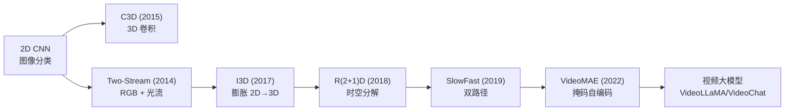
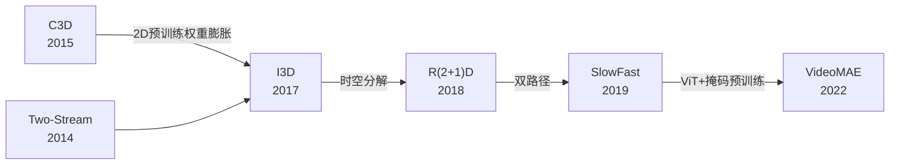
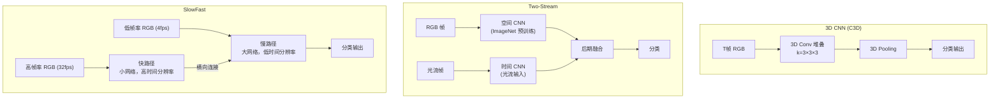

# Video Understanding (视频理解)

## 知识地图



## 前置知识

- **2D CNN**：卷积、池化、全连接分类
- **3D 卷积**：将 2D 卷积核扩展到时间维度
- **光流 (Optical Flow)**：像素在帧间的运动向量
- **ViT / Transformer**：自注意力、掩码自编码 (MAE)

## 模型演化路线



| Model | Year | Key Innovation |
|-------|------|---------------|
| C3D | 2015 | 3D 卷积直接处理时空立方体 |
| Two-Stream | 2014 | RGB + 光流双流并行 |
| I3D | 2017 | ImageNet 预训练 2D 权重膨胀为 3D |
| R(2+1)D | 2018 | 3D 卷积分解为 2D 空间 + 1D 时间 |
| SlowFast | 2019 | 慢路径（空间语义）+ 快路径（运动） |
| VideoMAE | 2022 | ViT + 高掩码率 (90%) 自监督预训练 |

## 为什么会出现 (Why)

静态图像分类回答"这是什么"，视频理解回答"这在发生什么"——需要同时建模空间外观和时间动态。核心挑战：视频是 $T \times H \times W \times 3$ 的 4D 张量，直接将 2D CNN 扩展为 3D 会带来巨大的计算开销和过拟合风险。同时，视频标注成本极高（需要逐帧标注或视频级标签），标注数据远少于图像数据。

## 解决什么问题 (Problem)

1. **时空建模**：如何在可接受的计算代价下同时建模空间外观和时间运动
2. **数据效率**：视频标注数据少，如何利用 ImageNet 预训练的优势
3. **运动与语义的平衡**：慢动作需要语义理解，快动作需要高时间分辨率捕捉

## 核心思想 (Core Idea)

**从 3D 卷积（C3D）到膨胀初始化（I3D）再到时空分解（R(2+1)D）和快慢双路径（SlowFast），视频理解模型的演进围绕一个核心目标——以最小计算代价实现最丰富的时空建模。**

---

## 模型结构图

### 视频理解模型架构对比



### R(2+1)D 卷积分解


## 数学模型/公式

### 3D 卷积

将 2D 卷积扩展到时间维度，kernel 为 $T_k \times H_k \times W_k$：

$$
y_{t,i,j} = \sum_{\tau=0}^{T_k-1} \sum_{h=0}^{H_k-1} \sum_{w=0}^{W_k-1} x_{t+\tau, i+h, j+w} \cdot w_{\tau, h, w}
$$

**通俗解释：** 2D 卷积在图像的 (H, W) 两个方向滑动，3D 卷积多了一个 T 方向（时间），滑过一个时空立方体。就像同时观察几个连续帧的同一个局部区域，既能提取纹理（空间），也能提取运动（时间）。但代价是参数量约是 2D 卷积的 $T_k$ 倍。

### I3D (Inflated 3D ConvNets)

将 ImageNet 预训练的 2D ConvNet（如 ResNet）的每一层"膨胀"为 3D：

$$
W_{3D}^{(t,h,w)} = \frac{1}{T} W_{2D}^{(h,w)} \quad \text{(权重沿时间均匀复制)}
$$

**通俗解释：** 将 2D 卷积核沿时间维度"膨胀"——对于一个 $3 \times 3$ 的 2D 卷积核，复制 T 份堆成 $T \times 3 \times 3$ 的 3D 卷积核，再除以 T 保持数值范围。同时输入 RGB 帧和预计算的光流（像素运动轨迹），两路分别处理后在最后合并。核心洞察：一个好的图像分类器已经"理解"了大量视觉概念，将其权重扩展为 3D 比从零训练 3D 模型有效得多。

### R(2+1)D — 时空分解

将 $t \times h \times w$ 的 3D 卷积分解为 $(1 \times h \times w)$ + $(t \times 1 \times 1)$：

$$
\text{3D Conv}(T_k, H_k, W_k) \approx \text{2D Conv}(1, H_k, W_k) + \text{1D Conv}(T_k, 1, 1)
$$

**通俗解释：** 3D 卷积等价于先做 2D 空间卷积（看同一帧内的空间关系），再做 1D 时间卷积（看不同帧同一位置的变化）。但 R(2+1)D 的关键改进是在两者之间加了 ReLU 非线性——相当于把"空间理解"和"时间理解"解耦，允许模型学习更灵活的时空组合。参数数量基本不变，但优化更容易（两个"小"问题的乘积 vs 一个"大"问题）。

### SlowFast

两个并行的路径：
- **Slow pathway**：低帧率（如 4fps）、大网络 → 捕获空间语义
- **Fast pathway**：高帧率（如 32fps）、小网络、高时间分辨率 → 捕获运动

通过横向连接（lateral connections）将 Fast 的信息送入 Slow。

**通俗解释：** 人类视觉也是双通道的——副中央凹区域（parvocellular）对颜色和细节敏感但反应慢，大细胞区域（magnocellular）对运动敏感但反应快。SlowFast 正是受此启发：慢路径看"是什么"（需要大量计算理解场景内容），快路径看"在动什么"（需要高时间分辨率捕捉运动）。横向连接相当于快路径不断告诉慢路径"注意那有东西在动"。

---

## 可视化展示

### 模型性能对比

```echarts
return {
  tooltip: { trigger: "axis", confine: true },
  title: { top: 5,  text: '视频理解模型 Kinetics-400 Top-1', left: 'center', textStyle: { fontSize: 12 } },
  xAxis: { type: 'category', data: ['C3D', 'Two-Stream', 'I3D', 'R(2+1)D', 'SlowFast', 'VideoMAE'] },
  yAxis: { type: 'value', min: 60, max: 85, name: 'Top-1 Accuracy (%)' },
  series: [{
    type: 'bar',
    data: [61.3, 68.4, 71.1, 74.3, 79.8, 82.5],
    itemStyle: { color: '#2c3e50' },
    label: { show: true, position: 'top', formatter: '{c}%' }
  }],
  grid: { left: 60, right: 20, top: 55, bottom: 60 }
}
```

---

## 最小可运行代码

### PyTorch — R(2+1)D Block

```python
import torch
import torch.nn as nn

class R2Plus1DBlock(nn.Module):
    """将 3D 卷积分解为 (2+1)D"""
    def __init__(self, in_c, out_c, mid_c=None, temporal_kernel=3):
        super().__init__()
        mid_c = mid_c or out_c

        # Spatial conv: 1×k×k
        self.spatial = nn.Conv3d(in_c, mid_c, kernel_size=(1, 3, 3),
                                  padding=(0, 1, 1), bias=False)
        self.spatial_bn = nn.BatchNorm3d(mid_c)
        # Temporal conv: t×1×1
        self.temporal = nn.Conv3d(mid_c, out_c, kernel_size=(temporal_kernel, 1, 1),
                                   padding=(temporal_kernel//2, 0, 0), bias=False)
        self.temporal_bn = nn.BatchNorm3d(out_c)
        self.relu = nn.ReLU(inplace=True)

        # Shortcut
        self.shortcut = nn.Sequential()
        if in_c != out_c:
            self.shortcut = nn.Conv3d(in_c, out_c, 1, bias=False)

    def forward(self, x):
        # x: [B, C, T, H, W]
        out = self.relu(self.spatial_bn(self.spatial(x)))
        out = self.relu(self.temporal_bn(self.temporal(out)))
        out += self.shortcut(x)
        return self.relu(out)


class SlowFastFusion(nn.Module):
    """SlowFast 横向连接"""
    def __init__(self, slow_dim, fast_dim, alpha=8):
        super().__init__()
        # Fast→Slow: 时间下采样, 通道变换
        self.fast_to_slow = nn.Sequential(
            nn.Conv3d(fast_dim // alpha, slow_dim // alpha, 1, bias=False),
            nn.BatchNorm3d(slow_dim // alpha))

    def forward(self, slow, fast):
        # slow: [B, C_slow, T_slow, H, W]
        # fast: [B, C_fast, T_fast, H, W]  (T_fast = α × T_slow)
        B, C_f, T_f, H, W = fast.shape
        T_s = slow.shape[2]
        alpha = T_f // T_s

        # 时间降采样: reshape→pool→reshape
        fast_reshaped = fast.view(B, C_f, T_s, alpha, H, W)
        fast_down = fast_reshaped.mean(dim=3)  # [B, C_f, T_s, H, W]
        fast_proj = self.fast_to_slow(fast_down)

        return torch.cat([slow, fast_proj], dim=1)
```

---

## 工业界应用

| 产品/项目 | 说明 |
|-----------|------|
| **YouTube** | 视频内容审核（暴力/色情检测）、自动标签、推荐排序 |
| **TikTok** | 视频理解用于推荐算法、特效触发、内容安全 |
| **DeepMind Perceiver** | 通用感知模型，视频理解作为多模态输入之一 |
| **Tesla Autopilot** | 视频理解（多帧输入）替代单帧检测做自动驾驶 |
| **监控安防** | 异常行为检测（打架/摔倒/入侵），实时分析 |
| **体育分析** | 自动识别动作（投篮/射门/犯规），赛事集锦生成 |
| **VideoMAE / InternVideo** | 开源预训练视频理解模型，提供下游任务微调 |

---

## 对比表格

| | C3D | I3D | R(2+1)D | SlowFast | VideoMAE |
|------|-----|-----|---------|----------|----------|
| 架构类型 | 3D CNN | 膨胀 2D→3D | 分解 (2+1)D | 双路径 | ViT + MAE |
| 输入 | RGB 帧 | RGB + 光流 | RGB 帧 | RGB (两种帧率) | RGB 帧 |
| 计算量 | 极高 | 高 | 中 | 中 | 高 |
| 预训练策略 | 从零 | ImageNet 膨胀 | 从零/Sports-1M | ImageNet + Kinetics | 掩码自编码 |
| Kinetics Top-1 | 61.3% | 71.1% | 74.3% | 79.8% | 82.5% |
| 是否需要光流 | 否 | 是（可选） | 否 | 否 | 否 |
| 推理速度 | 慢 | 中 | 快 | 中等 | 中等 |

---

## 学完后建议继续学习

- **Video Generation (Sora/SVD)** — 与视频理解对称的生成技术
- **Vision-Language Models (VideoLLaMA)** — 视频理解 + 语言推理
- **Action Detection / Temporal Localization** — 精细化时间定位
- **3D Point Cloud Processing** — 另一条 3D 时间序列路线

---

## 高频面试题

### Q1: I3D 的"膨胀" (Inflation) 初始化策略是如何工作的？为什么有效？

**标准答案：**
I3D 的膨胀策略：将一个 ImageNet 预训练的 2D 卷积核 $W_{2D} \in \mathbb{R}^{C_{out} \times C_{in} \times H \times W}$ 扩展为 3D 卷积核 $W_{3D} \in \mathbb{R}^{C_{out} \times C_{in} \times T \times H \times W}$，通过对时间维度进行均匀复制：$W_{3D}^{(t,h,w)} = \frac{1}{T} W_{2D}^{(h,w)}$。同时，2D 池化层也按时间维度进行对应膨胀。

为什么有效：
1. **知识迁移**：ImageNet 预训练的 2D 滤波器已经学会了边缘、纹理、形状等基础视觉特征，膨胀后这些特征在时间维度上被均匀应用——相当于对每一帧做相同的特征提取，然后取时间平均。
2. **平滑初始化**：$\frac{1}{T}$ 的缩放保证膨胀后的卷积输出数值范围与 2D 版本一致，避免了 3D 网络常见的梯度不稳定问题。
3. **加速收敛**：从有意义的初始化开始（而非随机），大幅减少视频预训练所需的迭代次数和标注数据量。

本质上是将图像识别能力"免费"转换为视频识别的起点。

### Q2: R(2+1)D 将 3D 卷积分解为 2D + 1D，这带来了什么好处？为什么中间加 ReLU 很重要？

**标准答案：**
R(2+1)D 的核心分解：$N \times T \times H \times W$ 的 3D 卷积 → $M \times 1 \times H \times W$ 的 2D 空间卷积 + $N \times T \times 1 \times 1$ 的 1D 时间卷积。

好处：
1. **参数量减少**：原始 3D 卷积参数 $N \cdot M \cdot T \cdot H \cdot W$，分解后为 $M \cdot 1 \cdot H \cdot W + N \cdot M \cdot T \cdot 1 \cdot 1$，通常更少。
2. **非线性增加**：中间加入 ReLU 使模型比同等参数量的 3D 卷积多一倍的非线性层，表达能力更强。
3. **优化更容易**：将困难的时空联合优化拆解为两个子问题——先学"每帧的空间特征"再学"帧间变化"。

中间 ReLU 至关重要的原因：没有 ReLU，$(2D) \circ (1D)$ = 一个标准的 3D 卷积（线性操作复合后仍是线性操作），分解没有任何增益。ReLU 打破了这种线性等价，使得模型真正学到非线性分解的表示。

### Q3: SlowFast 的双路径设计灵感来自哪里？快慢路径如何协同工作？

**标准答案：**
SlowFast 的设计灵感来自灵长类动物视觉系统中两种细胞类型的并行处理：副细胞（Parvocellular，对颜色/空间细节敏感，时间分辨率低）和大细胞（Magnocellular，对运动/时间变化敏感，时间分辨率高）。

协同机制：
- **慢路径**：低帧率（4fps），使用大网络（如 ResNet-101），通道数多。捕获语义信息——场景内容、物体类别、空间关系。类似于看"每张关键帧"。
- **快路径**：高帧率（32fps），使用小网络（如通道数压缩为 1/8），通道数少但时间分辨率高。捕获运动信息——动作轨迹、速度、方向变化。
- **横向连接**：快路径的特征通过时间降采样（pooling/reshape）后注入慢路径，让慢路径"知道"哪里有运动。快路径的单向信息流（只向慢路径输出）避免增加快路径的计算负担。

这种设计以较少额外计算（快路径很小）获取了高时间分辨率的运动感知能力。

### Q4: VideoMAE 的掩码自编码在不同帧间如何工作？为什么掩码率要高达 90%？

**标准答案：**
VideoMAE 将 ViT 的 MAE 预训练扩展到视频。它将视频视为一系列帧 patches 组成的 token 序列，随机掩码掉一部分 token，让模型从可见 token 重建被掩码的 token。

在帧间的运作方式：掩码是随机应用在所有帧的所有空间位置上的 token 的，而不是掩码整帧。这意味着模型可能看到第 1 帧中的某个区域和第 3 帧中的另一个区域，需要推断被掩码区域的时空一致性。

为什么 90% 掩码率：
1. **视频信息冗余度极高**：相邻帧的内容高度相似，低掩码率下模型可以通过"复制上一帧"轻易完成任务，学不到有意义的特征。
2. **强制学习运动建模**：90% 掩码下，模型几乎看不到连续的信息，必须学会理解运动规律才能重建。例如看到第 1 帧左上角有个球、第 5 帧右上角有个球，模型需要推断中间帧的球应该沿着弧线移动。
3. **图像 MAE 用 75% 掩码**，视频的信息冗余度更高，所以 90% 才足够。这是"信息密度越低，掩码率需要越高"的体现。

### Q5: 光流 (Optical Flow) 在早期视频理解中扮演什么角色？为什么现代方法逐渐弃用？

**标准答案：**
光流是像素在相邻帧之间的运动向量，描述了"每个像素从上一帧移动到了下一帧的哪个位置"。在 Two-Stream 和 I3D 中，光流作为时间流的显式输入，直接编码了运动信息。

逐渐弃用的原因：
1. **计算代价极大**：传统光流计算（如 TV-L1、FlowNet）非常耗时，推理速度慢，不适合实时应用。
2. **端到端学习替代**：3D 卷积和 SlowFast 可以通过端到端学习隐式地学到运动信息，不需要显式的光流输入。实验证明慢路径（只输入 RGB）也能达到接近双流的效果。
3. **光流自身的局限**：光流假设亮度恒定和空间平滑，在快速运动、遮挡、光照变化时误差大。这些场景正是视频理解需要处理的关键情况。
4. **数据标注成本**：光流需要稠密的像素级标注（或通过无监督方法计算），而 RGB 帧不需要额外处理。
5. **Transformer 时代**：VideoMAE 等 ViT 方法通过自注意力直接建模长程时空依赖，光流作为一种局部运动表示的优势不再明显。
