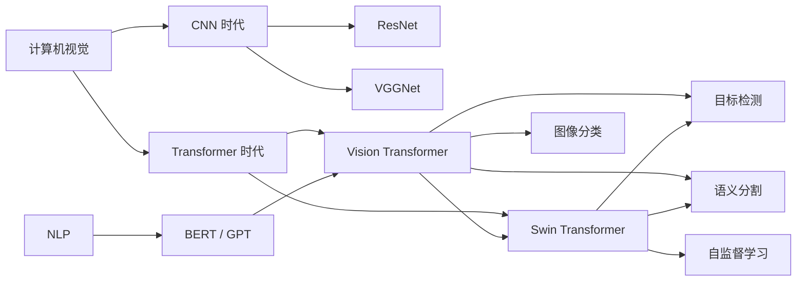
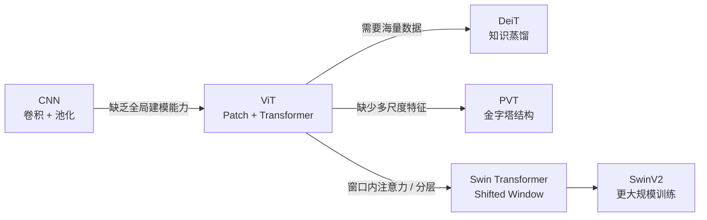
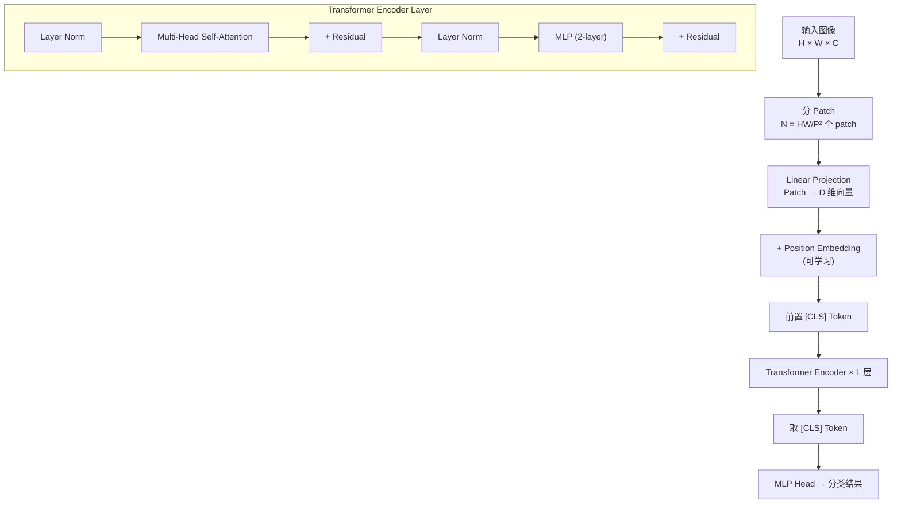
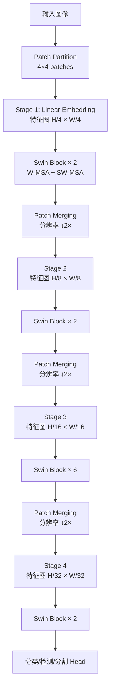
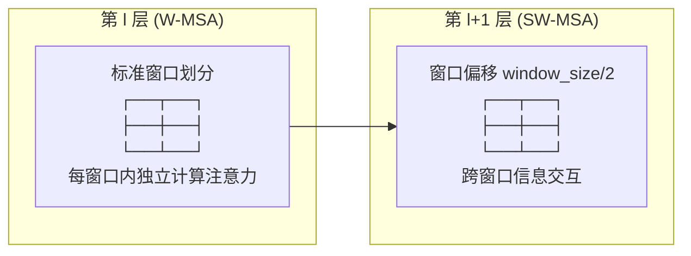

# ViT / Swin Transformer

## 知识地图

## 前置知识

- **CNN 基础**：理解卷积、池化、感受野、平移等变性
- **Transformer**：自注意力机制 (Self-Attention)、多头注意力 (Multi-Head Attention)、位置编码 (Position Encoding)
- **NLP Transformer**：BERT 的 [CLS] token 设计、Encoder-only 架构
- **图像分类**：ImageNet 基准、Top-1 / Top-5 Accuracy

## 模型演化路线

| Model | Year | Key Innovation |
|-------|------|----------------|
| ViT | 2020 | 将图像切割为 Patch，首次用纯 Transformer 做视觉分类 |
| DeiT | 2021 | 知识蒸馏，用 CNN 教师指导 ViT，小数据也能训好 |
| PVT | 2021 | 金字塔结构 + 空间缩减注意力，适配密集预测任务 |
| Swin | 2021 | 分层设计 + 移动窗口注意力，线性复杂度，横扫检测/分割榜 |
| SwinV2 | 2022 | 改进归一化和位置编码，支持 30 亿参数训练 |

## 为什么会出现 (Why)

CNN 在计算机视觉中统治了近十年，但有两个核心缺陷：

1. **局部感受野**：卷积核只能看到邻域像素，堆叠多层才能捕捉远距离依赖。全局建模能力弱。
2. **固定权重**：卷积核与内容无关（content-agnostic），同一套权重处理所有输入。而注意力是 **content-dependent**——权重随输入变化。

NLP 领域 Transformer 的巨大成功（BERT、GPT）让人们思考：能不能把图像也当作"序列"输入 Transformer？答案是 **ViT**——但它缺少 CNN 的归纳偏置（局部性、平移等变性），导致需要 JFT-300M 级别数据才能训好。

Swin Transformer 进一步解决 ViT 的两个问题：
1. ViT 全程单分辨率，无法适配检测/分割的多尺度需求
2. ViT 的全局注意力复杂度为 $O(N^2)$，大图不可用

## 解决什么问题 (Problem)

- **ViT**：让 Transformer 直接处理视觉任务，不依赖 CNN 的骨架
- **Swin**：提供 CNN 式的分层多尺度特征图，同时保持 $O(N)$ 复杂度的注意力

## 核心思想 (Core Idea)

**ViT**：将图像切成 Patch 当作"视觉词"，用 Transformer Encoder 建模 Patch 间的全局关系进行分类。  
**Swin**：在局部窗口内做自注意力，通过 Shifted Window 实现窗口间信息交互，配合分层下采样形成 CNN 式的金字塔结构。

## 模型结构图

### ViT 架构

### Swin Transformer 架构

### 移动窗口 (Shifted Window) 机制

## 数学模型/公式

### ViT — Patch Embedding

图像 $\mathbf{x} \in \mathbb{R}^{H \times W \times C}$，Patch 大小 $P \times P$，生成 $N = HW/P^2$ 个 Patch：

$$\mathbf{z}_0 = [\mathbf{x}_{class}; \mathbf{x}_p^1 \mathbf{E}; \mathbf{x}_p^2 \mathbf{E}; \ldots; \mathbf{x}_p^N \mathbf{E}] + \mathbf{E}_{pos}$$

**通俗解释：** 将每个 $P \times P$ 的小方块展平成一维向量，通过一个全连接层（$\mathbf{E}$）投影到 Transformer 的维度 $D$。然后在序列最前面拼接一个可学习的 [CLS] token，再加上位置编码，让模型知道每个 Patch 在图像中的位置。

### ViT — Transformer Encoder

$$\mathbf{z}'_\ell = \text{MSA}(\text{LN}(\mathbf{z}_{\ell-1})) + \mathbf{z}_{\ell-1}$$

$$\mathbf{z}_\ell = \text{MLP}(\text{LN}(\mathbf{z}'_\ell)) + \mathbf{z}'_\ell$$

**通俗解释：** 每一层先将输入做 Layer Normalization，然后所有 Patch（包括 [CLS] token）互相做注意力（看到全局信息），再通过残差连接加回。之后再经过一个两层 MLP 和另一个残差连接。重复 L 次后，取 [CLS] token 对应的输出向量进行分类。

### ViT — 自注意力

$$\text{Attention}(\mathbf{Q}, \mathbf{K}, \mathbf{V}) = \text{softmax}\left(\frac{\mathbf{Q}\mathbf{K}^T}{\sqrt{d_k}}\right) \mathbf{V}$$

**通俗解释：** 每个 Patch 都生成 Query（查询）、Key（键）、Value（值）三个向量。Query 和所有 Key 做点积得到相似度矩阵，除以 $\sqrt{d_k}$ 防止梯度消失，softmax 归一化后加权聚合所有 Value。本质上每个 Patch 都在"询问"其他所有 Patch 与自己的相关性。

### Swin — 复杂度对比

| 方法 | 计算复杂度 |
|------|-----------|
| 全局自注意力 | $O(N^2 d)$ |
| Swin (窗口) | $O(M^2 \cdot N \cdot d) = O(N M d)$ |

**通俗解释：** 全局注意力中每个 Patch 要看 $N$ 个 Patch，所以是 $N^2$。Swin 把 Patch 分组到大小为 $M$ 的窗口（通常 $M=7$），每个 Patch 只看窗口内的 $M^2$ 个 Patch。当 $N$ 很大（如检测任务中 $N=10000+$），Swin 的计算量远小于全局注意力。

### Swin — Shifted Window 自注意力

$$\hat{\mathbf{z}}^l = \text{W-MSA}(\text{LN}(\mathbf{z}^{l-1})) + \mathbf{z}^{l-1}$$

$$\mathbf{z}^l = \text{MLP}(\text{LN}(\hat{\mathbf{z}}^l)) + \hat{\mathbf{z}}^l$$

$$\hat{\mathbf{z}}^{l+1} = \text{SW-MSA}(\text{LN}(\mathbf{z}^l)) + \mathbf{z}^l$$

$$\mathbf{z}^{l+1} = \text{MLP}(\text{LN}(\hat{\mathbf{z}}^{l+1})) + \hat{\mathbf{z}}^{l+1}$$

**通俗解释：** Swin Block 成对出现。第一个 Block 用标准窗口划分（W-MSA），每个窗口独立做注意力。第二个 Block 将窗口划分偏移 $M/2$（SW-MSA），新的窗口跨越了旧的窗口边界，让相邻窗口的 Patch 有机会交互。Masked MSA 机制保证高效计算——循环移位+掩码+还原。

### Swin 变体

| 模型 | 参数量 | FLOPs | ImageNet Top-1 |
|------|--------|-------|---------------|
| Swin-T | 29M | 4.5G | 81.3% |
| Swin-S | 50M | 8.7G | 83.0% |
| Swin-B | 88M | 15.4G | 83.5% |
| Swin-L | 197M | 34.5G | 83.8% |

**通俗解释：** T/S/B/L 分别对应 Tiny/Small/Base/Large，通过调整通道数和 Block 层数来控制计算量。即使是最大的 Swin-L 也只有 197M 参数，远小于当时的 ViT-G（1.8B）。

## 工业界应用

| 应用领域 | 使用模型 | 说明 |
|----------|---------|------|
| 图像分类 | ViT / Swin | ImageNet 基准，Google / Microsoft 视觉系统的骨干网络 |
| 目标检测 | Swin-T as Backbone | Swin + Cascade Mask R-CNN，COCO 榜单长期 SOTA |
| 语义分割 | Swin + UPerNet | ADE20K 分割基准，分层特征天然适配分割任务 |
| 视频理解 | TimeSformer (ViT-based) | 将时间维度也当成 Patch 输入 Transformer |
| 多模态 | CLIP (ViT-based) | OpenAI CLIP 使用 ViT 作为图像编码器 |
| 自监督预训练 | Swin + SimMIM | 掩膜图像建模 (MIM)，在标注稀缺场景提升性能 |
| 医学影像 | Swin UNETR | 3D 医学图像分割，Swin Backbone + UNet 结构 |

## 对比表格

| | ViT | Swin Transformer | CNN (ResNet) |
|------|-----|-----------------|-------------|
| 架构风格 | 纯 Transformer | Transformer + 分层设计 | 纯卷积 |
| 注意力范围 | 全局 | 窗口内（跨窗口交互） | 局部（感受野） |
| 计算复杂度 | $O(N^2 d)$ | $O(N M d)$ | $O(N)$ |
| 多尺度特征 | 单一分辨率 | 4 个尺度 (4×/8×/16×/32×) | 多个尺度 |
| 数据需求 | 极高（JFT-300M） | 中等（ImageNet-22K） | 较低（ImageNet-1K） |
| 适合任务 | 分类 | 分类/检测/分割（通用） | 分类/检测/分割 |
| 归纳偏置 | 弱 | 中等（窗口 → 局部性） | 强（局部性、平移等变性） |

## 学完后建议继续学习

1. **ViT Variants (DeiT / PVT / CaiT)** — 理解 ViT 家族的不同改进方向
2. **DETR / Deformable DETR** — 了解 Transformer 如何用于目标检测
3. **SAM** — Vision Transformer 作为分割基础模型的编码器
4. **CLIP / SigLIP** — 视觉-语言对比学习，ViT 在多模态中的角色
5. **Masked Autoencoders (MAE)** — 自监督预训练 ViT 的核心方法

## 高频面试题

### Q1: ViT 和 CNN 的本质区别是什么？

**答案：** 两者在三个方面有本质差异：

1. **归纳偏置 (Inductive Bias)**：CNN 内置了局部性（卷积核只关注邻域）和平移等变性（图像平移导致特征图平移）。ViT 几乎没有这些先验——自注意力是全局的和置换不变的（permutation-invariant），需要靠位置编码来告诉模型 Patch 在哪。这是 ViT 需要更多数据的原因——缺乏先验意味着模型必须从数据中"学习"这些规律。

2. **内容依赖 (Content-Dependence)**：CNN 的卷积核是固定的（训练后就固定了），处理所有输入都一样。注意力权重是输入相关的——不同图像产生不同的注意力模式，这让 ViT 更灵活。

3. **感受野**：CNN 通过堆叠多层逐层增大感受野（理论上是线性增长）。ViT 从第一层起每个 Patch 就能看到所有其他 Patch，感受野是全局的。

### Q2: Swin Transformer 的 Shifted Window 为什么有效？窗口之间如何交互？

**答案：** 标准窗口划分下，每个窗口独立做注意力，窗口之间没有信息传递——相当于把图像切成了不相关的小块。Shifted Window 将窗口划分偏移一半窗口大小，使得原本在不同窗口的两个 Patch 现在落到同一个窗口内，从而产生了跨窗口的注意力交互。

具体实现技巧（不做真实窗口移动，而是用循环移位 `torch.roll` + 掩码注意力）：
- 将特征图循环移位，使错位的窗口重新对齐
- 在注意力计算中加掩码，防止原本不相邻的 Patch 互相关注
- 计算完后再反向循环移回原位

这种设计既实现了跨窗口交互，又保持了窗口内注意力的计算效率。

### Q3: 为什么 ViT 在小数据集上表现不如 CNN？

**答案：** CNN 的卷积操作内建了强先验——局部连接和权重共享。这意味着 CNN 不需要学习"相邻像素更相关"这条规律，它的架构本身就实现了它。而 ViT 的注意力机制在初始化时对所有 Patch 一视同仁——它必须通过大量数据来"发现"图像中的局部性、纹理、边缘这些基本模式。在小数据集上，ViT 没有足够样本来学到这些基本规律，所以欠拟合。DeiT 通过知识蒸馏（让 CNN 教师指导 ViT）部分解决了这个问题。

### Q4: ViT 中的 [CLS] token 的作用是什么？为什么不用全局平均池化？

**答案：** [CLS] token 借用了 BERT 的设计。它是一个可学习的全局表示向量，在所有 Transformer 层中与其他 Patch tokens 交互——每一层的注意力让 [CLS] 能聚合来自所有 Patch 的信息。最终取 [CLS] 的输出用于分类。

对比全局平均池化 (GAP)：GAP 对所有 Patch 取平均，是"民主"的信息聚合；[CLS] token 则通过注意力权重选择性聚合。在 ViT 原论文中，用 [CLS] 还是 GAP 对结果影响不大——后续工作（如 Swin）很多直接用 GAP 或 LayerNorm + 线性层，效果几乎一致。但 [CLS] token 的设计是 ViT "搬 NLP"的标志性符号。

### Q5: Swin Transformer 相比 ViT 的计算复杂度优势是怎么来的？用公式说明。

**答案：** 全局自注意力的复杂度为 $O(N^2 d)$，其中 $N$ 是 Patch 数量，$d$ 是每个 Patch 的维度。Swin 将 Patch 分到大小为 $M$ 的窗口（典型 $M=7$），每个窗口内独立做注意力：复杂度为 $M^2 \cdot (N/M^2) \cdot d = N M d$。

举例：输入 224×224、Patch=16 → $N = 14 \times 14 = 196$，全局注意力 = $196^2 d = 38,416d$；若 $M=7$，每个窗口有 49 个 Patch，Swin 注意力 = $196 \times 7 \times 7 \times d = 9,604d$。在检测任务中 $N$ 可达上万，差距更加悬殊。因此 Swin 是 $O(N)$ 级别（$M$ 为常数），而 ViT 是 $O(N^2)$。
