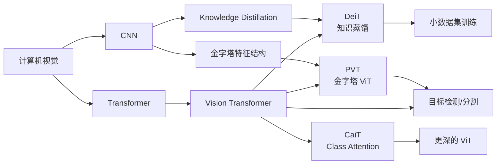
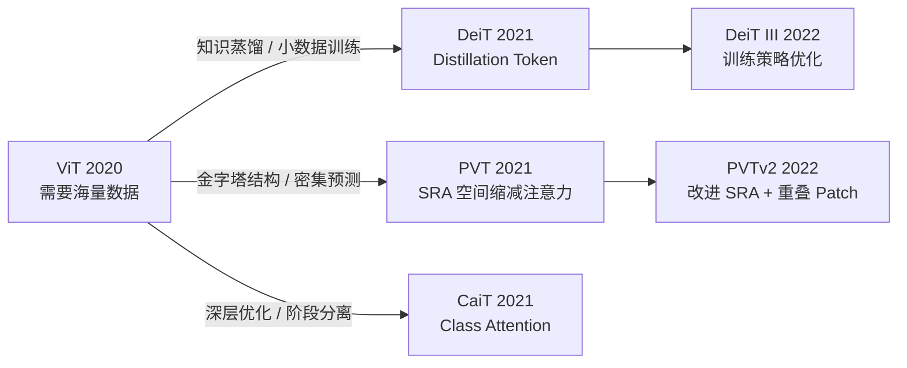
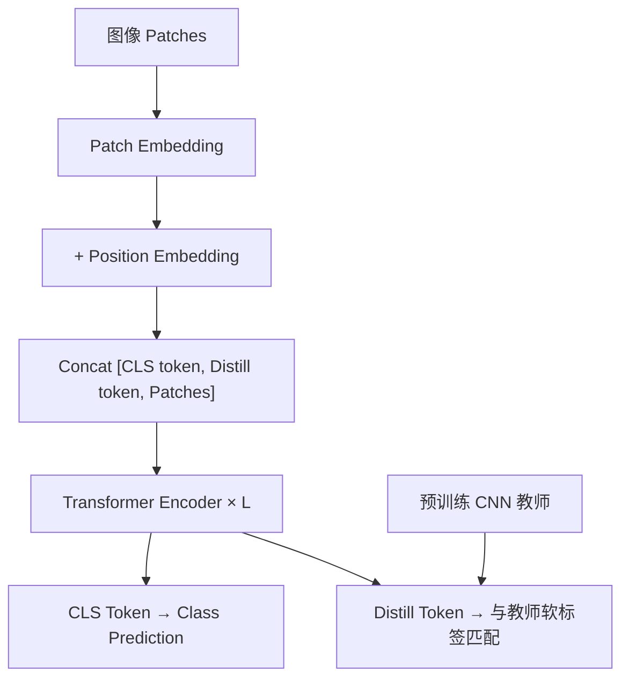
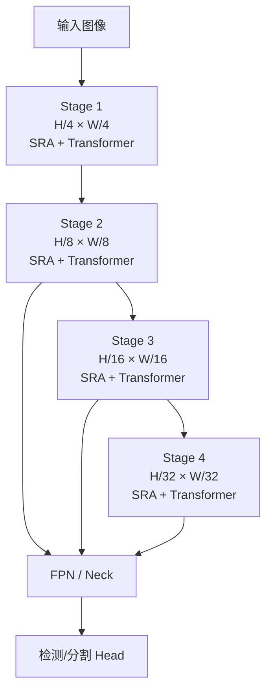
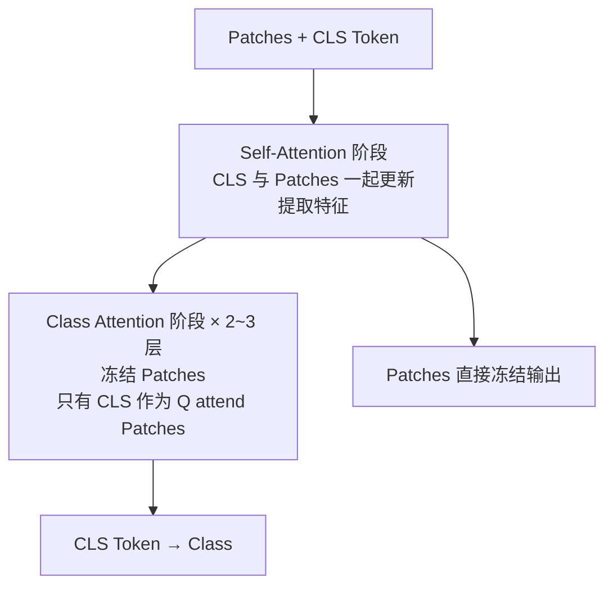
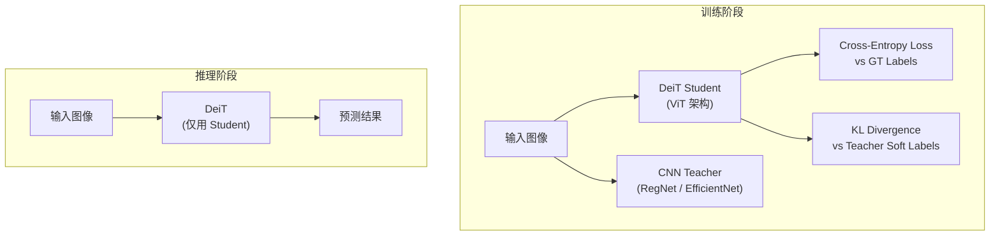

# ViT Variants (DeiT / PVT / CaiT)

## 知识地图



## 前置知识

- **ViT 基础**：Patch Embedding、Position Encoding、[CLS] Token、Transformer Encoder
- **知识蒸馏**：教师-学生框架，软标签 vs 硬标签，KL 散度
- **CNN 金字塔结构**：ResNet 的 4 个 Stage 逐步下采样 (1/4, 1/8, 1/16, 1/32)
- **自注意力计算复杂度**：$O(N^2 d)$ 的来源与瓶颈

## 模型演化路线



| Model | Year | Key Innovation |
|-------|------|----------------|
| ViT | 2020 | Patch + Transformer 做图像分类，需要 JFT-300M |
| DeiT | 2021 | 引入 Distillation Token，CNN 教师指导，ImageNet-1K 即可训好 |
| PVT | 2021 | 金字塔结构 + 空间缩减注意力 (SRA)，适配检测/分割的密集预测 |
| CaiT | 2021 | 两阶段设计：前层 SA 提取特征，后层 Class Attention 做决策 |
| PVTv2 | 2022 | 线性 SRA + 重叠 Patch Embedding + 卷积前馈网络 |

## 为什么会出现 (Why)

ViT 的痛点非常明确：

1. **数据饥渴**：ViT 缺少 CNN 的归纳偏置，需要 JFT-300M（3 亿张私有图片）级别数据才能超越 ResNet。普通研究者没有这个资源。DeiT 用知识蒸馏打破了这个壁垒——让 CNN 教师模型指导 ViT，在 ImageNet-1K（仅 128 万张）上也能达到 85%+ 的准确率。

2. **单分辨率输出**：ViT 全程保持同一分辨率（如 14×14），没有多尺度特征图。而目标检测和语义分割需要高分辨率定位小物体、低分辨率理解语义上下文。PVT 给 ViT 加上了 CNN 风格的金字塔结构。

3. **CLS token 过早参与决策**：标准 ViT 从第一层就让 [CLS] token 和所有 Patch tokens 一起做注意力，CLS 在浅层就参与了特征更新。CaiT 认为这是低效的——浅层应该专注提取特征，深层才让 CLS token 做分类决策。

## 解决什么问题 (Problem)

- **DeiT**：让 ViT 在小数据集上也能训练，无需 JFT-300M
- **PVT**：让 ViT 能输出多尺度特征图，用于检测和分割
- **CaiT**：优化深层 ViT 的训练，解决 CLS token 过早参与决策的问题

## 核心思想 (Core Idea)

**DeiT**：引入可学习的 Distillation Token，通过知识蒸馏让 CNN 教师指导 ViT 学生训练。  
**PVT**：用空间缩减注意力 (SRA) 降低高分辨率特征图上的注意力成本，构建金字塔结构。  
**CaiT**：将 Transformer 层分为 Self-Attention 阶段（特征提取）和 Class Attention 阶段（分类决策），CLS token 只在后阶段更新。

## 模型结构图

### DeiT 架构



### PVT 金字塔结构



### CaiT 两阶段设计



## 数学模型/公式

### DeiT 蒸馏损失

$$\mathcal{L}_{total} = \mathcal{L}_{CE}(y_{cls}, y_{gt}) + \mathcal{L}_{CE}(y_{distill}, y_{teacher})$$

**通俗解释：** DeiT 有两个分类输出——CLS token 的输出 $y_{cls}$ 和 Distillation token 的输出 $y_{distill}$。CLS token 用真实的 GT 标签监督（Cross-Entropy 损失），Distill token 用 CNN 教师模型的预测结果作为软标签监督。两个 token 都参与注意力计算，在训练中被引导学到不同的分类策略。推理时可以只用 CLS token 或两个取平均。

### PVT — 空间缩减注意力 (SRA)

$$\text{SRA}(\mathbf{Q}, \mathbf{K}, \mathbf{V}) = \text{Concat}(\text{head}_1, \dots, \text{head}_h) \mathbf{W}^O$$

$$\text{head}_i = \text{Attention}(\mathbf{Q}\mathbf{W}_i^Q, \text{SR}(\mathbf{K})\mathbf{W}_i^K, \text{SR}(\mathbf{V})\mathbf{W}_i^V)$$

**通俗解释：** 标准注意力中 K 和 V 的序列长度等于特征图的 $H \times W$。SRA 在计算注意力前先对 K 和 V 做空间缩减（用 stride=R 的卷积或平均池化），将序列长度从 $N$ 降到 $N/R^2$。例如在 Stage 1 高分辨率时 $R=8$，注意力矩阵从 $N \times N$ 降为 $N \times (N/64)$，大幅降低计算和内存开销。

### CaiT — Class Attention 公式

$$\text{ClassAttn}(\mathbf{x}_{cls}, \mathbf{X}_{patches}) = \text{Attention}(\mathbf{Q}_{cls}, \mathbf{K}_{all}, \mathbf{V}_{all})$$

**通俗解释：** Class Attention 与前层 Self-Attention 的方向相反。Self-Attention 中所有 token 同时更新；Class Attention 中只让 CLS token 作为 Query 去查询所有 Patches（作为 Key 和 Value），而 Patches 本身被冻结不更新。这相当于：前面的 SA 层负责"观察图像、提取特征"，后面的 CA 层负责"综合特征、做出判断"。

### Class Attention PyTorch 要点

```python
# Class Attention: Q 只来自 CLS token, K/V 来自 patches + CLS
Q = W_q(cls_token)          # [1, D]
K = W_k(torch.cat([cls, patches]))  # [N+1, D]
V = W_v(torch.cat([cls, patches]))  # [N+1, D]
cls_new = Attention(Q, K, V)  # 只更新 CLS
```

**通俗解释：** Q 向量只由一个 token（CLS）产生，但 K 和 V 来自所有 token。CLS token 通过 Query 主动"提问"，从所有 Patches 中"读取"信息来更新自己，而 Patches 的表示保持不变。这种设计让 CLS 可以在最后几层高效地做出最终分类判断，同时避免浅层 CLS token 对特征提取造成干扰。

## 最小可运行代码

### PyTorch — DeiT 蒸馏前向传播

```python
import torch
import torch.nn as nn

class DistilledTransformer(nn.Module):
    def __init__(self, embed_dim=384, num_classes=1000, depth=12, num_heads=6):
        super().__init__()
        self.cls_token = nn.Parameter(torch.randn(1, 1, embed_dim))
        self.distill_token = nn.Parameter(torch.randn(1, 1, embed_dim))
        self.pos_embed = nn.Parameter(torch.randn(1, 197, embed_dim))
        self.blocks = nn.ModuleList([
            nn.TransformerEncoderLayer(embed_dim, num_heads, dim_feedforward=4*embed_dim)
            for _ in range(depth)
        ])
        self.head = nn.Linear(embed_dim, num_classes)
        self.head_distill = nn.Linear(embed_dim, num_classes)

    def forward(self, patches):
        # patches: [B, N, D], N = 196 (14x14 patches)
        B = patches.shape[0]
        cls_token = self.cls_token.expand(B, -1, -1)
        distill_token = self.distill_token.expand(B, -1, -1)
        x = torch.cat([cls_token, distill_token, patches], dim=1)  # [B, 198, D]
        x = x + self.pos_embed[:, :x.shape[1]]

        for blk in self.blocks:
            x = blk(x)

        cls_out = self.head(x[:, 0])        # CLS 分类
        distill_out = self.head_distill(x[:, 1])  # Distill 分类
        return cls_out, distill_out
```

### PyTorch — Class Attention (CaiT 风格)

```python
class ClassAttention(nn.Module):
    def __init__(self, dim, num_heads):
        super().__init__()
        self.num_heads = num_heads
        self.head_dim = dim // num_heads
        self.scale = self.head_dim ** -0.5
        self.q = nn.Linear(dim, dim)
        self.k = nn.Linear(dim, dim)
        self.v = nn.Linear(dim, dim)
        self.proj = nn.Linear(dim, dim)

    def forward(self, x):
        # x: [B, N+1, D], 第0位是 CLS token
        cls_token = x[:, :1]
        patches = x[:, 1:]

        Q = self.q(cls_token)  # [B, 1, D]
        K = self.k(x)          # [B, N+1, D]
        V = self.v(x)

        attn = (Q @ K.transpose(-2, -1)) * self.scale
        attn = attn.softmax(dim=-1)
        cls_new = attn @ V
        cls_new = self.proj(cls_new)

        return torch.cat([cls_new, patches], dim=1)  # patches 冻结不动
```

## 可视化展示

### ViT 架构家族对比

```echarts
return {
  tooltip: { trigger: "axis", confine: true },
  title: { top: 5,  text: 'ViT 架构家族对比', left: 'center', textStyle: { fontSize: 12 } },
  xAxis: { type: 'category', data: ['ViT', 'DeiT', 'PVT', 'CaiT', 'Swin'] },
  yAxis: { type: 'value', min: 0, max: 1, name: '相对能力' },
  legend: { top: 28,  data: ['小数据性能', '密集预测', '可扩展性'] },
  series: [
    { name: '小数据性能', type: 'bar', data: [0.2, 0.75, 0.3, 0.4, 0.8], itemStyle: { color: '#2c3e50' } },
    { name: '密集预测', type: 'bar', data: [0.1, 0.1, 0.9, 0.1, 0.9], itemStyle: { color: '#16a085' } },
    { name: '可扩展性', type: 'bar', data: [0.8, 0.7, 0.7, 0.75, 0.9], itemStyle: { color: '#2980b9' } }
  ],
  grid: { left: 60, right: 20, top: 55, bottom: 55 }
}
```

### DeiT 蒸馏流程对比



## 工业界应用

| 应用领域 | 使用模型 | 说明 |
|----------|---------|------|
| 中小规模分类 | DeiT | 数据量不足时用蒸馏 ViT，比从头训 CNN 更强 |
| 目标检测 Backbone | PVT / PVTv2 | 多尺度特征图输出，直接替换 ResNet Backbone |
| 语义分割 Backbone | PVTv2 | ADE20K / Cityscapes 上的 Transformer 骨干 |
| 医学影像 | DeiT (fine-tuned) | 医学数据集通常较小，蒸馏 ViT 更易泛化 |
| 边缘设备部署 | DeiT-Tiny | 5M 参数的小型 ViT，适配移动端 |

## 对比表格

| | ViT | DeiT | PVT | CaiT | Swin |
|------|-----|------|-----|------|------|
| 数据需求 | 极高 (JFT-300M) | 低 (ImageNet-1K) | 中 (ImageNet-1K) | 中 (ImageNet-1K) | 中 (ImageNet-22K) |
| 多尺度输出 | 无 | 无 | 有 (4 级金字塔) | 无 | 有 (4 级金字塔) |
| 核心创新 | Patch + Transformer | 蒸馏 Token | SRA 空间缩减注意力 | Class Attention 两阶段 | Shifted Window |
| 适合密集预测 | 否 | 否 | 是 | 否 | 是 |
| 训练资源 | 企业级 | 学术级 | 学术级 | 学术级 | 中等 |

## 学完后建议继续学习

1. **Swin Transformer** — 另一条线：窗口注意力 + 分层结构，统合 ViT 和 CNN 的优点
2. **DETR / Deformable DETR** — 了解 Transformer 如何端到端做目标检测
3. **MAE (Masked Autoencoder)** — 自监督预训练 ViT，用 75% 掩膜率实现高效训练
4. **CLIP / SigLIP** — 视觉-语言联合训练中的 ViT 编码器
5. **DINO / DINOv2** — 自监督 ViT 特征学习的最新进展

## 高频面试题

### Q1: DeiT 的 Distillation Token 和 [CLS] Token 有什么区别？为什么需要两个？

**答案：** 结构上两者完全相同——都是可学习的嵌入向量，都参与 Transformer 的注意力计算。区别在于监督信号：CLS token 的输出用真实标签监督（标准 Cross-Entropy），Distill token 的输出用 CNN 教师的软标签监督。

为什么需要两个？因为 DeiT 的作者实验发现，用同一个 token 同时接收两种监督信号（GT 硬标签 + 教师软标签）效果不如分开。两个 token 在注意力过程中各学各的——CLS 专注于从 Patches 中直接学习分类特征，Distill 则模仿教师的行为模式。推理时可以只用 CLS、只用 Distill、或两者取平均。

### Q2: PVT 的 SRA (Spatial Reduction Attention) 和标准注意力有什么区别？为什么能降低复杂度？

**答案：** 标准注意力中 K 和 V 的序列长度 = 特征图的 $H \times W$。在高分辨率 Stage 1（$H/4 \times W/4$），对于一个 224×224 的输入，$N = 56 \times 56 = 3136$，注意力矩阵 $3136 \times 3136$ 非常大。

SRA 对 K 和 V 做空间下采样（如 stride=8 的卷积），将序列长度从 $N$ 压缩到 $N/R^2$。注意力矩阵从 $N \times N$ 降为 $N \times (N/R^2)$，是原始复杂度的 $1/R^2$。例如 $R=8$ 时，复杂度降为原来的 1/64。

代价是丢失了细粒度的空间信息——但在浅层高分辨率特征图上，这种压缩是可以接受的，因为浅层注意力更多关注语义聚类而非精确空间关系。

### Q3: CaiT 的 Class Attention 为什么要把 CLS token 的更新放在最后几层？这样做有什么好处？

**答案：** 标准 ViT 中，[CLS] token 从第一层就参与 Self-Attention，和所有 Patch tokens 一起更新。CaiT 的作者认为这有两个问题：

1. **过早决策**：浅层特征还不够语义化，CLS token 在浅层就开始做"分类相关的聚合"，效率低下。
2. **干扰特征提取**：CLS token 的梯度信号会反向影响 Patch embeddings 的学习方向，让 Patch 过早偏向"被 CLS 需要的样子"。

CaiT 的解决方案：前 N-2 层用纯 Self-Attention（Patches 之间互相建模，CLS 也参与但不主导），最后 2 层切换为 Class Attention（冻结 Patches，只让 CLS 作为 Q 去 attend 所有 Patches）。这样 Patch embeddings 可以最大化保留图像信息，CLS token 在最后一刻才综合决策，效果更好。

### Q4: ViT 系列模型怎么用到目标检测任务中？

**答案：** 有两个关键挑战：

1. **分辨率不匹配**：分类时输入通常是 224×224，但检测需要更高分辨率（如 800×1333）。直接放大输入会导致 Patch 数量平方级增长，全局注意力不可行。
2. **多尺度需求**：检测需要同时定位大物体和小物体，单分辨率的特征图不够。

解决方案分两类：
- **PVT/Swin 路线**：设计金字塔结构的 ViT（4 个 Stage 逐步下采样），输出正好是 4 个尺度的特征图，直接对接 FPN + 检测 Head。Swin 的窗口注意力和 PVT 的 SRA 都能控制高分辨率下的计算量。
- **ViT-Adapter 路线**：在标准 ViT 上加一个空间适配器（类似 FPN），将单分辨率特征图转换为多尺度特征。保留 ViT 的全局建模能力，同时满足检测需求。

### Q5: 知识蒸馏中，为什么用教师的软标签（概率分布）比硬标签更好？

**答案：** 硬标签（one-hot）只告诉学生"正确答案是第 K 类"。软标签（概率向量）包含了教师模型学到的类间关系——比如教师预测一张狗图片为：狗 0.7、狼 0.2、猫 0.08、其他 0.02。这个分布告诉学生"这只狗有点像狼，但和猫完全不同"，这是硬标签无法传递的"暗知识"(Dark Knowledge)。

在 DeiT 中，CNN 教师的卷积先验帮助 ViT 学生更快学到图像的基本模式（边缘、纹理、局部性），相当于用教师的归纳偏置来弥补 ViT 归纳偏置不足的问题。这也是为什么 DeiT 在 ImageNet-1K 上就能训好的核心原因。
