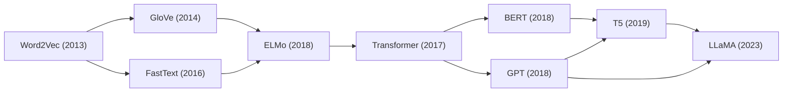
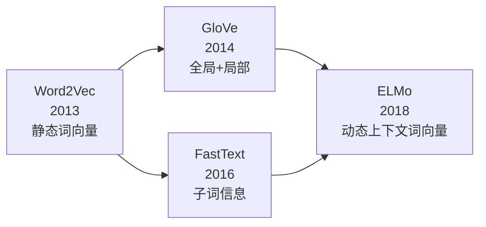
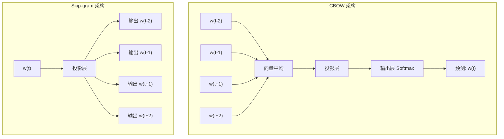

# Word2Vec (CBOW / Skip-gram)

## 知识地图



## 前置知识

- **One-hot 编码**：传统 NLP 将每个词表示为一个维数等于词汇表大小的稀疏向量，仅该词索引处为 1，其余为 0。这种表示没有语义信息，且维度灾难。
- **分布假说 (Distributional Hypothesis)**："You shall know a word by the company it keeps" (Firth, 1957)。上下文相似的词，语义也相似。这是 Word2Vec 的理论基石。
- **Softmax 与交叉熵**：多分类问题的标准损失函数，理解其计算复杂度 $O(V)$ 才能理解负采样的动机。
- **梯度下降**：理解 SGD 的基本原理，因为 Word2Vec 通过梯度下降优化词向量。

## 模型演化路线



| 阶段 | 模型 | 核心突破 |
|------|------|----------|
| 静态词向量 | Word2Vec | 用预测任务替代矩阵分解，高效训练 |
| 引入全局统计 | GloVe | 结合全局共现矩阵和局部上下文窗口 |
| 子词建模 | FastText | 字符 n-gram，处理 OOV 和形态学 |
| 上下文相关 | ELMo | 词向量随上下文变化，解决多义性问题 |

## 为什么会出现 (Why)

在 Word2Vec (2013) 之前，NLP 主要使用**高维稀疏的 one-hot 向量**或基于**矩阵分解的降维方法**（如 LSA/LSI）。这些方法的根本问题：

1. **One-hot 无法表达语义**：任意两个词的 one-hot 向量内积为 0，无法衡量语义相似度。"apple" 和 "orange" 的相似度为 0，与 "airplane" 的相似度也为 0。
2. **矩阵分解计算昂贵**：LSA 需要对 $V \times V$ 共现矩阵做 SVD，复杂度 $O(V^3)$，百万级词汇不可行。
3. **维度灾难**：词汇表 $V$ 通常百万级，每个词的向量维数即 $V$，无法用于深度学习。

Word2Vec 首次提出用**浅层神经网络 + 预测任务**高效学习**稠密、低维、蕴含语义**的词向量。

## 解决什么问题 (Problem)

通过预测任务学习词的**稠密分布式表示 (dense distributed representation)**，使得语义相近的词在向量空间中距离接近，且支持向量运算（国王 - 男人 + 女人 = 女王）。

## 核心思想 (Core Idea)

Word2Vec 通过**预测任务**学习词的稠密向量表示。核心假设（分布假说）：**上下文相似的词，语义也相似**。

## 数学模型 / 公式

### 两种架构

#### CBOW (Continuous Bag of Words)

用**上下文词预测目标词**：

$$\text{Input: } w_{t-2}, w_{t-1}, w_{t+1}, w_{t+2} \quad \rightarrow \quad \text{Output: } w_t$$

**通俗解释：** 给你一句话中前后各两个词（如 "the ___ cat sat on" 猜中间被挖掉的词），用周围的上下文来猜中心词是什么。CBOW 把上下文词的向量取平均，然后预测中心词。

- 上下文词向量 → 平均 → 预测目标词
- 较快，适合频繁词

#### Skip-gram

用**目标词预测上下文词**：

$$\text{Input: } w_t \quad \rightarrow \quad \text{Output: } w_{t-2}, w_{t-1}, w_{t+1}, w_{t+2}$$

**通俗解释：** 给你一个中心词（如 "cat"），让你猜它周围的词可能是什么（如 the, sat, on, the）。Skip-gram 用一个中心词去预测多个上下文词。

- 对低频词效果更好
- 训练较慢（一个中心词预测多个上下文词）

### 目标函数

Skip-gram 的负对数似然（使用负采样）：

$$J = -\sum_{(w, c) \in D_+} \log \sigma(\mathbf{v}_c^T \mathbf{v}_w) - \sum_{(w, c) \in D_-} \log \sigma(-\mathbf{v}_c^T \mathbf{v}_w)$$

其中 $\sigma(x) = 1/(1+e^{-x})$，$D_+$ 是正样本（真实上下文），$D_-$ 是负样本（随机采样）。

**通俗解释：** 这个公式将多分类问题转化为二分类——对每一对 (中心词, 上下文词)，判断它们是真实搭配还是随机凑对。正样本要给高分（$\sigma$ 趋近 1），负样本要给低分（$\sigma$ 趋近 0）。通过取负对数再求和，训练目标就是最小化这个值。

### 负采样

全量 Softmax 在百万级词汇上不可行。负采样将其转化为二分类问题：对每个正样本，采样 $k$ 个噪声词作为负样本（通常 $k=5\sim 20$）。

噪声分布：$P_n(w) \propto U(w)^{3/4}$（提升低频词被采样的概率）

**通俗解释：** 原始 Softmax 需要对词汇表中每个词计算概率，百万词汇时太慢。负采样改为：只从正样本（真实出现的词对）和随机抽的少量负样本（噪音词对）中学习区分能力。$3/4$ 次方的技巧让低频词有更高概率被抽中当"反面教材"。

### 层次 Softmax (Hierarchical Softmax)

将词汇组织成 Huffman 树，每个词的概率 = 从根到叶的路径上各节点的二分类概率之积，将复杂度从 $O(V)$ 降为 $O(\log V)$。

**通俗解释：** 把整个词汇表变成一棵二叉树，高频词靠近树根（路径短），低频词靠近树叶。预测一个词时不需要遍历整个词表，只需沿着从根到该词的路径做几次二分类判断（向左还是向右），复杂度从正比于词汇量降到对数级别。

### 著名的语义关系

$$\text{vec}(\text{king}) - \text{vec}(\text{man}) + \text{vec}(\text{woman}) \approx \text{vec}(\text{queen})$$

$$\text{vec}(\text{Paris}) - \text{vec}(\text{France}) + \text{vec}(\text{Italy}) \approx \text{vec}(\text{Rome})$$

**通俗解释：** 向量空间中的词向量不仅记录了语义相似性，还编码了语义关系的**方向**。"国王"减去"男人"加上"女人"约等于"女王"，说明向量空间里存在一个"性别方向"，沿着这个方向可以变换词的含义。这正是分布式表示的强大之处。

## 可视化展示

### Word2Vec 架构图



### 训练流程图


## 最小可运行代码

```python
from gensim.models import Word2Vec

model = Word2Vec(
    sentences,
    vector_size=300,
    window=5,
    min_count=5,
    sg=1,          # 1=Skip-gram, 0=CBOW
    negative=5,    # 负采样数
    epochs=10,
)
king_vec = model.wv['king']
similar = model.wv.most_similar('king', topn=5)
```

## 工业界应用

| 应用场景 | 说明 | 典型用法 |
|----------|------|----------|
| 搜索/推荐 | 查询词和文档标题的语义匹配 | 用词向量做 query-doc 相似度计算 |
| 特征工程 | 文本分类/情感分析的输入特征 | 将文本中词的向量取平均作为文本表示 |
| 机器翻译 | 双语词向量对齐 | 利用不同语言的向量空间具有相似几何结构做词典映射 |
| 知识图谱 | 实体关系推理 | 利用 TransE 等模型对实体和关系做向量化 |
| 广告点击率预估 | 用户查询和广告标题的语义匹配 | 词向量作为 NN 输入特征 |

## 对比表格

| | Word2Vec (CBOW) | Word2Vec (Skip-gram) |
|------|----------|----------|
| 预测方向 | 上下文 → 中心词 | 中心词 → 上下文 |
| 训练速度 | 快 | 慢 |
| 低频词效果 | 一般 | 好 |
| 适用场景 | 数据量大、高频词重要 | 数据量小、低频词也需学习 |
| 训练技巧 | 负采样 / 层次 Softmax | 负采样 / 层次 Softmax |

## 局限性

- 每个词只有一个向量（无法表示多义词）
- 窗口限制（不能捕获长距离依赖）
- 不能生成上下文相关的表示（ELMo / BERT 的动机）

## 学完后建议继续学习

1. **GloVe**：了解如何结合全局共现统计改善词向量质量
2. **FastText**：了解如何用子词信息处理 OOV 问题和形态学丰富的语言
3. **ELMo**：了解从"静态词向量"到"动态上下文词向量"的范式转变

## 高频面试题

### Q1: Word2Vec 的 CBOW 和 Skip-gram 有什么区别？各自适合什么场景？

**标准答案：**
- **CBOW (Continuous Bag of Words)**：用上下文词（前后各 k 个词）来预测中心词。训练时将上下文词的向量取平均后预测目标词，计算效率高，适合频繁词较多的场景。
- **Skip-gram**：用中心词预测周围的上下文词。对每个中心词要预测多个上下文词，训练较慢，但对低频词效果更好，适合数据量较小的场景。
- 本质区别：CBOW 对上下文词做了平滑（平均），损失了词序信息；Skip-gram 保持了每个上下文词的独立性，能从每个中心词学习更多信息。

### Q2: 为什么 Word2Vec 需要负采样？负采样的原理是什么？

**标准答案：**
- **必要性**：原始 Softmax 需要计算词汇表 V 中每个词的概率，当 V 达到百万级时，每次前向传播的复杂度为 $O(V)$，训练不可行。
- **原理**：负采样将多分类问题转化为二分类问题。对每个正样本（真实的 center-context 词对），随机采样 k 个词作为负样本（虚假的搭配），模型只需学会区分这 k+1 个样本，将复杂度从 $O(V)$ 降至 $O(k)$（通常 k=5~20）。
- **噪声分布**：负采样使用 $P_n(w) \propto U(w)^{3/4}$ 的噪声分布，$3/4$ 次方提升了低频词被采样的概率，避免只采样高频词。

### Q3: 层次 Softmax 是如何将复杂度从 O(V) 降到 O(log V) 的？

**标准答案：**
- 将所有词组织成一棵 Huffman 树（根据词频构建，高频词靠近根节点）。
- 每个词的概率等于从根节点到该词叶子节点路径上每个内部节点的二分类概率之积。路径长度平均为 $\log V$。
- 每次预测只需沿路径做 $\log V$ 次二分类，而非对 V 个词做 Softmax。
- 缺点：当负采样技术成熟后，层次 Softmax 逐渐被替代，因为负采样实现更简单，且在大规模语料上效果相当。

### Q4: Word2Vec 的词向量为什么可以做语义运算（如 king - man + woman = queen）？

**标准答案：**
- Word2Vec 学到的向量空间具有**线性语义结构**。模型训练时，相似的上下文会导致相似的梯度更新，使得语义相近的词在向量空间中聚集。
- 更重要的是，语义**关系**在向量空间中表现为**方向向量**。例如，"性别"方向 = $\vec{queen} - \vec{king} \approx \vec{woman} - \vec{man}$。
- 这是 Word2Vec 训练目标的自然副产品：预测任务迫使模型将可互换的词（如同性别的名词）编码为相似的向量差。
