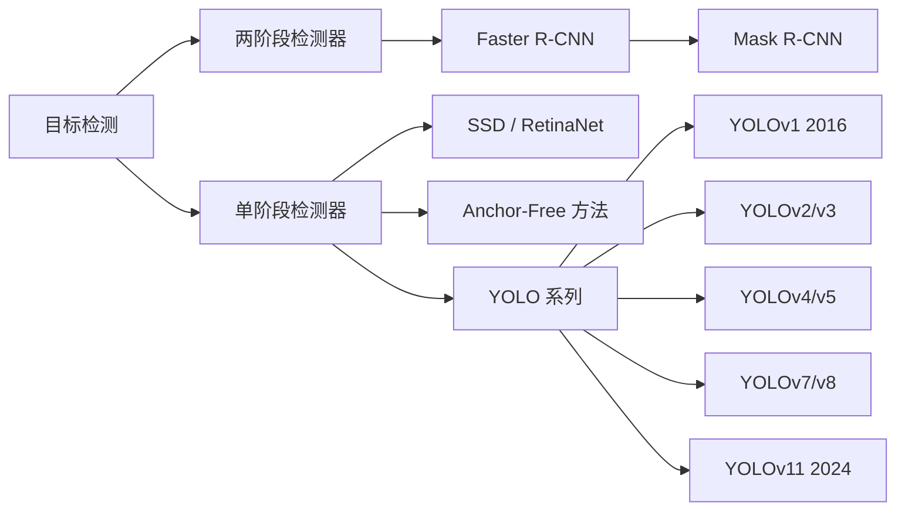
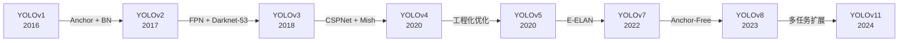
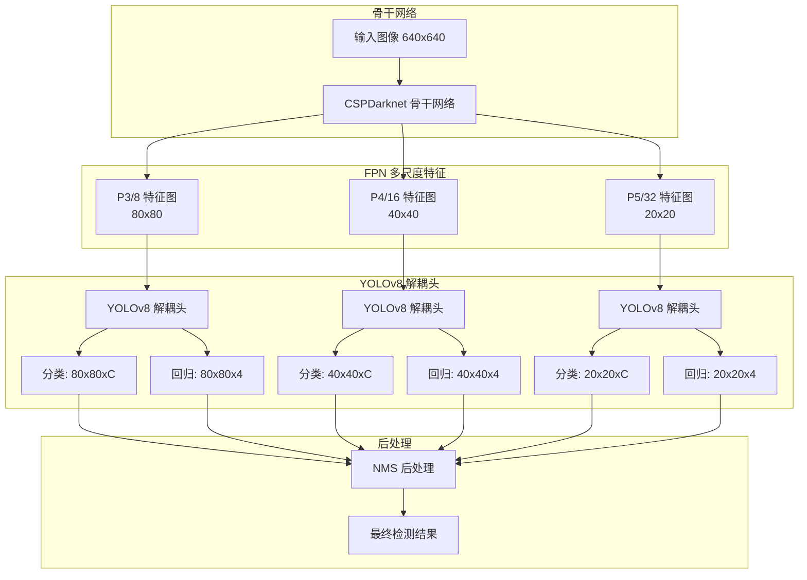
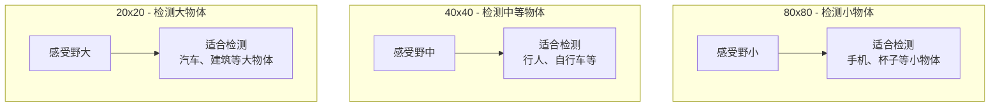

# YOLO (You Only Look Once)

## 知识地图



## 前置知识

- CNN 基本原理：卷积层、池化层、Batch Normalization
- 目标检测的基本概念：边界框、IoU、NMS、mAP
- 两阶段检测器 (Faster R-CNN) 的基本流程
- FPN (Feature Pyramid Network) 的多尺度特征融合思想
- Anchor 机制的基本概念

## 模型演化路线



| 模型 | 年份 | 关键创新 |
|------|------|----------|
| YOLOv1 | 2016 | 网格预测，端到端单阶段检测，将检测定义为回归问题 |
| YOLOv2 | 2017 | Anchor 机制，BatchNorm，多尺度训练，Darknet-19 |
| YOLOv3 | 2018 | FPN 多尺度检测，Darknet-53 骨干，多标签分类 |
| YOLOv4 | 2020 | CSPNet, Mish 激活, Mosaic 数据增强, CIOU Loss |
| YOLOv5 | 2020 | 工程化实现（Ultralytics），AutoAnchor，多种模型尺度 |
| YOLOv7 | 2022 | E-ELAN, 模型重参数化, 辅助头训练 |
| YOLOv8 | 2023 | Anchor-Free，解耦头，C2f 模块，实例分割支持 |
| YOLOv11 | 2024 | 持续优化，支持检测/分割/姿态/分类多任务 |

## 为什么会出现 (Why)

在 YOLO 出现之前，目标检测的主流范式是**两阶段检测器**（如 Faster R-CNN）：

1. 先生成候选区域（Region Proposals）
2. 再对每个候选区域分类和回归

这种"先找候选、再仔细看"的策略虽然精度高，但**天生慢**——不可能做到实时。而自动驾驶、视频监控、机器人导航等场景对实时性有刚性需求。

YOLO 的洞见是：**人类看一张图只需要一眼就能知道哪里有什么物体，为什么机器不能？** 于是它将检测重新定义为回归问题，一张图只过一遍网络，直接输出检测结果。

## 解决什么问题 (Problem)

**如何在保持较高精度的前提下，实现极快的检测速度？** 具体挑战：

- 需要在不降低太多精度的前提下，将检测速度从秒级提升到毫秒级
- 单阶段方法如何解决正负样本极度不平衡的问题
- 如何在一个网络中同时处理不同大小的物体
- 如何减少 Anchor 机制带来的超参数调优负担

## 核心思想 (Core Idea)

**YOLO 将目标检测重新定义为回归问题：一次前向传播直接预测边界框坐标和类别概率，实现真正的"一眼看全图"。**

---

## YOLOv1 — 网格预测

将图像划分为 $S \times S$ 网格（通常 $S=7$），每个网格预测 $B$ 个边界框及其置信度 + $C$ 个类别概率。

### 损失函数

$$L = \lambda_{coord} \sum_{i} \mathbb{1}_{ij}^{obj} \left[(x_i - \hat{x}_i)^2 + (y_i - \hat{y}_i)^2\right]$$

$$+ \lambda_{coord} \sum_{i} \mathbb{1}_{ij}^{obj} \left[(\sqrt{w_i} - \sqrt{\hat{w}_i})^2 + (\sqrt{h_i} - \sqrt{\hat{h}_i})^2\right]$$

$$+ \sum_{i} \mathbb{1}_{ij}^{obj} (C_i - \hat{C}_i)^2$$

$$+ \lambda_{noobj} \sum_{i} \mathbb{1}_{ij}^{noobj} (C_i - \hat{C}_i)^2$$

$$+ \sum_{i} \mathbb{1}_{i}^{obj} \sum_{c} (p_i(c) - \hat{p}_i(c))^2$$

> 对 $w, h$ 取平方根是为了让大框和小框的偏移惩罚相近。

---

## 数学模型/公式

### YOLOv1 网格预测输出

每个网格预测 $B$ 个边界框，每个框包含 5 个值：$(x, y, w, h, confidence)$，加上 $C$ 个类别概率。最终输出维度为：

$$S \times S \times (B \times 5 + C)$$

对于 $S=7, B=2, C=20$（VOC 数据集），输出为 $7 \times 7 \times 30$。

**通俗解释：** 把图切成 7x7 的棋盘格，每个格子负责预测"落在我这里"的物体。每个格子预测 2 个候选框和 20 个类别的概率。最终总共输出 7x7x30 的向量——麻雀虽小，五脏俱全。

### YOLOv1 损失函数的五项

**通俗解释：**
- **第一项（坐标损失）**：预测框的中心点 (x, y) 准不准？$\lambda_{coord}=5$ 表示定位比分类重要 5 倍。
- **第二项（尺寸损失）**：预测框的宽高 (w, h) 准不准？用平方根是因为大框偏一点无所谓，小框偏一点就很致命——平方根让大小框的误差量级更接近。
- **第三项（置信度损失-有物体）**：包含物体的格子的置信度要尽量高。
- **第四项（置信度损失-无物体）**：不包含物体的格子的置信度要尽量低。$\lambda_{noobj}=0.5$ 降低无物体格子的权重，因为大部分格子都是背景。
- **第五项（分类损失）**：类别预测对了吗？只计算包含物体的格子。

### 置信度定义

$$\text{Confidence} = \text{Pr(Object)} \times \text{IoU}_{pred}^{truth}$$

**通俗解释：** 置信度 = "这里有物体吗"乘以"框得有多准"。如果一个框完全没覆盖任何物体，置信度应该是 0；如果一个框完美覆盖了一个物体，置信度接近 1。

---

## YOLOv8 架构要点

### Anchor-Free 检测头

不再预设 Anchor，直接预测：
- 每个位置是否为物体中心
- 从该中心到四条边的距离 (t, l, b, r)

**通俗解释：** YOLOv8 彻底扔掉了 Anchor 这个"拐杖"。以前的 YOLO 需要预先定义一堆参考框（什么 1:1、1:2、2:1 的比例），然后预测相对于这些参考框的偏移。YOLOv8 直接从每个位置预测"如果我是中心，框的上下左右边界在哪里"——更直观，更简单。

### 解耦头 (Decoupled Head)

分类和回归分支分开（不像 v5 共享卷积）：

```
特征 → Conv → 分类分支 → 类别概率
      → Conv → 回归分支 → bbox 偏移
```

**通俗解释：** 分类任务关心的是"这是什么"，需要语义信息；回归任务关心的是"框在哪里"，需要位置信息。这两种任务需要的特征类型完全不同——强行让它们共享参数就像让一个人同时学钢琴和篮球，两个都学不好。分开后各学各的，效果更好。

---

## 模型结构图



## 可视化展示

### YOLOv8 多尺度检测示意



## 最小可运行代码

```python
from ultralytics import YOLO

model = YOLO('yolov8n.pt')  # nano, s, m, l, x
results = model('image.jpg')
results[0].show()
```

## 工业界应用

| 应用场景 | 为什么选择 YOLO | 实际案例 |
|----------|---------------|----------|
| 自动驾驶 | 极低延迟，实时检测行人/车辆/交通标志 | Tesla, 百度 Apollo 的实时感知 |
| 视频监控 | 高吞吐量，单 GPU 可同时处理数十路视频 | 海康威视、大华安防摄像头 |
| 工业质检 | 快速部署，边缘设备上实时运行 | 电子元器件缺陷检测、包装质检 |
| 零售分析 | 边缘计算，隐私保护 | 无人零售货架识别、客流统计 |
| 无人机跟踪 | 轻量模型适合嵌入式设备 | DJI 无人机目标追踪 |
| 手机/AR | 超轻量模型 (nano) 可在移动端实时运行 | Snapchat 滤镜、AR 导航 |

## 对比表格

| 维度 | YOLO | Faster R-CNN | SSD | RetinaNet |
|------|------|-------------|-----|-----------|
| 检测方式 | 单阶段 | 两阶段 | 单阶段 | 单阶段 |
| 速度 (FPS) | 30-160 | 5-15 | 20-60 | 5-15 |
| 精度 (COCO) | 中-高 | 高 | 中 | 高 |
| 小物体 | 较弱(早期) / 好(v8+) | 好 | 较弱 | 好 |
| 模型大小 | 极小-大 (nano-xl) | 大 | 中 | 大 |
| 训练难度 | 简单 | 中等 | 简单 | 中等 |
| 部署友好 | 极好 | 中等 | 好 | 中等 |

## 学完后建议继续学习

1. **SSD / RetinaNet**：理解其他单阶段检测器的设计思路，重点学习 Focal Loss 解决类别不平衡
2. **Anchor-Free 方法 (FCOS, CenterNet)**：了解无锚框检测范式，对比 YOLOv8 的 Anchor-Free 设计
3. **Transformer 检测器 (DETR)**：了解端到端目标检测的新范式
4. **YOLO 模型优化与部署**：TensorRT 加速、量化、剪枝、蒸馏等
5. **目标跟踪 (ByteTrack, DeepSORT)**：将检测结果用于多目标跟踪

## 高频面试题

### Q1: YOLOv1 的核心思想和主要缺点是什么？

**答：**
- **核心思想**：将目标检测转化为回归问题，一张图只过一遍网络，直接从图像像素预测边界框和类别概率。
- **主要缺点**：
  1. 每个网格只预测 2 个框且类别相同——密集小物体场景下表现差
  2. 全连接层要求固定输入尺寸
  3. 直接回归坐标不如基于 Anchor 的方式精确
  4. 正负样本极度不平衡（大量网格是背景）
  5. 对小物体和罕见长宽比的物体泛化能力差

### Q2: YOLOv3 相比 YOLOv2 做了哪些关键改进？

**答：**
1. **多尺度预测**：借鉴 FPN，在 3 个不同尺度的特征图上分别做预测（13x13, 26x26, 52x52），大幅提升小物体检测能力。
2. **Darknet-53 骨干**：更深的骨干网络，使用残差连接，比 Darknet-19 更强但比 ResNet-101 更快。
3. **多标签分类**：用 Sigmoid 替代 Softmax，每个类别独立预测（一个物体可以同时属于多个类别）。
4. **9 种 Anchor**：在三个尺度上各使用 3 种 Anchor，通过 K-Means 聚类得到。

### Q3: YOLOv8 的 Anchor-Free 设计和之前的 Anchor-Based YOLO 有什么区别？

**答：**
- **Anchor-Based (v2-v7)**：每个网格预设 3 种 Anchor（不同尺度和长宽比），模型预测相对于 Anchor 的偏移 (tx, ty, tw, th)。需要手动设计 Anchor 尺寸，正样本匹配规则复杂。
- **Anchor-Free (v8+)**：不预设 Anchor，直接预测"该位置是否是物体中心"和"中心到四条边的距离"。核心优势：
  1. 不需要手动设计 Anchor 尺寸，减少超参数调优
  2. 正负样本分配策略更灵活（Task-Aligned Assigner）
  3. 检测头计算量减少
  4. 对异常长宽比的物体泛化更好

### Q4: YOLO 的 NMS (非极大值抑制) 是如何工作的？YOLOv8 用了什么改进？

**答：**
- **传统 NMS**：按置信度排序所有检测框，取最高的框，移除与它 IoU 超过阈值（如 0.5）的其他框，重复直到所有框被处理。缺点是直接删除了重叠框，对密集物体场景不友好。
- **YOLOv8 改进**：使用更高效的 NMS 实现，且在后处理前通过 Anchor-Free 策略已经大幅减少了冗余预测框。YOLOv8 的训练阶段使用 Task-Aligned Assigner 动态分配正负样本，让预测框的质量更高，减少了对 NMS 的依赖。

### Q5: YOLO 系列为什么从 v5 开始不再由原作者维护？谈谈 YOLO 的开源生态。

**答：** YOLO 原作者 Joseph Redmon 在 YOLOv3 后因伦理担忧（军事应用和隐私侵犯）宣布退出 CV 研究。此后 YOLO 的发展分为两条线：
1. **学术线**：Alexey Bochkovskiy (YOLOv4)、Chien-Yao Wang 等 (YOLOv7) 继续在学术上推进。
2. **工程线**：Ultralytics 公司开发了 YOLOv5/v8/v11，主攻易用性、部署和工业落地。Ultralytics 的版本虽然非"官方论文"，但凭借完整的文档、训练脚本、多平台部署支持成为了事实上的工业标准。YOLOv8 是目前使用最广泛的版本。
